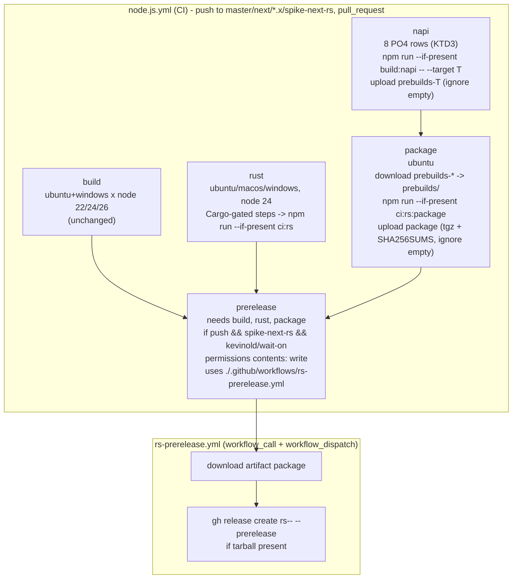

# Spike-next-rs L0 Operator Bootstrap - Plan

## Goal Capsule

- Objective: lane workers can land Rust lanes L1–L10 into `spike-next-rs` with CI that gates them (`rust`, `napi`, `package`), fork prereleases that testers can install (`rs-<version>-<shortsha>`), an MWPM config that drives the spine, and a developer manual that every lane extends, without any lane ever editing `.github/workflows/`.
- Means: script-hook CI jobs that no-op until `Cargo.toml` exists (KTD3, KTD4), a reusable `rs-prerelease.yml` called from the same CI run (KTD1), the verbatim `.multi-worker-pm.json` (KD1), and seven `docs/guides/` pages marking planned sections per lane (KTD6).
- Authority: R-IDs own the observable behavior (jobs, guards, tag scheme, config, guide contents); KTDs own mechanism; units cite both and add only file-local deltas.
- Execution profile: worktree `.claude/worktrees/chore/spike-l0-bootstrap`, branch `chore/spike-l0-bootstrap` off `origin/spike-next-rs` at `d021b72`; PR in `kevinold/wait-on` with base `spike-next-rs`, body includes `Closes #52`; Conventional Commits `chore:` (config), `ci:` (workflows), `docs:` (guides, AGENTS.md, README.md); this plan committed under `docs/plans/`.
- Stop conditions: stop and surface if the `build` job on the PR is anything but green and unchanged in steps, if any Cargo-gated step reports `failure` instead of `skipped` on the PR run, if a napi matrix row cannot acquire a runner within one CI run (label missing), if `actionlint` cannot be made clean without weakening a guard, or if honoring a requirement would need a secret beyond `GITHUB_TOKEN`, an edit to `.releaserc.json`/`release.yml`, or any interaction with `jeffbski/wait-on`.

---

## Product Contract

### Summary

`node.js.yml` gains `spike-next-rs` as a push branch and three jobs (`rust`, `napi`, `package`) that call `npm run --if-present ci:rs | build:napi | ci:rs:package`, plus a `prerelease` job that calls the new reusable `rs-prerelease.yml` to publish a GitHub prerelease on the fork from the `package` artifact. `.multi-worker-pm.json` is added verbatim from #52. `docs/guides/` gets seven pages stating what is true today and marking each lane's future sections; `AGENTS.md` and `README.md` link to them.

### Problem Frame

The spine (#35) forbids lanes from touching workflows (KD-S7), yet L1–L10 each need a CI gate, a multi-target prebuild matrix, and fork prereleases (KD-S8) to prove their work. Nothing of that exists on `spike-next-rs` today: CI has a single `build` job, no MWPM config drives the spine, and `AGENTS.md`'s Stack section still describes axios/lodash and Node >=20 while the branch runs undici on Node >=22.19. The issue's proposed `rs-prerelease.yml` trigger (`workflow_run`) can never fire from a non-default branch, so the operator bootstrap must also solve how prereleases actually run.

### Requirements

**CI: `node.js.yml`**

- R1. `push.branches` includes `spike-next-rs`; the `build` job's matrix and steps are byte-for-byte unchanged.
- R2. Job `rust` runs on `ubuntu-latest`, `macos-latest`, `windows-latest` with Node 24: checkout, setup-node with npm cache, Rust toolchain install, cargo cache, `cargo-deny` install, `npm ci --engine-strict`, `npm run --if-present ci:rs`; every Rust-specific step is gated `if: hashFiles('Cargo.toml') != ''` (toolchain step on `rust-toolchain.toml`) so the job is green with those steps `skipped` while no `Cargo.toml` exists.
- R3. Job `napi` needs nothing, runs one row per PO4 target (8 rows, KTD3), runs `npm run --if-present build:napi -- --target <triple> [extra args]`, and uploads `prebuilds/**` as artifact `prebuilds-<target>` with `if-no-files-found: ignore`.
- R4. Job `package` needs `napi`, runs on ubuntu, downloads every `prebuilds-*` artifact into `prebuilds/`, runs `npm run --if-present ci:rs:package`, and uploads `wait-on-*.tgz` plus `SHA256SUMS` as artifact `package` with `if-no-files-found: ignore`.
- R5. No third-party action beyond `actions/*`, `Swatinem/rust-cache`, `taiki-e/install-action`, `mlugg/setup-zig`, each pinned to a bare major tag (node.js.yml style); no secret beyond `GITHUB_TOKEN`.

**CI: `rs-prerelease.yml`**

- R6. A new `.github/workflows/rs-prerelease.yml` creates a GitHub prerelease in `kevinold/wait-on` tagged `rs-<package.json version>-<7-char sha>` with the tarball and `SHA256SUMS` attached, only when the `package` artifact contains a tarball, and never publishes to npm.
- R7. The prerelease runs only for a successful CI run of a `push` to `spike-next-rs` on `github.repository == 'kevinold/wait-on'`; it is skipped (not failed) on pull requests, forks, and other branches.
- R8. Write permission (`contents: write`) is granted only on the release path: the `prerelease` caller job in `node.js.yml` (a called workflow cannot exceed its caller's grant) and the job in `rs-prerelease.yml` that creates the release; no other job in either workflow gains write permission.
- R9. `rs-prerelease.yml` also declares `workflow_dispatch`, inert until the file exists on the default branch (KTD1).

**MWPM config**

- R10. `.multi-worker-pm.json` at the repo root has exactly the content given in #52 (KD1).
- R11. `.npmignore` lists `.multi-worker-pm.json`.

**Developer guides (`docs/guides/`)**

- R12. `README.md`: index of the six pages plus one-paragraph model (JS default, Rust opt-in via `WAIT_ON_ENGINE`, one contract two drivers, spike branch and spine workflow).
- R13. `architecture.md`: JS engine today (rxjs polling pipeline, `PREFIX_RE` resource dispatch, undici HTTP, single `lib/wait-on.js`), target Rust layout (`Cargo.toml` workspace, `crates/wait-on-core`, `crates/wait-on-napi`, `prebuilds/<platform>-<arch>[-musl]/wait-on.node`, hand-written loader in `lib/`), engine selection and fallback (`rust`, `rust-strict`); Rust parts marked `Status: planned (lane L1)`/`(lane L9)`.
- R14. `development.md`: prerequisites (Node >=22.19, rustup with `rust-toolchain.toml`, cargo-deny), clone/setup, building the addon, running each engine locally, a commands table of the scripts that exist now (`lint`, `test`, `test:mocha`, `test:types`, `test:coverage`) with `ci:rs`, `build:napi`, `ci:rs:package` rows marked `Status: planned (lane L1/L9)`.
- R15. `testing.md`: TDD rule (pointer to AGENTS.md, not a copy), the suites that exist (`api`, `cli`, `cli-conformance*`, `parser-properties`, `validation`, `https-proxy`, `coverage`, `native-helpers`, `types.test-d.ts`), running under each engine, the Rust pending list (`Status: planned (lane L1)`), conformance/property tests, coverage gate, fake-clock rules (`test/frozen-clock.js`), Windows notes.
- R16. `ci.md`: every job in `node.js.yml` and `rs-prerelease.yml`, the `npm run --if-present` hook contract (script name, inputs, expected outputs and paths: `prebuilds/**`, `wait-on-*.tgz`, `SHA256SUMS` at repo root), the 8-row target matrix with runner and cross mechanism, the no-op gating rule, why `rs-prerelease.yml` is reusable (KTD1), and why lanes cannot edit workflows (KD-S7).
- R17. `releasing.md`: Node channels (`latest`/master, `next`/rc, `*.x`) as a pointer to `.github/RELEASING.md` (no duplication), semantic-release + commitlint rules in two lines, Rust test prereleases on the fork (tag scheme, `npm i <tarball-url>`, `WAIT_ON_ENGINE=rust`, `Status: planned (lane L10)` for end-to-end verification), and the deferred list (npm publish from fork, standalone binary, cutover).
- R18. `contributing-dual-engine.md`: workflow for a change (which engine(s) to touch, tests first, both drivers, pending list shrink), spine lanes vs operator PRs, docs-as-done checklist (guide pages a lane must update).
- R19. Every guide states current truth: undici (not axios), no lodash, Node `>=22.19.0`, `lib/wait-on.js` is the only lib file, `10.0.0-rc.1`; every not-yet-true section carries `Status: planned (lane Lx)`.

**Links**

- R20. `AGENTS.md` gains a short `## Two engines` section linking `docs/guides/README.md`, and its `## Stack` bullets are corrected to current truth so they do not contradict R19.
- R21. `README.md`'s `## Get involved` section links `docs/guides/README.md` for contributors.

### Key Decisions

- KD1. **`.multi-worker-pm.json` verbatim from #52** (session-settled: user-directed — chosen over an alternate schema: the issue specifies it verbatim). Governs R10; the `checks.required` vs matrix-name question is recorded in Assumptions, not fixed here.
- KD2. **PR base is `spike-next-rs`** (session-settled: user-directed — chosen over `master`: spike work lives on `spike-next-rs`). Governs the execution profile and R1.
- KD3. **Fork only** (session-settled: user-directed — chosen over an upstream PR: nothing is pushed to or opened against `jeffbski/wait-on`). Governs R6, R7.
- KD4. **Guides describe now, mark later.** Each page is truthful on the day it merges; planned content is a labeled stub owned by a named lane (KD-S9). Governs R12–R19.

### Scope Boundaries

- In: `node.js.yml` additions (R1–R5), new `rs-prerelease.yml` (R6–R9), MWPM config and `.npmignore` (R10–R11), seven guide pages (R12–R19), link edits (R20–R21), this plan.
- Out: `.releaserc.json`, `release.yml`, `commitlint.yml`, `pr-title.yml` (KD-S8); `package.json` scripts (`ci:rs`, `build:napi`, `ci:rs:package` are lane deliverables, KD-S7); any Rust source; npm publishing; changing `build` job behavior.

### Deferred to Follow-Up Work

- Adding `rs-prerelease.yml` to `master` so `workflow_dispatch` becomes live (operator step when the spike PR is promoted).
- MWPM check-name matching for matrix jobs (`rust (ubuntu-latest)`) if the PM reports required checks as missing; config content is settled and any fix lands in the MWPM skill or a follow-up config PR.
- Targets outside PO4 (for example `linux-armv7`).
- Idempotent re-publish when a release tag already exists (re-run of the same sha).
- Cross-run re-publish via a `run_id` dispatch input (needs `actions: read`), once the file exists on `master`.

### Sources

- Issue kevinold/wait-on#52 (requirements text, config JSON, guide page list).
- Spine plan `docs/plans/2026-09-30-1400-feat-spike-next-rs-spine-plan.md` (KD-S1..KD-S9, PO4 target matrix, script hooks).
- `.github/workflows/node.js.yml` (current CI), `.github/workflows/release.yml` (permissions style), `.github/RELEASING.md` (Node release runbook).
- `package.json` (`files` whitelist, scripts, engines, deps), `.npmignore`, `AGENTS.md`, `README.md` (`## Get involved`).
- Externally verified facts: `workflow_run`/`workflow_dispatch` require the default branch (docs.github.com, events that trigger workflows); `hashFiles` is allowed in step-level `if`; upload-artifact `if-no-files-found: ignore` and download-artifact `pattern:` both succeed on empty sets; napi-rs v3 `--cross-compile` (`-x`) uses cargo-zigbuild and needs zig on PATH; bare `rustup toolchain install` installs from `rust-toolchain.toml`; `macos-14`, `ubuntu-24.04-arm`, `windows-11-arm` available to public repos.

---

## Planning Contract

### Key Technical Decisions

- KTD1. **`rs-prerelease.yml` is a reusable workflow (`on: workflow_call` plus `workflow_dispatch`), called from a `prerelease` job in `node.js.yml`.** Conflict with issue text: #52 specifies `on: workflow_run` of CI; GitHub only fires `workflow_run` and `workflow_dispatch` for files on the default branch (`master`), and this file lives only on `spike-next-rs`, so as written it would never run. The caller job has `needs: [build, rust, package]` (package implies napi, matching "CI completed successfully"), `if: github.event_name == 'push' && github.ref == 'refs/heads/spike-next-rs' && github.repository == 'kevinold/wait-on'`, and `permissions: contents: write` (a called workflow cannot exceed its caller's grant); the called job repeats the repository guard and the same permission. Running in the same `run_id` lets `download-artifact` fetch `package` without a run id. Download uses `pattern: package` with `merge-multiple: true`, not `name: package`: a name download errors when the artifact is absent (every run until L9 defines `ci:rs:package`), while a pattern download succeeds on an empty set and the KTD2 tarball gate then skips the release. File name, guards, write-scope, and tag scheme from the issue are kept; only the trigger mechanism deviates. `workflow_dispatch` is declared bare, as #52 asks (R9). Rejected: `workflow_run` as specified (never fires); a separate `push` workflow duplicating the build (double CI cost, no single success gate).
- KTD2. **Release creation uses the runner's preinstalled `gh` CLI with `GITHUB_TOKEN`**, not a third-party release action: `gh release create rs-<version>-<shortsha> --prerelease --target <sha> <tgz> SHA256SUMS`, version read from `package.json` after checkout, gated `if: hashFiles('dist/wait-on-*.tgz') != ''` on the downloaded directory. Rejected: `softprops/action-gh-release` (new third-party pin for one command).
- KTD3. **napi matrix is an explicit `include:` list of 8 rows, each with `target`, `os`, `zig` (bool), `extra-args`.** Native runners wherever a free public-repo runner exists; cross only for musl, where no runner exists: `aarch64-apple-darwin` and `x86_64-apple-darwin` on `macos-14` (x64 via `rustup target add`, Apple toolchain cross-compiles without zig); `x86_64-unknown-linux-gnu` on `ubuntu-24.04`; `aarch64-unknown-linux-gnu` on `ubuntu-24.04-arm`; `x86_64-unknown-linux-musl` on `ubuntu-24.04` and `aarch64-unknown-linux-musl` on `ubuntu-24.04-arm`, both `zig: true`, `extra-args: -x` (napi-rs `--cross-compile` via cargo-zigbuild); `x86_64-pc-windows-msvc` on `windows-latest`; `aarch64-pc-windows-msvc` on `windows-11-arm`. Gating: `mlugg/setup-zig@v2` step `if: matrix.zig && hashFiles('Cargo.toml') != ''`; `rustup target add ${{ matrix.target }}` step gated on `rust-toolchain.toml`; build step passes `-- --target ${{ matrix.target }} ${{ matrix.extra-args }}` unconditionally (`--if-present` no-ops without the script). Rejected: `--use-napi-cross` for linux gnu (native arm runner exists); one cross runner for everything (slower, hides native-runner issues L9 must see).
- KTD4. **Rust toolchain via a bare `rustup toolchain install` step gated `if: hashFiles('rust-toolchain.toml') != ''`**; rustup is preinstalled on all three runner images and reads the pinned channel from the file (KD-S5). `Swatinem/rust-cache@v2` and `taiki-e/install-action@v2` (`tool: cargo-deny`) are gated on `Cargo.toml`. Rejected: `dtolnay/rust-toolchain` (third-party pin for what one line does); `rustup show` auto-install (behavior varies by rustup version).
- KTD5. **RED checks per unit, since mocha cannot go red on config or workflows.** U1: `node ~/.claude/skills/multi-worker-pm/scripts/run.mjs spine config --digest` printing `config: defaults sha256:a719347fc6a8` before the file exists is RED; reporting the file is GREEN. `.npmignore` carve-out: `package.json` has a `files` whitelist, so `npm pack --dry-run` already excludes a root `.multi-worker-pm.json` and cannot go red; the entry is hygiene per AGENTS.md and is verified by inspection plus an unchanged `npm pack --dry-run` file list. U2: `actionlint` clean before and after, and the PR's CI run (RED: current run lists only `build (...)` jobs) showing `rust`, `napi` (8 rows), `package` green with every Cargo-gated step `skipped`. U3: adding the `prerelease` caller job before the reusable file exists makes `actionlint` fail on the missing `uses: ./.github/workflows/rs-prerelease.yml` target (RED); creating the file turns it GREEN; the PR run shows `prerelease` `skipped` by its guard, and the first post-merge push to `spike-next-rs` shows it running with the release step `skipped` for lack of a tarball (prove-the-path evidence). U4, U5: docs-only, exempt.
- KTD6. **Guides are truthful stubs, not aspirational docs.** Each page reads `lib/wait-on.js`, `package.json`, and `test/` at authoring time for the "now" sections; planned sections are a heading, one sentence, and `Status: planned (lane Lx)` so the owning lane replaces the marker. `releasing.md` links `.github/RELEASING.md` rather than restating it.
- KTD7. **Minimal diff to `node.js.yml`.** No top-level `permissions:` or `concurrency:` block is added; only the `prerelease` job declares permissions, so `build` and every other job keep their current effective permissions (R1, R8).

### High-Level Technical Design

### Assumptions

- A1. L9's `build:napi` script forwards trailing args to `napi build`, so `-- --target <triple> -x` reaches napi-rs; if L9 chooses another CLI shape, the `extra-args` matrix column is the single place to adapt (operator PR).
- A2. L9's `ci:rs:package` writes `wait-on-*.tgz` and `SHA256SUMS` to the repo root; `ci.md` documents that as the hook contract so L9 targets it.
- A3. L1's `ci:rs` builds the host addon itself; CI provides only toolchain, cargo cache, cargo-deny, and `npm ci`.
- A4. Runner labels `macos-14`, `ubuntu-24.04-arm`, `windows-11-arm` are available to this public fork at no cost; confirmed by the PR's first run (Risk 2 has the fallback).
- A5. Current majors for `actions/upload-artifact` and `actions/download-artifact` are v7 and v8; the executor confirms the tags resolve on the first run and `actionlint` accepts their inputs.
- A6. MWPM `checks.required` (`build`, `rust`, `napi`) matches matrix jobs by prefix or the PM tolerates it; not verified, config is settled verbatim (KD1).
- A7. `gh` on `ubuntu-latest` with `GITHUB_TOKEN` and `contents: write` can create a release and upload assets in `kevinold/wait-on`.
- A8. `actionlint` reports a missing local reusable-workflow file, which is what makes U3's RED observable; if it does not, U3's RED falls back to the file-absent check (`test -f` fails).
- A9. `Swatinem/rust-cache@v2` tolerates being gated off; when Cargo files appear it needs no extra config.

### Risks

- Risk 1: `workflow_dispatch` on `rs-prerelease.yml` is inert while the file is absent from `master`. Mitigation: KTD1 makes the push path work via `workflow_call`; `ci.md` and `releasing.md` state the limitation; deferred item covers promotion.
- Risk 2: `windows-11-arm` (or another label) unavailable, leaving the row queued. Mitigation: stop condition; fallback row is `windows-latest` with `rustup target add aarch64-pc-windows-msvc` (MSVC cross-compiles arm64), recorded in `ci.md` if used.
- Risk 3: A Cargo-gated step fails rather than skips. Mitigation: the PR run is the test; every gated step's conclusion is checked to be `skipped` (KTD5).
- Risk 4: A lane adds `ci:rs` before `Cargo.toml`/`rust-toolchain.toml`, so the script runs without a toolchain. Mitigation: `contributing-dual-engine.md` says the script and the Cargo files land in one PR.
- Risk 5: Re-running `prerelease` for the same sha fails on an existing tag. Accepted; listed under deferred.
- Risk 6: MWPM required-check names do not match matrix job names (A6). Mitigation: observed on the first spine merge; config stays verbatim; follow-up if needed.

---

## Implementation Units

### U1. MWPM config and `.npmignore`

- **Goal:** the multi-worker PM reads the spike's config from the repo instead of defaults.
- **Requirements:** R10, R11; KD1; KTD5.
- **Dependencies:** none.
- **Files:** `.multi-worker-pm.json` (new), `.npmignore`.
- **Approach:** create the file with the exact JSON from #52 (no reformatting beyond a trailing newline); append `.multi-worker-pm.json` to `.npmignore`.
- **Patterns to follow:** existing `.npmignore` one-path-per-line style.
- **Test scenarios:**
  - RED: `node ~/.claude/skills/multi-worker-pm/scripts/run.mjs spine config --digest` prints `config: defaults sha256:a719347fc6a8`.
  - GREEN: the same command reports the file (a non-defaults digest) and no parse error.
  - Carve-out: `npm pack --dry-run` file list unchanged and `.multi-worker-pm.json` absent from it.
- **Verification:** digest command output captured in the PR body; `npm pack --dry-run` unchanged.

### U2. CI jobs `rust`, `napi`, `package` in `node.js.yml`

- **Goal:** every push to `spike-next-rs` and every PR runs the Rust gate, the 8-target prebuild matrix, and the packaging step, all green as no-ops today.
- **Requirements:** R1–R5; KTD3, KTD4, KTD5, KTD7.
- **Dependencies:** none.
- **Files:** `.github/workflows/node.js.yml`.
- **Approach:**
  1. Add `spike-next-rs` to `push.branches`; leave `build` untouched.
  2. Add `rust` (matrix os x node 24): checkout@v4, setup-node@v4 with npm cache, `rustup toolchain install` gated on `rust-toolchain.toml`, `Swatinem/rust-cache@v2` gated on `Cargo.toml`, `taiki-e/install-action@v2` with `tool: cargo-deny` gated on `Cargo.toml`, `npm ci --engine-strict`, `npm run --if-present ci:rs`.
  3. Add `napi` (KTD3 include list): checkout, setup-node, toolchain install and `rustup target add` gated on `rust-toolchain.toml`, rust-cache gated, setup-zig gated on `matrix.zig` and `Cargo.toml`, `npm ci --engine-strict`, `npm run --if-present build:napi -- --target ${{ matrix.target }} ${{ matrix.extra-args }}`, upload-artifact `prebuilds-${{ matrix.target }}` path `prebuilds/**` `if-no-files-found: ignore`.
  4. Add `package` (`needs: napi`, ubuntu-latest): checkout, setup-node, download-artifact `pattern: prebuilds-*` into `prebuilds/` with `merge-multiple: true`, `npm ci --engine-strict`, `npm run --if-present ci:rs:package`, upload-artifact `package` with paths `wait-on-*.tgz` and `SHA256SUMS`, `if-no-files-found: ignore`.
- **Execution note:** keep the matrix column names `target`, `os`, `zig`, `extra-args` so `ci.md` (U4) and later operator PRs share one vocabulary.
- **Patterns to follow:** node.js.yml bare-major action pins and step layout.
- **Test scenarios:**
  - RED: current PR/branch CI shows only `build (...)` jobs; `actionlint` clean on the current file.
  - GREEN: `actionlint` clean after edit.
  - PR run shows `build` unchanged and green, `rust` (3 rows), `napi` (8 rows), `package` all green.
  - `gh run view <id> --json jobs` shows every Cargo-gated step with conclusion `skipped` and the `--if-present` steps `success`; no `prebuilds-*`/`package` artifacts.
  - Every napi row is a dispatch branch and must appear in the run.
- **Verification:** `actionlint .github/workflows/node.js.yml` exit 0; run URL and job list in the PR body.

### U3. `rs-prerelease.yml` reusable workflow and `prerelease` caller job

- **Goal:** a successful CI run for a push to `spike-next-rs` on the fork publishes a GitHub prerelease with the tarball when one exists.
- **Requirements:** R6–R9; KTD1, KTD2, KTD5.
- **Dependencies:** U2.
- **Files:** `.github/workflows/rs-prerelease.yml` (new), `.github/workflows/node.js.yml` (`prerelease` job).
- **Approach:**
  1. In `node.js.yml` add job `prerelease` with `needs: [build, rust, package]`, the KTD1 `if` guard, `permissions: contents: write`, `uses: ./.github/workflows/rs-prerelease.yml`.
  2. In `rs-prerelease.yml`: `on: workflow_call` and bare `workflow_dispatch`; one job on `ubuntu-latest` with `if: github.repository == 'kevinold/wait-on'` and `permissions: contents: write`.
  3. Steps: checkout@v4; download-artifact with `pattern: package`, `merge-multiple: true`, path `dist/` (no `run-id`: same run, KTD1); compute `tag=rs-<package.json version>-<sha7>`; `gh release create` per KTD2 gated `if: hashFiles('dist/wait-on-*.tgz') != ''`, `GH_TOKEN: ${{ github.token }}`. No npm publish step anywhere in the file.
- **Execution note:** add the caller job first and run `actionlint` to observe RED on the missing file, then create the file.
- **Patterns to follow:** `release.yml` least-privilege job permissions and repository guard; node.js.yml bare-major pins.
- **Test scenarios:**
  - RED: `actionlint` fails on `uses: ./.github/workflows/rs-prerelease.yml` (file missing), or `test -f` fails.
  - GREEN: `actionlint` clean on both files.
  - PR run: `prerelease` conclusion `skipped` (guard).
  - Post-merge push to `spike-next-rs`: `prerelease` job conclusion `success`, download step `success` with no files, release step `skipped`, no release created.
  - The `if` expression contains all three conditions (event, ref, repository).
- **Verification:** `actionlint` exit 0; PR run `prerelease` skipped.

### U4. Developer guides (`docs/guides/`, 7 pages)

- **Goal:** a contributor or lane worker can read how the two-engine repo works today and see exactly which lane fills each gap.
- **Requirements:** R12–R19; KD4; KTD6.
- **Dependencies:** U2, U3.
- **Files:** `docs/guides/README.md`, `docs/guides/architecture.md`, `docs/guides/development.md`, `docs/guides/testing.md`, `docs/guides/ci.md`, `docs/guides/releasing.md`, `docs/guides/contributing-dual-engine.md` (all new).
- **Approach:** read `lib/wait-on.js`, `package.json`, `test/`, `.github/RELEASING.md`, and the final workflows first; write "now" sections from those reads only; planned sections are a heading, one sentence of intent, and `Status: planned (lane Lx)` using the spine lane numbers. `ci.md` carries the KTD3 table and the hook contract (A1–A3). `releasing.md` links `.github/RELEASING.md` and gives the fork prerelease flow plus the deferred list.
- **Patterns to follow:** `.github/RELEASING.md` tone; AGENTS.md brevity; repo-relative links.
- **Test scenarios:** Test expectation: none -- docs-only (AGENTS.md carve-out). Self-checks: `grep -rn "axios\|lodash\|>=20" docs/guides/` returns nothing; every `Status: planned` names a lane; every relative link resolves.
- **Verification:** grep checks above; page list matches R12–R18.

### U5. Link guides from `AGENTS.md` and `README.md`

- **Goal:** agents and human contributors find the guides from the two files they already read.
- **Requirements:** R20, R21.
- **Dependencies:** U4.
- **Files:** `AGENTS.md`, `README.md`.
- **Approach:** add `## Two engines` to `AGENTS.md` after `## What wait-on is` (three to five lines, link `docs/guides/README.md`); rewrite `## Stack` bullets to current truth (Node `>=22.19`, deps `joi`, `rxjs`, `undici`; drop the stale "Upcoming" bullet); add one bullet under `README.md` `## Get involved` pointing at `docs/guides/README.md`.
- **Patterns to follow:** existing AGENTS.md section length and bullet style.
- **Test scenarios:** Test expectation: none -- docs-only. Self-check: links resolve.
- **Verification:** `npm test` still green.

---

## Verification Contract

| Check | Command or observation | Expected |
|---|---|---|
| MWPM config read (U1) | `node ~/.claude/skills/multi-worker-pm/scripts/run.mjs spine config --digest` | reports `.multi-worker-pm.json` (not `defaults`), no error |
| Package contents unchanged (U1) | `npm pack --dry-run` | file list identical to before |
| Workflow syntax (U2, U3) | `actionlint` | exit 0 for `node.js.yml` and `rs-prerelease.yml` |
| RED for U3 | `actionlint` with caller job present and file absent | error naming `rs-prerelease.yml` |
| `build` unchanged (U2) | `git diff` of the `build` job block; PR run | no diff inside `jobs.build`; green |
| No-op jobs (U2) | PR run via `gh run view <id> --json jobs` | `rust` x3, `napi` x8, `package` green; Cargo-gated steps `skipped` |
| Guard on PR (U3) | PR run | `prerelease` job `skipped` |
| Guides truth (U4) | `grep -rn "axios\|lodash\|>=20" docs/guides/` | no matches |
| Planned markers (U4) | `grep -rn "Status: planned" docs/guides/` | each names a lane L1–L10 |
| Full suite | `npm test` | green |

---

## Definition of Done

- R1–R21 satisfied; KD1–KD4 and KTD1–KTD7 reflected in the files.
- PR from `chore/spike-l0-bootstrap` to `spike-next-rs` in `kevinold/wait-on`, Conventional title, body includes `Closes #52`, the MWPM digest output, and the KTD1 deviation note.
- CI on the PR: `build` green and unchanged; `rust`, `napi` (8 rows), `package` green with Cargo-gated steps skipped; `prerelease` skipped by guard; `actionlint` clean.
- This plan and all `docs/guides/**` committed; nothing under `docs/` deleted.
- `.releaserc.json`, `release.yml`, `commitlint.yml`, `pr-title.yml`, and `package.json` untouched; no interaction with `jeffbski/wait-on`.
- No abandoned-attempt code left in the diff.
