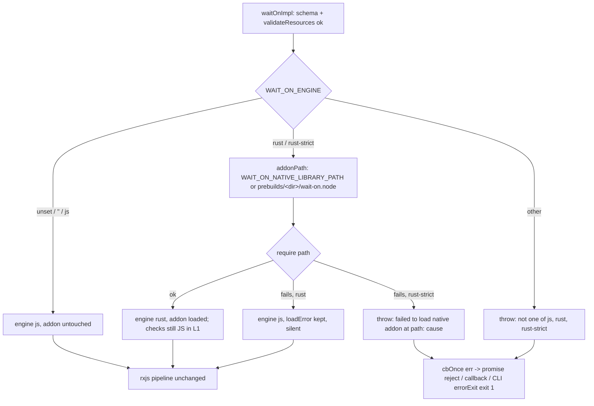

# [L1] Cargo workspace, napi addon, engine switch and dual-driver test run

Implementation-ready lane plan for sub-issue #53. Product Contract preservation: the
requirements R-L1-1..R-L1-12 and tests T1..T10 below keep the meaning of the
requirements-only plan; sections were restructured to the unified-plan shape and tests
T11+ were added. The spine plan is controlling and is never edited by this lane.

---

## Goal Capsule

**Objective.** After this lane merges into `spike-next-rs`, anyone can check: `npm test`
is green and unchanged in outcome; `npm run ci:rs` is green on ubuntu, macos and windows
(CI `rust` job) and it runs the whole mocha suite a second time with the real napi addon
loaded (`WAIT_ON_ENGINE=rust-strict`); `WAIT_ON_ENGINE=rust` with no addon still works
silently; every `napi` CI row produces `prebuilds/<platform>-<arch>[-musl]/wait-on.node`.
Proves PO1 (bridge), PO13 (dual driver), PO21 (toolchain pin).

**Means.** A two-crate Cargo workspace (KTD1), a small `lib/engine.js` resolver + loader
with a test-only addon-path override (KTD3, KTD4), a Rust pending list composed into the
existing root hooks (KTD6), and two Node scripts behind `build:napi` / `ci:rs` (KTD7,
KTD8). No resource check is ported; the addon only answers `version()` and `noop()`.

**Authority.** `AGENTS.md` > spine plan KD-S1..KD-S9 > this plan.

**Stop conditions.**
- A `.github/workflows/` change is needed (any napi/rust row cannot go green from
  `package.json` scripts alone) -> stop and report to the PM. Do not edit workflows, do
  not post on #35.
- A public API / CLI / `WAIT_ON_SCHEMA` / `index.d.ts` surface change would be needed ->
  stop and report.
- A new runtime dependency would be needed -> stop and report.

**Execution profile.** `/ce-work` via `/lfg` from this plan; strict TDD per AGENTS.md;
opens one PR, base `spike-next-rs` on `kevinold/wait-on`, body `Closes #53`; never merges.

---

## Product Contract

### Summary

Stand up the Rust side of the two-engine repo so lanes L2-L10 only port checks: Cargo
workspace + pinned toolchain + supply-chain gate, a napi addon the JS package can load
through a hand-written loader, an env-driven engine switch with safe fallback, and a run
of every mocha suite under both engines with an explicit pending list. JS engine behavior
is unchanged.

### Problem Frame

Today the repo has one engine (`lib/wait-on.js`) and CI hooks (`ci:rs`, `build:napi`,
`ci:rs:package`) that no-op until scripts exist. The napi `package` job and later lanes
need: a place for Rust code, a reproducible toolchain, a way for `lib/` to find and load
an addon without a new dependency, and a switch that keeps JS the default (KD-S1). All of
this must be provable through the front doors (`waitOn` result, CLI exit/stderr) and must
run on Windows `cmd` in CI.

### Requirements

- **R-L1-1 Cargo workspace (KD-S4).** Root `Cargo.toml` workspace with members
  `crates/wait-on-core` (pure Rust lib, no napi) and `crates/wait-on-napi` (napi-rs
  binding, `crate-type = ["cdylib"]`, depends on `wait-on-core`). `Cargo.lock` committed.
- **R-L1-2 Toolchain (KD-S5, PO21).** `rust-toolchain.toml` pins a specific stable version
  with `rustfmt` and `clippy` components; MSRV (`rust-version` in the workspace) equals the
  pin. The CI `rust` job runs a bare `rustup toolchain install`, so the file alone must be
  enough to provision the toolchain.
- **R-L1-3 Supply-chain gate.** `deny.toml` so `cargo deny check` passes on the committed
  lockfile (licenses allow-list compatible with MIT distribution, advisories, bans, sources
  restricted to crates.io).
- **R-L1-4 Addon surface.** The addon exports `version()` returning the crate version
  string and a `noop()` (the spine L1 row names both; `noop` is one line). No other
  surface.
- **R-L1-5 Prebuilds loader (KD-S4).** Small hand-written loader in `lib/` that resolves
  `prebuilds/<platform>-<arch>[-musl]/wait-on.node` relative to the package root (musl
  detected at runtime on linux), with no new runtime dependency. `prebuilds/` is
  gitignored and not committed.
- **R-L1-6 Engine selection (KD-S1).** Read `WAIT_ON_ENGINE` on every `waitOn` call:
  - unset, empty, or `js` -> JS engine; the addon is never loaded.
  - `rust` -> load the addon; on load failure fall back to JS silently (no stdout/stderr
    change for the CLI).
  - `rust-strict` -> load the addon; on load failure `waitOn` rejects / calls back with an
    error naming the engine, the addon path and the cause (the CLI exits 1 with that
    message on stderr).
  - any other value -> `waitOn` rejects / calls back with an error naming the allowed
    values (CLI exits 1).
  Under a loaded Rust engine, resources not yet ported keep using the JS checks.
- **R-L1-7 npm scripts (KD-S7).**
  - `build:napi` -- build the host (or `-- --target <triple> [extra-args]`) addon into
    `prebuilds/<platform>-<arch>[-musl]/wait-on.node` via `@napi-rs/cli`. It must accept
    the CI `napi` job's argument shape (`--target <triple>`, and `-x` on musl rows) and
    must never write to the repo root (`index.js`, `index.d.ts`).
  - `ci:rs` -- cross-platform (ubuntu, macos, windows; no POSIX-only shell): `cargo fmt
    --check`, `cargo clippy --all-targets -- -D warnings`, `cargo test`, `cargo deny
    check`, host `build:napi`, then the mocha suites with `WAIT_ON_ENGINE=rust-strict`.
    Env setting must work under Windows `cmd` (Node script in `scripts/`, not `VAR=x cmd`).
- **R-L1-8 Pending list (KD-S2).** One explicit Rust pending list `test/rust-pending.js`
  naming tests (mocha full titles) that cannot pass on Rust yet. Under
  `WAIT_ON_ENGINE=rust*`, listed tests are reported as pending, not silently dropped;
  under JS the list has no effect. The list starts empty. Under `rust*`, a listed test
  that is not registered in the suites fails the run, so stale entries cannot accumulate.
- **R-L1-9 Dual-driver run (PO13).** `npm test` (JS) is unchanged in outcome. `ci:rs` runs
  the same `test/**/*.mocha.js` under `rust-strict`, including CLI subprocess tests (the
  env var propagates to spawned `bin/wait-on`).
- **R-L1-10 Packaging hygiene.** The published package keeps `crates/`, `Cargo.*`,
  `rust-toolchain.toml`, `deny.toml`, `target/`, `scripts/` out (the `files` whitelist
  already does; `.npmignore` needs no change) and includes `prebuilds/` when present (L9
  fills it). `target/` and `prebuilds/` gitignored.
- **R-L1-11 Lint/coverage.** New `lib/` and `scripts/` code is linted; `npm run
  test:coverage` thresholds (`.nycrc.json`) stay met under the JS run.
- **R-L1-12 Guides (KD-S9).** Update `docs/guides/` `architecture.md`, `development.md`,
  `testing.md`, `ci.md` with the real layout, commands, engine switch, pending list, and
  the `ci:rs` / `build:napi` status (no longer "planned").

### Scope Boundaries

- Allowed paths: `crates/`, `Cargo.toml`, `Cargo.lock`, `rust-toolchain.toml`, `deny.toml`,
  `lib/`, `bin/`, `test/`, `index.d.ts`, `package.json`, `package-lock.json`, `.npmignore`,
  `.gitignore`, `.nycrc.json`, `eslint.config.mjs`, `docs/guides/`, `docs/plans/`,
  `docs/solutions/`, `AGENTS.md`, `README.md`, `benchmarks/`, `scripts/`.
  `.mocharc.json` is not allowed (KTD6 works around it).
- New package allowed: `@napi-rs/cli` (devDependency only). No new runtime dependency.
- No `.github/workflows/` edits (stop condition above).
- No resource check is ported. `bin/wait-on` is not edited: its existing `errorExit`
  already prints the error and exits 1, which is the CLI surface R-L1-6 needs.
- Public API, CLI flags, `WAIT_ON_SCHEMA`, `index.d.ts` unchanged.
- **Non-goals (considered, not built):** a `napi` config block in `package.json`
  (the script copies `*.node` regardless of napi's binary naming); an addon load cache
  (`require()` already caches by resolved path); a `--verbose` log line naming the engine
  (would change log parity that L7 owns); a `WAIT_ON_ENGINE` entry in `WAIT_ON_SCHEMA` or
  an `engine` option (env only, per KD-S1); `ci:rs:package` (L9); strip/size tuning of the
  addon (L9); running lint/types inside `ci:rs` (the `build` job does that); a guard that
  diffs `index.d.ts` after `napi build` (structurally impossible once the output dir is
  under `target/`, see KTD7).

### Outstanding Questions

- **(deferred, answered by CI)** Do all 8 `napi` rows go green with `build:napi` as
  specified, in particular musl rows via `-x`/cargo-zigbuild and `aarch64-pc-windows-msvc`?
  Answered by the PR's `napi` checks. A red row that needs a workflow edit is a stop
  condition. A red row that the script can fix (e.g. installing `cargo-zigbuild`) is fixed
  in `scripts/build-napi.js` (test: `test/scripts.mocha.js` "plans a cargo-zigbuild install
  when -x is given and it is absent").
- **(deferred, execution-time)** Exact `@napi-rs/cli` v3 flag spellings for output dir and
  disabling JS/d.ts generation. Resolved by reading `napi build --help` during U2; the
  plan only fixes the invariant (output dir under `target/napi/`), guarded by
  `test/scripts.mocha.js` "output dir is under target/napi and never the repo root".
- None blocking.

### Sources

- Lane issue kevinold/wait-on#53 (text only; no comments at authoring time).
- Spine plan `docs/plans/2026-09-30-1400-feat-spike-next-rs-spine-plan.md` KD-S1, KD-S2,
  KD-S4, KD-S5, KD-S7, KD-S9, lane table row L1.
- `AGENTS.md` (TDD, conventions), `docs/guides/ci.md` (hook contract, napi matrix),
  `.github/workflows/node.js.yml` (read-only), `lib/wait-on.js`, `bin/wait-on`,
  `test/frozen-clock.js`, `package.json`, `.nycrc.json`, `eslint.config.mjs`.
- napi-rs CLI docs (`cli/docs/build.md`): `--target`, `--output-dir`, `--manifest-path`,
  `--cross-compile` (cargo-zigbuild / cargo-xwin).

---

## Planning Contract

### Key Technical Decisions

- **KTD1 Workspace shape.** Root `Cargo.toml` with `[workspace] members = [crates/wait-on-core, crates/wait-on-napi]`, `resolver = "2"`, and `[workspace.package]` carrying one
  `version`, `edition`, `rust-version`, `license = "MIT"` that both crates inherit. One
  version number for the addon and core; T4 reads it from the root `Cargo.toml`.
  Chosen over per-crate versions: nothing in L1 needs them to differ.
- **KTD2 napi crate is not unit-tested; core is.** `crates/wait-on-napi/Cargo.toml` sets
  `[lib] crate-type = ["cdylib"], test = false, doctest = false`; `version()` logic lives in
  `crates/wait-on-core` with a `#[test]` asserting the concrete string. Chosen over testing
  the napi crate: a cdylib napi crate's test binary can fail to link `napi_*` symbols
  outside Node, and the binding is one line.
- **KTD3 One loader module, `lib/engine.js`, env read per call.** Exports `resolveEngine(env)`
  -> `{ engine: 'js' | 'rust', addon: object | null, loadError: Error | null }` (throws on
  an invalid value or a strict load failure), plus pure helpers `prebuildDir({ platform,
  arch, musl })`, `isMusl({ platform, report })`, `addonPath(env)`. `waitOnImpl` calls
  `resolveEngine(process.env)` after `validateResources` and routes a throw into
  `cbOnce(err)`, so the error reaches the callback / promise exactly like validation
  errors and the CLI's untouched `errorExit` prints it and exits 1. Reading `process.env`
  per call lets in-process tests toggle values without mocking (AGENTS: no mocking wait-on
  modules). Chosen over a module-load-time read: untestable in-process. The resolved engine
  is not yet passed into `createResource$` deps (nothing consumes it in L1; L2 adds it).
- **KTD4 Test hook: `WAIT_ON_NATIVE_LIBRARY_PATH` overrides the addon path.** Wait-on
  specific name (napi-rs's own `NAPI_RS_NATIVE_LIBRARY_PATH` would collide with other
  napi packages in the same process). Loading is `require(path)`, which accepts a `.node`
  or a `.js` file, so tests point it at (a) a nonexistent path ("poison": proves the
  loader never touched it under `js`, proves fallback under `rust`, proves the error
  under `rust-strict`), (b) a junk file named `wait-on.node` (dlopen failure), and (c)
  `test/fixtures/fake-addon.js` exporting `{ version, noop }` (the load-success branch on
  every platform, which keeps `.nycrc.json` thresholds met without a native build). The
  real addon is exercised by T4 whenever the host prebuild exists (always under `ci:rs`).
  Chosen over a `.nycrc.json` exclusion: the exclusion hides the branch, the fixture runs it.
  Documented in guides only (dev/test hook, not a public option).
- **KTD5 Engine values.** Exact set `''`/unset -> js, `js`, `rust`, `rust-strict`; anything
  else throws `WAIT_ON_ENGINE="<v>" is not one of js, rust, rust-strict`. Strict failure
  message: `WAIT_ON_ENGINE=rust-strict: failed to load the native addon at <path>: <cause>`.
  Concrete strings so tests assert literal substrings.
- **KTD6 Pending list plugs into `test/frozen-clock.js`'s `mochaHooks`.** `.mocharc.json`
  (off-limits) already requires `test/frozen-clock.js` as the root-hook plugin.
  `test/rust-pending.js` exports `pending` (array of mocha full titles, starts empty),
  `createHooks(list)` -> `{ beforeAll, beforeEach }`, and `mochaHooks = createHooks(pending)`;
  `frozen-clock.js` composes them (`beforeAll`, `beforeEach` from rust-pending; its own
  `afterEach` unchanged). `beforeAll` walks the root suite collecting registered full
  titles and throws naming stale entries; `beforeEach` calls `this.skip()` when the
  current test's full title is listed. Both are no-ops unless `WAIT_ON_ENGINE` matches
  `/^rust(-strict)?$/`. Walking registered titles (not run titles) keeps `--grep` runs from
  false stale errors. Chosen over a `mocha` block in `package.json`: two mocha config
  sources merge unpredictably for `require`. Chosen over a `--require` flag in
  `test:mocha`: same merge risk, and `ci:rs` would have to repeat it.
- **KTD7 `build:napi` = `scripts/build-napi.js`, output never at repo root.** Resolves the
  target triple (`--target` or host from `rustc -vV`), maps triple -> `{ platform, arch,
  musl }` and reuses `lib/engine.js` `prebuildDir` for the directory name (one source of
  truth), runs the napi CLI through `process.execPath` + the bin path resolved from
  `@napi-rs/cli/package.json` (Windows-safe, no `.cmd` shim) with `--release`,
  `--manifest-path crates/wait-on-napi/Cargo.toml`, `--output-dir <abs target/napi/<dir>>`,
  `--target <triple>` and forwarded extra args, then copies the single `*.node` from that
  dir to `prebuilds/<dir>/wait-on.node`. Any generated `index.js`/`index.d.ts` lands under
  `target/` (gitignored). When `-x` is passed and `cargo zigbuild --version` fails, it runs
  `cargo install cargo-zigbuild --locked` first (CI installs zig only; workflows cannot
  change). Chosen over plain `cargo build` + copy: R-L1-7 names `@napi-rs/cli`.
- **KTD8 `ci:rs` = `scripts/ci-rs.js`.** Sequential `spawnSync` with `stdio: 'inherit'`,
  fail on first non-zero: `cargo fmt --all --check`; `cargo clippy --workspace
  --all-targets -- -D warnings`; `cargo test --workspace`; `cargo deny check`;
  `node scripts/build-napi.js`; `node <mocha/bin/mocha.js> --exit test/**/*.mocha.js` with
  `env: { ...process.env, WAIT_ON_ENGINE: 'rust-strict' }`. `cargo` resolves to
  `cargo.exe` on Windows without a shell; mocha runs via its JS bin. The step list is a
  pure exported function so its order and env are unit-tested. A missing `cargo-deny`
  fails with cargo's own "no such command" (no extra code); `development.md` says how to
  install it.
- **KTD9 `prebuilds/` enters `files` now.** One line in `package.json`; harmless when
  the directory is absent, required for L9's tarball. T10 checks `npm pack --dry-run`.
- **KTD10 Session-settled.**
  - PR base `spike-next-rs` on kevinold/wait-on (session-settled: user-directed — chosen
    over master/next or jeffbski/wait-on: spine lanes merge into the spike branch; upstream
    out of scope).
  - No `.github/workflows/` edits; if needed stop and report to the PM (session-settled:
    user-directed — chosen over editing workflows or posting an operator request on #35:
    KD-S7 plus PM instruction this session).
  - Only new package is `@napi-rs/cli` as devDependency (session-settled: user-directed —
    chosen over node-gyp-build or other loader/runtime deps: lane contract plus KD-S4
    hand-written loader).
  - Stay inside allowed paths; `.mocharc.json` is not one (session-settled: user-directed
    — chosen over touching other paths: lane contract).

### High-Level Technical Design

Layout after the lane:

```
Cargo.toml  rust-toolchain.toml  deny.toml  Cargo.lock
crates/wait-on-core/{Cargo.toml, src/lib.rs}
crates/wait-on-napi/{Cargo.toml, build.rs, src/lib.rs}
lib/engine.js            (resolver + loader; required by lib/wait-on.js)
scripts/build-napi.js    scripts/ci-rs.js
test/rust-pending.js     test/engine.mocha.js  test/rust-pending.mocha.js
test/scripts.mocha.js    test/rust-scaffold.mocha.js
test/fixtures/fake-addon.js  test/fixtures/rust-pending/{spec.js, hooks-listed.js, hooks-stale.js}
prebuilds/<platform>-<arch>[-musl]/wait-on.node   (gitignored, built)
```

Engine selection per `waitOn` call (the branching gate):



Directional sketch of `lib/engine.js` (not code):
`prebuildDir` -> `${platform}-${arch}${musl ? '-musl' : ''}`; `isMusl` -> platform is
linux and `report().header.glibcVersionRuntime` is absent; `addonPath(env)` -> override
or `path.join(__dirname, '..', 'prebuilds', prebuildDir(host), 'wait-on.node')`;
`resolveEngine(env)` -> switch on value, try `require(addonPath(env))`, throw / fall back.

### Assumptions

- `@napi-rs/cli` v3 exposes its bin through `package.json` `bin.napi` (a JS file runnable
  under `node`), accepts `--manifest-path`, `--output-dir`, `--target`, `--release`,
  `--cross-compile`/`-x`, and does not modify the package.json it reads. Verified during U2.
- napi-rs 3 on windows resolves `napi_*` symbols at runtime and `napi_build::setup()`
  emits the macOS `dynamic_lookup` link args, so a plain build of the cdylib is loadable
  by Node. Verified by T4 under `ci:rs` on all three OSes.
- Node's `require()` loads `.node` files and caches by resolved path (Node >= 22.19).
- `process.report.getReport()` exists on every supported Node.
- CI `napi` rows have `rustup target add <triple>` done and `zig` on PATH for musl rows.

### Risks

| Risk | Answered by |
|---|---|
| `build:napi` activates 8 `napi` rows; any red row blocks the PR | PR `napi` checks; script-fixable causes go to `scripts/build-napi.js` (+ `test/scripts.mocha.js`); workflow-only causes are a stop condition |
| musl rows: `-x` needs `cargo-zigbuild`, CI installs zig only | `test/scripts.mocha.js` "plans a cargo-zigbuild install when -x is given and it is absent"; behavior proven by the two musl `napi` rows |
| Windows `ci:rs`: env var and spawn without shell | `test/scripts.mocha.js` "uses process.execPath, not npm or a shell, for node steps"; T8 on the `rust` windows row |
| Coverage: addon-present branch unreachable in the JS run | T4b (fixture addon) runs the success branch on every platform; `npm run test:coverage` meets `.nycrc.json` |
| `rust-strict` error thrown synchronously would bypass the callback / promise | T3 promise form and T3 callback form both assert the error arrives through `cb(err)` / rejection, never a throw |
| Pending list silently drops tests or fires false stale errors under `--grep` | T7 subprocess runs assert `stats.pending` counts via `--reporter json`; stale check walks registered titles (T7 stale case) |
| Toolchain pin and MSRV drift apart | T11 in `test/rust-scaffold.mocha.js` |
| `napi build` writes `index.js` / `index.d.ts` at the repo root | `test/scripts.mocha.js` "output dir is under target/napi and never the repo root"; `npm run test:types` stays green after a local build |
| Crate version vs package version confusion | T4 compares `version()` to the root `Cargo.toml` `[workspace.package] version`, never to `package.json` |
| `cargo deny` license allow-list too narrow for napi's dependency tree | `cargo deny check` on the committed lockfile (U1 verification); widen the allow-list only to licenses actually present |

---

## Implementation Units

Order: U1 -> U3 -> U4 -> U2 -> U5 -> U6 -> U7. U3 and U4 do not need a built addon (T4
real-addon case skips until U2/U5 exist locally). Every unit: RED (run the named test,
read the failure), GREEN, `npm test`, refactor on green. Test and code land in the same
Conventional Commit.

### U1. Cargo workspace, toolchain pin, deny gate

- **Goal.** `cargo test --workspace`, `cargo fmt --all --check`, `cargo clippy --workspace
  --all-targets -- -D warnings`, `cargo deny check` all pass from the repo root.
- **Requirements.** R-L1-1, R-L1-2, R-L1-3, R-L1-4 (Rust side).
- **Dependencies.** None.
- **Files.** `Cargo.toml`, `Cargo.lock`, `rust-toolchain.toml`, `deny.toml`,
  `crates/wait-on-core/Cargo.toml`, `crates/wait-on-core/src/lib.rs`,
  `crates/wait-on-napi/Cargo.toml`, `crates/wait-on-napi/build.rs`,
  `crates/wait-on-napi/src/lib.rs`, `test/rust-scaffold.mocha.js`, `.gitignore` (`target/`).
- **Approach.** KTD1, KTD2. `wait-on-core` exposes `version()` returning the crate version.
  `wait-on-napi` exposes `version()` and `noop()` via `#[napi]`; `build.rs` calls
  `napi_build::setup()`. `rust-toolchain.toml` pins the exact stable channel with
  `rustfmt` and `clippy` components; `[workspace.package] rust-version` equals it.
  `deny.toml`: licenses allow-list (MIT, Apache-2.0, and only what the lockfile actually
  needs), advisories on, bans `multiple-versions = "warn"`, sources deny unknown
  registries and git.
- **Patterns to follow.** Spine KD-S4/KD-S5 file layout; keep crates minimal (no
  tokio/reqwest yet — L2+ add deps when a check needs them).
- **Test scenarios.**
  - T9 `crates/wait-on-core/src/lib.rs` `#[test] version_is_workspace_version`: action
    `version()`; expected the concrete string set in `[workspace.package]` (e.g.
    `"0.1.0"`). RED: no crate -> `cargo test` fails to find a workspace.
  - T11 `test/rust-scaffold.mocha.js` "pins the same Rust version in rust-toolchain.toml
    and the workspace rust-version": read the two files; expected equal strings, and
    `Cargo.lock` exists. RED: files missing.
  - Config RED for R-L1-3: `cargo deny check` observed failing (no `deny.toml`) then green.
- **Verification.** The four cargo commands above green; `npm test` unchanged.

### U2. napi crate build script (`build:napi`)

- **Goal.** `npm run build:napi` produces `prebuilds/<host dir>/wait-on.node`; `npm run
  build:napi -- --target <triple> [-x]` does the same for the CI argument shape; nothing is
  written to the repo root.
- **Requirements.** R-L1-7 (`build:napi`), R-L1-5 (directory naming).
- **Dependencies.** U1 (crates), U3 (`prebuildDir` reuse).
- **Files.** `scripts/build-napi.js`, `package.json` (`build:napi` script, `@napi-rs/cli`
  devDependency, `lint` glob adds `"scripts/**/*.js"`), `package-lock.json`,
  `test/scripts.mocha.js`, `.gitignore` (`prebuilds/`).
- **Approach.** KTD7. Export pure functions and run `main()` only under
  `require.main === module`: `targetToPrebuild(triple)` (8 CI triples ->
  `{ platform, arch, musl }`, unknown throws listing the supported triples),
  `hostTriple(rustcVVText)` (parses the `host:` line), `planBuild({ target, extraArgs,
  repoRoot, hasZigbuild })` -> `{ napiArgs, outputDir, prebuildPath, installZigbuild }`.
  `main` runs the plan with `spawnSync` (`stdio: 'inherit'`), copies the single `*.node`
  from `outputDir` to `prebuildPath`, fails if zero or several `.node` files are found.
- **Patterns to follow.** `bin/wait-on` exports its parsers for tests under a
  `require.main === module` guard; `test/helpers/cli-conformance.js` for spawning with
  `process.execPath`.
- **Test scenarios (`test/scripts.mocha.js`, describe "build:napi").**
  - "maps every CI target triple to its prebuild directory": each of the 8 triples ->
    `darwin-arm64`, `darwin-x64`, `linux-x64`, `linux-arm64`, `linux-x64-musl`,
    `linux-arm64-musl`, `win32-x64`, `win32-arm64`. RED: module missing.
  - "rejects an unknown triple with the supported list": `riscv64gc-unknown-linux-gnu` ->
    throw whose message includes `x86_64-unknown-linux-gnu`.
  - "parses the host triple from rustc -vV output": literal multi-line string with
    `host: aarch64-apple-darwin` -> `aarch64-apple-darwin`.
  - "output dir is under target/napi and never the repo root":
    `planBuild({ target: 'x86_64-unknown-linux-gnu', extraArgs: [], repoRoot: '/r' })` ->
    `outputDir` equals `/r/target/napi/linux-x64` (path-joined); `napiArgs` contains
    `--output-dir` followed by that dir, `--target x86_64-unknown-linux-gnu`, `--release`,
    `--manifest-path` -> `crates/wait-on-napi/Cargo.toml`; `prebuildPath` equals
    `/r/prebuilds/linux-x64/wait-on.node`.
  - "forwards extra args and plans a cargo-zigbuild install when -x is given and it is
    absent": `extraArgs: ['-x']`, `hasZigbuild: false` -> `napiArgs` ends with `-x` and
    `installZigbuild === true`; with `hasZigbuild: true` -> `false`.
  - "the script file has no side effects on require": requiring `scripts/build-napi.js`
    returns the function map without spawning anything.
- **Verification.** `npm run build:napi` locally creates `prebuilds/<host>/wait-on.node`;
  `npm run test:types` still green afterwards; no `index.js` at repo root; `npm run lint`
  covers `scripts/`. In CI: all 8 `napi` rows green and each uploads `prebuilds-<target>`.

### U3. Engine selection and prebuilds loader in `lib/`

- **Goal.** `WAIT_ON_ENGINE` drives `waitOn` per KTD3/KTD5 at both front doors; JS
  behavior unchanged when unset.
- **Requirements.** R-L1-5, R-L1-6, R-L1-9 (env propagation), R-L1-11 (coverage).
- **Dependencies.** None (real-addon case of T4 needs U2/U5 to have run locally; it skips
  otherwise).
- **Files.** `lib/engine.js` (new), `lib/wait-on.js` (require + one call site in
  `waitOnImpl` after `validateResources`), `test/engine.mocha.js` (new),
  `test/fixtures/fake-addon.js` (new; exports `version` returning `'fake'` and `noop`).
- **Approach.** KTD3, KTD4, KTD5. Tests scope env with a small `withEnv(overrides, fn)`
  helper that sets/deletes keys on `process.env` and restores them in `finally`; CLI
  cases spawn `process.execPath bin/wait-on <existing file> -t 1000` with an explicit
  `env`. Poison path = a nonexistent file under `os.tmpdir()`; junk addon = a temp file
  named `wait-on.node` containing text.
- **Patterns to follow.** `test/native-helpers.mocha.js` (require the module directly for
  pure helpers); `test/cli.mocha.js` `execCLI`; `test/coverage.mocha.js` (existing file as
  an instantly-ready resource, generous timeout for subprocess cases). Plain `it`
  (nothing is time-dependent).
- **Test scenarios (`test/engine.mocha.js`).**
  - T1 "should use the JS engine and never touch the addon when WAIT_ON_ENGINE is unset"
    (API): `WAIT_ON_ENGINE` deleted, `WAIT_ON_NATIVE_LIBRARY_PATH` = poison;
    `waitOn({ resources: [__filename], timeout: 1000 })` resolves. Same with
    `WAIT_ON_ENGINE=''` and `WAIT_ON_ENGINE=js`. Path proof: `resolveEngine(env)` returns
    `{ engine: 'js', addon: null, loadError: null }` for the same envs.
  - T1 (CLI) "should exit 0 under js with a poison addon path": spawn with
    `WAIT_ON_ENGINE=js`, poison; exit 0, stderr `''`.
  - T2 "should fall back to JS silently when rust is requested and the addon is missing"
    (API): `rust` + poison; resolves; `resolveEngine(env)` returns `engine 'js'`,
    `addon null`, `loadError` with `code 'MODULE_NOT_FOUND'` (proves the load was
    attempted). CLI: exit 0, stdout and stderr identical to the js run.
  - T2c "should fall back when the addon file exists but cannot be loaded": `rust` + junk
    `wait-on.node`; resolves and `loadError` is an Error.
  - T3 "should reject under rust-strict when the addon is missing" (promise):
    `rust-strict` + poison; rejection message includes `rust-strict`, the poison path, and
    `Cannot find module`. Callback form: `waitOn(opts, cb)` does not throw and `cb`
    receives the same error. T3c: junk addon -> rejects with the path in the message.
    CLI: exit 1, stderr includes `rust-strict` and the poison path.
  - T4 "should load the real addon and answer version() under rust-strict": `this.skip()`
    unless `fs.existsSync(addonPath({}))`; `rust-strict`, no override; `waitOn` resolves
    and `resolveEngine(env).addon.version()` equals the `version` read from the root
    `Cargo.toml` `[workspace.package]`, and `addon.noop()` returns `undefined`. Under
    `ci:rs` this never skips.
  - T4b "should take the addon-present branch with a fixture addon" (API, always runs):
    `rust-strict` + `WAIT_ON_NATIVE_LIBRARY_PATH=test/fixtures/fake-addon.js`; resolves;
    `resolveEngine(env)` returns `engine 'rust'` and `addon.version() === 'fake'`; calling
    twice returns the same `addon` object. Same env under `rust` -> identical result.
    CLI: exit 0 with the fixture path (versus exit 1 with poison in T3).
  - T5 "should error on an unknown WAIT_ON_ENGINE value": `WAIT_ON_ENGINE=nope`; API
    rejects with message including `"nope"` and `js, rust, rust-strict`; callback form
    delivers the same error without throwing; CLI exits 1 with that message on stderr.
  - T6 "resolves the prebuild directory per platform/arch/musl": `prebuildDir` cells
    `{darwin,arm64,false}` -> `darwin-arm64`; `{darwin,x64,false}` -> `darwin-x64`;
    `{linux,x64,false}` -> `linux-x64`; `{linux,x64,true}` -> `linux-x64-musl`;
    `{linux,arm64,true}` -> `linux-arm64-musl`; `{win32,x64,false}` -> `win32-x64`;
    `{win32,arm64,false}` -> `win32-arm64`. `isMusl` with linux and no
    `glibcVersionRuntime` -> true; with `'2.39'` -> false; darwin -> false.
    `addonPath({})` is under `<repo root>/prebuilds/`, contains
    `${process.platform}-${process.arch}`, ends with `wait-on.node`;
    `addonPath({ WAIT_ON_NATIVE_LIBRARY_PATH: '/x' })` -> `/x`.
- **Verification.** `npm test`; `npm run test:coverage` meets thresholds with every
  `lib/engine.js` branch run.

### U4. Rust pending list and root-hook composition

- **Goal.** Under `WAIT_ON_ENGINE=rust*`, listed tests report pending and stale entries
  fail the run; under JS nothing changes.
- **Requirements.** R-L1-8, R-L1-9.
- **Dependencies.** None.
- **Files.** `test/rust-pending.js` (new), `test/frozen-clock.js` (compose hooks; no
  other change), `test/rust-pending.mocha.js` (new),
  `test/fixtures/rust-pending/spec.js` (two tests in `describe('rust-pending fixture')`:
  `'listed test'`, `'other test'`), `test/fixtures/rust-pending/hooks-listed.js`
  (hooks for `['rust-pending fixture listed test']`),
  `test/fixtures/rust-pending/hooks-stale.js` (hooks for `['no such test']`).
- **Approach.** KTD6. The pending list file has a header comment stating the entry
  format (mocha full title) and that each lane shrinks it. Fixtures live outside the
  `*.mocha.js` glob so the main run never picks them up.
- **Patterns to follow.** Root hook plugin shape already in `test/frozen-clock.js`;
  subprocess spawning from `test/helpers/cli-conformance.js`.
- **Test scenarios (`test/rust-pending.mocha.js`; each spawns mocha's JS bin via
  `process.execPath` with `--no-config --reporter json --require <hooks fixture>
  test/fixtures/rust-pending/spec.js` and an explicit env, then parses stdout JSON).**
  - T7 "should report a listed test as pending under rust": `rust`, hooks-listed;
    `stats.pending === 1`, `stats.passes === 1`, pending full title equals
    `rust-pending fixture listed test`, exit 0. Repeat with `rust-strict`.
  - T7 "should run every test under js even when listed": `js` (and unset), hooks-listed;
    `stats.passes === 2`, `stats.pending === 0`.
  - T7 "should fail the run under rust when a listed test is not registered": `rust`,
    hooks-stale; exit non-zero and the failure message includes `no such test` and
    `test/rust-pending.js`.
  - T7 "should ignore a stale entry under js": `js`, hooks-stale; `stats.passes === 2`,
    exit 0.
  - "the committed list is empty and composed into the root hooks":
    `require('./rust-pending').pending` deep-equals `[]`;
    `require('./frozen-clock').mochaHooks.beforeEach` and `beforeAll` are the rust-pending
    hooks (same function references). RED: frozen-clock exports only `afterEach`.
- **Verification.** `npm test`; a local mocha run with `WAIT_ON_ENGINE=rust` shows 0
  pending from the list.

### U5. `ci:rs` script

- **Goal.** `npm run ci:rs` runs the Rust gate then the full mocha suite under
  `rust-strict`, on all three OSes, no shell.
- **Requirements.** R-L1-7 (`ci:rs`), R-L1-9.
- **Dependencies.** U1, U2, U3, U4.
- **Files.** `scripts/ci-rs.js` (new), `package.json` (`ci:rs` script),
  `test/scripts.mocha.js` (describe "ci:rs").
- **Approach.** KTD8. `steps({ repoRoot })` returns an ordered array of
  `{ cmd, args, env? }`; `main()` runs them with `spawnSync(..., { stdio: 'inherit', env })`
  and exits with the first non-zero status.
- **Test scenarios (`test/scripts.mocha.js`, describe "ci:rs").**
  - "runs fmt, clippy, test, deny, host build, then mocha under rust-strict in that order":
    `steps()` deep-equals the literal list: `cargo fmt --all --check`; `cargo clippy
    --workspace --all-targets -- -D warnings`; `cargo test --workspace`; `cargo deny
    check`; `process.execPath scripts/build-napi.js`; `process.execPath <resolved
    mocha/bin/mocha.js> --exit test/**/*.mocha.js` with `env.WAIT_ON_ENGINE === 'rust-strict'`.
  - "uses process.execPath, not npm or a shell, for node steps": every step whose `cmd`
    is not `cargo` has `cmd === process.execPath`.
  - T8 (config RED): `npm run ci:rs` observed failing with "Missing script" before the
    script is added; green after.
- **Verification.** `npm run ci:rs` green locally (needs `cargo-deny`); `rust` CI job
  green on ubuntu, macos, windows; T4's real-addon case ran (not skipped) in that job's
  mocha output.

### U6. Packaging hygiene

- **Goal.** The tarball ships `prebuilds/` when present and never Rust sources or scripts.
- **Requirements.** R-L1-10, R-L1-11.
- **Dependencies.** U2 (so `prebuilds/` exists locally for the positive check).
- **Files.** `package.json` (`files` adds `"prebuilds/"`), `.gitignore` (`target/`,
  `prebuilds/` if not already added in U1/U2).
- **Approach.** KTD9. `.npmignore` unchanged.
- **Test scenarios.**
  - T10 (config RED/GREEN): `npm pack --dry-run` before the `files` change lists no
    `prebuilds/` entry although `prebuilds/<host>/wait-on.node` exists; after, it lists
    that file; in both runs no `crates/`, `Cargo.`, `target/`, `scripts/`, `deny.toml`,
    `rust-toolchain.toml` entries appear.
- **Verification.** The `npm pack --dry-run` inspection above; `npm run lint` includes
  `scripts/**/*.js`.

### U7. Guides and touch-ups (docs-only)

- **Goal.** Every `Status: planned (lane L1)` marker is replaced with the real state.
- **Requirements.** R-L1-12.
- **Dependencies.** U1-U6.
- **Files.** `docs/guides/architecture.md` (Rust engine layout; engine selection and
  fallback incl. `WAIT_ON_NATIVE_LIBRARY_PATH` as a dev/test hook and the exact values),
  `docs/guides/development.md` (`cargo-deny` install line; building the addon; running
  each engine), `docs/guides/testing.md` (new suite rows `test/engine.mocha.js`,
  `test/rust-pending.mocha.js`, `test/scripts.mocha.js`, `test/rust-scaffold.mocha.js`;
  running under each engine; pending list format and stale rule), `docs/guides/ci.md`
  (hook table: `ci:rs` and `build:napi` exist (L1), matrix hardening L9), `README.md`
  (one sentence: experimental `WAIT_ON_ENGINE=rust` opt-in, link to guides), `AGENTS.md`
  ("Two engines" paragraph: name `lib/engine.js` and `test/rust-pending.js`).
- **Test scenarios.** Test expectation: none -- docs-only carve-out. Check: no
  `planned (lane L1)` markers remain in `docs/guides`.
- **Verification.** Links resolve; `docs/guides/contributing-dual-engine.md` checklist
  items for this lane satisfied.

---

## Verification Contract

Run from the repo root; all must pass before the PR opens.

- `npm test` -- lint (now incl. `scripts/**/*.js`), types, mocha under JS; outcome
  unchanged from the base branch apart from the new suites.
- `npm run test:coverage` -- `.nycrc.json` thresholds met (branches 95, lines 98,
  functions 94, statements 97) with `lib/engine.js` included.
- `cargo fmt --all --check`, `cargo clippy --workspace --all-targets -- -D warnings`,
  `cargo test --workspace` (T9 runs), `cargo deny check`.
- `npm run build:napi` -- creates `prebuilds/<host>/wait-on.node`; afterwards
  `npm run test:types` still green and no `index.js` exists at the repo root.
- `npm run build:napi -- --target <host triple>` -- same result via the CI arg shape.
- `npm run ci:rs` -- green locally; its mocha pass shows T4's real-addon case executed
  (not pending) and 0 pending from the list.
- `npm pack --dry-run` -- includes `prebuilds/**/wait-on.node` when present; excludes
  `crates/`, `Cargo.toml`, `Cargo.lock`, `target/`, `scripts/`, `deny.toml`,
  `rust-toolchain.toml`.
- CI on the PR: `build` (ubuntu+windows x node 22/24/26), `rust` (ubuntu, macos, windows),
  all 8 `napi` rows, `package` (no-op green) -- all green. commitlint / PR title checks
  green (Conventional Commits).

Matrix coverage (engine value x addon x front door):

| Engine | Addon missing (poison) | Addon broken (junk file) | Addon present (fixture) | Addon present (real) |
|---|---|---|---|---|
| unset / `''` / `js` | T1 API + CLI (poison proves untouched) | carve-out: never touched, T1 | carve-out: never touched, T1 | carve-out: never touched, T1 |
| `rust` | T2 API + CLI | T2c API (CLI carve-out: same try/catch as missing) | T4b API | T4 API (skip-if-missing; runs in `ci:rs`) |
| `rust-strict` | T3 API promise + callback + CLI | T3c API (CLI carve-out as above) | T4b API + CLI exit 0 | T4 API; whole suite under `ci:rs` |
| invalid | T5 API promise + callback + CLI | carve-out: value check precedes loading | same | same |

---

## Definition of Done

- All requirements R-L1-1..R-L1-12 met; tests T1-T11 present, named for behavior, each
  seen red for the right reason before green.
- Verification Contract fully green locally and on the PR; every PR check green.
- `test/rust-pending.js` committed and empty; `prebuilds/` and `target/` gitignored and
  absent from the diff; no `.only`/`.skip` in the diff (conditional `this.skip()` in T4
  only).
- Guides updated (no `planned (lane L1)` markers left); README and AGENTS.md touched as
  in U7; `docs/plans/**` never deleted.
- Cleanup criterion: no abandoned-attempt code in the diff; the working tree contains no
  generated files outside gitignored paths (`target/`, `prebuilds/`, `coverage/`,
  `.nyc_output/`); scratch build output from `napi build` is under `target/napi/` only.
- PR opened against `spike-next-rs` with `Closes #53`; not merged by the lane. If a
  non-obvious learning surfaced (e.g. a napi flag or musl row fix), `/ce-compound` ran
  before the PR opened.

---

## Resume notes

<!-- Lane L1 notes only. Append below; never edit the spine plan or sibling lane plans. -->
