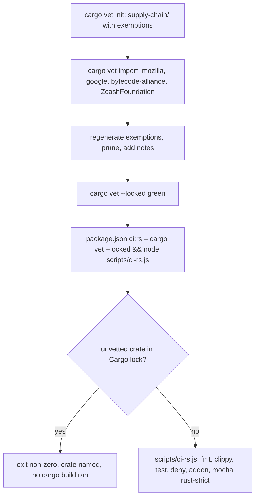

# [L11] cargo-vet supply-chain audits gating CI - Plan

Implementation-ready lane plan for sub-issue #68. Product Contract preservation: requirements R-L11-1..R-L11-9 and tests T-L11-1..T-L11-6 keep the meaning of the requirements-only plan; the open points (import registry names, wiring form, exemption minimization order, the RED probe) are resolved in KTD1–KTD6. The spine plan is controlling and is never edited by this lane.

---

## Goal Capsule

**Objective.** After this lane merges into `spike-next-rs`, a new or bumped third-party Rust crate cannot reach the shipped addon without an audit or a reasoned exemption: `npm run ci:rs` (the CI `rust` job on ubuntu, macos, windows) runs `cargo vet --locked` first and exits non-zero naming any crate in `Cargo.lock` that no imported audit, local audit, or recorded exemption covers. This completes R23's `cargo-vet` leg beside `cargo-deny`.

**Means.** A committed `supply-chain/` store (`cargo vet init`, imports from Mozilla, Google, Bytecode Alliance, ZcashFoundation, exemptions minimized and annotated; KTD1–KTD3), the gate wired as `cargo vet --locked && node scripts/ci-rs.js` in the `package.json` `ci:rs` entry (KTD4), RED observed on the command per `AGENTS.md` (KTD5), guides updated with the trust sources and counts (KTD6). No new scripts, no workflow edits, no JS change.

**Authority.** `AGENTS.md` > spine plan KD-S1..KD-S9 > this plan.

**Stop conditions** (report to the PM, do not work around):
- a `.github/workflows/` change is needed;
- an edit outside the lane's allowed paths is needed (`supply-chain/`, `Cargo.toml`, `Cargo.lock`, `deny.toml`, `crates/`, `package.json`, `package-lock.json`, `.npmignore`, `docs/guides/`, `docs/plans/`, `docs/solutions/`, `AGENTS.md`);
- JS engine behaviour would change.

**Execution profile.** `/ce-work` via `/lfg` from this plan; strict TDD per `AGENTS.md` (config/tooling RED = a command observed failing); one PR, base `spike-next-rs` on `kevinold/wait-on`, body `Closes #68`; never merges.

---

## Product Contract

### Summary

Create and commit the cargo-vet store, import the four trust sources, leave only reasoned exemptions, and make `npm run ci:rs` fail fast on an unvetted crate by prefixing the existing `ci:rs` entry in `package.json`. The operator side (CI installs `cargo-deny,cargo-vet`) is already true on `spike-next-rs`; this lane supplies the store, the gate, and the docs.

### Problem Frame

`deny.toml` gates advisories, licenses, bans, and sources, but nothing says whether the code in the 148 third-party crates was ever reviewed. A bumped crate with a malicious diff passes `cargo deny check` today. cargo-vet answers "who audited this version", and the CI `rust` job already installs it, but no `supply-chain/` store exists and `ci:rs` never calls it. `scripts/ci-rs.js` and `test/scripts.mocha.js` are outside this lane's paths, so the gate must be wired at the `package.json` script level.

### Starting state (verified 2026-09-30)

- `Cargo.lock`: 150 packages, 148 third-party from crates.io plus the workspace members `wait-on-core` and `wait-on-napi`.
- `deny.toml` gates advisories (yanked), licenses, bans, sources. `scripts/ci-rs.js` `steps()` runs fmt, clippy `-D warnings`, `cargo test`, `cargo deny check`, `build-napi.js`, mocha under `WAIT_ON_ENGINE=rust-strict`; `main()` spawns each without a shell and echoes `> <cmd> <args>` before each step. `test/scripts.mocha.js` `describe('ci:rs')` asserts `steps()` only; it does not read `package.json`.
- `package.json`: `"ci:rs": "node scripts/ci-rs.js"`; `files` allow-list = `bin/`, `lib/`, `prebuilds/`, `exampleConfig.js`, `index.d.ts`, so `supply-chain/` is outside the tarball already.
- `.github/workflows/node.js.yml` `rust` job: `taiki-e/install-action@v2` with `tool: cargo-deny,cargo-vet` (gated on `Cargo.toml`), then `npm run --if-present ci:rs` on ubuntu, macos, windows. No workflow edit needed.
- Local: cargo-vet 0.10.2 installed. No `supply-chain/` directory; `cargo vet --locked` errors "You must run 'cargo vet init'".
- Docs drift: `docs/guides/ci.md` line 10 still says `tool: cargo-deny`; line 23 (`ci:rs` row) lists no vet step; `docs/guides/development.md` line 6 (prerequisites) and line 27 (`ci:rs` row) omit cargo-vet; `docs/guides/architecture.md` line 27 mentions `deny.toml` only, no supply-chain section. `docs/solutions/` has no cargo-vet learning.

### Requirements

- R-L11-1 `supply-chain/` is created with `cargo vet init` and committed with `config.toml`, `audits.toml`, and `imports.lock`.
- R-L11-2 `config.toml` imports audits from Mozilla, Google, Bytecode Alliance, and ZcashFoundation at minimum. Other established sources (for example Embark, ISRG) are added only when they cover crates that would otherwise be exempted.
- R-L11-3 Exemptions are listed only for crates that no imported source covers. Each one carries a short `notes` reason. The exemption list is the minimum left after `cargo vet regenerate exemptions` / `prune`.
- R-L11-4 `cargo vet --locked` passes on the committed store and needs no network fetch beyond the locked imports.
- R-L11-5 `npm run ci:rs` runs `cargo vet --locked` and fails with a non-zero exit when it fails. Wiring goes in the `package.json` `ci:rs` entry, which is in allowed paths (`scripts/ci-rs.js` is not). It runs first so a supply-chain failure is reported before the slow build and test steps. The entry must work in POSIX sh and Windows cmd with no shell-specific syntax other than `&&`.
- R-L11-6 Workspace members (`wait-on-core`, `wait-on-napi`) are not audited (`audit-as-crates-io = false`, or the `cargo vet init` default for unpublished path crates).
- R-L11-7 `supply-chain/` is kept out of the npm tarball. Check whether the `files` allow-list already excludes it; add a `.npmignore` entry only if `npm pack --dry-run` shows it.
- R-L11-8 Docs are updated in the same PR:
  - `docs/guides/development.md`: install `cargo-vet`, and how to vet a new or bumped crate (`cargo vet`, `cargo vet suggest`, `cargo vet certify`, `cargo vet diff`). Exemption policy: an exemption only for a crate no import covers, with a reason, and prefer certifying a small diff over exempting.
  - `docs/guides/ci.md`: the `cargo vet --locked` gate in `ci:rs`, and the `rust` job tool list now reads `cargo-deny,cargo-vet`.
  - `docs/guides/architecture.md` (supply-chain section): trust sources, the current third-party crate count, and the exemption count, recorded so later lanes can see drift.
- R-L11-9 JS engine behaviour is unchanged. `npm test` stays green.

### Key Decisions

- KD-L11-1 Edits only in the lane's allowed paths (session-settled: user-directed — chosen over editing `scripts/ci-rs.js` / `test/scripts.mocha.js`: `scripts/` and `test/` belong to other lanes; a later `scripts/` lane may fold the step into `steps()` with a planner test). Governs R-L11-5.
- KD-L11-2 No `.github/workflows/` edits (session-settled: user-directed — chosen over editing the install-action tool list: workflows are operator-owned and the list already holds `cargo-vet`). Governs R-L11-5, T-L11-6.
- KD-L11-3 Imports Mozilla, Google, Bytecode Alliance, ZcashFoundation at minimum, then reasoned exemptions only (session-settled: user-directed — chosen over blanket exemptions: a blanket list makes the gate pass without anyone having audited anything). Governs R-L11-2, R-L11-3.
- KD-L11-4 RED is `cargo vet --locked` observed failing, before the store exists and again after a scratch unvetted crate is added (session-settled: user-directed — chosen over a mocha test: `AGENTS.md` tooling rule, and `test/` is outside the lane). Governs T-L11-1, T-L11-2.
- KD-L11-5 Lane notes go only in this plan's `## Resume notes`, never the spine or sibling plans (session-settled: user-directed — chosen over updating the spine plan: sibling lanes edit in parallel). Governs Definition of Done.

### Assumptions

- Wiring is the literal `package.json` entry `"ci:rs": "cargo vet --locked && node scripts/ci-rs.js"`; npm runs it through `sh -c` on POSIX and `cmd /d /s /c` on Windows, and `&&` short-circuits identically in both (T-L11-6 is the Windows proof).
- cargo-vet 0.10.2 registry names are `mozilla`, `google`, `bytecode-alliance`; ZcashFoundation is imported by registry name if one resolves, else by URL (`https://raw.githubusercontent.com/ZcashFoundation/zebra/main/supply-chain/audits.toml`); the registry's `zcash` entry is ECC's `zcash/rust-ecosystem`, a different organisation. The implementer records the form that worked in Resume notes.
- `cargo vet init` writes an exemption per third-party crate so the store passes on day one; `cargo vet regenerate exemptions` after the imports recomputes the minimum, and `cargo vet prune` drops unused import entries. Exemption entries accept `notes = "..."`.
- Unpublished workspace members are not treated as crates.io crates by default, so R-L11-6 needs no `[policy]` entry; if `cargo vet` reports the `audit-as-crates-io` ambiguity, add `[policy."wait-on-core"]` / `[policy."wait-on-napi"]` with `audit-as-crates-io = false`.
- `cargo vet --locked` (use `imports.lock`, fetch no new audits) is the CI form; `cargo metadata` under it may still read the local crates.io index, which the `rust` job has after `rust-cache`.

### Scope Boundaries

- Out of scope: editing `scripts/ci-rs.js` or `test/scripts.mocha.js`; adding `cargo-audit`; local `audits.toml` certifications of the current lockfile (exemptions with reasons are the honest record of "not yet reviewed"); any `.github/workflows/` edit.
- Non-goals (considered, not built): a mocha test that reads the `package.json` script string (mirror test; `test/` is outside the lane); a wrapper script for the gate (one `&&` in `package.json` does it); custom criteria or a `criteria-map`; importing every registry source (KD-L11-3: add a source only when it removes exemptions).

### Sources

- Issue kevinold/wait-on#68; spine plan lane L11; requirements plan R23.
- `scripts/ci-rs.js`, `test/scripts.mocha.js` (`describe('ci:rs')`), `package.json`, `deny.toml`, `.github/workflows/node.js.yml` (`rust` job), `docs/guides/ci.md`, `docs/guides/development.md`, `docs/guides/architecture.md`.
- cargo-vet 0.10.2 (`init`, `import`, `regenerate exemptions`, `prune`, `suggest`, `certify`, `diff`, `--locked`, `audit-as-crates-io`).

---

## Planning Contract

### Key Technical Decisions

- KTD1. **Store from `cargo vet init`, committed as-is plus imports.** `supply-chain/config.toml` (imports, policy, exemptions), `audits.toml` (local audits, empty), `imports.lock` (the fetched audit snapshot the `--locked` check reads). Chosen over hand-writing the files: init produces the exact shape the tool version expects.
- KTD2. **Imports in this order: `mozilla`, `google`, `bytecode-alliance`, ZcashFoundation (registry name or URL, Assumptions), each via `cargo vet import`.** Then `cargo vet regenerate exemptions`, then `cargo vet prune`. Add `embark-studios` or `isrg` only when a trial import followed by `regenerate exemptions` removes at least one exemption; otherwise leave it out and say so in Resume notes. Chosen over importing everything: a source covering nothing is noise in `imports.lock`.
- KTD3. **Every remaining exemption gets `notes`.** One short reason per entry: `no import covers <crate>`, or `<crate> newer than the audited <version>`. Written after `regenerate exemptions`, since that command rewrites the exemptions table and would drop earlier notes. Chosen over a single top-of-file comment: the file is machine-rewritten, and `notes` survives `cargo vet` edits.
- KTD4. **Gate wiring: `"ci:rs": "cargo vet --locked && node scripts/ci-rs.js"` in `package.json`.** `cargo vet` runs before fmt, clippy, test, deny, build, and mocha, so an unvetted crate is the first failure in a red `rust` job. Chosen over a new `scripts/ci-vet.js` (outside allowed paths, and a script for one command) and over appending the step (a supply-chain failure would wait behind a full build).
- KTD5. **RED probe: a scratch, uncommitted dependency.** Add one third-party crate that no import covers to `crates/wait-on-core/Cargo.toml`, refresh `Cargo.lock`, run `cargo vet --locked` and `npm run ci:rs`, record the output in Resume notes, then revert `Cargo.lock` and `crates/wait-on-core/Cargo.toml` (never `docs/`). "Fails before any build step" is proven by the absence of the `> cargo fmt --all --check` echo line from `scripts/ci-rs.js`. Chosen over deleting an exemption entry: the objective is "a new crate cannot reach the addon", so the probe adds a crate.
- KTD6. **Docs carry the counts.** `architecture.md` gets a `## Supply chain` section: `deny.toml` policy, the trust sources, `148 third-party crates, N exemptions (2026-09-30)`, and the rule that a change bumping the count must import, certify, or exempt with a reason. `development.md` and `ci.md` get the prerequisite, the row edits, and the vet-a-new-crate recipe. Chosen over a new guide page: three small edits on pages sibling lanes already maintain.

### High-Level Technical Design

### Risks

| Risk | Answered by |
|---|---|
| ZcashFoundation is not a registry name | URL import form (Assumptions); form recorded in Resume notes |
| Imports cover few crates, exemption list stays large | acceptable: KD-L11-3 wants reasoned exemptions, not zero; counts recorded in `architecture.md` |
| `regenerate exemptions` wipes `notes` | KTD3 orders notes last; T-L11-1 rerun after notes |
| `cargo vet --locked` needs network on a cold runner | `--locked` only forbids fetching audits; T-L11-6 proves it on three OSes |
| Windows `cmd` mishandles `&&` in the npm script | T-L11-6 (windows row of the `rust` job) |
| Scratch probe crate left behind | Definition of Done cleanup criterion |

---

## Implementation Units

Order: U1, U2, U3. Store, wiring, and docs land as separate Conventional Commits (`build(rs): ...` for U1 and U2, `docs(guides): ...` for U3; lane rule: subjects start with feat|fix|refactor|perf|test|docs|build|chore).

### U1. Supply-chain store: init, imports, exemptions

- **Goal.** `supply-chain/` exists, imports the trust sources, lists only reasoned exemptions, and `cargo vet --locked` passes against it.
- **Requirements.** R-L11-1, R-L11-2, R-L11-3, R-L11-4, R-L11-6, R-L11-7.
- **Dependencies.** None.
- **Files.** `supply-chain/config.toml`, `supply-chain/audits.toml`, `supply-chain/imports.lock` (new).
- **Approach.** KTD1, KTD2, KTD3. RED first: record the `cargo vet --locked` failure with no store. Then init, import per KTD2, regenerate exemptions, prune, add notes, rerun `cargo vet --locked`. Add the explicit workspace policy only if cargo-vet asks (R-L11-6). Confirm `npm pack --dry-run` lists no `supply-chain/` path (R-L11-7).
- **Execution note.** Commit the store only after the final `--locked` run is green so `imports.lock` matches the exemptions. Do not certify crates in `audits.toml` in this lane.
- **Test scenarios.**
  - T-L11-1 RED: `cargo vet --locked` without `supply-chain/` exits non-zero ("You must run 'cargo vet init'"). GREEN: after init, imports, regenerate, prune, notes, it exits 0.
  - R-L11-6: the GREEN output names neither `wait-on-core` nor `wait-on-napi`.
  - R-L11-3: every exemption entry in `config.toml` has a `notes` key; the count is recorded for U3.
  - T-L11-4: `npm pack --dry-run` output contains no `supply-chain/` line.
- **Verification.** `cargo vet --locked` exit 0; only `supply-chain/` added; trust-source list and exemption count noted for U3.

### U2. Gate wiring in `package.json`

- **Goal.** `npm run ci:rs` fails first on an unvetted crate, before any cargo build step, on sh and cmd.
- **Requirements.** R-L11-5, R-L11-9.
- **Dependencies.** U1.
- **Files.** `package.json` (`scripts.ci:rs`).
- **Approach.** KTD4, KTD5. RED first with the scratch crate probe: `cargo vet --locked` names it, while the unchanged `npm run ci:rs` still starts `> cargo fmt --all --check` (the gap). Edit the script entry. Rerun the probe: `npm run ci:rs` exits non-zero naming the crate, with no `> cargo fmt` line. Revert the scratch change, then run `npm run ci:rs` end to end.
- **Execution note.** Never stage the scratch change. `test/scripts.mocha.js` stays green because `steps()` is unchanged (KD-L11-1).
- **Test scenarios.**
  - T-L11-2 RED (gap): with the scratch crate, `cargo vet --locked` exits non-zero naming it, while `npm run ci:rs` (old entry) prints `> cargo fmt --all --check`.
  - T-L11-2 GREEN: with the new entry, `npm run ci:rs` exits non-zero, output names the crate, no `> cargo fmt --all --check` line.
  - T-L11-3: after revert, `npm run ci:rs` exits 0 end to end on the host.
  - T-L11-5: `npm test` green, proving R-L11-9.
  - T-L11-6: the PR's `rust` job green on ubuntu, macos, windows; each log runs `cargo vet` before `scripts/ci-rs.js`.
- **Verification.** Probe output (crate name, exit code, absence of the fmt echo) in Resume notes; this unit's diff is `package.json` only.

### U3. Guides (docs-only)

- **Goal.** `docs/guides/` states what is true on merge: cargo-vet is a prerequisite, `ci:rs` starts with `cargo vet --locked`, the `rust` job installs `cargo-deny,cargo-vet`, and a supply-chain section records sources and counts.
- **Requirements.** R-L11-8.
- **Dependencies.** U1 (sources, exemption count), U2 (wiring form).
- **Files.** `docs/guides/development.md`, `docs/guides/ci.md`, `docs/guides/architecture.md`.
- **Approach.** KTD6. Small additive edits; sibling lanes edit the same pages:
  1. `development.md`: prerequisite `cargo install cargo-vet --locked`; `ci:rs` row gains `cargo vet --locked` first; a short "Vetting a new or bumped crate" subsection (`cargo vet`, `suggest`, `diff`, `certify`, exemption policy per R-L11-8).
  2. `ci.md`: `rust` job tool list `cargo-deny,cargo-vet`; `ci:rs` row input and output gain the vet gate.
  3. `architecture.md`: pointer next to the `deny.toml` mention plus `## Supply chain` per KTD6.
- **Execution note.** Fill `N` from U1's committed `config.toml`. If the ZcashFoundation import needed the URL form, say so in `development.md`.
- **Test scenarios.** Test expectation: none -- docs-only carve-out. Check: no guide still says the `rust` job installs only `cargo-deny`, and the `ci:rs` rows agree with the `package.json` entry.
- **Verification.** Every guide tool-list mention of `cargo-deny` pairs with `cargo-vet`.

---

## Verification Contract

| Command | Proves |
|---|---|
| `cargo vet --locked` (before U1) | T-L11-1 RED: non-zero, no store |
| `cargo vet --locked` (after U1) | T-L11-1 GREEN, R-L11-4, R-L11-6 |
| `npm pack --dry-run` | T-L11-4, R-L11-7: no `supply-chain/` line |
| scratch crate + `cargo vet --locked` | T-L11-2 RED: non-zero, crate named |
| scratch crate + `npm run ci:rs` (old entry) | T-L11-2 gap: `> cargo fmt --all --check` printed |
| scratch crate + `npm run ci:rs` (new entry) | T-L11-2 GREEN, R-L11-5: non-zero, crate named, no fmt line |
| `git status` after revert | cleanup: `Cargo.lock`, `crates/` unchanged |
| `npm run ci:rs` | T-L11-3: full gate green on the host |
| `npm test` | T-L11-5, R-L11-9 |
| CI on the PR (`build`, `rust` ×3 OSes, `napi`, `package`, commitlint, PR title) | T-L11-6; Conventional Commits |

Matrix: shell {sh (ubuntu, macos), cmd (windows)} × vet outcome {pass, fail}. Pass cells: T-L11-6 on all three OSes. Fail cell: T-L11-2 on the host (darwin, sh). The cmd fail cell is a reasoned carve-out: `&&` short-circuit on non-zero is cmd's documented behaviour, and the pass cell proves the entry parses under cmd.

---

## Definition of Done

- R-L11-1..R-L11-9 met; T-L11-1..T-L11-6 observed, each RED seen failing for the right reason before its GREEN, probe output recorded in Resume notes.
- `supply-chain/config.toml`, `audits.toml`, `imports.lock` committed; every exemption has `notes`; imports include Mozilla, Google, Bytecode Alliance, ZcashFoundation; any extra source removed at least one exemption.
- `package.json` `ci:rs` is `cargo vet --locked && node scripts/ci-rs.js`; no other `package.json` change; `package-lock.json` untouched.
- No edits under `.github/workflows/`, `scripts/`, `test/`, `lib/`, `bin/`; JS engine unchanged; no new npm dependency.
- Cleanup: the scratch unvetted-crate change is reverted; `Cargo.toml`, `Cargo.lock`, `crates/` show no diff.
- Guides updated per U3 with the trust sources, `148` third-party crates, and the dated exemption count; `docs/plans/**` never deleted.
- Every PR check green; PR opened against `spike-next-rs` with `Closes #68`; not merged by the lane.

---

## Resume notes

- 2026-09-30 doc review (non-interactive): no P0/P1. Proposed (unapplied, peer-only): Definition of Done's "each RED seen failing" applies only to T-L11-1 and T-L11-2; T-L11-3..6 need their stated outcomes. FYIs for U3: `docs/guides/ci.md` step-guard sentence (~line 75) also names the cargo-deny install step, so pair it with cargo-vet; the development guide should say not to clear a bump with `cargo vet regenerate exemptions` and that each new exemption needs `notes`, which PR review checks. Residual: CI installs unpinned latest cargo-vet (store written by 0.10.x); a pin would need a workflow edit (out of lane).

