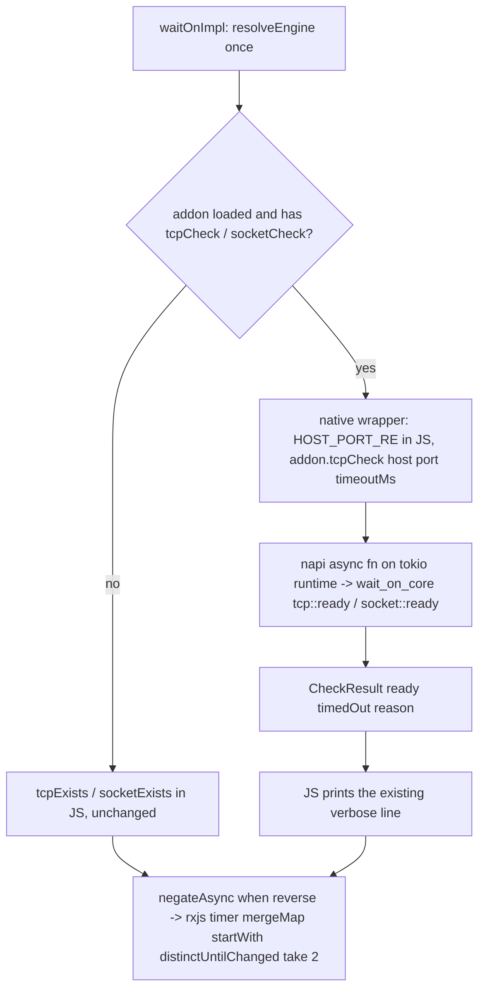

# [L2] tcp and socket resource checks in Rust

Implementation-ready lane plan for sub-issue #54. Product Contract preservation: requirements R-L2-1..R-L2-10 and tests T-L2-1..T-L2-8 below keep the meaning of the requirements-only plan; sections were restructured to the unified-plan shape and the open areas (async mechanism, Windows named pipe, addon lacking exports) are resolved in KTD1, KTD4 and KTD6. The spine plan is controlling and is never edited by this lane.

---

## Goal Capsule

**Objective.** After this lane merges into `spike-next-rs`, a user who sets `WAIT_ON_ENGINE=rust` (or `rust-strict`) with a loadable addon gets the "is this `tcp:` / `socket:` resource ready?" answer from Rust, with the same results, exit codes and verbose line shapes as the JS engine; a user who leaves the engine unset sees nothing change. `npm test` and `npm run ci:rs` are green with every existing tcp/socket test unmodified, and `test/rust-pending.js` has no tcp/socket entries. Proves PO1 (napi bridge on one resource type end-to-end).

**Means.** Two async napi exports backed by `wait-on-core` on napi's tokio runtime (KTD1, KTD2, KTD3), a per-export dispatch in `createTCP$` / `createSocket$` that keeps the rxjs pipeline, `negateAsync` reverse and verbose logging in JS (KTD5, KTD6), and a call-recording fixture addon as the network-edge stub (KTD7).

**Authority.** `AGENTS.md` > spine plan KD-S1..KD-S9 > this plan.

**Stop conditions** (report to the PM, do not work around):
- a `.github/workflows/` change is needed;
- a public API / CLI / `WAIT_ON_SCHEMA` / `index.d.ts` change is needed;
- a new **npm runtime** dependency is needed (new crates are allowed if `cargo deny check` passes; prefer std over new crates).

**Execution profile.** `/ce-work` via `/lfg` from this plan; strict TDD per `AGENTS.md`; opens one PR, base `spike-next-rs` on `kevinold/wait-on`, body `Closes #54`; never merges.

---

## Product Contract

### Summary

Move the `tcp:` and `socket:` readiness checks into `wait-on-core`, expose them through `wait-on-napi` as Promise-returning functions, and have `lib/wait-on.js` call them when `resolveEngine` returns a loaded addon that has the exports. JS keeps the polling loop, timeouts, reverse negation and verbose output (KD-S3). The pending list stays empty; the existing tcp/socket suites are the parity contract and run under both engines.

### Problem Frame

L1 left an addon that answers `version()` and `noop()` only; `waitOnImpl` resolves the engine and discards it. Nothing yet proves that a Rust check can sit behind the rxjs pipeline without blocking the event loop, without changing behavior at either front door, and while passing the same suites on ubuntu, macos and windows. tcp/socket is the smallest resource type to prove that with.

### Requirements

**Core checks (Rust)**

- R-L2-1 Core tcp check. `wait-on-core` exposes a tcp readiness check taking host, port and a connect timeout in ms; returns ready (connected, then closed) or not-ready with a human-readable reason (refused / timed out / resolve error). It must: try every resolved address for the host (e.g. `localhost` → `::1` and `127.0.0.1`), so a listener bound on only one family is found, matching Node's `net.connect`; accept IPv6 literals as extracted by the existing `HOST_PORT_RE` (`[::1]:port` → host `::1`), bare port → host `localhost` (host defaulting stays in JS, KTD2); honor `tcpTimeout` as the per-attempt connect bound where `tcpTimeout: 0` means **no timeout** (Node `socket.setTimeout(0)` disables it), never an immediate failure; close the connection after a successful connect (the #82 tests observe the server side seeing the close).
- R-L2-2 Core socket check. `wait-on-core` exposes a socket readiness check taking a path: unix domain socket connect on unix; on Windows the path is a named pipe (`\\?\pipe\…` / `\\.\pipe\…`, what `socketPathIn` builds) and "ready" means the pipe can be opened, then closed. Ready/not-ready + reason, like R-L2-1.
- R-L2-8 Rust quality gates. `cargo fmt --check`, `cargo clippy -D warnings`, `cargo test`, `cargo deny check` pass (all via `npm run ci:rs`). Core checks have Rust unit tests against real local listeners (ephemeral ports, temp socket paths).

**Bridge and dispatch**

- R-L2-3 napi surface. `wait-on-napi` exports the two checks as **async** functions returning Promises (they must not block the Node event loop; the rxjs `timeout` timer must still fire while a connect is pending). Result shape carries readiness and the not-ready reason. Names are `tcpCheck` and `socketCheck` (KTD2), recorded in the guide.
- R-L2-4 JS dispatch. When `resolveEngine` returns a loaded addon, `tcp:` and `socket:` checks call the addon; otherwise the existing JS checks run unchanged. The engine is resolved once per `waitOn` call (the existing call site), not per poll. Reverse mode keeps using `negateAsync` around whichever check is active. Verbose output keeps the same line shapes (`making TCP connection to …`, `  error connecting …` / `  timed out connecting …` / `  TCP connection successful …`, socket equivalents), with the reason text taken from Rust.
- R-L2-5 Addons without the checks. An addon that loads but lacks the tcp/socket exports (e.g. `test/fixtures/fake-addon.js`, an older prebuild) must not break `waitOn`: the missing check falls back to JS (KTD6) and a test pins that. The existing engine tests (T1–T4b in the L1 plan) stay green.
- R-L2-6 JS engine unchanged. Under unset/`js`, behavior, output and handles are byte-identical to today; the addon is never loaded (L1 T1 keeps proving this).

**Parity, docs, shared files**

- R-L2-7 Pending list. Any tcp/socket test that cannot pass under Rust is listed in `test/rust-pending.js`; the lane's end state has **no tcp/socket entries** (the list is expected to stay empty). Edits to the list are small and additive (sibling lanes share it).
- R-L2-9 Guides (KD-S9). `docs/guides/architecture.md`: tcp/socket now run in Rust when the engine is loaded; addon surface lists the new exports; any deliberate difference recorded. `docs/guides/testing.md`: pending-list state and how the path proof works. Keep edits small (sibling lanes edit the same pages).
- R-L2-10 Shared files additive. Crate module registration, `lib/engine.js` / dispatch in `lib/wait-on.js`, the pending list, and guides are shared with L3–L6; changes are minimal and additive.

### Tests that answer the risks (write each before its code)

- T-L2-1 Path proof, API (always runs, no build). Under `rust-strict` with `WAIT_ON_NATIVE_LIBRARY_PATH` pointing at a JS fixture addon that implements the tcp and socket exports and records its calls: `waitOn` on a `tcp:` port and on a `socket:` path resolves **and** the fixture saw the call with the expected host/port/timeout or path. Proves JS dispatches to the addon (AGENTS "prove the path ran"). Lives in U1.
- T-L2-2 Path proof, CLI. Same fixture through `bin/wait-on` (subprocess, env passed): exit 0 and the fixture's call record (a temp file it writes) shows the call. U1.
- T-L2-3 Real addon (skip unless built; never skips under `ci:rs`). With the real addon: tcp ready, tcp not-listening times out, IPv6 `[::1]` listener, `localhost` against an IPv4-only listener, socket ready, socket missing, reverse tcp and reverse socket. Plus a proof the Rust function answered (spy on the loaded addon object's export, KTD9; not by mocking wait-on modules). U4.
- T-L2-4 tcpTimeout matrix (real addon). `tcpTimeout` 200 against an unroutable host (`10.255.255.1`) → not ready within the bound (waitOn times out, not hangs past `timeout`); `tcpTimeout: 0` against a listening port → ready. Rust unit tests cover the same cells in core. U2 (core cells), U4 (front door).
- T-L2-5 Event loop not blocked. While a Rust tcp connect to an unroutable host is pending with a large `tcpTimeout`, the overall `timeout` still fires on time. U4.
- T-L2-6 Addon without checks (R-L2-5). Fixture addon with only `version`/`noop` + a `tcp:` resource → JS fallback, asserted. U1.
- T-L2-7 Reverse via JS negation. Fixture addon answering not-ready → reverse `tcp:` and reverse `socket:` resolve; answering ready → they time out. U1.
- T-L2-8 Existing suites, both engines. `npm test` and `npm run ci:rs` green with the existing tcp/socket tests unmodified (api, cli, cli-conformance, #82 close/leak tests). Verification Contract.

Matrix: engine {js, rust fixture, rust real} × resource {tcp host:port, tcp bare port, tcp [ipv6]:port, socket} × reverse {off, on} × tcpTimeout {default, custom, 0} (tcpTimeout only for tcp). Cell assignment is the table in the Verification Contract; the Windows named-pipe socket cell runs on the windows `ci:rs` row.

### Scope Boundaries

- Allowed paths: `crates/`, `Cargo.toml`, `Cargo.lock`, `rust-toolchain.toml`, `deny.toml`, `lib/`, `bin/`, `test/`, `index.d.ts`, `package.json`, `package-lock.json`, `.npmignore`, `.gitignore`, `.nycrc.json`, `eslint.config.mjs`, `docs/guides/`, `docs/plans/`, `docs/solutions/`, `AGENTS.md`, `README.md`, `benchmarks/`, `scripts/`. Never `.github/workflows/`; never the spine plan or sibling lane plans.
- Out of scope: `file:`, `http(s)`, unix-socket http, `command:` checks (L3–L6); moving the polling loop to Rust (L7); any public surface change; `bin/wait-on`, `index.d.ts`, `WAIT_ON_SCHEMA`, `.nycrc.json` are not edited.
- Non-goals (considered, not built): a `rust-strict` error for an addon lacking an export (KTD6 explains; revisit if a shipped prebuild ever lags `lib/`); moving `HOST_PORT_RE` parsing or the verbose line assembly into Rust (L7 owns output; KTD2); a per-address timeout split (JS bounds the whole attempt, KTD3); a `--verbose` line naming the engine (L1 non-goal, unchanged); a dedicated `ERROR_PIPE_BUSY` retry inside Rust (the next poll tick already retries, KTD4).

### Outstanding Questions

All three open areas are resolved (KTD1, KTD4, KTD6). Execution-time details, none blocking:
- (deferred) Whether the napi export property on the loaded addon object is writable, which the T-L2-3 spy relies on. If not, the proof switches to the Rust reason fingerprint (`(os error` in verbose output, KTD9) for the API case as well as the CLI case.
- (deferred) `10.255.255.1` black-holing on the CI network. The existing JS tests already depend on it; the core tcp timeout test asserts "not ready within the bound" and accepts either `TimedOut` or an immediate network error as the reason.

### Sources

- Lane issue kevinold/wait-on#54 (text only; no comments at authoring time); spine plan KD-S1, KD-S2, KD-S3, KD-S6, KD-S7, KD-S9 and lane row L2; L1 plan `docs/plans/2026-09-30-spike-rs-l1-scaffold-plan.md` KTD2–KTD6 (napi crate untested, `lib/engine.js` shape, fixture hook, pending list).
- `lib/wait-on.js`: `waitOnImpl` engine call site, `createResource$` switch, `createTCP$` / `tcpExists` (`HOST_PORT_RE`, verbose lines, `setTimeout(tcpTimeout)`), `createSocket$` / `socketExists`, `negateAsync`. `lib/engine.js` `resolveEngine`.
- Tests: `test/api.mocha.js` (tcp listen, socket listen, #82 close/leak trio, "should trigger TCP timeout handler", IPv6 `[::1]` cases), `test/cli.mocha.js` (tcp/socket timeouts, `--tcpTimeout 1s`), `test/cli-conformance.mocha.js` tcp/socket describes, `test/helpers/cli-conformance.js` (`socketPathIn`, `getFreePort`, `runCli`), `test/engine.mocha.js` (`withEnv`, `runCLI`), `test/coverage.mocha.js` (silencing `console.log` under `verbose`).
- napi-rs v3 docs: `#[napi] async fn` returns a Promise when the `async` (alias `tokio_rt`) feature is on; work runs on napi's tokio runtime; Futures need `napi4` (already enabled). `AsyncTask` runs on the libuv threadpool.
- tokio: `TcpStream::connect((host, port))` resolves and tries each address; `time::timeout`; `net::UnixStream::connect`; `net::windows::named_pipe::ClientOptions::open`.

---

## Planning Contract

### Key Technical Decisions

- KTD1. **Async mechanism: napi's tokio runtime (`napi` feature `async`), `#[napi] async fn` returning Promises.** Chosen over `AsyncTask` + std blocking connect: `AsyncTask` parks a libuv threadpool thread (4 by default) per pending connect; with `tcpTimeout: 0` against a black-holed host and `mergeMap` concurrency `simultaneous` (default Infinity) every poll tick parks another thread for the OS connect timeout, starving Node's fs/dns work and stalling sibling `file:` and `http:` resources, which JS `net.connect` never does. `std::net::TcpStream::connect_timeout` also rejects a zero `Duration`. A pending tokio connect is a task, not a thread. tokio is already sanctioned for the Rust engine (KD-S6). Cost: `tokio` (`net`, `time`) in `wait-on-core`; its tree is MIT/Apache-2.0, inside the `deny.toml` allow-list. Answered by T-L2-5.
- KTD2. **Addon surface.** `tcpCheck(host: string, port: number, timeoutMs: number): Promise<CheckResult>` and `socketCheck(path: string): Promise<CheckResult>`, `CheckResult = { ready: boolean, timedOut: boolean, reason: string | null }` (`reason` null when ready; declared `#[napi(object, use_nullable = true)]` so `None` crosses as `null`, not an absent key). Host/port parsing stays in JS (`HOST_PORT_RE`, bare port → `localhost`), so Rust receives the parsed host, numeric port and `tcpTimeout` as today's `tcpExists` does; `timeoutMs` 0 means no timeout. Chosen over parsing in Rust: JS already parses and prints host/port in its verbose lines, and R-L2-4 keeps line assembly in JS. `timedOut` is a boolean rather than a magic reason string so the JS line choice never string-matches.
- KTD3. **Core API.** `wait_on_core::tcp::ready(host, port, timeout_ms) -> Result<(), NotReady>` and `wait_on_core::socket::ready(path) -> Result<(), NotReady>`, `NotReady::{TimedOut, Io(io::Error)}` with `Display` giving the reason text. The timeout wraps the whole connect attempt (resolve + all resolved addresses), matching the JS idle timeout that bounds the whole `net.connect`. Addresses are **raced**, not tried in order: `tokio::net::lookup_host((host, port))`, one connect per address in a `JoinSet`, first `Ok` wins, the rest are aborted; when all fail, report the last error. Sequential tries would lose on Windows, where a refused loopback connect takes ~2 s (SYN retry after RST), so `localhost` → `::1` first would burn the whole 300 ms default budget before reaching `127.0.0.1`; Node avoids the same trap with `autoSelectFamily`. Dropping the stream is the close. Not-ready reason text is Rust's `io::Error` Display (e.g. `Connection refused (os error 61)`), not Node's `Error: connect ECONNREFUSED …`: a deliberate difference visible only under `--verbose`, recorded in the guide (R-L2-9).
- KTD4. **Windows socket = named-pipe client open.** Under `#[cfg(windows)]`, `tokio::net::windows::named_pipe::ClientOptions::new().open(path)`; success then drop is "ready"; any error (missing pipe, `ERROR_PIPE_BUSY`) is not-ready with the reason, and the next poll tick retries. Chosen over AF_UNIX on Windows: Node servers listen on named pipes for `\\?\pipe\…`, which is what `socketPathIn` builds and every socket test uses. Chosen over `std::fs::OpenOptions` open: same size, but tokio's client is already a dependency and carries pipe semantics. Proven by the socket tests on the windows `ci:rs` row.
- KTD5. **JS dispatch.** `waitOnImpl` keeps the `addon` from its existing `resolveEngine` call and adds it to the `createResource$` deps. `createTCP$` and `createSocket$` pick the check once per `waitOn`: the native wrapper when `addon` has the export (`typeof addon.tcpCheck === 'function'`), else the JS check; both share the `(output, tcpPath, tcpTimeout)` / `(output, socketPath)` signature, and `negateAsync` wraps whichever is active exactly as today. The native wrappers print the existing verbose lines from `CheckResult`: `ready` → the success line, `timedOut` → the `timed out connecting …` line, else the `error connecting …` line with `reason`. Chosen over dispatching inside `createResource$`: the per-resource factory already owns the check choice for reverse.
- KTD6. **Addon lacking an export falls back to JS for that check, under both `rust` and `rust-strict`.** One `typeof` test, no new error string, `test/fixtures/fake-addon.js` and the L1 engine tests untouched. `rust-strict`'s contract (L1 R-L1-6) is about the addon *loading*; under `ci:rs` the T-L2-3 spy fails if the real addon lacks the export, so a silently-JS `ci:rs` cannot happen. Chosen over a `rust-strict` error: a second branch, message and test cell for a case that only the fixture produces (prebuilds ship with the package that references them). Pinned by T-L2-6.
- KTD7. **Fixture addon and env helper.** `test/fixtures/fake-addon-checks.js` exports `version`, `noop`, `tcpCheck`, `socketCheck`; answers per `WAIT_ON_FAKE_ADDON_ANSWER` (`ready` default, `refused`, `timeout`), records every call in `module.exports.calls` (same module instance the loader `require`s, since `require` caches by absolute path) and appends a JSON line per call to the file named by `WAIT_ON_FAKE_ADDON_LOG` when set (subprocess proof). `withEnv` and `runCLI` move from `test/engine.mocha.js` to `test/helpers/engine-env.js`, generalized to the keys passed, so the new suite reuses them.
- KTD8. **Session-settled.**
  - Reverse stays JS `negateAsync` around the active check (session-settled: user-directed — chosen over reverse in Rust: keeps the lane small; L7 moves the loop).
  - The napi checks are async functions returning Promises (session-settled: user-directed — chosen over sync napi calls: must not block the event loop; the rxjs `timeout` must fire while a connect is pending).
  - JS pipeline stays the orchestrator, KD-S3 (session-settled: user-directed — chosen over moving the polling loop to Rust now: L7 owns it).
  - No `.github/workflows/`, public API/CLI/schema/`index.d.ts` change, no new npm runtime dependency (session-settled: user-directed — chosen over editing workflows: lanes change CI only via npm scripts, KD-S7).
- KTD9. **Real-addon path proof.** API: wrap `addon.tcpCheck` / `addon.socketCheck` on the object `resolveEngine` returns (the same cached module object the dispatch uses) to count calls, restore after. CLI: `--verbose` stdout of a not-listening port contains `(os error`, a Rust-only fingerprint (Node prints `ECONNREFUSED`). Chosen over mocking wait-on modules (AGENTS anti-pattern).

### High-Level Technical Design



Layout after the lane (new or changed files only):

```
crates/wait-on-core/src/{lib.rs, tcp.rs, socket.rs}   (tokio net+time; #[tokio::test]s)
crates/wait-on-napi/src/lib.rs                          (+ tcp_check, socket_check, CheckResult; napi feature async)
lib/wait-on.js                                          (addon in deps; native wrappers in createTCP$/createSocket$)
test/engine-checks.mocha.js                             (T-L2-1/2/3/5/6/7)
test/api.mocha.js                                       (engine-agnostic parity cells for T-L2-3/4)
test/fixtures/fake-addon-checks.js  test/helpers/engine-env.js
docs/guides/{architecture.md, testing.md}
```

### Assumptions

- napi 3 `async` feature provides the tokio runtime and `#[napi] async fn` → Promise on all three CI OSes and the 8 `napi` target rows; `wait-on-core`'s `tokio` (`net`, `time`; dev `macros`, `rt-multi-thread`) unifies with napi's. Verified by `cargo build` in U2 and the `napi` rows on the PR.
- Node's `require` returns the same cached object for the addon path, so a spy on that object is seen by the dispatch (already relied on by L1 T4b "same addon object").
- Port range validation is unchanged: neither engine validates `tcp:host:99999` up front; JS throws `ERR_SOCKET_BAD_PORT`, the Rust path rejects at the napi `u16` conversion; both surface as a `waitOn` error. Not a tested cell.
- The process's tcp/socket tests already use real listeners and real clocks (`docs/guides/testing.md`), so a Rust check resolving on real time needs no clock change; `itFrozen` tcp tests keep working because the fake clock leaves global timers real.

### Risks

| Risk | Answered by |
|---|---|
| A Rust connect blocks the event loop (or a threadpool starve hides as "slow") | T-L2-5 in `test/engine-checks.mocha.js`: `timeout` fires within headroom while a 30 s `tcpTimeout` connect to `10.255.255.1` is pending |
| `localhost` resolves to `::1` first and the listener is IPv4-only (worst on Windows, ~2 s loopback refusal) | address race (KTD3); windows `ci:rs` row is the cell that proves it; core test `localhost_finds_ipv4_only_listener`; api parity test "should succeed for localhost against an IPv4-only listener" under `ci:rs` |
| `tcpTimeout: 0` becomes an instant failure | core test `timeout_zero_means_no_timeout`; api parity test "should succeed with tcpTimeout 0 against a listening port" |
| Windows named pipe open semantics differ from Node (`\\?\pipe\` prefix, busy pipe) | socket tests (api, cli, conformance, #82 close) on the windows `ci:rs` row; core `#[cfg(windows)]` tests |
| Server does not see the close after a Rust connect (#82) | existing #82 close tests under `ci:rs` (drop closes the fd; server `getConnections` returns 0) |
| Coverage gate: new JS branches unreachable in the JS run | fixture tests run the native wrappers and all three verbose lines under `npm test` (`.nycrc.json` thresholds met) |
| `cargo deny` rejects a tokio transitive license or duplicate version | `cargo deny check` in U2 (`multiple-versions = "warn"`); widen only to licenses actually present |
| Spy on the addon export not possible (non-writable property) | fallback to the `(os error` fingerprint (Outstanding Questions) |
| `#82` `TCPSocketWrap` leak test passes trivially under Rust | accepted: Rust opens no Node handles; the close tests are the real guard (recorded in testing.md) |

---

## Implementation Units

Order: U1 → U2 → U3 → U4 → U5. U1 needs no Rust build. Every unit: RED (run the named test, read the failure), GREEN, `npm test`, refactor on green. Test and code land in the same Conventional Commit.

### U1. Fixture addon and JS dispatch to the addon checks

- **Goal.** With a fixture addon that has `tcpCheck` / `socketCheck`, `waitOn` and the CLI route `tcp:` and `socket:` checks to it, keep reverse and verbose behavior, and fall back to JS when an export is missing.
- **Requirements.** R-L2-4, R-L2-5, R-L2-6, R-L2-10.
- **Dependencies.** None.
- **Files.** `lib/wait-on.js`, `test/engine-checks.mocha.js` (new), `test/fixtures/fake-addon-checks.js` (new), `test/helpers/engine-env.js` (new; `withEnv`, `runCLI` moved out of `test/engine.mocha.js`), `test/engine.mocha.js` (imports the helper; no behavior change).
- **Approach.** KTD5, KTD6, KTD7.
  1. Fixture first (it is the RED harness), then the helper extraction.
  2. `waitOnImpl`: keep the `resolveEngine` result, pass `addon` in the deps object.
  3. `createTCP$` / `createSocket$`: choose native wrapper vs JS check once; the wrappers reuse the existing verbose strings verbatim.
- **Patterns to follow.** `test/engine.mocha.js` (env scoping, `runCLI` with explicit env, `FIXTURE_ADDON` absolute path); `test/coverage.mocha.js` (silence/capture `console.log` for `verbose: true`); `test/helpers/cli-conformance.js` `getFreePort`, `socketPathIn`, `tempDir`.
- **Test scenarios (`test/engine-checks.mocha.js`, describe "addon checks (fixture)"; each case sets `WAIT_ON_ENGINE=rust-strict` and `WAIT_ON_NATIVE_LIBRARY_PATH` = absolute `test/fixtures/fake-addon-checks.js` via `withEnv` / `runCLI`, so it runs under both drivers). No listener is needed: the fixture is the network-edge stub.**
  - T-L2-1 "should dispatch a tcp check to the addon with host, port and tcpTimeout": resource `tcp:127.0.0.1:<free port>`, `tcpTimeout: 450`; resolves; `fixture.calls` last entry deep-equals `{ fn: 'tcpCheck', host: '127.0.0.1', port: <free port>, timeoutMs: 450 }`. RED: `calls` empty (JS check ran).
  - T-L2-1 "should default a bare port to localhost": `tcp:<free port>` → call has `host: 'localhost'`.
  - T-L2-1 "should pass an IPv6 literal without brackets": `tcp:[::1]:<free port>` → `host: '::1'`.
  - T-L2-1 "should dispatch a socket check to the addon with the path": `socket:<socketPathIn(tempDir())>` → `{ fn: 'socketCheck', path: <that path> }`.
  - T-L2-2 "should dispatch from the CLI and record the call in the log file": `runCLI` with `WAIT_ON_FAKE_ADDON_LOG` = temp file, args `tcp:127.0.0.1:<free port>` + fast opts; exit 0; the log file parses to one line with `fn: 'tcpCheck'`, that port, `timeoutMs: 300` (schema default). Same for `socket:`.
  - T-L2-7 "should resolve reverse tcp and reverse socket when the addon answers not-ready": `WAIT_ON_FAKE_ADDON_ANSWER=refused`, `reverse: true` → both resolve. "should time out reverse tcp and reverse socket when the addon answers ready": default answer, `reverse: true`, `timeout: 300` → rejects with `Timed out`.
  - "should print the existing verbose lines from the addon result": `verbose: true` with captured `console.log`; answer `ready` → output includes `  TCP connection successful to host:127.0.0.1 port:<port>` and `  connected to socket:<path>`; answer `timeout` → `  timed out connecting to TCP host:127.0.0.1 port:<port> tcpTimeout:450ms`; answer `refused` → `  error connecting to TCP host:127.0.0.1 port:<port> fake refused` and `  error connecting to socket socket:<path> fake refused`. (Covers every new branch for the coverage gate.)
  - T-L2-6 "should fall back to the JS check when the addon lacks tcpCheck": `WAIT_ON_NATIVE_LIBRARY_PATH` = `test/fixtures/fake-addon.js`, real listener on `127.0.0.1:0`, `tcp:127.0.0.1:<port>` resolves; same under `WAIT_ON_ENGINE=rust`. RED: `TypeError: addon.tcpCheck is not a function`.
  - "should never call the addon under js": `WAIT_ON_ENGINE=js`, fixture path set, real listener; resolves and `fixture.calls` is empty (R-L2-6, cheap sibling of L1 T1).
- **Verification.** `npm test` green; `npm run test:coverage` meets `.nycrc.json` with the wrappers included; `test/engine.mocha.js` unchanged in outcome.

### U2. Core tcp check

- **Goal.** `wait_on_core::tcp::ready` answers ready / not-ready with reason for every R-L2-1 cell, on the tokio runtime.
- **Requirements.** R-L2-1, R-L2-8, R-L2-10.
- **Dependencies.** None (U1 first only for commit order).
- **Files.** `crates/wait-on-core/Cargo.toml` (`tokio` with `net`, `time`, `rt` — `rt` is needed for hostname resolution (`spawn_blocking`) and `JoinSet`; dev-dependency features `macros`, `rt-multi-thread`), `crates/wait-on-core/src/lib.rs` (register `tcp`, `socket` modules, `NotReady`), `crates/wait-on-core/src/tcp.rs`, `Cargo.lock`.
- **Approach.** KTD1, KTD3. `timeout_ms == 0` skips the `tokio::time::timeout` wrapper; otherwise wrap the resolve-and-race (`lookup_host` + `JoinSet` of `TcpStream::connect(addr)`); the winning stream is dropped immediately. Module registration in `lib.rs` is one line per module (shared with L3–L6: keep it additive).
- **Patterns to follow.** `version_is_workspace_version` test shape; ephemeral `TcpListener::bind("127.0.0.1:0")`.
- **Test scenarios (`crates/wait-on-core/src/tcp.rs` `#[cfg(test)]`, `#[tokio::test]`).**
  - `ready_when_listening`: bind `127.0.0.1:0`, `ready("127.0.0.1", port, 300)` → `Ok(())`. RED: module missing.
  - `refused_when_nothing_listens`: bind, take the port, drop the listener, `ready("127.0.0.1", port, 5000)` → `Err(NotReady::Io(_))` whose Display is non-empty (5000, not 300: Windows reports a loopback refusal only after ~2 s).
  - `localhost_finds_ipv4_only_listener`: listener on `127.0.0.1:0`, `ready("localhost", port, 300)` → `Ok(())`.
  - `ipv6_literal`: bind `[::1]:0` (return early if bind fails: no IPv6 loopback), `ready("::1", port, 300)` → `Ok(())`.
  - `timeout_zero_means_no_timeout`: listener, `ready("127.0.0.1", port, 0)` → `Ok(())`.
  - `times_out_within_bound`: `ready("10.255.255.1", 9, 200)` → `Err(_)` and elapsed under 1000 ms (either `TimedOut` or an immediate network error is acceptable; T-L2-4 core cell).
  - `resolve_error_is_not_ready`: `ready("no-such-host.invalid", 1, 5000)` → `Err(NotReady::Io(_))` (large bound so a slow CI resolver cannot turn it into `TimedOut`).
  - `closes_after_success`: listener accepts, then `ready` returns `Ok`, and reading from the accepted side yields 0 bytes (EOF) within 300 ms.
- **Verification.** `cargo test --workspace`, `cargo clippy --workspace --all-targets -- -D warnings`, `cargo fmt --all --check`, `cargo deny check` green.

### U3. Core socket check (unix socket, Windows named pipe)

- **Goal.** `wait_on_core::socket::ready` connects to a unix socket, or opens a named pipe on Windows, then closes.
- **Requirements.** R-L2-2, R-L2-8, R-L2-10.
- **Dependencies.** U2 (shared `NotReady`, tokio dependency).
- **Files.** `crates/wait-on-core/src/socket.rs`, `crates/wait-on-core/src/lib.rs` (module line).
- **Approach.** KTD3, KTD4. `#[cfg(unix)]` `UnixStream::connect(path)`; `#[cfg(windows)]` `ClientOptions::new().open(path)`; result dropped on success. No timeout wrapper (JS `socketExists` has none).
- **Patterns to follow.** U2 test shape; temp dir via `std::env::temp_dir()` + pid.
- **Test scenarios (`crates/wait-on-core/src/socket.rs`).**
  - `ready_when_listening` (unix): `UnixListener::bind(<tmp>/sock)`, `ready(path)` → `Ok(())`. RED: module missing.
  - `not_ready_when_missing` (unix): `ready(<tmp>/no-such-sock)` → `Err(NotReady::Io(_))`.
  - `ready_when_pipe_exists` (windows): `ServerOptions::new().create(r"\\.\pipe\wait-on-core-<pid>")`, `ready(that path)` → `Ok(())`.
  - `not_ready_when_pipe_missing` (windows): `ready(r"\\.\pipe\wait-on-core-missing-<pid>")` → `Err(NotReady::Io(_))`.
- **Verification.** As U2; the windows cases run on the windows `ci:rs` row.

### U4. napi exports and real-addon proofs

- **Goal.** The built addon exposes `tcpCheck` / `socketCheck` per KTD2; under `rust-strict` with the real addon, the tcp/socket suites pass and the Rust path is proven to have answered.
- **Requirements.** R-L2-3, R-L2-4, R-L2-7, R-L2-8.
- **Dependencies.** U1, U2, U3.
- **Files.** `crates/wait-on-napi/Cargo.toml` (`napi` features add `async`), `crates/wait-on-napi/src/lib.rs`, `test/engine-checks.mocha.js` (describe "addon checks (real addon)"), `test/api.mocha.js` (engine-agnostic parity cells), `Cargo.lock`.
- **T-L2-3 cell map.** The new real-addon tests below prove the Rust path answered (tcp ready, socket ready, tcp not-listening). The remaining T-L2-3 cells (IPv6 `[::1]`, `localhost` vs IPv4-only, socket missing, reverse tcp/socket) run against the real addon through the existing and U4 parity tests under `ci:rs`, per the Verification Contract matrix.
- **Approach.** KTD1, KTD2, KTD9. `#[napi(object, use_nullable = true)] CheckResult`; two `#[napi] async fn`s that call core and map `Ok` → ready, `TimedOut` → `timedOut`, `Io` → `reason`. The napi crate stays untested in cargo (L1 KTD2); its proof is the real-addon suite.
- **Execution note.** Build the host addon locally before running the real-addon describe so its RED is the missing export (`addon.tcpCheck` undefined at the spy), not a skip. The `test/api.mocha.js` parity additions characterize JS behavior and are expected to pass on first run under JS; their Rust-side RED is the U2 core tests, and their Rust proof is the `ci:rs` run after this unit.
- **Patterns to follow.** `test/engine.mocha.js` real-addon case (`this.skip()` unless `fs.existsSync(addonPath({}))`, never skipped under `ci:rs`); `test/api.mocha.js` #82 tests for server-side close observation.
- **Test scenarios (`test/engine-checks.mocha.js`, describe "addon checks (real addon)"; `WAIT_ON_ENGINE=rust-strict`, no path override; skip unless a host prebuild exists).**
  - T-L2-3 "should answer a tcp check from the Rust addon": spy wraps `addon.tcpCheck` on `resolveEngine(env).addon`; listener on `127.0.0.1:0`; `waitOn` resolves and the spy count is at least 1 and the wrapped result is `{ ready: true, timedOut: false, reason: null }`. RED: `addon.tcpCheck` undefined.
  - T-L2-3 "should answer a socket check from the Rust addon": same with `socketCheck` on `socketPathIn(tempDir())` and a listening server.
  - T-L2-3 "should report a Rust reason for a port nothing listens on (CLI)": `runCLI` with `--verbose`, `tcp:127.0.0.1:<free port>`, `--tcpTimeout 5000`, `-t 4000` (so the Windows ~2 s refusal arrives as an `io::Error`, not a timeout); exit non-zero; stdout includes `error connecting to TCP host:127.0.0.1 port:<port>` and `(os error`.
  - T-L2-4 "should mark a tcp check timed out at tcpTimeout with the Rust addon": `tcp:10.255.255.1:9`, `tcpTimeout: 200`, `timeout: 600`; rejects with `Timed out`; elapsed under 1500 ms.
  - T-L2-5 "should fire the overall timeout while a Rust connect is pending": `tcp:10.255.255.1:9`, `tcpTimeout: 30000`, `timeout: 500`; rejects with `Timed out`; elapsed under 2000 ms; the process exits normally at suite end (`--exit` still in place).
- **Test scenarios (`test/api.mocha.js`, engine-agnostic; run under JS in `npm test` and under Rust in `ci:rs`).**
  - "should succeed when a service is listening on a bare tcp port": listener on `localhost` port 0, resource `tcp:<port>`.
  - "should succeed for localhost against an IPv4-only listener": listener bound to `127.0.0.1:0`, resource `tcp:localhost:<port>`.
  - "should succeed with tcpTimeout 0 against a listening port": `tcpTimeout: 0`, `timeout: 2000`.
  - "should succeed in reverse mode when nothing listens on the socket path": `socket:<socketPathIn(tempDir())>`, `reverse: true`. (Reverse tcp unreachable is already covered by `test/cli-conformance.mocha.js`.)
- **Verification.** `npm run build:napi` then `npm run ci:rs` green locally: the real-addon describe executed (not pending), 0 pending from the list, every existing tcp/socket test unmodified and green; `test/rust-pending.js` still `[]`.

### U5. Guides (docs-only)

- **Goal.** `docs/guides/` states what is true on merge for tcp/socket under Rust.
- **Requirements.** R-L2-9, R-L2-10.
- **Dependencies.** U1–U4.
- **Files.** `docs/guides/architecture.md` ("Rust engine layout": addon exposes `version()`, `noop()`, `tcpCheck`, `socketCheck` and the `CheckResult` shape; "Resource checks in Rust": tcp/socket moved (L2), per-export JS fallback when an export is missing; recorded difference: not-ready reason text is Rust `io::Error` text under `--verbose`), `docs/guides/testing.md` (suite row `test/engine-checks.mocha.js`; fixture `fake-addon-checks.js` and its `WAIT_ON_FAKE_ADDON_ANSWER` / `WAIT_ON_FAKE_ADDON_LOG` knobs; how the path proof works (fixture call record, addon spy, `(os error` fingerprint); pending list still empty; the `TCPSocketWrap` leak test is trivially green under Rust and the close tests are the guard).
- **Test scenarios.** Test expectation: none -- docs-only carve-out. Check: `docs/guides/contributing-dual-engine.md` checklist rows for architecture and testing satisfied; no page claims tcp/socket still run in JS under a loaded engine.
- **Verification.** Links resolve; edits are small and additive (sibling lanes edit the same pages).

---

## Verification Contract

Run from the repo root; all must pass before the PR opens.

- `npm test` -- lint, types, mocha under JS; every existing tcp/socket test unmodified; the fixture describe ran.
- `npm run test:coverage` -- `.nycrc.json` thresholds (branches 95, lines 98, functions 94, statements 97) met with the native wrappers included.
- `cargo fmt --all --check`, `cargo clippy --workspace --all-targets -- -D warnings`, `cargo test --workspace` (U2/U3 tests), `cargo deny check`.
- `npm run build:napi` then `npm run ci:rs` -- green; the real-addon describe executed, 0 pending from the list.
- CI on the PR: `build` (ubuntu+windows × node 22/24/26), `rust` (ubuntu, macos, windows; the windows row proves the named-pipe cells), all 8 `napi` rows, commitlint / PR title (Conventional Commits).

Matrix coverage (engine × resource × reverse × tcpTimeout):

| Cell | js | rust fixture | rust real |
|---|---|---|---|
| tcp host:port, ready | existing api/cli/conformance | T-L2-1 | T-L2-3 spy; existing suites under `ci:rs` |
| tcp host:port, not listening | existing api/cli/conformance timeouts | carve-out: fixture `refused` covered by verbose test | T-L2-3 CLI fingerprint; existing timeouts under `ci:rs` |
| tcp bare port | U4 api parity test | T-L2-1 bare port | U4 api parity test under `ci:rs` |
| tcp [ipv6]:port | existing #141 tests | T-L2-1 IPv6 literal | existing #141 tests under `ci:rs`; core `ipv6_literal` |
| tcp localhost vs IPv4-only listener | U4 api parity test | carve-out: host string only, no resolution in fixture | U4 api parity test under `ci:rs`; core test |
| socket ready / missing | existing api/cli/conformance, #82 close | T-L2-1, verbose `refused` | T-L2-3 spy; existing suites under `ci:rs` (windows row = named pipe) |
| reverse tcp / socket | conformance reverse tcp; U4 reverse socket | T-L2-7 | U4 reverse socket and conformance under `ci:rs` |
| tcpTimeout default (300) | existing | T-L2-2 records 300 | existing under `ci:rs` |
| tcpTimeout custom | existing "trigger TCP timeout handler", cli `--tcpTimeout` | T-L2-1 records 450; verbose `timeout` | T-L2-4 (200 ms, bound asserted); core `times_out_within_bound` |
| tcpTimeout 0 | U4 api parity test | carve-out: fixture ignores the value | U4 api parity test under `ci:rs`; core `timeout_zero_means_no_timeout` |
| addon lacking export | carve-out: never loaded | T-L2-6 (`rust` and `rust-strict`) | carve-out: real addon has the exports (spy would fail otherwise) |
| event loop free during pending connect | carve-out: JS `net.connect` is non-blocking by construction | carve-out: fixture answers synchronously | T-L2-5 |

---

## Definition of Done

- All requirements R-L2-1..R-L2-10 met; tests T-L2-1..T-L2-8 present, named for behavior, each seen red for the right reason before green (U4 parity additions: characterization, RED recorded in U2/U3).
- Verification Contract fully green locally and on the PR; every PR check green.
- `test/rust-pending.js` still `[]`; no `.only`/`.skip` in the diff (conditional `this.skip()` in the real-addon describe only); `prebuilds/` and `target/` absent from the diff.
- Guides updated per U5; `docs/plans/**` never deleted.
- Cleanup criterion: no abandoned-attempt code (no leftover `AsyncTask`, std-connect or AF_UNIX experiments); the working tree contains no generated files outside gitignored paths.
- PR opened against `spike-next-rs` with `Closes #54`; not merged by the lane. If a non-obvious learning surfaced (e.g. a napi async quirk or a named-pipe finding on the windows row), `/ce-compound` ran before the PR opened.

---

## Resume notes

- 2026-09-30: U1–U5 implemented (native subagents; U2+U3 one worker). `ci:rs` 351 passing, 0 pending; `test/rust-pending.js` still `[]`.
- Review (full, incl. cross-model codex pass): 1 actionable finding (real-addon timeout test did not prove `timedOut`) fixed; residual risks recorded in the PR body (Windows busy named pipe under reverse, `tcpTimeout` ≥ 2^32 across the u32 bridge).
- Merged `origin/spike-next-rs` after L3 (#55, `file:`): kept both addon surfaces (`fileSize` AsyncTask + `tcpCheck`/`socketCheck` async fn); `fake-addon-checks.js` now spreads `fake-addon.js` so it also answers `fileSize`; `engine-env.js` scopes `WAIT_ON_FAKE_FILE_SIZE`.
- Local runs collide with sibling worktrees' mocha on fixed ports (3000/3001/3011): wait and re-run; not a lane defect.
