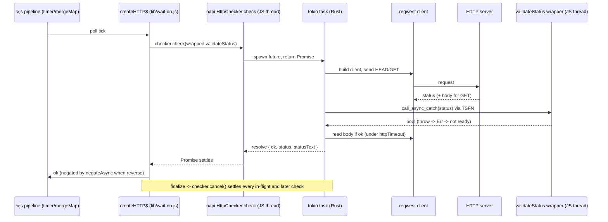

# L4: http(s) HEAD/GET checks and validateStatus over a threadsafe callback - Plan

Lane plan for sub-issue #56. Spine rules (KD-S1..KD-S9 in the spine plan) and the AGENTS.md TDD rules apply; this plan names only what L4 adds.

## Goal Capsule

- **Objective:** A user who sets `WAIT_ON_ENGINE=rust` gets `http:`/`https:` (HEAD) and `http-get:`/`https-get:` (GET) readiness answered by the Rust engine with the same observable behavior as the JS engine, including a JS `validateStatus` function deciding readiness, while the JS engine and every user on it are unchanged.
- **Means:** an HTTP check in `crates/wait-on-core` on reqwest + rustls (KTD1), consulted from `createHTTP$` for the in-scope option cells (KTD4), with `validateStatus` invoked from Rust through a napi threadsafe function (KTD2) and in-flight requests cancelled on teardown (KTD6).
- **Authority:** spine plan key decisions (KD-S1..KD-S9) > AGENTS.md > lane issue #56 > this plan. The parent plan's PO2 and AE2 are the proof this lane owes.
- **Stop conditions:** a needed CI change that only `.github/workflows/` can carry (file an operator PR, do not fold it into the lane); a `napi` matrix row failing on a ring/reqwest build problem (record it, operator PR, lane stays green on `ci:rs`); a merge of `origin/spike-next-rs` that changes the `createResource$` deps shape (re-thread, rerun both gates before continuing); any need to grow `test/rust-pending.js` (R-L4-7).
- **Execution profile:** `execution: code`, run through `/ce-work`, strict test-first per AGENTS.md, one PR into `spike-next-rs` closing #56. The lane worker finishes and ships; the PM merges.

---

## Product Contract

Product Contract preservation: R-L4-1 through R-L4-8 keep the IDs and meaning from the lane issue; R-L4-9 is added from the cancellation resolution recorded in Assumptions.

### Summary

Add the first resource check that runs in Rust: HEAD and GET readiness for `http(s)` resources, with `headers`, `auth`, `httpTimeout`, `followRedirect`, the default 2xx rule, and a JS `validateStatus` consulted from Rust. JS keeps orchestrating the poll (KD-S3); `createHTTP$` asks the addon instead of undici when the option cell is in L4 scope, and keeps the undici path otherwise. Deliver the measured per-check FFI overhead and the routing table in `docs/guides/architecture.md`.

### Problem Frame

PO2 in the parent plan is the riskiest parity item: a function-valued option must cross the FFI boundary with correct semantics and no deadlock under `simultaneous`. Until an HTTP check runs in Rust, the Rust engine answers nothing (the addon exports only `version()` and `noop()`, and `waitOnImpl` discards the `resolveEngine` result), so the spike has no evidence for the parity claim that gates L7.

### Key Decisions

- **JS engine default and unchanged; Rust opt-in via `WAIT_ON_ENGINE`** (KD-S1). (session-settled: user-directed — chosen over switching the default: the JS engine stays authoritative through the spike.) Governs R-L4-5, R-L4-6.
- **Checks first, loop last** (KD-S3): rxjs orchestrates, Rust answers one check. (session-settled: user-directed — chosen over moving the loop now: the loop is L7.) Governs R-L4-1.
- **`validateStatus` stays a JS function, invoked from Rust.** (session-settled: user-directed — chosen over evaluating it in Rust or dropping function options: the API is non-breaking in full.) Governs R-L4-2, R-L4-3.
- **HTTP stack reqwest + rustls + tokio, no OpenSSL** (KD-S6). (session-settled: user-directed — chosen over OpenSSL/native-tls: no system OpenSSL across the prebuild matrix.) Governs R-L4-6.
- **No `.github/workflows/` edits; CI behavior via `ci:rs`, `build:napi`, `ci:rs:package`** (KD-S7). (session-settled: user-directed — chosen over lane workflow edits.) Governs R-L4-6.
- **L4 routes default https to Rust; TLS options, proxies and unix sockets stay JS until L5.** `strictSSL` defaults to `false` in `WAIT_ON_SCHEMA`, so the default https cell means "accept invalid certs", which needs no trust store. `strictSSL: true`, `ca`/`cert`/`key`/`passphrase`, `proxy` (object or `false`), env proxies, and `http://unix:` keep the JS check. Not user-settled; see Assumptions. Governs R-L4-5.

### Requirements

**Parity and proof**

- R-L4-1. Under `WAIT_ON_ENGINE=rust-strict`, every in-scope HTTP test in `test/api.mocha.js`, `test/cli.mocha.js`, `test/cli-conformance-http.mocha.js`, `test/https-proxy.mocha.js`, and `test/coverage.mocha.js` passes, and a test proves the Rust check handled in-scope requests rather than a silent JS fallback.
- R-L4-2. A JS `validateStatus` decides readiness for Rust checks: with `validateStatus: s => s === 200`, a 200 passes and a 204 does not (parent AE2).
- R-L4-3. No deadlock or starvation when several HTTP resources consult `validateStatus` concurrently under `simultaneous > 1`, and with `simultaneous: 1`.
- R-L4-4. `httpTimeout` is enforced by Rust: a server that does not finish the response (headers or body) within `httpTimeout` makes the check fail and `waitOn` time out, as in JS.
- R-L4-5. Out-of-scope cells (the L5 set in Key Decisions) behave exactly as today under the Rust engine, served by the JS check.

**Gates**

- R-L4-6. JS engine behavior unchanged; `npm test` green; `npm run ci:rs` green (fmt, clippy `-D warnings`, `cargo test`, `cargo deny check`, host addon build, mocha under `rust-strict`).
- R-L4-7. `test/rust-pending.js` does not grow. It is empty today, so there is nothing to shrink.

**Measurement**

- R-L4-8. The per-check FFI overhead of the Rust path versus the JS path, with and without `validateStatus`, is recorded in `docs/guides/architecture.md` with the command that reproduces it.

**Process lifetime**

- R-L4-9. Under the Rust engine, `waitOn` settling (success, timeout, or error) leaves no in-flight Rust HTTP request holding the Node process open; an API caller whose script ends after `waitOn` rejects exits promptly even when a server never responds and `httpTimeout` is unset.

### Acceptance Examples

- AE-L4-1. **Covers R-L4-2.** Given `WAIT_ON_ENGINE=rust-strict` and `waitOn({ resources: ['http-get://localhost:<p>/health'], validateStatus: s => s === 200, timeout: 600 })`, when the server answers 200, then `waitOn` resolves; when it answers 204, then `waitOn` rejects with the timeout error.
- AE-L4-2. **Covers R-L4-2, R-L4-3.** Given `validateStatus: () => { throw new Error('boom') }` and a server answering 200, when polled under the Rust engine, then the resource never reads ready, `waitOn` rejects on `timeout`, and the process does not crash.
- AE-L4-3. **Covers R-L4-5.** Given `WAIT_ON_ENGINE=rust-strict`, `strictSSL: true`, and a self-signed https server, when polled, then `waitOn` rejects exactly as under JS and the addon's HTTP check was not called.
- AE-L4-4. **Covers R-L4-9.** Given a script that starts an unref'd server which accepts connections and never writes, calls `waitOn({ resources: ['http://localhost:<p>/'], timeout: 300 })` under `rust-strict`, awaits the rejection, and ends, when run as a subprocess, then it exits 0 within the test budget.

### Scope Boundaries

**Deferred to follow-up work (other lanes)**

- L5: `strictSSL: true` with trust roots (webpki or platform verifier), `ca`/`cert`/`key`/`passphrase`, `proxy` object and `proxy: false`, `HTTP_PROXY`/`HTTPS_PROXY`/`NO_PROXY`, `http://unix:` sockets and Windows named pipes (reqwest 0.13 `unix_socket` is the likely path). These cells keep the JS check in L4.
- L6: `command:` in Rust. L7: the polling loop in Rust, which also decides whether the Rust path stops loading `rxjs`/`undici`.
- L9: prebuild matrix hardening; if ring on `aarch64-pc-windows-msvc` or the zig musl rows needs a toolchain change, that is an operator PR and an L9 note, not an L4 fix.
- L8: a regression threshold for the overhead number; L4 only records it.

**Considered and not built**

- Fallback reqwest timeout when `httpTimeout` is unset: the cancel handle (KTD6) already frees the process; a fallback would change parity (JS has no timeout by default). Build it if U4's lifetime test cannot be made deterministic.
- A process-wide shared reqwest `Client` across resources: JS builds one dispatcher per resource, so one `Client` per `HttpChecker` (KTD6) is the parity choice. Revisit if U5 shows per-resource client construction dominating.
- HTTP/2 (`http2` feature): a readiness probe needs HTTP/1.1 only. Revisit if a user reports an h2-only server.
- Default request-header parity (undici sends `user-agent: undici`, `accept-language`, `sec-fetch-mode`; reqwest without default features sends `accept: */*`): no test asserts them and no user-facing option reads them. Recorded as a deliberate delta in `docs/guides/architecture.md`; add headers only if a real server rejects the Rust request.
- Verbose-line parity beyond status: JS keeps printing the existing `HTTP(S) result for` / `HTTP(S) error for` lines from the result the addon returns (KTD7); no test asserts these lines today, so no new test asserts byte-equal output.
- Evaluating `validateStatus` in Rust or a test-only call counter on the addon: the fixture addon (KTD10) proves the path without touching the shipped surface.
- Restricting `cargo deny` to the prebuild triples via `[graph] targets` instead of allowing `CDLA-Permissive-2.0`: the allow-list edit is one line and the header of `deny.toml` already frames it as "licenses the lockfile actually needs".

### Assumptions

- Routing scope (Key Decisions, last entry) is an orchestrator resolution: default https (`strictSSL: false`) is in L4 scope via `tls_danger_accept_invalid_certs(true)`; `strictSSL: true` and every other TLS/proxy/unix cell is L5. If the user prefers plain-http-only for L4, KTD4 shrinks and the https tests in the matrix become carve-outs.
- Cancellation (R-L4-9, KTD6) is an orchestrator resolution. The napi `AbortSignal` integration exists only for `AsyncTask`, so the handle is custom.
- Lane allowed paths (issue #56 YAML) include `benchmarks/` and `scripts/`; the spine plan's generic list does not name them. If the PM's pre-merge check rejects `benchmarks/`, the script moves under `scripts/` and this plan's paths update.
- Siblings L2 (`tcp:`/`socket:`) and L3 (`file:`) edit the same lines (threading `addon` into `createResource$`, `crates/*/src/lib.rs`, `Cargo.toml`, `deny.toml`, the guides) in parallel. L4 keeps its edits additive (KTD13) and expects one merge of `origin/spike-next-rs` before ready.
- napi 3.13 with `default-features = false, features = ["napi4", "async"]` provides `#[napi] async fn` (Promise) and threadsafe functions; `call_async_catch` returns `Err` on a JS throw instead of `napi_fatal_exception`.
- reqwest 0.13.x API names (`tls_danger_accept_invalid_certs`, `rustls-no-provider`, `redirect::Policy::none/limited`) as in the research dossier; the first `cargo build` confirms.
- A pending napi Promise keeps the Node event loop alive (ref'd deferred). U4's test proves it either way; if the test passes before cancellation exists, that is investigated per AGENTS.md, not celebrated.

---

## Planning Contract

### Key Technical Decisions

- KTD1. **reqwest 0.13 with `default-features = false` and `rustls-no-provider`, plus `rustls` with the `ring` provider; the provider is installed once before the first client build.** (session-settled: user-directed — chosen over OpenSSL/native-tls: no system OpenSSL across the prebuild matrix.) The ring provider over aws-lc-rs is a planning choice: ring needs only a C compiler on every prebuild row; aws-lc-sys needs cmake/NASM and carries the `OpenSSL` license. `charset`, `http2`, and `system-proxy` stay off; the client calls `no_proxy()` so env proxies never leak into the Rust path (those cells are routed to JS anyway, KTD4). Cites KD-S6. Governs R-L4-6.
- KTD2. **`validateStatus` crosses the boundary as a napi `ThreadsafeFunction` with `CalleeHandled = false`, called with `call_async_catch` from the tokio task.** (session-settled: user-directed — chosen over evaluating status rules in Rust: the JS function is the product contract.) The TSFN is an optional argument (`undefined` maps to `None`), so the default 2xx rule runs in Rust when absent. `call_async` is never used: it would route a JS throw to `napi_fatal_exception`. Governs R-L4-2, R-L4-3.
- KTD3. **JS wraps the user function as `s => { try { return Boolean(fn(s)) } catch { return false } }` before passing it to Rust; Rust maps every `Err` from the callback (throw, non-bool, closing env) to not-ready.** Two layers because each guards a different failure: the wrapper keeps JS truthiness semantics (`bool: FromNapiValue` is strict) and keeps throws out of Rust; `call_async_catch` still guards the env-closing case. Parity: `httpCallSucceeds` treats a throw as `false` today.
- KTD4. **Routing predicate in `createHTTP$`: use the addon when it is loaded and no L5 condition holds.** Conditions and the table are in High-Level Technical Design. The predicate is a small pure function exported on `_internal` for direct tests; the branch is proven at the front door with the fixture addon (KTD10). `proxy: false` is an L5 cell even though it is plain http: it is a proxy decision.
- KTD5. **JS builds the final header map, including the `auth` Basic header, and passes string-valued headers to Rust; Rust sets headers verbatim and has no auth logic.** The axios-parity quirks (case-insensitive `Authorization` override, partial/empty credentials) stay in one place, `createHTTP$`, and serve both engines. Values are normalized with `String(v)` because `headers: Joi.object()` admits non-strings and a napi `HashMap<String, String>` would reject them.
- KTD6. **A per-resource native checker: `createHTTP$` creates one addon `HttpChecker` from the per-resource options (url, method, headers, redirect policy, timeout) next to the existing `teardown` AbortController, calls `checker.check(validateStatus?)` on every poll, and calls `checker.cancel()` from `finalize`.** It holds one reqwest `Client` (connection reuse across polls, mirroring the one undici dispatcher per resource that `createHTTP$` builds and closes in `finalize`) and a cancel token: a tokio `watch::Sender<bool>`. Each `check` subscribes and races the request against `wait_for(|c| *c)`, which returns at once when already cancelled, so every in-flight check (several under `simultaneous`) and any later check settles not-ready after one `cancel()`. `oneshot` and a single `AbortHandle` are rejected: each serves one waiter. Governs R-L4-9.
- KTD7. **The addon's check resolves an object `{ ok, status?, statusText?, error? }` and never rejects for a not-ready outcome; a rejection means a programming or engine error.** JS prints the existing verbose lines from that object. `ok` is the value the pipeline uses after `reverse` negation in JS (`negateAsync`, unchanged).
- KTD8. **The HTTP check lives in `crates/wait-on-core` (`src/http.rs`), generic over an async validate callback, so `cargo test` covers status, redirect, timeout, headers, and callback logic with a local `std::net::TcpListener` server; `crates/wait-on-napi` is glue only.** reqwest/rustls become core dependencies; tokio (`macros`, `rt-multi-thread`) is a core dev-dependency. The cdylib keeps `test = false`.
- KTD9. **`deny.toml` gains `BSD-3-Clause` (`subtle`, pulled by rustls on every target) and `CDLA-Permissive-2.0` (`webpki-root-certs`, wasm32-only but cargo-deny checks all targets).** `ring` is `Apache-2.0 AND ISC`, already allowed. Expect `multiple-versions` warnings (`windows-sys`), not errors. `cargo tree -i aws-lc-rs` must be empty.
- KTD10. **Proof the path ran: a counting fixture addon `test/fixtures/counting-addon.js` loaded via `WAIT_ON_NATIVE_LIBRARY_PATH`.** It records every `HttpChecker` construction and `check` call and delegates to the real prebuild when `addonPath({})` exists, otherwise answers a canned `{ ok: true, status: 200 }`. This proves routing on the JS run (nyc sees the branch, no cargo needed) and proves the real Rust check served the request under `ci:rs`. `resolveEngine` re-reads env per `waitOn` call, so `withEnv` from `test/engine.mocha.js` scopes it per test.
- KTD11. **Overhead benchmark at `benchmarks/http-ffi.js`: a CommonJS script that starts one local http server and times N sequential `waitOn` calls per configuration (js, rust-strict, rust-strict + `validateStatus`), reporting median and p95 per check, plus one steady-state configuration per engine where the server turns ready after N polls so connection reuse across polls is measured.** Front-door timing (through `waitOn`) is what users pay; the pipeline cost is a constant across configurations. Numbers land in `docs/guides/architecture.md` with the rerun command. `package.json` `lint` gains `"benchmarks/**/*.js"`. Governs R-L4-8.
- KTD12. **Redirect and timeout mapping: `followRedirect: true` → `redirect::Policy::limited(20)` (undici's hop limit); `false` → `Policy::none()` so the 3xx is the status `validateStatus` sees; `httpTimeout > 0` → per-request `timeout()` covering connect through body; unset or 0 → no timeout (cancellation covers teardown, KTD6).** GET reads the body only when the status passed, under the same timeout, matching `httpCallSucceeds`. A redirect-limit error resolves not-ready, like every transport error.
- KTD13. **Merge-hotspot discipline: `waitOnImpl` keeps `const { addon } = resolveEngine(process.env)` and passes `{ validatedOpts, output, log, addon }` to `createResource$`; Rust code goes in new files (`crates/wait-on-core/src/http.rs`, `crates/wait-on-napi/src/http.rs`) with one `mod` line each in `lib.rs`.** Same deps shape every lane would add, so the sibling merge is a union, not a conflict.

### High-Level Technical Design

Sequence for one in-scope check (`rust` engine, `validateStatus` present):



Routing decision (evaluated once per resource in `createHTTP$`, KTD4):

| Condition on validated options and env | Route | Owner |
|---|---|---|
| Addon not loaded (`js`, or `rust` with load failure) | JS | KD-S1 |
| `http://unix:` (either regex form) → `socketPath` set | JS | L5 |
| Any of `ca`, `cert`, `key`, `passphrase` defined | JS | L5 |
| `strictSSL === true` | JS | L5 |
| `proxy !== undefined` (object or `false`) | JS | L5 |
| Any of `HTTP_PROXY`, `http_proxy`, `HTTPS_PROXY`, `https_proxy` set | JS | L5 |
| Otherwise: `http:`, `http-get:`, and `https:`/`https-get:` with default `strictSSL` | Rust | L4 |

Directional shape of the addon surface (not a specification):

```text
new HttpChecker({ url, method, headers, followRedirect, timeoutMs }) -> checker
checker.check(validateStatus?) -> Promise<{ ok, status?, statusText?, error? }>
checker.cancel()
```

### Input matrix

Dimensions: method (HEAD, GET) × server outcome (2xx, non-2xx, 3xx, refused, no headers, slow body) × options (`validateStatus` absent/accepting/rejecting/throwing/non-bool, `followRedirect`, `headers`, `auth`, `httpTimeout`, `reverse`, `simultaneous`) × engine (JS, Rust via fixture, Rust real under `rust-strict`). Every existing test runs on both engines through `ci:rs`; the table lists each cell's owner.

| Cell | Test | State |
|---|---|---|
| HEAD 2xx later; GET 2xx later | `should succeed when http resources are become available later`; `... http GET resources become available later` | exists, `test/api.mocha.js` |
| HEAD/GET via redirect, `followRedirect` default | `... become available later via redirect` (both methods) | exists |
| HEAD/GET `followRedirect: false` + 3xx | new real-clock `it()` per method: server 302s `/` to `/foo`, `followRedirect: false`, `timeout: 600` → rejects, server saw `/` and never `/foo`, fixture count > 0 under `rust-strict`. The existing `itFrozen` tests stay as JS regressions: the frozen pump reaches the virtual timeout before a cross-thread Rust check settles, so they cannot go red under Rust | U3 |
| 404 default → timeout; refused → timeout | `should timeout when an http resource returns 404`; `... is not available` (HEAD, GET, https, https GET) | exists |
| No response headers within `httpTimeout` | `should timeout when an http resource does not respond before httpTimeout` | exists |
| Slow GET body vs `httpTimeout` | new: headers sent, body stalls past `httpTimeout` → timeout | U3 |
| `headers` via API, HEAD and GET, incl. non-string value | new: server asserts header values | U3 |
| `auth` HEAD (4 casings, partial creds, passthrough) | `https/tls and proxy parity` auth tests | exists; moved out of the openssl gate in U3 |
| `auth` GET | new: server asserts Basic header on GET | U3 |
| `validateStatus` accepts non-2xx (HEAD, GET); rejects 2xx; 204 default | existing api and https-proxy validateStatus tests | exists; ungated in U3 |
| `validateStatus` rejects 2xx, AE2 shape (200 vs 204, GET) | new AE-L4-1 | U3 |
| `validateStatus` throws (HEAD and GET) | new AE-L4-2 | U3 |
| `validateStatus` returns truthy non-boolean | new: `() => 1` accepted | U3 |
| `validateStatus` × `simultaneous` 1 and 3, several resources | new: resolves, callback invoked per resource | U3 |
| `reverse` × http unavailable; `reverse` × live server via CLI | `succeeds for an unavailable http resource in reverse mode`; CLI `inverts the accepted set in reverse mode` | exists |
| CLI `--status-codes` (validateStatus over TSFN in a subprocess), `-H`, config headers, GET | `test/cli.mocha.js` status-codes and headers blocks | exists |
| CLI conformance http vectors | `test/cli-conformance-http.mocha.js` | exists |
| Rust path ran (in-scope cells, HEAD and GET, https default) | new: fixture count > 0 | U3 |
| L5 cells stay JS (unix, `ca`, `strictSSL: true`, `proxy: false`, `HTTP_PROXY` env) | new: fixture count 0 and JS behavior unchanged | U3 |
| https default accepted (self-signed) under Rust | `should pass an https self-signed cert when strictSSL is false (default)` | exists, openssl-gated |
| Hung server, `httpTimeout` unset, process exits after settle | new AE-L4-4 | U4 |
| Rust unit logic (status, redirect, timeout, headers, callback, refused) | `cargo test -p wait-on-core` | U1 |

Reasoned carve-outs:

- https success cells run only where `openssl` exists (ubuntu and macos `rust` rows). A committed localhost cert fixture would lift that; not built in L4 because the Windows JS row already skips these and the cell is not Windows-specific.
- Explicit `strictSSL: false` and the schema default validate to the same `validatedOpts`, so one test covers both.
- A `reverse` live-server API test is not added: `negateAsync` wraps the Rust check exactly as it wraps `httpCallSucceeds`, and the CLI `-r --status-codes` test exercises it under Rust.
- Verbose output lines are not asserted (none are today).
- Rust unit tests do not cover TLS: the https cell is proven at the front door, and a Rust TLS test server would add `rcgen` and a rustls server for one assertion.

### Risks

| Risk | Answered by |
|---|---|
| TSFN deadlock: JS thread awaiting the Promise while Rust awaits the callback | `validateStatus × simultaneous` tests (U3); design note: never `block_on` on the JS thread |
| Pending Promise keeps Node alive after `waitOn` settles | AE-L4-4 subprocess test (U4); CLI is safe via `process.exit`, mocha via `--exit` |
| Redirect semantics (reqwest `none` vs undici `manual`; hop limit 10 vs 20) | U1 cargo redirect tests + the new U3 real-clock `followRedirect: false` tests; `Policy::limited(20)` (KTD12) |
| `cargo deny` rejects the new tree | `ci:rs` step 4 after KTD9; `cargo tree -i aws-lc-rs` empty |
| ring on `aarch64-pc-windows-msvc` or zig musl rows | `napi` job on the PR; failure → operator PR, not a lane change |
| Sibling lanes touch the same lines | KTD13; one merge of `origin/spike-next-rs` before ready |
| Fixed ports (3000, 8125) in existing tests collide with new tests | new tests use `listen(0)` |

---

## Implementation Units

### U1. Rust HTTP check in wait-on-core

- **Goal:** `crates/wait-on-core` answers "is this HTTP resource ready?" for HEAD/GET with headers, redirect policy, timeout, default 2xx rule, and an async validate callback, tested by `cargo test`.
- **Requirements:** R-L4-2, R-L4-4, R-L4-6 (KTD1, KTD8, KTD9, KTD12).
- **Dependencies:** none.
- **Files:** `crates/wait-on-core/Cargo.toml`, `crates/wait-on-core/src/lib.rs` (one `pub mod http;`), `crates/wait-on-core/src/http.rs` (check plus `#[cfg(test)]` module), `Cargo.lock`, `deny.toml`.
- **Approach:**
  1. Add reqwest (`default-features = false`, `rustls-no-provider`) and rustls (`ring`, `std`, `tls12`) as core dependencies; tokio (`macros`, `rt-multi-thread`) as a dev-dependency. Install the ring provider once behind a `std::sync::Once`.
  2. Define an options struct (url, method, headers as string pairs, follow_redirect, timeout_ms) and an outcome struct mirroring KTD7.
  3. Implement the check per KTD12 as a checker built once from the options (one `Client`: `no_proxy`, `tls_danger_accept_invalid_certs(true)`, redirect policy, optional timeout; KTD6) whose check sends, decides `ok` via the callback or the 2xx rule, reads the body only when `ok`, and maps every transport error to not-ready with the error string.
  4. Extend `deny.toml` per KTD9.
- **Execution note:** RED for `deny.toml` is `cargo deny check` observed failing after the dependencies land and before the allow-list edit. Confirm `cargo tree -i aws-lc-rs` is empty before writing any check logic.
- **Patterns to follow:** existing `crates/wait-on-core/src/lib.rs` test module shape; edition 2024 async closures (`AsyncFn`) for the callback bound.
- **Test scenarios** (each against a scripted `std::net::TcpListener` server on a thread, ephemeral port):
  - HEAD, server answers `200` with `Content-Length: 4` and no body → ready, does not hang.
  - GET, server answers `204` → ready under the default rule; `404` → not ready with status 404 in the outcome.
  - GET, server answers `302 Location: /ok` then `200` on `/ok`; `follow_redirect = true` → ready; `follow_redirect = false` → not ready and outcome status is 302.
  - Callback present: server answers `401`, callback returns true → ready; server answers `200`, callback returns false → not ready; callback receives exactly the status the server sent.
  - Timeout 50 ms, server accepts and never writes → not ready with an error string, within a few hundred ms.
  - GET with timeout 50 ms, server sends headers then stalls the body → not ready.
  - Connection refused (port from a closed listener) → not ready, no panic.
  - Headers `x-custom: keep` and `authorization: Basic dTpw` reach the server verbatim.
  - Redirect chain longer than 20 hops with `follow_redirect = true` → not ready (limit error), no panic.
- **Verification:** `cargo test --workspace` green; `cargo clippy --workspace --all-targets -- -D warnings` clean; `cargo deny check` green; no `aws-lc-rs` or `openssl-sys` in `cargo tree`.

### U2. napi binding: HttpChecker, validateStatus TSFN, cancel

- **Goal:** the addon exports an `HttpChecker` class whose async `check` returns a Promise of the KTD7 object, accepts an optional JS `validateStatus` over a TSFN, and whose `cancel()` settles every in-flight and later check (KTD6).
- **Requirements:** R-L4-2, R-L4-9 (KTD2, KTD3, KTD6, KTD7).
- **Dependencies:** U1.
- **Files:** `crates/wait-on-napi/Cargo.toml` (`features = ["napi4", "async"]`), `crates/wait-on-napi/src/lib.rs` (one `mod http;`), `crates/wait-on-napi/src/http.rs`, `test/engine.mocha.js`.
- **Approach:**
  1. `#[napi(object)]` options and result structs; `#[napi] struct HttpChecker` built from the options (holds the core checker and the `watch` cancel sender); `#[napi] async fn check(&self, validate_status: Option<ThreadsafeFunction<u16, bool, u16, Status, false>>)`; owned argument types only.
  2. Adapt the TSFN into the core callback: `call_async_catch(status).await.unwrap_or(false)`.
  3. `cancel()` sends `true` on the `watch`; `check` races the core check against `wait_for(|c| *c)` and resolves `{ ok: false, error: 'cancelled' }` when cancelled (KTD6).
  4. Keep `version()` and `noop()` untouched.
- **Execution note:** RED is the real-addon test in `test/engine.mocha.js` (`should load the real addon and answer version() ...` block) extended to the new exports; it skips without a host prebuild and always runs under `ci:rs`.
- **Patterns to follow:** `test/engine.mocha.js` real-addon test (skip on missing `addonPath({})`, `withEnv`); napi-rs `#[napi(object)]` for plain data.
- **Test scenarios** (all skip without a prebuild):
  - Real addon exposes `HttpChecker` (constructor with `check` and `cancel`).
  - `check()` against a local server answering 200 resolves `{ ok: true, status: 200 }`.
  - Two concurrent `check()` calls on one checker against a hung server both settle `ok: false` within 500 ms of one `cancel()`; a `check()` started after `cancel()` settles at once.
  - Two sequential `check()` calls on one checker reuse one connection (server counts one accepted socket).
  - With `validateStatus: s => s === 500` and a 200 server, resolves `ok: false` with `status: 200`.
  - With a throwing `validateStatus` (passed raw, no wrapper), resolves `ok: false` and the mocha process survives (proves `call_async_catch`).
  - Against a server that accepts and never writes, calling `cancel()` after 100 ms settles the Promise within 500 ms with `ok: false`.
  - `timeoutMs: 50` against the same hung server settles `ok: false` without `cancel()`.
- **Verification:** `npm run build:napi` succeeds on the host; the new engine tests pass under `npm run ci:rs`; `npm test` still green (the tests skip without a prebuild).

### U3. Route in-scope HTTP checks to the addon and prove the path

- **Goal:** `createHTTP$` sends in-scope cells to the addon with the KTD3 wrapper and KTD5 headers, keeps L5 cells on undici, and every matrix cell has a front-door test on both engines.
- **Requirements:** R-L4-1, R-L4-2, R-L4-3, R-L4-4, R-L4-5, R-L4-6, R-L4-7 (KTD3, KTD4, KTD5, KTD7, KTD10, KTD13).
- **Dependencies:** U2 (for the real-addon run; the fixture-addon tests run before U2 lands).
- **Files:** `lib/wait-on.js` (`waitOnImpl` deps threading, `createHTTP$`, routing predicate on `_internal`), `test/fixtures/counting-addon.js` (new), `test/engine.mocha.js` (routing block), `test/api.mocha.js` (matrix additions), `test/https-proxy.mocha.js` (plain-http block moved out of the openssl gate).
- **Approach:**
  1. Thread `addon` per KTD13.
  2. In `createHTTP$`, after headers are built (existing code), evaluate the KTD4 predicate; when Rust, build the addon options (string headers, method, `followRedirect`, `httpTimeout` as `timeoutMs`), create one `HttpChecker` for the resource, wrap `validateStatus` per KTD3, and use a check function that calls `checker.check` and prints the existing verbose lines from the result; `finalize` calls `checker.cancel()` in addition to the existing teardown. The JS branch is untouched.
  3. Counting fixture per KTD10, exporting `calls` for assertions and `reset()`.
  4. Move the plain-http `auth`/`headers`/`validateStatus` tests in `test/https-proxy.mocha.js` into a sibling `describe` without the openssl `before` hook so they run on Windows too; keep the TLS and proxy tests gated.
- **Execution note:** Write the fixture-addon routing tests first; they go red on the JS run without cargo (`addon.HttpChecker` is never constructed). Then the matrix tests, run under both `npm run test:mocha` and `WAIT_ON_ENGINE=rust-strict`.
- **Patterns to follow:** `test/engine.mocha.js` `withEnv`; `test/https-proxy.mocha.js` `listenHttp` and `seenAuthFor`; `should ... when ...` naming; `listen(0)` ports.
- **Test scenarios:**
  - Routing (fixture addon, `withEnv({ WAIT_ON_ENGINE: 'rust-strict', WAIT_ON_NATIVE_LIBRARY_PATH: fixture })`): `http://localhost:<p>/` and `http-get://...` resolve, one `HttpChecker` is constructed per resource with `method` HEAD/GET respectively, and its `check` count is ≥ 1.
  - Routing: `https://localhost:<p>/` (self-signed, openssl-gated) routes to the fixture (count 1) and resolves under the real prebuild; on the canned path it resolves too.
  - L5 stays JS, one test per condition: `http://unix:<sock>:/`, `ca: cert`, `strictSSL: true`, `proxy: false`, `HTTP_PROXY=http://127.0.0.1:1` in env → `calls.length === 0` and the outcome equals the JS engine's (unix and `proxy: false` succeed against a live server; `strictSSL: true` self-signed rejects; env proxy dead → rejects on timeout).
  - Routing predicate unit rows via `_internal`: each condition alone returns JS; the empty cell returns Rust.
  - `validateStatus` wrapper: `() => 1` accepted (resolves); `() => { throw }` on 200 → rejects on timeout for HEAD and for GET (AE-L4-2); `s => s === 200` with 200 → resolves, with 204 → rejects (AE-L4-1, GET).
  - `validateStatus × simultaneous`: three resources on one server, `simultaneous: 1` and `simultaneous: 3`, callback counts calls → resolves within `timeout`, call count ≥ 3.
  - Headers via API: `headers: { 'X-Custom': 'keep', 'X-Num': 42 }` reach the server as `keep` and `'42'`, for HEAD and for GET.
  - `auth` with GET: server sees `Basic base64(u:p)`.
  - Slow body: GET server writes headers and 1 byte, then stalls; `httpTimeout: 70`, `timeout: 600` → rejects.
  - JS engine unchanged: the whole suite under `npm test` with `WAIT_ON_ENGINE` unset never loads the fixture or the addon (existing `js engine` tests keep asserting the poison path).
  - `test/rust-pending.js` stays `[]` (asserted by the existing pending-list hooks under `rust-strict`).
- **Verification:** `npm test` green including `npm run test:coverage` thresholds with the new branch covered by the fixture; `WAIT_ON_ENGINE=rust-strict npm run test:mocha` green with the real prebuild; every routing test asserts the fixture count, not only the outcome.

### U4. Teardown and process lifetime under the Rust engine

- **Goal:** an API caller's process exits after `waitOn` settles even with an in-flight request to a server that never answers and `httpTimeout` unset.
- **Requirements:** R-L4-9, R-L4-6 (KTD6).
- **Dependencies:** U3.
- **Files:** `test/fixtures/hung-http-api.js` (new script), `test/engine.mocha.js` (lifetime block), `lib/wait-on.js` only if the `finalize` ordering needs a fix.
- **Approach:**
  1. Script: start an http server, `server.unref()` and `socket.unref()` every connection, accept and never write; call `waitOn({ resources: ['http://localhost:<p>/'], timeout: 300, interval: 100 })`, await the rejection, print `settled`, and let the script end naturally.
  2. Test spawns it with `process.execPath` under `rust-strict` (skip without prebuild) and under `js` as the control, asserting exit code 0, `settled` on stdout, within a 5 s budget.
- **Execution note:** Prove RED by running the test with `checker.cancel()` commented out of `finalize`: the child must hang until the budget. If it exits anyway, the pending-Promise assumption is wrong; record the finding in Resume notes and keep the test as a guard.
- **Patterns to follow:** `test/engine.mocha.js` `runCLI` (spawn with a controlled env, no shell).
- **Test scenarios:**
  - Under `rust-strict`: child exits 0 with `settled` within 5 s (AE-L4-4).
  - Under `js`: same, as the control that the script itself does not hold the loop.
  - Existing CLI http tests (`test/cli.mocha.js`, `test/cli-conformance-http.mocha.js`) pass under `ci:rs` with their existing duration budgets, proving the tokio runtime does not delay `process.exit`.
- **Verification:** the lifetime tests pass under `npm run ci:rs`; no mocha run under `rust-strict` needs `--exit` to finish the engine suite (observed, not asserted).

### U5. FFI overhead benchmark

- **Goal:** a reproducible per-check overhead number for JS, Rust, and Rust with `validateStatus`.
- **Requirements:** R-L4-8 (KTD11).
- **Dependencies:** U3.
- **Files:** `benchmarks/http-ffi.js` (new), `test/benchmarks.mocha.js` (new), `package.json` (`lint` glob), `docs/guides/architecture.md` (numbers land in U6).
- **Approach:**
  1. Script exports pure helpers (`summarize(samples)` → median, p95) and a `run({ iterations, engines })` that starts a local server, runs N `waitOn` calls per configuration with `interval: 0`-equivalent settings, and prints one table row per configuration; `require.main === module` guard; `--iterations` flag; skips Rust configurations when no prebuild exists.
  2. Add the glob to `lint`.
- **Execution note:** RED is `npm run lint` not covering `benchmarks/` (observed) and the `summarize` test failing before the helper exists.
- **Patterns to follow:** `scripts/ci-rs.js` (pure planning function plus `main`), `test/scripts.mocha.js`.
- **Test scenarios:**
  - `summarize([5, 1, 3, 2, 4])` returns median 3 and a p95 of 5.
  - Subprocess smoke: `node benchmarks/http-ffi.js --iterations 3 --engines js` exits 0 and prints a `js` row.
  - Under a prebuild: `--engines rust-strict` row present (skip without prebuild).
- **Verification:** `npm run lint` covers `benchmarks/`; `npm pack --dry-run` does not include `benchmarks/` (`files` whitelist); numbers recorded in U6.

### U6. Guides and lane bookkeeping

- **Goal:** the developer manual states what is true on merge: HTTP runs in Rust for the routed cells, how `validateStatus` crosses the boundary, the deny additions, the overhead numbers, and the new suites and fixtures.
- **Requirements:** R-L4-8, KD-S9.
- **Dependencies:** U1–U5.
- **Files:** `docs/guides/architecture.md`, `docs/guides/testing.md`, `docs/guides/development.md`, `docs/guides/contributing-dual-engine.md` (only if the checklist changes), this plan's Resume notes.
- **Approach:**
  1. `architecture.md`: replace "No resource check runs in Rust yet" and the L4 line under "Resource checks in Rust" with the routing table from High-Level Technical Design, the TSFN design (KTD2, KTD3), the cancel handle (KTD6), the deliberate deltas (default request headers, redirect hop limit), the deny.toml additions, and the U5 numbers with the rerun command.
  2. `testing.md`: add `test/benchmarks.mocha.js`, the `counting-addon.js` and `hung-http-api.js` fixtures, and the "running under each engine" note that routing tests pin the fixture via `WAIT_ON_NATIVE_LIBRARY_PATH`.
  3. `development.md`: benchmark command row; note that `cargo build` now compiles reqwest/rustls (first build time).
- **Test expectation:** none — docs-only edits.
- **Verification:** every planned-status marker naming L4 is gone; the docs-as-done checklist in `contributing-dual-engine.md` is satisfied.

---

## Verification Contract

| Command | Proves | When |
|---|---|---|
| `npm test` | lint (incl. `benchmarks/`), `index.d.ts` type tests, mocha under JS with the fixture-addon routing branch covered | every unit; before the PR |
| `npm run test:mocha -- --grep "<name>"` | one RED/GREEN cycle | per test |
| `npm run test:coverage` | `.nycrc.json` thresholds hold with the new `createHTTP$` branch | U3, before the PR |
| `npm run build:napi` | host prebuild builds with reqwest/rustls/ring | U2 onward |
| `npm run ci:rs` | fmt, clippy `-D warnings`, `cargo test`, `cargo deny check`, host addon, full mocha under `rust-strict` | U1 onward; the lane's gate |
| `WAIT_ON_ENGINE=rust-strict npm run test:mocha` | fast dual-engine loop without the cargo steps | during U3/U4 |
| `node benchmarks/http-ffi.js` | overhead numbers for `architecture.md` | U5 |
| PR checks (`build`, `rust`, `napi` 8 rows, `package`) | the matrix compiles the new tree on every target | PR |

Quality gates: no `.only`/`.skip` left in the diff; `test/rust-pending.js` is `[]`; no `aws-lc-rs`/`openssl-sys` in `Cargo.lock`; Conventional Commit messages (commitlint and pr-title checks run on the PR).

---

## Definition of Done

Global:

- R-L4-1 through R-L4-9 hold with the tests named in the Input matrix passing under `npm test` and `npm run ci:rs`.
- One merge of `origin/spike-next-rs` completed and both gates rerun after it.
- Guides updated per U6; no planned-status marker names L4.
- Abandoned attempts (an alternative cancel primitive, a fallback timeout, unused reqwest features) are removed from the diff.
- PR into `spike-next-rs` with `Closes #56`, Conventional Commit title, checks green including all `napi` rows or an operator PR filed for any row that fails on toolchain grounds.

Per unit:

| Unit | Done when |
|---|---|
| U1 | core tests cover every scenario listed; `cargo deny check` green; no aws-lc-rs |
| U2 | real-addon engine tests pass under `ci:rs`; a raw throwing `validateStatus` cannot crash the process |
| U3 | fixture routing tests prove Rust vs JS per cell; matrix tests green on both engines; coverage thresholds hold |
| U4 | lifetime test green under `rust-strict` and `js`; RED observed with cancellation disabled (or the finding recorded) |
| U5 | benchmark runs from a clean checkout with a prebuild; lint covers it; numbers captured |
| U6 | guides state only what is true on merge; overhead numbers and rerun command recorded |

## Resume notes

<!-- Lane worker notes go here only. -->
