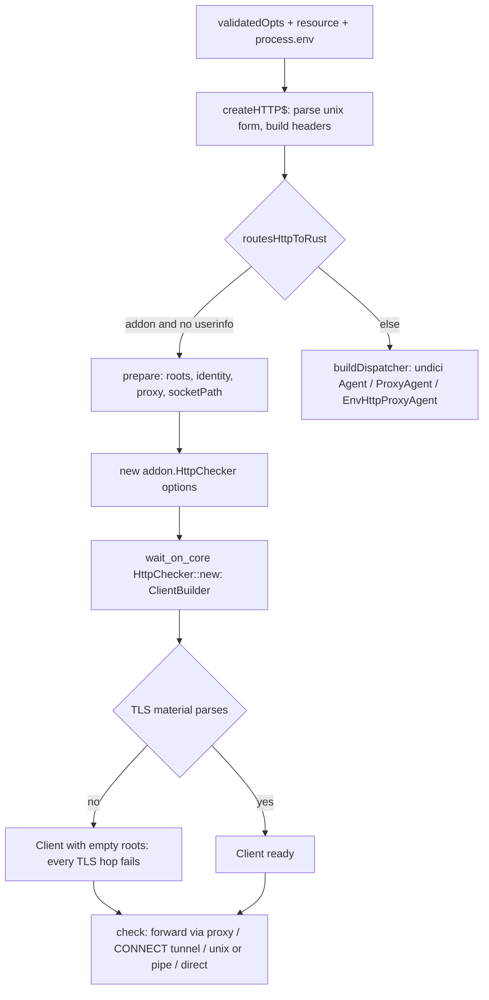

# L5: TLS options, proxies and http-over-unix in Rust - Plan

Lane plan for sub-issue #57. Spine rules (KD-S1..KD-S9 in the spine plan) and the AGENTS.md TDD rules apply; this plan names only what L5 adds. L4 decisions are cited as "L4 KTDn" (`docs/plans/2026-09-30-spike-rs-l4-http-plan.md`).

## Goal Capsule

- **Objective:** a user who sets `WAIT_ON_ENGINE=rust` and uses `ca`/`cert`/`key`/`passphrase`, `strictSSL: true`, a `proxy` object or `proxy: false`, `HTTP_PROXY`/`HTTPS_PROXY`/`NO_PROXY`, or `http://unix:<sock>:<path>` (a named pipe on Windows) gets the same outcome the JS engine gives, and every remaining difference is written down where the behavior is described. Users on the JS engine see no change.
- **Means:** JS prepares each resource's TLS material and proxy decision once and hands them to the addon (KTD1, KTD2, KTD4); the Rust checker gains verified TLS, a client identity, an explicit proxy and unix/pipe transports on reqwest (KTD5, KTD7); `routesHttpToRust` keeps only the userinfo row on JS (KTD7).
- **Authority:** spine plan key decisions (KD-S1..KD-S9) > AGENTS.md > lane issue #57 > this plan. PO9 in the spine lane table is the proof this lane owes.
- **Stop conditions:** a needed `.github/workflows/` change (report to the PM, do not edit); any need to grow `test/rust-pending.js`; a merge of `origin/spike-next-rs` that reshapes `createHTTP$`/`routesHttpToRust` (re-thread, rerun both gates); a `napi` matrix row failing on a reqwest transport or TLS build problem (record it, operator PR, lane stays green on `ci:rs`).
- **Execution profile:** `execution: code`, run through `/ce-work` in this worktree, strict test-first per AGENTS.md, one PR into `spike-next-rs` closing #57. The lane worker finishes and ships; the PM merges.

---

## Product Contract

Product Contract preservation: R-L5-1 through R-L5-12 and AE-L5-1 through AE-L5-4 keep the IDs and meaning from the lane issue; the "Input matrix (to be completed in planning)" moved under Planning Contract as the completed matrix, and OQ1 to OQ5 are resolved into KTD1 to KTD5 (each names its answering test), with the residue under Assumptions.

### Summary

Move the http option cells L4 left on undici into the Rust engine: verified TLS with Node's roots or a supplied `ca`, a client certificate with an optionally encrypted key, an explicit or env-selected proxy (forward for http, CONNECT for https), and http over a unix socket or Windows named pipe. JS keeps owning option semantics: it normalizes TLS material, computes the proxy decision the way undici's `EnvHttpProxyAgent` does, and passes plain strings to the addon; Rust configures reqwest from those strings and answers one check. The self-signed test fixture is regenerated so both engines can verify it, a stub proxy proves which path a request took, and the routing table and deltas in `docs/guides/architecture.md` reflect post-L5 routing.

### Problem Frame

After L4 the Rust engine answers only the plain http/https cells; every TLS, proxy and unix option silently falls back to undici, so PO9 (TLS/proxy parity) has no evidence and L7 cannot drop `undici` from the Rust path. The riskiest cells are the ones #238 missed: TLS options applied to an https target reached through a proxy tunnel.

### Key Decisions

- **JS engine default and unchanged; Rust opt-in via `WAIT_ON_ENGINE`** (KD-S1). (session-settled: user-directed — chosen over switching the default: the JS engine stays authoritative through the spike.) Governs R-L5-2, R-L5-12.
- **rxjs orchestrates polling; Rust answers one check** (KD-S3). (session-settled: user-directed — chosen over moving the loop now: the loop is L7.) Governs R-L5-1.
- **reqwest + rustls (ring) + tokio, no OpenSSL/native-tls** (KD-S6). (session-settled: user-directed — chosen over OpenSSL/native-tls: no system OpenSSL across the prebuild matrix.) Governs R-L5-3, R-L5-4, R-L5-5.
- **No `.github/workflows/` edits; CI behavior via `ci:rs`, `build:napi`, `ci:rs:package`** (KD-S7). (session-settled: user-directed — chosen over lane workflow edits: CI owns no lane logic.) Governs R-L5-12.
- **JS owns option semantics for both engines; Rust receives prepared strings.** Not user-settled (orchestrator resolution, see Assumptions): one implementation of the undici-shaped rules (proxy normalization, env precedence, `NO_PROXY` matching, key decryption) serves both engines, so parity is by construction and drift is caught by the same front-door tests on both engines. Governs R-L5-6, R-L5-7, R-L5-9.
- **Parity-preserving fixture change.** The self-signed test certificate gains a SAN and `CA:FALSE` so rustls/webpki can verify it; the JS engine's acceptance of the old CN-only, `CA:TRUE` shape becomes a recorded delta, not a Rust workaround. Governs R-L5-3, R-L5-4, R-L5-10.

### Requirements

**Routing**

- R-L5-1. Every L5 row of the routing table routes to Rust when the addon is loaded, except rows the plan carves out with a recorded reason (R-L5-9). The URL-with-userinfo row stays JS (not an L5 row).
- R-L5-2. Under `WAIT_ON_ENGINE=js` nothing changes: `npm test` green, no new behavior.

**TLS**

- R-L5-3. `strictSSL: true` verifies the server chain and hostname under Rust; a self-signed target fails, a publicly trusted one passes. Default roots match what undici trusts (Node's bundled Mozilla set), not the OS store (KD-S6).
- R-L5-4. `ca` (string, Buffer, and whatever array forms the schema admits) is honored with `strictSSL: true` exactly as Node treats it (a supplied `ca` replaces the default roots), so a self-signed target with its matching `ca` passes.
- R-L5-5. `cert` + `key` present a client certificate; a server requiring client auth accepts the Rust request when they are supplied and rejects it when absent. `passphrase` decrypts an encrypted `key`, or the cell is a documented delta that stays on JS (resolved: KTD2 decrypts in JS).

**Proxy**

- R-L5-6. `proxy` object routes through that proxy (http target via absolute-form request, https target via CONNECT tunnel), with the same normalization as `buildDispatcher` and Basic proxy credentials. `proxy: false` connects directly even when env proxies are set. A malformed proxy object reaches the callback, never a synchronous throw (existing test).
- R-L5-7. With `proxy` unset, `HTTP_PROXY`/`http_proxy`, `HTTPS_PROXY`/`https_proxy` and `NO_PROXY`/`no_proxy` select the proxy per target scheme and host the way `EnvHttpProxyAgent` does (including which variable an https target reads and how `NO_PROXY` matches). Differences are deltas (R-L5-10).

**http-over-unix**

- R-L5-8. `http://unix:<sock>:<path>` in both URL forms (short and absolute) and `http-get://unix:...` connect over the unix socket on POSIX and the named pipe on Windows, with the request path/`Host` the JS path sends; a unix resource is never proxied, even with env proxies set (existing test).

**Proof and gates**

- R-L5-9. The option × scheme × env-proxy matrix (Planning Contract, Input matrix) is enumerated in the plan; each reachable cell has a test on both engines, or a reasoned carve-out written in the plan.
- R-L5-10. Every deliberate JS/Rust difference is listed under "Deliberate JS vs Rust differences" in `docs/guides/architecture.md`, and the routing table there reflects post-L5 routing.
- R-L5-11. Tests of routed paths prove the path taken: under `rust*` the counting addon saw the check; proxy tests assert the stub proxy counted the request or CONNECT; unix tests assert the socket server saw the request; direct (`proxy: false`, `NO_PROXY`) tests assert the proxy saw nothing.
- R-L5-12. `npm test` and `npm run ci:rs` green; `test/rust-pending.js` does not grow (it is empty, so "shrink" means nothing is added).

### Acceptance Examples

- AE-L5-1. **Covers R-L5-3, R-L5-4, R-L5-11.** Given `rust-strict`, a self-signed https server and `strictSSL: true`, when polled, then `waitOn` rejects on timeout; with its `ca` supplied, then `waitOn` resolves; the counting addon saw the check both times.
- AE-L5-2. **Covers R-L5-7, R-L5-11.** Given `rust-strict` and `HTTP_PROXY` pointing at a stub proxy, when a plain http target is polled, then `waitOn` resolves and the stub counted one request; with `NO_PROXY` matching the target, then `waitOn` resolves and the stub counted zero.
- AE-L5-3. **Covers R-L5-6, R-L5-3, R-L5-4, R-L5-11.** Given `rust-strict`, an https target, `proxy: { host, port }` naming a stub CONNECT proxy, `strictSSL: true` and the matching `ca`, when polled, then `waitOn` resolves and the stub counted a CONNECT.
- AE-L5-4. **Covers R-L5-8, R-L5-11.** Given `rust-strict`, `http://unix:<sock>:/health` and `HTTP_PROXY` set, when polled, then `waitOn` resolves and the socket server saw `/health`. On Windows the same holds over `\\?\pipe\...`.

### Scope Boundaries

**Deferred to follow-up work (other lanes)**

- L6: `command:` in Rust. L7: the polling loop, which decides when the Rust path stops loading `rxjs`/`undici`. L8: parser differential. L9: prebuild matrix.
- No change to the JS engine's behavior, the option schema, `index.d.ts`, the CLI flags, or README option text. No new runtime npm dependency. New Rust crates only when needed and `cargo deny` clean (none are planned, KTD9). No `.github/workflows/` edits.

**Considered and not built**

- `webpki-roots` crate for default roots: a second snapshot of the Mozilla set that ignores `NODE_EXTRA_CA_CERTS`; Node's own set passed from JS (KTD1) mirrors undici exactly with no new crate. Revisit if the per-resource root transfer shows up in `benchmarks/http-ffi.js`.
- Caching Node's root list at module level: computed once per resource construction today; add a cache if the benchmark shows it.
- Decrypting encrypted keys in Rust (a pkcs8 crate): Node's `crypto` already does it in stdlib (KTD2).
- Reimplementing `NO_PROXY` matching in Rust or using reqwest's `NoProxy`: curl semantics differ from undici's; one JS implementation serves both engines (KTD4).
- A TLS stub proxy for `protocol: 'https'` proxies: no test target exists offline; the hop is recorded as a delta (KTD4) and stays covered by the dead-proxy normalization tests.
- A test-only "which engine served me" export on the shipped addon: the counting fixture (L4 KTD10) already proves the path.
- Rust TLS unit tests with `rcgen` and a rustls server: TLS cells are proven at the front door on both engines; a cargo TLS server would add a dev-dependency for assertions mocha already makes (KTD9).
- Re-reading `NO_PROXY` on every poll to match undici's per-dispatch read: no test or user need; recorded as a delta (KTD4).

### Assumptions

- "JS owns option semantics" (Key Decisions) is an orchestrator resolution. If the user prefers the env-proxy decision in Rust, KTD4 changes to reqwest's `Proxy::from_env` semantics and the undici-specific `NO_PROXY` rows in the matrix become recorded deltas.
- reqwest 0.13.5 exposes `ClientBuilder::unix_socket` (unix) and `ClientBuilder::windows_named_pipe` (windows) without a feature flag, plus `tls_certs_only`, `identity`, `Proxy::all`, `Certificate::from_pem_bundle` and `Identity::from_pem` (verified in the registry source; `Identity::from_pkcs8_pem` is `native-tls`-only). The first `cargo build` confirms.
- **Deferred, with fallback:** reqwest's `windows_named_pipe` accepts the `\\?\pipe\...` paths Node listens on. Answered on the Windows `rust` CI row by the un-skipped unix routing test and the `test/https-proxy.mocha.js` unix tests (KTD5). Fallback if it cannot: the win32 `socketPath` row returns to JS as a recorded carve-out in the routing table; `test/rust-pending.js` is never used for it.
- **Deferred, with fallback:** webpki accepts a self-signed leaf (SAN, `CA:FALSE`) as a trust anchor for itself. Answered by the `ca` + `strictSSL: true` test under `rust-strict` (KTD6). Fallback: the fixture helper generates a CA plus a leaf and tests supply the CA as `ca`.
- **Deferred, with fallback:** every CI row's `openssl` accepts `-addext` (OpenSSL 1.1.1+; verified locally on OpenSSL 3.6). Fallback: the helper writes a temp config file and passes `-config`/`-extensions`.
- Node `>=22.19.0` provides `tls.getCACertificates('default')` (verified on Node 26; documented since 22.15) and it includes `NODE_EXTRA_CA_CERTS`. Answered by the extra-CA subprocess test (KTD1).
- The schema admits `ca`/`cert` as string or Buffer only and `key` as string, Buffer or object (`WAIT_ON_SCHEMA`); no array forms exist, so R-L5-4's "array forms the schema admits" is the empty set.
- On Windows, `HTTP_PROXY` and `http_proxy` are one variable; tests that distinguish spellings skip on `win32` and set both spellings elsewhere (existing pattern in `test/engine.mocha.js`).

---

## Planning Contract

### Key Technical Decisions

- KTD1. **Trust roots come from JS: with `strictSSL: true`, JS passes `roots` as PEM strings — the `ca` value (string or Buffer as UTF-8) when set, else `tls.getCACertificates('default')` — and Rust builds the client with `tls_certs_only` over exactly those certificates; with `strictSSL: false` no roots are passed and `tls_danger_accept_invalid_certs` stays.** Resolves OQ3. Never the platform verifier (KD-S6): reqwest's `rustls-no-provider` defaults to `rustls-platform-verifier`, so `tls_certs_only` is what keeps the OS store out. A supplied `ca` replaces the defaults, as Node does. JS passes TLS material for every target scheme, because one reqwest client serves the whole redirect chain and an http resource may redirect to https (undici applies `connect` TLS options to every hop); KTD3 keeps bad material inert on plain-http hops. Non-PEM `ca` text parses to an empty root set on both engines (Node's `createSecureContext` accepts it), so every verified hop then fails. Answering tests: AE-L5-1 (`test/https-proxy.mocha.js`), the http→https redirect rows, and the `NODE_EXTRA_CA_CERTS` subprocess test (`test/engine.mocha.js`, both engines, checks counted). Governs R-L5-3, R-L5-4.
- KTD2. **Client identity is normalized in JS to a PEM certificate plus a plain PKCS#8 PEM key via `crypto.createPrivateKey({ key, passphrase }).export(...)`; Rust concatenates `cert` and `key` and uses `Identity::from_pem`.** Resolves OQ1 and OQ5. `Identity::from_pkcs8_pem` is `native-tls`-only in reqwest 0.13.5; `from_pem` is the rustls constructor and accepts PKCS#1, SEC1 and PKCS#8 keys. One stdlib call covers encrypted keys, so no Rust decryption crate; a `passphrase` with an unencrypted key is ignored on both engines. When normalization throws (wrong passphrase, malformed key, the schema's object form of `key`), JS passes the original value as a string and Rust fails to parse it (KTD3), which reproduces Node's per-connection failure. Answering tests: the mTLS block in `test/https-proxy.mocha.js` (cert+key accepted, absent rejected, encrypted key + passphrase, wrong passphrase, object `key`). Governs R-L5-5.
- KTD3. **Error timing parity: TLS material errors fail every TLS handshake, proxy URI errors surface at construction.** The Rust checker constructor never fails on roots or identity: when either does not parse, it builds the client with `tls_certs_only` over an empty set and no danger flag, so every TLS hop fails verification while plain-http hops still succeed, which is Node's per-connection behavior. `waitOn` then times out on https exactly as undici does and the counting addon still sees the checks. A proxy URI that `new URL` rejects is thrown by JS before the checker exists and routed through `throwError` (existing pattern in `createRustHTTP$`), matching undici's synchronous `ProxyAgent` construction error on the JS path; `Proxy::all` rejecting a URL JS accepted is a programming error and stays a constructor rejection. Answering tests: garbage `cert`, wrong `passphrase`, object `key` → `Timed out` on https on both engines with checks counted; garbage `cert` on a plain http target → resolved; the existing `'bad host'` construction test with zero constructions under `rust*`. Governs R-L5-5, R-L5-6.
- KTD4. **The proxy decision is computed in JS once per resource and passed as `proxy?: string`; Rust adds `Proxy::all(uri)` after `no_proxy()`.** Resolves OQ4. One pure function replaces the inline normalization in `buildDispatcher` (the JS path calls it too): `socketPath` → none; `proxy` object → the normalized URI (protocol with or without `:`, bracketed bare IPv6, percent-encoded credentials); `proxy: false` → none; unset → undici's `EnvHttpProxyAgent` decision ported to JS: `http_proxy ?? HTTP_PROXY` for http targets, `https_proxy ?? HTTPS_PROXY` for https targets falling back to the http proxy when unset, an empty lowercase value shadowing the uppercase one, then `no_proxy ?? NO_PROXY` matching on lowercased hostname without port, brackets or trailing dot: empty list proxies; entries split on commas and whitespace; `*` (or `*:port`) matches all; an entry port must match the explicit or default port; leading `*.` matches subdomains only; leading `.` or a plain host matches apex and subdomains. reqwest forward-proxies http and CONNECT-tunnels https like undici, percent-decodes userinfo into Basic `Proxy-Authorization` like undici, and applies roots and identity to the target TLS inside the tunnel like `requestTls`. Drift guard: the same front-door tests run under both engines against the stub proxy, so the JS engine's real undici is the oracle for the port; the grammar is unit-tested via `_internal`. Deltas recorded (R-L5-10): `NO_PROXY` is read once per resource (undici re-reads per dispatch). The env decision only selects the proxy for Rust; the JS path keeps using `EnvHttpProxyAgent` itself, so the JS engine stays an independent undici oracle. Answering tests: AE-L5-2, AE-L5-3 and the env matrix rows in `test/https-proxy.mocha.js`; vectors in `test/native-helpers.mocha.js`. Governs R-L5-6, R-L5-7.
- KTD10. **Three proxy cells stay on JS as recorded carve-outs (R-L5-1), decided in `routesHttpToRust` from the KTD4 inputs.** (a) An https target whose KTD4 decision selects an env proxy: on `spike-next-rs` the JS path builds `new EnvHttpProxyAgent({ connect })`, and undici 8's inner `ProxyAgent` reads target TLS only from `requestTls`, so the JS engine drops `strictSSL: false`/`ca`/`cert`/`key` there; Rust would honor them and diverge, and fixing JS is out of scope (R-L5-2). The upstream fix (`requestTls`/`proxyTls` on `refactor/axios-to-fetch`, commits 23a3dfb and 19293cc) moves this cell to Rust once it reaches `spike-next-rs`. (b) Any proxy URI in play (the `proxy` object's URI, or either selected env value `http_proxy ?? HTTP_PROXY` / `https_proxy ?? HTTPS_PROXY`) that is not a valid `http:` URL: an `https:` proxy hop is verified with Node defaults under undici (no `proxyTls` on this branch) but would inherit `tls_danger_accept_invalid_certs` and the client identity under reqwest, exposing proxy credentials; `socks*` schemes work in undici but reqwest is built without `socks` (KTD9); a malformed env value makes undici's `EnvHttpProxyAgent` constructor throw immediately, which only the JS path reproduces. (c) Nothing else: http targets behind env proxies, `NO_PROXY`-exempted https targets, and `http:` proxy objects for any target route to Rust. Answering tests: routing rows asserting zero constructions under `rust*` for each carve-out (`test/engine.mocha.js`). Governs R-L5-1, R-L5-2, R-L5-10.
- KTD5. **Unix and pipe transport: JS passes `socketPath` and never a proxy; Rust calls `unix_socket` on unix and `windows_named_pipe` on windows, keeping the synthesized `http://localhost/<path>` URL so the request path and `Host` match the JS path.** Resolves OQ2. reqwest documents these transports as replacing TCP and proxy options, and JS is the single owner of "unix is never proxied" (matches `buildDispatcher`). Answering tests: existing unix tests under `rust-strict` with path proof, the un-skipped unix routing test on win32, and AE-L5-4 on the Windows `rust` CI row. Governs R-L5-8.
- KTD6. **Cert fixture: one shared helper generates an EC self-signed leaf with `subjectAltName=DNS:localhost,IP:127.0.0.1` and `basicConstraints=critical,CA:FALSE`, a second unrelated leaf (bundle tests), and a PKCS#8-encrypted copy of the key with a known passphrase; `test/https-proxy.mocha.js` and `test/engine.mocha.js` both use it.** webpki requires the server name in the SAN and rejects an end-entity with `CA:TRUE`, which the current `req -x509 -subj /CN=localhost` output has; Node accepts both, so the JS engine's outcomes are unchanged by the new fixture. The old shape becomes a recorded delta (R-L5-10). Answering test: the existing `ca` + `strictSSL: true` test, which is RED under `rust-strict` with the old fixture and GREEN with the new one. Governs R-L5-3, R-L5-4.
- KTD7. **`routesHttpToRust` shrinks to "addon loaded, no URL userinfo, and no KTD10 carve-out"; every other L5 condition is removed from the predicate and the `PROXY_ENV_VARS` gate goes away.** The addon options grow by optional fields only (`roots`, `cert`, `key`, `proxy`, `socketPath`), set only when defined, so L4's option-shape test (`deep.equal` on construct opts) keeps passing unchanged. Governs R-L5-1.
- KTD8. **Path proof for proxies: a stub proxy helper in `test/helpers/stub-proxy.js` — one Node http server that forwards absolute-form requests to the target and counts them (recording the request line and `proxy-authorization`), and handles `CONNECT` by piping a TCP connection and counting it.** Direct-connection cells assert zero counts. Ephemeral port. The JS engine run (real undici through the stub) is the helper's own check. Governs R-L5-11.
- KTD9. **No new crates. Rust unit tests cover what a scripted `TcpListener`, `UnixListener` or named-pipe server can see (absolute-form proxying and proxy auth header, unix and pipe transport, deferred TLS-material error, invalid proxy URI); TLS verification, identity and CONNECT are proven at the front door on both engines.** `deny.toml` is expected unchanged; `ci:rs` step 4 confirms. Governs R-L5-12.

### High-Level Technical Design

Routing after L5 (`routesHttpToRust`, evaluated once per resource in `createHTTP$`):

| Condition on validated options, url and env | Route | Owner |
|---|---|---|
| Addon not loaded (`js`, or `rust` with load failure) | JS | KD-S1 |
| URL with userinfo (`user:pass@`) | JS | undici rejects it, reqwest would send Basic; kept for parity |
| https target whose env-proxy decision selects a proxy | JS | KTD10 (a): JS engine drops TLS options there on this branch |
| A proxy URI in play (object URI or a set env value) that is not a valid `http:` URL (`https:`, `socks*`, malformed) | JS | KTD10 (b) |
| Everything else, including `http://unix:`, any TLS option, `strictSSL: true`, `http:` proxy objects, `proxy: false`, env proxies for http targets or `NO_PROXY`-exempted https targets | Rust | KTD7 |
| Fallback row, only if the Windows pipe assumption fails: `socketPath` on `win32` | JS | KTD5 (recorded carve-out) |

Option preparation, JS to napi to reqwest (one owner per rule):

| Input | JS preparation (`createHTTP$`) | napi field | reqwest |
|---|---|---|---|
| `strictSSL: true`, any target scheme | `ca` as UTF-8 PEM, else `tls.getCACertificates('default')` | `roots: string[]` | `tls_certs_only(from_pem_bundle each)` |
| `strictSSL: false` (default) | nothing | `roots` absent | `tls_danger_accept_invalid_certs(true)` |
| `cert` + `key` (+ `passphrase`), any target scheme | cert as UTF-8 PEM; key re-exported as plain PKCS#8 PEM, original string on failure | `cert`, `key` | `identity(Identity::from_pem(cert + key))` |
| Unparsable roots or identity | passed as given | as given | `tls_certs_only([])`, no danger flag: every TLS hop fails, http hops unaffected (KTD3) |
| `proxy` object | normalized URI (shared with `buildDispatcher`); `new URL` guard → `throwError` | `proxy: string` | `Proxy::all(uri)` after `no_proxy()` |
| `proxy: false` | none | absent | `no_proxy()` |
| `proxy` unset | `EnvHttpProxyAgent` port (KTD4) | `proxy` or absent | as above |
| `http://unix:<sock>:<path>` | `socketPath`; proxy forced to none; url `http://localhost/<path>` | `socketPath` | `unix_socket` / `windows_named_pipe` |

Directional shape of the addon options after L5 (not a specification): `new HttpChecker({ url, method, headers, followRedirect, timeoutMs?, roots?, cert?, key?, proxy?, socketPath? })`.

### Input matrix

Dimensions: target (`http`, `https`, unix socket, Windows pipe) × TLS (`none`, `strictSSL: true`, `ca`, `cert`+`key`, `cert`+`key`+`passphrase`) × proxy option (unset, object, object with auth, `false`) × env (none, `HTTP_PROXY`, `HTTPS_PROXY`, `NO_PROXY` matching, lowercase spellings) × engine (JS, Rust). Every test below runs under `npm test` (JS) and `npm run ci:rs` (Rust, real prebuild through the counting fixture); "proof" names the path evidence per R-L5-11. Tests marked "converted" exist today and gain the counting-fixture `outcome` helper and the proof assertion.

| Cell | Test (file) | Proof | State |
|---|---|---|---|
| https × `strictSSL: true`, self-signed, no `ca` → timeout | `should fail an https self-signed cert when strictSSL is true` (`test/https-proxy.mocha.js`) | checks counted | converted (AE-L5-1) |
| https × `strictSSL: true` × `ca` Buffer → resolves | `... matching ca is supplied ...` (same file) | checks counted | converted; RED under Rust until KTD6 (AE-L5-1) |
| https × `strictSSL: true` × `ca` string; × `ca` bundle (unrelated cert + matching cert) → resolves | new, same file | checks counted | U4 |
| https × `strictSSL: true`, no `ca`, `NODE_EXTRA_CA_CERTS`=fixture cert → resolves | new subprocess test (`test/engine.mocha.js`, `test/fixtures/extra-ca-api.js`), both engines | child prints the counting check total | U4 |
| https × `strictSSL: false` × self-signed → resolves | `should pass an https self-signed cert when strictSSL is false (default)` | L4 row | exists |
| https × `ca` × `strictSSL: false` | carve-out: verification is off, so `ca` cannot change the verdict; the row above covers it | — | — |
| http × `strictSSL: true` + `ca` + `cert` + `key` → resolves (TLS material passed, unused on an http hop) | new (`test/https-proxy.mocha.js`); routing test asserts construct opts carry `roots`/`cert`/`key` (`test/engine.mocha.js`) | checks counted; opts inspected | U4 |
| http → 302 → https (self-signed) × `strictSSL: true` × `ca` → resolves; without `ca` → timeout | new (`test/https-proxy.mocha.js`) | checks counted; https server saw the redirected request when resolved | U4 (KTD1) |
| http × garbage `cert` + `key` → resolves on both engines | new, same file | checks counted | U4 (KTD3) |
| https × `cert`+`key`, server requires client cert → resolves; without them → timeout | new mTLS block (`test/https-proxy.mocha.js`) | server saw `socket.authorized`; checks counted | U4 |
| https × `cert`+encrypted `key`+`passphrase` → resolves; wrong passphrase → timeout; passphrase with plain key → resolves | new, same block | as above | U4 |
| https × `cert`+`key` × `strictSSL: true` × `ca` → resolves | new, same block | as above | U4 |
| https × `key: {}` (schema object form) + `cert` → timeout on both engines | new, same block | checks counted | U4 (OQ5) |
| https × garbage `cert` PEM → timeout on both engines | new, same block | checks counted | U4 (KTD3) |
| http × `proxy` object × stub → resolves | new (`test/https-proxy.mocha.js`) | stub `requests` = 1, absolute-form request line | U4 |
| http × `proxy` object with `auth` (`p@:/`) → resolves | new | stub saw `proxy-authorization: Basic base64(u:p@:/)` | U4 |
| https × `proxy` object × `strictSSL: true` × `ca` → resolves | new | stub `connects` = 1 (AE-L5-3) | U4 |
| https × `proxy` object × `strictSSL: true`, no `ca` → timeout | new | stub `connects` ≥ 1 (TLS verified inside the tunnel; the #238 cell) | U4 |
| https × `proxy` object × `cert`+`key` → resolves | new | `connects` = 1, server `authorized` | U4 |
| http × `proxy: false` × `HTTP_PROXY`=stub → resolves direct | new | stub counts 0 | U4 |
| http × `proxy: false`, no env → resolves | `should connect directly when proxy is false ...` | checks counted | converted |
| `proxy: {}` → validation error via callback | `should surface a malformed proxy object ...` | schema, engine-independent | exists |
| 7 proxy URL normalization cases × dead proxy → `Timed out` | `should build a valid proxy URL for ...` | checks counted | converted |
| `proxy.host` with a space → construction error via callback | `should route a dispatcher construction error ...` | zero constructions under `rust*` | converted |
| http × `HTTP_PROXY`=stub → resolves via stub; × lowercase `http_proxy` → same | new | `requests` = 1 (AE-L5-2) | U4 |
| http × `HTTP_PROXY`=stub × `NO_PROXY=localhost` → direct; × lowercase `no_proxy` → direct | new | counts 0 (AE-L5-2) | U4 |
| http × `HTTP_PROXY`=stub × `NO_PROXY=*` → direct | new | counts 0 | U4 |
| http × `HTTP_PROXY`=stub × `NO_PROXY=*.localhost` → proxied (subdomain-only rule) | new | `requests` = 1 | U4 |
| http × `HTTP_PROXY`=stub × `NO_PROXY=localhost:<port>` → direct; `localhost:<other>` → proxied | new | counts | U4 |
| http × `http_proxy=''` × `HTTP_PROXY`=stub → direct (empty lowercase shadows) | new, skipped on win32 | counts 0 | U4 |
| https × `HTTPS_PROXY`=stub × `strictSSL: true` × `ca` → JS carve-out | new routing row: zero constructions under `rust*`, stub `connects` ≥ 1 (JS engine drops the TLS options here on this branch) | stub counts | U4 (KTD10 a) |
| https × only `HTTP_PROXY`=stub → JS carve-out (undici fallback tunnels through the http proxy) | new routing row: zero constructions under `rust*`, stub `connects` ≥ 1 | stub counts | U4 (KTD10 a, OQ4) |
| http × only `HTTPS_PROXY`=stub → direct | new | counts 0 | U4 |
| https × `HTTPS_PROXY`=stub × `NO_PROXY=localhost` → direct | new | counts 0 | U4 |
| `NO_PROXY` grammar: comma/whitespace split, trailing dot, `[::1]:port`, `*:port`, leading `.`, case, default ports 80/443 | vectors via `_internal` (`test/native-helpers.mocha.js`) | pure function; both engines call it | U4 |
| `NO_PROXY` variants beyond the front-door rows above | carve-out: both engines consult the same function, and the front-door rows prove its verdict is honored on each engine | — | — |
| unix × `HTTP_PROXY` dead → resolves | `should not route a unix-socket check through HTTP_PROXY ...` | socket server saw the path; checks counted (AE-L5-4) | converted |
| unix × `proxy` object (dead) → resolves | new | socket server saw the path | U4 |
| unix short and absolute forms; `http-get://unix:`; CLI unix vectors | `test/https-proxy.mocha.js`, `test/api.mocha.js`, `test/cli.mocha.js`, `test/cli-conformance-http.mocha.js` | routing test asserts construct opts `socketPath` and url (`test/engine.mocha.js`) | exist; run under `ci:rs` |
| Windows pipe: all unix rows over `\\?\pipe\...` | same tests on the Windows `rust` CI row; unix routing test un-skipped on win32 | as above | U4 |
| URL userinfo → JS | `should time out like JS without constructing a checker when the url has userinfo` | zero constructions | exists |
| CLI × config-file `proxy` object × stub → resolves | new (`test/cli.mocha.js`) | stub `requests` ≥ 1; engine by inherited env | U4 |
| Rust routing options per L5 condition (unix, `ca`, `strictSSL`, `proxy: false`, `HTTP_PROXY`) | `L5 cells route to the addon` block replacing `L5 cells stay on the JS check` (`test/engine.mocha.js`) | construct opts inspected (`roots`, `proxy`, `socketPath`) | U4 (flips L4 tests) |
| `reverse` × proxy/TLS | carve-out: `negateAsync` wraps the Rust check unchanged (L4 carve-out) | — | — |
| `proxy` object with `protocol: 'https'` or `'socks5'`; `HTTPS_PROXY=https://…` | routing rows: zero constructions under `rust*` (`test/engine.mocha.js`) | construct count | U4 (KTD10 b) |
| malformed `HTTP_PROXY` (e.g. `proxy.corp:3128`) × `NO_PROXY=localhost` × https target → construction error via callback on both engines | new routing row (`test/engine.mocha.js`) | zero constructions | U4 (KTD10 b) |
| Rust unit: forward proxy request line and `proxy-authorization`; unix transport; pipe transport; unparsable TLS material fails the TLS hop only; invalid proxy URI | `cargo test -p wait-on-core` | scripted servers | U1 |

### Risks

| Risk | Answered by |
|---|---|
| Fixture cert cannot pass webpki (no SAN, `CA:TRUE`) | KTD6 helper; `ca` + `strictSSL` test RED then GREEN under `rust-strict`; fallback CA+leaf pair (Assumptions) |
| Self-signed `CA:FALSE` leaf rejected as its own anchor by webpki | same test; fallback CA+leaf pair |
| `-addext` unsupported on a CI row's openssl | helper's own SAN/CA assertion fails on that row; fallback `-config` file |
| reqwest `windows_named_pipe` rejects `\\?\pipe\` paths | un-skipped routing test and unix tests on the Windows `rust` row; fallback win32 carve-out row (KTD5) |
| Env-proxy port drifts from undici | identical front-door rows on both engines with the stub (KTD4); vectors in `test/native-helpers.mocha.js` |
| Rust constructor rejects immediately where JS times out | KTD3; garbage `cert` / wrong passphrase / object `key` rows |
| `tls.getCACertificates` missing on the Node floor | `npm ci --engine-strict` floor is 22.19; the extra-CA subprocess test fails loudly if absent |
| Root transfer cost per resource (~120 PEMs) | `node benchmarks/http-ffi.js` unchanged rows; cache only if it moves |
| Fixed ports and parallel lanes | every new server and stub uses `listen(0)` |
| Sibling lanes touch `createHTTP$` | additive edits; one merge of `origin/spike-next-rs` before ready (U6) |

---

## Implementation Units

### U1. Rust core: TLS roots and identity, explicit proxy, unix and pipe transports

- **Goal:** `wait_on_core::http::HttpChecker` builds its client from optional roots, identity, proxy URI and socket path, defers TLS-material parse errors to `check`, and is covered by `cargo test`.
- **Requirements:** R-L5-3, R-L5-4, R-L5-5, R-L5-6, R-L5-8, R-L5-12 (KTD1, KTD2, KTD3, KTD4, KTD5, KTD9).
- **Dependencies:** none.
- **Files:** `crates/wait-on-core/src/http.rs` (options, builder, tests), `crates/wait-on-core/Cargo.toml` only if a tokio feature is missing for the unix test server, `Cargo.lock`.
- **Approach:**
  1. Extend `HttpOptions` with `roots: Option<Vec<String>>`, `cert: Option<String>`, `key: Option<String>`, `proxy: Option<String>`, `socket_path: Option<String>`.
  2. Builder: `roots` present → `tls_certs_only` over every certificate parsed from each PEM bundle, no `tls_danger_accept_invalid_certs`; absent → today's danger flag. `cert`+`key` → `identity(Identity::from_pem(cert + key))`. A parse failure of roots or identity builds the client with `tls_certs_only` over an empty set and no danger flag (KTD3). `proxy` → `Proxy::all` after `no_proxy()`; its error is a constructor error. `socket_path` → `unix_socket` under `cfg(unix)`, `windows_named_pipe` under `cfg(windows)`.
  3. Keep `cancel`, redirect and timeout behavior untouched.
- **Execution note:** write the forward-proxy test first against the existing scripted `serve` helper (the "proxy" is just the listener that must see an absolute-form request line); it is RED because the client connects to the target directly.
- **Patterns to follow:** the `serve`/`Reply` scripted server and `checker` helper in the existing test module; `crates/wait-on-core/src/socket.rs` for `cfg(unix)`/`cfg(windows)` pipe tests.
- **Test scenarios:**
  - `proxy` set to the scripted server's address, url on another (closed) port: the scripted server sees a request line starting with `GET http://` (absolute-form) and a `host` header of the target; outcome ready on its 200.
  - `proxy` with `u:p%40%3A%2F@` userinfo: the scripted server sees `proxy-authorization: Basic` of `u:p@:/` (percent-decoded).
  - `proxy` unset: the scripted target sees an origin-form request line (`GET / `), guarding that `no_proxy()` still holds.
  - `proxy` set to an unparsable URI: `HttpChecker::new` returns `Err`.
  - `roots` = a `-----BEGIN CERTIFICATE-----` block with an invalid base64 body: `new` returns `Ok`; a plain-http `check` against the scripted server resolves ready; an https-url `check` resolves `ok: false` with a non-empty `error`.
  - `cert`/`key` = garbage: same shape as above.
  - `roots` = `["not a pem"]` parses to an empty root set (no error), matching Node: an https-url `check` resolves not ready.
  - `cfg(unix)`: `socket_path` to a `UnixListener` that answers 200 → ready; request line is origin-form with `host: localhost`; a `proxy` set alongside is ignored (the listener still sees the request).
  - `cfg(windows)`: `socket_path` to a named-pipe server (`ServerOptions`) that answers 200 → ready.
  - `socket_path` to a missing path → not ready with an error, no panic.
- **Verification:** `cargo test --workspace` green on the host; `cargo clippy --workspace --all-targets -- -D warnings` clean; `cargo deny check` unchanged and green; `cargo tree` shows no new crate.

### U2. napi options for TLS, proxy and socket path

- **Goal:** the addon's `HttpChecker` accepts the five optional fields and maps them to core options; the real-addon engine tests cover the new surface.
- **Requirements:** R-L5-1, R-L5-12 (KTD7).
- **Dependencies:** U1.
- **Files:** `crates/wait-on-napi/src/http.rs`, `test/engine.mocha.js` (real-addon `HttpChecker` block).
- **Approach:**
  1. Add `roots: Option<Vec<String>>`, `cert: Option<String>`, `key: Option<String>`, `proxy: Option<String>`, `socket_path: Option<String>` (`socketPath` in JS) to `HttpCheckerOptions`; pass through.
  2. No new exports, no change to `check`/`cancel`.
- **Execution note:** RED is the real-addon test (skips without a host prebuild, always runs under `ci:rs`) constructing a checker with `proxy` set to a local scripted server and asserting that server saw the request.
- **Patterns to follow:** the existing real-addon `HttpChecker` tests in `test/engine.mocha.js` (skip on missing prebuild, ephemeral ports).
- **Test scenarios** (skip without a prebuild):
  - `new HttpChecker({ ..., proxy: 'http://127.0.0.1:<stubPort>' })` against a plain http target: the stub (`test/helpers/stub-proxy.js`, U3, or a bare `http.createServer` counting absolute-form requests) counted one request and `check()` resolved `ok: true`.
  - `new HttpChecker({ ..., roots: [<cert block with invalid body>] })` on an https url: constructor does not throw; `check()` resolves `ok: false` with an `error`.
  - `new HttpChecker({ ..., socketPath })` against a local unix socket (named pipe on win32) server: `check()` resolves `ok: true` and the server saw `/`.
- **Verification:** `npm run build:napi` succeeds; the new engine tests pass under `npm run ci:rs`; `npm test` still green (they skip without a prebuild).

### U3. Test helpers: verifiable cert fixture and stub proxy

- **Goal:** one cert helper both TLS suites share, generating a webpki-verifiable self-signed leaf, a second leaf and an encrypted key; one stub proxy that counts forwarded requests and CONNECT tunnels.
- **Requirements:** R-L5-3, R-L5-4, R-L5-5, R-L5-11 (KTD6, KTD8).
- **Dependencies:** none (lands before U4's tests need it).
- **Files:** `test/helpers/tls-fixture.js` (new), `test/helpers/stub-proxy.js` (new), `test/https-proxy.mocha.js` and `test/engine.mocha.js` (replace their inline `openssl req` generation with the helper), `test/native-helpers.mocha.js` or a new `describe` in `test/https-proxy.mocha.js` for the helper's own checks.
- **Approach:**
  1. `tls-fixture.js`: returns `null` when `openssl version` fails (callers `skip`); otherwise creates a temp dir and runs `openssl req -x509` with EC P-256, `-addext subjectAltName=DNS:localhost,IP:127.0.0.1`, `-addext basicConstraints=critical,CA:FALSE`, twice (primary and unrelated leaf), then `openssl pkcs8 -topk8` with a fixed passphrase for the encrypted key; exposes `{ dir, key, cert, otherCert, encryptedKey, passphrase, socketPathFor, cleanup }`. `socketPathFor` keeps the existing `\\?\pipe\` mapping.
  2. `stub-proxy.js`: `start()` → `{ url, requests, connects, close }` on `listen(0)`; the `request` handler parses the absolute-form `req.url`, records the request line and `proxy-authorization`, forwards to the target with `http.request` and pipes the response back; the `connect` handler records the header, opens `net.connect` to `host:port`, writes `200 Connection Established` and pipes both ways.
  3. Replace both inline generations with the helper; existing TLS tests are the regression guard for the swap.
- **Execution note:** the helper's own RED is an `X509Certificate` assertion (SAN contains `DNS:localhost`, `ca === false`) against the old generation before the flags land; the stub's RED is the first U4 proxy front-door test on the JS engine (real undici through the stub) before the counting handlers exist.
- **Patterns to follow:** `test/helpers/engine-env.js` (small exported helpers), `listenHttp`/`closeServers` in `test/https-proxy.mocha.js`.
- **Test scenarios:**
  - Fixture cert parses with `crypto.X509Certificate`: `subjectAltName` includes `DNS:localhost`, `ca` is `false`; `otherCert` has a different `fingerprint`.
  - `crypto.createPrivateKey({ key: encryptedKey, passphrase })` succeeds and without the passphrase throws.
  - Existing TLS tests in both suites pass unchanged on the JS engine after the swap.
  - Stub: an `http.request` with an absolute-form path through the stub reaches a local target and increments `requests`; a raw `CONNECT` over `net` gets `200` and increments `connects`.
- **Verification:** `npm test` green; both suites skip cleanly when `openssl` is absent; no fixed ports.

### U4. JS option preparation, routing flip and the front-door matrix

- **Goal:** `createHTTP$` prepares roots, identity, proxy and socket path per KTD1–KTD5 and hands them to the addon for every non-userinfo resource; every Input-matrix row has its test on both engines.
- **Requirements:** R-L5-1, R-L5-2, R-L5-3 to R-L5-9, R-L5-11, R-L5-12 (KTD1–KTD5, KTD7, KTD8, KTD10).
- **Dependencies:** U1, U2 (real-engine runs), U3 (fixtures); the routing and vector tests go red on the JS run with the counting fixture before U1/U2 exist.
- **Files:** `lib/wait-on.js` (`routesHttpToRust`, `createHTTP$`, `createRustHTTP$`, `buildDispatcher` sharing the proxy URI helper, new pure helpers on `_internal`), `test/engine.mocha.js` (routing block flip, extra-CA subprocess test), `test/fixtures/extra-ca-api.js` (new), `test/https-proxy.mocha.js` (matrix rows, `outcome` helper), `test/native-helpers.mocha.js` (`NO_PROXY` and proxy-URI vectors), `test/cli.mocha.js` (config-file proxy row), `test/api.mocha.js` only if a unix row needs the counting helper there.
- **Approach:**
  1. Extract the proxy-object normalization from `buildDispatcher` into a pure helper both paths call; add the env-proxy decision helper (KTD4) and a TLS preparation helper (KTD1, KTD2), all exposed on `_internal` for vector tests.
  2. In `createHTTP$`, compute `socketPath` (existing), the proxy URI (guarded by `new URL`, error via `throwError`), and TLS material for https targets only; pass them to `createRustHTTP$`, which sets each addon option only when defined (KTD7).
  3. Shrink `routesHttpToRust` to addon-loaded, no-userinfo and no KTD10 carve-out; delete `PROXY_ENV_VARS`.
  4. Add an `outcome` helper to `test/https-proxy.mocha.js` mirroring `test/api.mocha.js` (`WAIT_ON_NATIVE_LIBRARY_PATH` to the counting fixture under `rust*`, assert checks ≥ 1) and convert the existing TLS/proxy/unix tests to it; the routing block in `test/engine.mocha.js` asserts construct options, not outcomes, because the canned fixture answers `ok: true` when no prebuild exists.
- **Execution note:** start with the routing flip tests (fixture addon, no cargo): each former "stays JS" test becomes "constructs one checker whose options carry `socketPath` / `roots` / `proxy`", RED while the predicate still gates them. Then the `NO_PROXY` vectors, then the front-door rows under `npm run test:mocha` and `WAIT_ON_ENGINE=rust-strict`.
- **Patterns to follow:** `outcome()` in `test/api.mocha.js` (`http checks on either engine`); `withEnv` from `test/helpers/engine-env.js` for env rows (set both spellings where the test is not about case); `test/fixtures/hung-http-api.js` for the subprocess script.
- **Test scenarios** (each also listed in the Input matrix):
  - Routing: `http://unix:<sock>:/` (pipe on win32) → one construct with `socketPath` equal to the path, `url` of `http://localhost/`, no `proxy` even with `HTTP_PROXY` set.
  - Routing: `ca` + `strictSSL: true` on an http target → one construct with `roots`; each KTD10 carve-out (https × selected env proxy; `https:`/`socks5` proxy object; `HTTPS_PROXY=https://…`; malformed env proxy) → zero constructions; `strictSSL: true` on https without `ca` → `roots.length > 1`; with `ca` → `roots` deep-equals the single PEM string; `proxy: false` with `HTTP_PROXY` set → no `proxy` field; `HTTP_PROXY` dead → `proxy` equals the dead URI; `proxy` object with auth → `proxy` equals the normalized URI with percent-encoded credentials.
  - Vectors (`_internal`): the `NO_PROXY` grammar rows; `http_proxy` before `HTTP_PROXY`; empty lowercase means no proxy; https target reads `https_proxy` then `HTTPS_PROXY` then the http proxy; http target ignores `HTTPS_PROXY`; proxy-object normalization for the 7 existing cases yields the URIs `buildDispatcher` produced.
  - Covers AE-L5-1: self-signed https with `strictSSL: true` → `Timed out`; with `ca` (Buffer, string, and bundle with `otherCert` first) → resolved; checks counted.
  - Extra-CA subprocess: child with `NODE_EXTRA_CA_CERTS`=fixture cert, `strictSSL: true`, no `ca`, polls the local https server and prints the outcome and counting check total; under `rust-strict` (skip without prebuild) and `js` both print `resolved`, and the Rust child prints a positive count.
  - TLS options on http target → resolved on both engines.
  - mTLS block (server `requestCert` + `rejectUnauthorized` + `ca: cert`): `cert`+`key` → resolved and `req.socket.authorized`; absent → `Timed out`; `encryptedKey`+`passphrase` → resolved; wrong passphrase → `Timed out`; `passphrase` with the plain key → resolved; `key: {}` → `Timed out`; garbage `cert` → `Timed out`; `cert`+`key`+`strictSSL: true`+`ca` → resolved. Checks counted in every row.
  - Covers AE-L5-3: https × `proxy` object → stub `connects` = 1 with `ca`; `Timed out` and `connects` ≥ 1 without `ca`; mTLS through the tunnel → `authorized`.
  - http × `proxy` object → `requests` = 1 with an absolute-form request line; with `auth` → `proxy-authorization` decodes to `u:p@:/`.
  - Covers AE-L5-2: `HTTP_PROXY`=stub (and lowercase) → `requests` = 1; with `NO_PROXY=localhost` (and lowercase) → 0; `*` → 0; `*.localhost` → 1; `localhost:<port>` → 0 and `localhost:<other>` → 1; empty `http_proxy` shadowing → 0 (skip on win32).
  - `HTTPS_PROXY`=stub × https and only `HTTP_PROXY` × https → routed to JS (zero constructions), stub `connects` ≥ 1; only `HTTPS_PROXY` × http → 0; `HTTPS_PROXY` × `NO_PROXY=localhost` × https → Rust, 0.
  - http → 302 → https: `strictSSL: true` + `ca` → resolved; without `ca` → `Timed out`; garbage `cert`+`key` on a plain http target → resolved.
  - `proxy: false` × `HTTP_PROXY`=stub → resolved, counts 0.
  - Covers AE-L5-4: unix (pipe on win32) × `HTTP_PROXY` dead → resolved and the socket server saw `/health`; unix × `proxy` object dead → resolved.
  - Existing normalization and `'bad host'` tests converted: `Timed out` with checks counted; construction error with zero constructions.
  - CLI: `-c` config file with `proxy: { host, port }` of the stub → exit 0 and `requests` ≥ 1.
  - JS engine unchanged: the whole suite under `npm test` with `WAIT_ON_ENGINE` unset never loads the fixture or the addon.
- **Verification:** `npm test` green including `npm run test:coverage` thresholds; `WAIT_ON_ENGINE=rust-strict npm run test:mocha` green with the real prebuild; every routed-path test asserts its proof, not only the outcome; `test/rust-pending.js` is still `[]`.

### U5. Guides: routing table, option flow and deltas

- **Goal:** the developer manual states what is true on merge: which http cells run in Rust, how TLS material and the proxy decision cross the boundary, the fixture shape, and every deliberate delta.
- **Requirements:** R-L5-10, KD-S9.
- **Dependencies:** U1–U4.
- **Files:** `docs/guides/architecture.md`, `docs/guides/testing.md`, `docs/guides/development.md` (only if a command row changes), `docs/guides/contributing-dual-engine.md` (only if the checklist changes).
- **Approach:**
  1. `architecture.md`: replace the "http(s) (L4)" routing table with the post-L5 table (High-Level Technical Design), rename the heading to cover L4+L5, add the option-preparation table, and extend "Deliberate JS vs Rust differences" with: webpki needs a SAN and rejects a `CA:TRUE` end-entity (a CN-only or CA-flagged self-signed `ca` passes under JS, times out under Rust); `NO_PROXY` read once per resource; TLS-material and proxy error text differs under `--verbose`. Add the KTD10 JS rows to the routing table with their reasons, including that the env-proxy × https row moves to Rust once the JS `requestTls`/`proxyTls` fix reaches `spike-next-rs`.
  2. `testing.md`: `test/helpers/tls-fixture.js` and `test/helpers/stub-proxy.js` rows; `test/https-proxy.mocha.js` now runs its TLS/proxy rows on both engines with the counting fixture; Windows notes: pipes are exercised under Rust too; `NODE_EXTRA_CA_CERTS` subprocess fixture.
- **Test expectation:** none — docs-only edits.
- **Verification:** no routing row still says "JS (L5)"; every delta the matrix carve-outs name is present; the docs-as-done checklist in `contributing-dual-engine.md` is satisfied.

### U6. Lane bookkeeping

- **Goal:** the lane lands as one clean PR into `spike-next-rs`.
- **Requirements:** R-L5-2, R-L5-12.
- **Dependencies:** U1–U5.
- **Files:** this plan's Resume notes; `docs/solutions/` only if `/ce-compound` finds a non-obvious learning (candidates: the webpki fixture requirements, the deferred-error parity choice).
- **Approach:**
  1. Merge `origin/spike-next-rs` once, rerun `npm test` and `npm run ci:rs`.
  2. Remove abandoned attempts (an unused reqwest feature, a Rust-side `NO_PROXY` parser, a second cert generation path) from the diff.
  3. Confirm no `.github/workflows/` change is needed; if one is, report per Stop conditions.
- **Test expectation:** none — process unit; the gates in Verification Contract are its checks.
- **Verification:** PR checks green on `build`, `rust` (ubuntu, macos, windows) and all `napi` rows, or an operator PR filed for a toolchain failure.

---

## Verification Contract

| Command | Proves | When |
|---|---|---|
| `npm test` | lint, `index.d.ts` type tests, mocha under JS: routing flip covered by the counting fixture, vectors, JS-engine rows of the matrix | every unit; before the PR |
| `npm run test:mocha -- --grep "<name>"` | one RED/GREEN cycle | per test |
| `npm run test:coverage` | `.nycrc.json` thresholds hold with the new helpers and the shrunken predicate | U4, before the PR |
| `npm run build:napi` | host prebuild builds with the new options | U2 onward |
| `npm run ci:rs` | fmt, clippy `-D warnings`, `cargo test`, `cargo deny check` (unchanged allow-list), host addon, full mocha under `rust-strict` including every Rust row of the matrix | U1 onward; the lane's gate |
| `WAIT_ON_ENGINE=rust-strict npm run test:mocha` | fast dual-engine loop without the cargo steps | during U4 |
| Windows `rust` CI row (via `ci:rs`) | named-pipe rows under Rust; env-case skips behave | PR |
| PR checks (`build`, `rust` × 3 OS, `napi` rows, `package`) | the matrix compiles the changed tree on every target | PR |

Quality gates: no `.only`/`.skip` left in the diff (platform and tool `this.skip()` calls excepted); `test/rust-pending.js` is `[]`; no new crate in `Cargo.lock`; no `.github/workflows/` edit; Conventional Commit messages (commitlint and pr-title checks run on the PR).

---

## Definition of Done

Global:

- R-L5-1 through R-L5-12 hold with the tests named in the Input matrix passing under `npm test` and `npm run ci:rs`, on ubuntu, macos and windows rows.
- Every matrix row is either tested on both engines or carved out in this plan with its reason; every carve-out that implies a behavior difference appears in `docs/guides/architecture.md`.
- One merge of `origin/spike-next-rs` completed and both gates rerun after it.
- Guides updated per U5; no routing row names L5 as pending.
- Cleanup: abandoned attempts removed from the diff; `test/rust-pending.js` unchanged at `[]`; no workflow edits.
- PR into `spike-next-rs` with `Closes #57`, Conventional Commit title, checks green including all `napi` rows or an operator PR filed for any row that fails on toolchain grounds.

Per unit:

| Unit | Done when |
|---|---|
| U1 | core tests cover every scenario listed; `cargo deny check` green with no allow-list change; no new crate |
| U2 | real-addon engine tests pass under `ci:rs`; L4's construct-options `deep.equal` test unchanged and green |
| U3 | both suites generate certs through the helper; fixture assertions hold on every CI row (or the `-config` fallback is in); stub counts forward and CONNECT |
| U4 | routing tests prove options per cell; matrix rows green on both engines; RED observed for the fixture swap and the routing flip; coverage thresholds hold |
| U5 | guides state only what is true on merge; deltas listed |
| U6 | merge done, gates rerun, PR open |

## Resume notes

<!-- Lane worker notes go here only. -->
