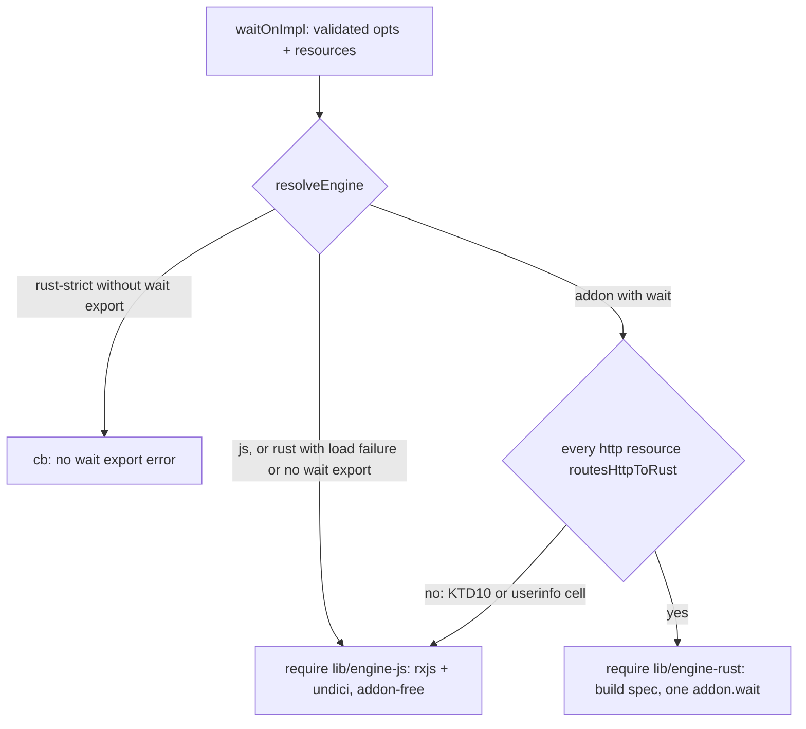

# L7: polling loop in Rust, one napi call per waitOn - Plan

Lane plan for sub-issue #59. Spine rules (KD-S1..KD-S9 in the spine plan) and the AGENTS.md TDD rules apply; this plan names only what L7 adds. L4 and L5 decisions are cited as "L4 KTDn" / "L5 KTDn" (`docs/plans/2026-09-30-spike-rs-l4-http-plan.md`, `docs/plans/2026-09-30-spike-rs-l5-tls-proxy-unix-plan.md`).

## Goal Capsule

- **Objective:** under `WAIT_ON_ENGINE=rust` / `rust-strict` with the addon loaded, one `waitOn` hands the whole wait (every resource, its schedule, stabilization, concurrency, timeout, reverse, and `log`/`verbose` output) to Rust in one napi call, that path loads neither `rxjs` nor `undici`, and callers see the same callback, Promise, exit code and output behavior. Users on the JS engine see no change.
- **Means:** the loop is specified and tested in Rust (`wait_on_core::waiter`, KTD1, KTD2), exposed as one `wait` export (KTD3) that streams log lines back through a threadsafe function before it settles (KTD4); `lib/wait-on.js` becomes a front door that validates and dispatches to a lazily required JS engine or a minimal Rust shim (KTD5, KTD6); JS tests stay at the front doors (KTD7, KTD8).
- **Authority:** spine plan key decisions (KD-S1..KD-S9) > AGENTS.md > lane issue #59 > the 2026-09-30 operator steer (Key Decisions) > this plan. Spine lane table row L7 (R1, R5, PO16) is the proof this lane owes.
- **Stop conditions:** a needed `.github/workflows/` change (report to the PM, do not edit); any need to add to `test/rust-pending.js`; a merge of `origin/spike-next-rs` that reshapes `waitOnImpl`, `createHTTP$`/`routesHttpToRust` or the addon exports (re-thread, rerun both gates); tokio's paused clock proving unusable for an I/O-backed integration case on a CI row (apply the Assumptions fallback for that case, record it, lane stays green).
- **Execution profile:** `execution: code`, through `/lfg` → `/ce-work` in this worktree, strict test-first per AGENTS.md, one PR into `spike-next-rs` closing #59. The lane worker finishes and ships; the PM merges.

---

## Product Contract

Product Contract preservation: R-L7-1 through R-L7-13 and AE-L7-1 through AE-L7-5 keep their IDs and meaning from the lane issue. R-L7-2 is clarified, not changed: the success callback is `cb()` with `err === undefined`, never `null` (`test/api.mocha.js:876,889`, #250), so "cb(null|undefined)" reads as that. OQ1 to OQ4 are resolved into KTD6, KTD1/KTD3, KTD4 and KTD8 (each names its answering test), with the residue under Assumptions.

### Summary

Today the Rust engine answers one check at a time inside the JS rxjs pipeline (L2-L6). L7 moves the pipeline itself into `wait_on_core`: `waitOnImpl` validates options and resources in JS as now, then under a loaded addon builds one spec (validated options plus one prepared entry per resource, reusing L5's `HttpCheckerOptions`) and makes a single `addon.wait(spec, log?, validateStatus?)` call whose result settles the caller's callback or Promise. Rust owns the schedule, the file stability window, concurrency, the timeout and its message, reverse, and the `waiting for` and verbose lines, which it delivers to JS's bound `console.log` in order before settling. The JS engine moves behind a lazy `require`, so the Rust path's module graph holds neither `rxjs` nor `undici`. Per the operator steer, Rust is the primary implementation: the loop's behavior is specified by cargo tests, and JS tests for this lane sit only at `waitOn` and the CLI.

### Problem Frame

After L6 every check runs in Rust but every schedule still runs in rxjs, so a `rust` user pays for two engines, `undici` and `rxjs` load on every path, and PO16 (one napi call per wait) has no evidence. The parts most likely to drift when the loop moves are the ones no test pins today: the exact `waiting for N resources` and `complete` lines, callback-once, mergeMap's queue-not-drop under `simultaneous`, exhaustMap for `command:`, and cancellation of in-flight checks on settle.

### Key Decisions

- **Rust is the primary implementation; loop behavior is specified and tested in Rust, JS tests stay at the front doors.** (session-settled: user-directed — chosen over JS-side loop tests and fixtures: Rust is the primary implementation going forward.) Schedule, stabilization, concurrency, timeout, reverse and output text are pinned by cargo unit tests in `crates/wait-on-core/src/waiter.rs` and integration tests in `crates/wait-on-core/tests/` against real tcp/socket/file/http servers under `tokio::time::pause()`/`advance`. JS tests for this lane are front-door only: `waitOn` Promise and callback forms and the CLI, one parity test per behavior. No new fake-addon tests of loop internals, and no new JS helper scripts. Governs R-L7-4, R-L7-5, R-L7-6, R-L7-12.
- **One napi call per `waitOn` under a loaded addon runs `delay`/`interval`/`window`/`simultaneous`/`timeout`/`reverse`, the log/verbose output and the timeout message.** (session-settled: user-directed — chosen over rxjs orchestrating per-check napi calls (the L2-L6 shape): spine KD-S3 schedules the loop move for L7; PO16.) Governs R-L7-1, R-L7-4, R-L7-5, R-L7-6.
- **Joi schema validation, config loading and `validateStatus` evaluation stay JS-side.** (session-settled: user-directed — chosen over porting them to Rust: one validation implementation; user functions live in JS.) Governs R-L7-7, R-L7-8.
- **JS engine default and unchanged; Rust opt-in via `WAIT_ON_ENGINE`** (KD-S1). (session-settled: user-directed — chosen over switching the default.) Governs R-L7-3.
- **Rust loop code is held to 100% line and region coverage by cargo tests, and to full JS compatibility.** (session-settled: user-directed — chosen over leaving untested branches for later lanes: the Rust library is the primary implementation and L13 enforces `cargo llvm-cov` in CI.) Governs R-L7-14.
- **`test/rust-pending.js` stays empty; no `.github/workflows/` edits; `docs/guides/architecture.md` updated in the same PR** (KD-S7, KD-S9). (session-settled: user-directed.) Governs R-L7-11, R-L7-12, R-L7-13.
- **Whole-wait fallback: a wait containing any resource `routesHttpToRust` rejects runs entirely on the JS engine.** Not user-settled (orchestrator resolution, see Assumptions): the three L5 KTD10 cells and the userinfo cell keep their JS outcomes and their existing zero-addon-call tests unchanged, and the module-graph promise is scoped to waits the Rust loop runs. Governs R-L7-9, R-L7-10.
- **The JS engine is addon-free after L7; the per-check addon routing in the rxjs pipeline is retired.** Not user-settled (orchestrator resolution): "loaded addon" now means "runs the loop", so a third mode (rxjs driving per-check napi calls) would be dead code reachable only from fixtures. The per-check exports (`fileSize`, `runCommand`, `tcpCheck`, `socketCheck`, `HttpChecker`, parsers) stay exported for the real-addon unit tests, the parser differential and `benchmarks/http-ffi.js`; removing them is a later cleanup. Governs R-L7-3, R-L7-9.
- **JS keeps parsing resources and preparing http options; Rust receives a typed spec.** Not user-settled: the L5 preparation (TLS material, proxy decision, headers) already lives in JS and `parse.rs` stays the L8 differential target, so the spec carries parsed fields rather than raw strings. Governs R-L7-7, R-L7-8.

### Requirements

**One call**

- R-L7-1. With the addon loaded, one `waitOn` makes exactly one napi call that runs the wait (helper calls such as `version()` aside), proven by a counting addon fixture at the front door.
- R-L7-2. Callback and Promise forms are unchanged: resolve / `cb()` with `err === undefined` on success, reject / `cb(err)` on timeout or error, the callback fires exactly once.
- R-L7-3. Under `WAIT_ON_ENGINE=js`, or `rust` with a load failure, behavior is byte-for-byte today's JS engine; `npm test` green.

**Moved into Rust**

- R-L7-4. `delay`, `interval`, `window` (file size stabilization, and `window` raised to `interval` as today), `simultaneous`, `timeout`, `reverse` run in Rust with the JS engine's semantics, for every resource type (`file:`, `http(s)[-get]:`, `tcp:`, `socket:`, `command:`, `http://unix:`).
- R-L7-5. The timeout error message is produced in Rust and matches JS exactly: `Timed out waiting for: <remaining resources, comma-space joined>`.
- R-L7-6. `log` and `verbose` output (the `waiting for N resources: ...` lines, reverse-mode banner, `complete` / `exiting with error` lines, and the per-resource verbose lines) reach stdout with the same text as JS, except deltas already recorded in `docs/guides/architecture.md` (e.g. Rust error text in not-ready reasons). Any new delta is recorded there.

**Kept in JS**

- R-L7-7. Joi schema validation, `validateResources`, config-file loading (CLI), and `validateStatus` evaluation stay JS-side. `validateStatus` keeps crossing as a threadsafe function (L4 mechanism).
- R-L7-8. TLS material, proxy decision (`envProxyFor`, `proxyObjectUri`), header/auth building stay JS-prepared strings per resource (L5 KTD1/KTD2/KTD4), passed in the single call.

**Module graph**

- R-L7-9. The Rust path loads neither `rxjs` nor `undici`, proven by a test (a subprocess that runs a Rust-engine `waitOn` and asserts `require.cache` never saw either package). The JS path may keep loading both.
- R-L7-10. Cells that L5 left routed to JS (`routesHttpToRust` false: userinfo URL, https target with env-selected proxy, non-`http:` proxy URI) must either move to Rust or have a recorded resolution that keeps R-L7-9 true (resolved: KTD6 whole-wait fallback, recorded in the architecture guide).

**Gates and docs**

- R-L7-11. `test/rust-pending.js` stays empty; every api test passes under `rust-strict`.
- R-L7-12. `npm test` and `npm run ci:rs` green on the branch; CLI subprocess tests pass under both engines; the loop's cargo unit and integration tests run inside `ci:rs`.
- R-L7-14. Every line and region of loop code this lane adds to `crates/wait-on-core` is executed by cargo tests in that crate (`cargo llvm-cov -p wait-on-core`); code that cannot be exercised is restructured until it can, and the napi layer stays a thin mapping with no branching logic.
- R-L7-13. `docs/guides/architecture.md` describes the Rust loop (replaces "Status: planned (lane L7)"), the single-call boundary, and any new deltas; `docs/guides/` updated in the same PR.

### Acceptance Examples

- AE-L7-1. **R-L7-1, R-L7-2.** Given `rust-strict` and a counting addon, two ready resources (a temp file and a local http server): `waitOn` resolves, the addon saw one `wait` call, and the callback form calls back once with `err === undefined`.
- AE-L7-2. **R-L7-5.** Given `rust-strict`, a missing file and `timeout: 300`: `waitOn` rejects with `Timed out waiting for: <file>`; same text as `js`.
- AE-L7-3. **R-L7-9.** Given `rust-strict`, a subprocess running `waitOn` on a ready resource exits 0 and reports neither `rxjs` nor `undici` loaded; under `js` it reports both (control).
- AE-L7-4. **R-L7-6.** Given `rust-strict` and `--verbose` via the CLI on a resource that becomes ready: stdout has the same `waiting for 1 resources: ...` and `complete` lines as `js`.
- AE-L7-5. **R-L7-4.** Given `rust-strict`, `reverse: true` and a file deleted after 300 ms: `waitOn` resolves; `window` stabilization on a growing file resolves only after size is stable for `window` ms.

### Scope Boundaries

**Deferred to follow-up work (other lanes)**

- L8: parser differential and timing tolerance. L9: prebuild matrix. L10: release readiness. No schema, `index.d.ts`, CLI flag or README option change. No new runtime npm dependency. No new Rust crates (a tokio dev-feature `test-util` for the paused clock is a feature, not a crate; `cargo deny` and `cargo vet` unaffected). No `.github/workflows/` edits.
- Removing the per-check addon exports and the `HttpChecker` class binding: optional cleanup, not done here (real-addon tests and benchmarks use them).

**Considered and not built**

- Rust-side resource parsing at runtime (`parse.rs`): JS already parses and must prepare TLS/proxy material anyway; `parse.rs` stays the L8 differential target.
- Keeping the rxjs per-check routing for an addon that lacks `wait`: a third engine mode reachable only from fixtures; an addon without `wait` is a load failure instead (KTD6).
- A second threadsafe function for `output` (verbose): one `log` function plus a `verbose` flag in the spec is the same contract with less surface.
- Rust formatting the `wait-on(<pid>) complete` / `exiting with error` lines: they fire after settle, so JS's existing `cleanup` keeps them and `process.pid` never crosses the boundary.
- A core `Clock` trait or injectable scheduler: tokio's paused clock (`tokio::time::pause`, `advance`) virtualizes `sleep`/`interval`/`Instant` without a seam in production code.
- A tokio `Semaphore` per resource for `simultaneous`: a pending-tick counter next to the in-flight `JoinSet` is mergeMap's buffer in two integers.
- A JS fixture addon that emulates loop semantics (canned timing, canned verbose lines): per the steer, fixtures answer only `ready` or `timed out` and record the call; behavior is proven in Rust and at the real front doors.
- New JS helper scripts (module-graph fixture, log-report preload): the module-graph proof runs an inline `node -e` program from the test.

### Assumptions

- "Whole-wait fallback" and "JS engine addon-free" (Key Decisions) are orchestrator resolutions. If the user wants carve-out cells in Rust instead, KTD6 drops the fallback once the `requestTls`/`proxyTls` fix reaches `spike-next-rs`, and the KTD10 zero-call tests flip to one-call tests.
- No settled decision conflicts with the evidence: the one-call loop, JS-side validation, the JS default and the empty pending list all hold on this branch.
- napi 3.13.0 builds its runtime with `Builder::new_multi_thread().enable_all()` (verified in the registry source), so `tokio::time` and `spawn_blocking` are available inside the `AsyncBlock`; fallback: `std::thread::spawn` plus a oneshot, as `run_command` does today.
- `ThreadsafeFunction` is not `Clone` in napi 3.13.0 (verified), so the single `validateStatus` handle is shared by http resources through an `Arc`; `call_async` on a weak handle from tokio tasks while the JS thread awaits the promise is the L4 pattern (`crates/wait-on-napi/src/http.rs`).
- **Deferred, with fallback:** under a paused tokio clock, auto-advance can jump virtual time past a check that is still waiting on real localhost I/O (tokio parks with a zero timeout, then advances to the next timer). Integration cases that mix I/O and timers settle the I/O first (yield until the scripted server recorded the request) and then `advance` explicitly, and use virtual timeouts far above tick spacing. Answered by the `crates/wait-on-core/tests/` suite passing on the three `rust` CI rows. Fallback for a case that still races: that case runs on real time with `Instant` headroom, recorded in the test, while file, timeout and schedule cases stay paused.
- An empty `resources` array never reaches the loop: joi's required item rejects it (`test/validation.mocha.js:27`), so the loop needs no empty case.
- `delay`, `interval`, `window`, `timeout`, `tcpTimeout` and `commandTimeout` cross as `u32` with the L4 clamp (`Math.min(x, 2 ** 32 - 1)`); Node's own timers already misfire above 2^31-1 ms, so the clamp is a recorded delta with no reachable parity cost.
- `itFrozen` tests run in real time under the Rust loop and fit their `this.timeout(3000)` budgets (longest: default `window` 750 on file success). If a CI row exceeds a budget, that `describe` budget is raised; a pending entry is never used.
- Since L6 an API caller's process can exit while a `command:` attempt's shell still runs (the attempt is a detached thread; Node's `exec` child would have kept the loop alive). The Rust loop keeps that behavior and the guide records it.

---

## Planning Contract

### Key Technical Decisions

- KTD1. **The loop lives in `wait_on_core::waiter`: one tokio task per resource, an aggregator that settles on all-ready or timeout, and abort-everything on settle.** Each resource task sleeps `delay`, then ticks on `tokio::time::interval_at(start + delay, max(interval, 1 ms))` with `MissedTickBehavior::Delay` (Node clamps `setInterval(…, 0)` to 1 ms and never bursts, so this is rxjs's `timer(delay, interval)`). A tick spawns the check into the task's `JoinSet` when fewer than `simultaneous` are in flight, else increments a pending counter that drains one tick per completed check (mergeMap queues, never drops); `command:` keeps one attempt in flight and drops ticks while it runs (exhaustMap, `simultaneous` ignored). Results are consumed in completion order; the first `true` latches the resource ready, aborts its `JoinSet` and, for http, calls `HttpChecker::cancel`. The aggregator selects between `JoinSet::join_next` over resource tasks and `sleep(timeout)` (none when absent); `timeout == 0` returns timed out before any task spawns, after the initial waiting line, as rxjs's `timer(0)` subscribed first does. On return by any path it drops the resource `JoinSet` (aborting in-flight connects and ticks) and cancels every http checker, so pooled sockets close and nothing outlives the settle except a `spawn_blocking` stat or command attempt, which holds no napi reference. `file_size` and `run_command` run under `spawn_blocking` (never the libuv pool or the napi call path, per `docs/solutions/best-practices/napi-readiness-checks-must-not-block-the-libuv-threadpool.md`). Resolves OQ2 with KTD3. Answering tests: the `waiter` unit suite (U1) and the integration suite (U2) under a paused clock, plus the existing process-lifetime test (`test/engine.mocha.js`, `hung-http-api.js`) under `rust-strict`. Governs R-L7-4, R-L7-5.
- KTD2. **Rust owns the per-wait and per-resource line text; file stabilization uses `Instant`.** The non-reverse `file:` state machine is the JS `scan` verbatim: a size above -1 that is new or changed records `{size, t: now}` and logs `  file exists, checking for size changes, size:N file:P`; the same size before `t + window` logs the stability-window line; at or after it logs `  file stabilized at size:N file:P` and latches; -1 keeps the state silently. Reverse `file:` latches at -1 with no window. Non-file reverse negates the check verdict, with the un-negated verbose lines. The aggregator logs `waiting for N resources: a, b` once before spawning (the `startWith(false)` emission) and after each flip that leaves a resource unready; the final all-ready flip logs nothing. The timeout message is `Timed out waiting for: ` plus the unready resources' original strings joined by `, `. Verbose lines are the strings in `lib/wait-on.js` today, including `making HTTP(S) HEAD request to  url:...` (two spaces without a socket path) and the `util.inspect` shape `{ status: 200, statusText: 'OK', ok: true }`. Answering tests: line vectors in U1/U2 and the front-door parity tests of U7 (AE-L7-4). Governs R-L7-5, R-L7-6.
- KTD3. **One export, `wait(spec, log?, validateStatus?) → Promise<{ ok, error }>`, built with `AsyncBlockBuilder` like `check()`; the result never rejects for an expected outcome.** `spec` is a `#[napi(object)]` with `delayMs`, `intervalMs`, `windowMs`, `tcpTimeoutMs`, `commandTimeoutMs` (`u32`), `simultaneous?` and `timeoutMs?` (`Option<u32>`, absent for `Infinity`), `reverse`, `verbose`, and `resources: [{ name, kind, path?, host?, port?, command?, http? }]` where `http` is L5's `HttpCheckerOptions` unchanged. Http checkers are constructed before the first line; a construction error (invalid proxy URI) returns `{ ok: false, error }` at once with no waiting line, matching the JS `throwError` timing. `{ ok: true, error: null }` maps to `cbOnce()` (so `err === undefined`), `{ ok: false, error }` to `cbOnce(new Error(error))`, and a promise rejection or synchronous throw also reaches `cbOnce`. `validateStatus` is the L4 weak `ThreadsafeFunction`, wrapped in JS as today (`Boolean`, throw → `false`), shared by every http resource through an `Arc`. Answering tests: the real-addon `wait` test in `test/engine.mocha.js` (U3) and AE-L7-1/AE-L7-2 (U7). Governs R-L7-1, R-L7-2, R-L7-5, R-L7-7.
- KTD4. **Log lines cross as a weak `ThreadsafeFunction<String>` that Rust awaits with `call_async`, so every per-wait line has run in JS before the result settles.** JS binds `console.log` at `waitOnImpl` time (as today) and passes it only when `log || verbose`; `spec.verbose` gates per-resource lines inside Rust. The aggregator awaits each of its own lines, so `waiting for` lines always precede the result, and JS's `cleanup` then prints `wait-on(<pid>) complete` or the `exiting with error` line before `cbOnce`, which is why `bin/wait-on`'s `process.exit(0)` inside the callback loses nothing. A verbose line from a check still in flight at settle may print after the completion line, as it can in JS today (the async check continues after `takeWhile` tears down). Rust never writes to fd 1, so in-process `console.log` capture keeps working. Resolves OQ3. Answering tests: AE-L7-4 under both engines (U7) and the ordered-lines assertions in U2/U3. Governs R-L7-6.
- KTD5. **`lib/wait-on.js` becomes the front door; the rxjs/undici engine moves verbatim to `lib/engine-js.js` behind a lazy `require`; shared pure helpers move to `lib/resources.js`; the Rust shim is `lib/engine-rust.js`.** `wait-on.js` keeps `WAIT_ON_SCHEMA`, `waitOn`/`waitOnImpl` (validation, `validateResources`, `resolveEngine`, `cbOnce`, the bound `log`/`output`, the reverse banner, `cleanup`) and dispatches to `require('./engine-js').run(deps)` or `require('./engine-rust').run(deps)` inside the function, so the Rust path's graph is `wait-on.js`, `engine.js`, `resources.js`, `engine-rust.js`, `joi`, `tls`, `crypto` and the addon. `resources.js` holds `PREFIX_RE` and friends, `extractPrefix`/`extractPath`, `tcpHostPort`, the http-unix split and header/auth building, `proxyObjectUri`, `determineRemainingResources` and the lodash replacements; `engine-rust.js` holds `envProxyFor`, `noProxyMatches`, `routesHttpToRust`, `rustTlsOptions`, `pkcs8Pem`, `hasUserinfo` and the spec builder. `waitOn._internal` keeps its exact shape, assembled in `wait-on.js` from `resources.js` and `engine-rust.js` (neither loads `rxjs`/`undici`), so `test/native-helpers.mocha.js` and `test/engine.mocha.js:20` are untouched. `.nycrc.json` already includes `lib/**/*.js`, so moved code keeps its coverage; the shim's branches are executed under `npm test` by the fixture-driven dispatch tests of U6. Answering tests: the inline-`-e` module-graph tests (bare `require('../lib/wait-on')` loads neither package; a Rust-engine wait loads neither; a JS-engine wait loads both), `npm run test:coverage` thresholds. Governs R-L7-3, R-L7-9.
- KTD6. **Dispatch rule: `resolveEngine` treats an addon without a `wait` function as a load failure; `waitOnImpl` runs the Rust shim when an addon is loaded and every http resource passes `routesHttpToRust`, else the addon-free JS engine.** Under `rust` a `wait`-less addon falls back to JS with `loadError` set; under `rust-strict` it rejects with `WAIT_ON_ENGINE=rust-strict: the native addon at <path> has no wait export` (a stale prebuild cannot pass CI on the JS engine). The KTD10 cells and the userinfo cell therefore run the whole wait on the JS engine with zero addon calls, which is what their tests assert today. Resolves OQ1. Answering tests: the three dispatch branches at the API and the CLI (U6), the existing `KTD10 carve-outs stay on the JS check` and userinfo tests with `calls.length === 0`, the `routed: false` rows in `test/https-proxy.mocha.js`. Governs R-L7-3, R-L7-9, R-L7-10.
- KTD7. **Fixtures change only enough to keep the front doors testable: `fake-addon.js` gains `wait`, `counting-addon.js` records `wait` calls instead of `HttpChecker` activity, `fake-addon-checks.js` is deleted, and tests of per-check routing go with it.** `fake-addon.js` exports `version`, `noop`, `calls` and `wait(spec)` answering `{ ok: true, error: null }` or, with `WAIT_ON_FAKE_ADDON_ANSWER=timeout`, `{ ok: false, error: 'Timed out waiting for: ' + names }`, appending one JSON line to `WAIT_ON_FAKE_ADDON_LOG` when set; `WAIT_ON_FAKE_FILE_SIZE` and `WAIT_ON_FAKE_COMMAND_OK` go away (`test/helpers/engine-env.js` list updated). `counting-addon.js` exports `wait` that records `{ type: 'wait', spec }`, delegates to the real prebuild when present, and otherwise rejects with `constructError` or answers canned (`validateStatus(200)` per http resource decides ready or timed out); the `HttpChecker` wrapper is removed. Tests that asserted which per-check export JS called (`test/engine.mocha.js` file-probe and command routing blocks, the `test/engine-checks.mocha.js` fixture suite, the L5 construct-option rows in the counting block, the `spyOn('tcpCheck'|'socketCheck')` real-addon tests) are deleted; the behaviors they guarded are proven in Rust (U1/U2) and at the front doors under the real addon on `ci:rs` (U7, `test/https-proxy.mocha.js` matrix). Governs R-L7-1, R-L7-11.
- KTD8. **Frozen-clock tests keep running under `rust-strict` in real time; only the clock-mechanism test pins the JS engine.** The pump cannot advance a Rust timer, so each `itFrozen` test simply runs on real time within its budget (Fake clock, Assumptions). `test/frozen-clock.mocha.js:33` asserts the mechanism itself (5000 ms virtual in under 2000 ms real), so it wraps its `waitOn` in `withEnv({ WAIT_ON_ENGINE: 'js' }, …)`, the AGENTS.md carve-out for tests of the freezing mechanism; no pending entry. Resolves OQ4. Answering test: `test/api.mocha.js` and `test/frozen-clock.mocha.js` green under `WAIT_ON_ENGINE=rust-strict npm run test:mocha` with `test/rust-pending.js` at `[]`. Governs R-L7-11.
- KTD9. **Cargo tests are the specification: unit tests in `waiter.rs` and integration tests in `crates/wait-on-core/tests/loop.rs`, both on `#[tokio::test(start_paused = true)]` with explicit `advance`, against real resources.** tokio's `test-util` feature is added to the dev-dependency only. Unit tests cover schedule shape with file resources and scripted `TcpListener`s; integration tests cover each resource kind end to end (file growth, tcp, unix socket or named pipe, `command:` through the shell, http with the scripted server and the `HttpChecker`), the line vectors, cancellation on settle and the construction-error path. `ci:rs` runs them in its `cargo test --workspace` step, so no `package.json` change is needed. Governs R-L7-4, R-L7-5, R-L7-6, R-L7-12.
- KTD10. **Guides: `architecture.md` gains a "Polling loop (L7)" section replacing the planned marker, the per-check paragraphs are reframed as "exports kept for tests", and the http routing text becomes a whole-wait rule.** New deltas recorded: `interval: 0` is a 1 ms period on both engines; duration options clamp at 2^32-1 ms under Rust; a `command:` attempt may outlive the process exit (since L6); verbose http error text is reqwest's on every error, not only TLS/proxy. `testing.md` updates the fixture paragraph, the suites table rows for `engine.mocha.js` and `engine-checks.mocha.js`, "Proving the Rust path ran" and the fake-clock bullets. Governs R-L7-13.

- KTD11. **Testability structure for 100% coverage: all branching lives in `wait_on_core::waiter`; `crates/wait-on-napi/src/wait.rs` only maps types and forwards.** The `Sink` takes a plain async closure, so tests drive every log path with a `Vec<String>` collector; `validate` is a generic closure as in `HttpChecker::check`, so its `Ok(true)`, `Ok(false)` and `Err` arms are reached without napi. Defensive arms that no input reaches (e.g. a `JoinError` from an aborted task) are removed or folded into a reachable arm rather than left uncovered. A local `cargo llvm-cov -p wait-on-core --summary-only` run before the PR reports 100% lines and regions for `waiter.rs`; `cargo-llvm-cov` is not installed on the lane host today, so U8 installs it locally (dev tool, not a crate dependency) or records the gap in the PR body. Governs R-L7-14.

### High-Level Technical Design

```mermaid
sequenceDiagram
  participant C as caller / bin/wait-on
  participant W as lib/wait-on.js
  participant S as lib/engine-rust.js
  participant N as napi wait()
  participant A as waiter aggregator
  participant R as resource tasks
  participant L as log TSFN -> console.log
  C->>W: waitOn(opts, cb)
  W->>W: joi validate, validateResources, resolveEngine
  W->>W: log reverse banner (if reverse)
  W->>S: run({ validatedOpts, addon, log, cleanup })
  S->>S: routesHttpToRust for every http resource
  S->>N: addon.wait(spec, log?, validateStatus?)
  N->>A: AsyncBlock: waiter::wait(spec, sink)
  A->>A: build HttpCheckers (error -> result at once)
  A->>L: "waiting for N resources: ..." (call_async, awaited)
  A->>R: spawn one task per resource
  loop every tick (delay, then interval)
    R->>R: spawn check (queue when at simultaneous; drop for command)
    R->>L: verbose lines (call_async)
    R-->>A: first true: resource ready
    A->>L: "waiting for M resources: ..." (unless all ready)
  end
  alt all ready
    A-->>N: Ok
  else timeout
    A-->>N: Err("Timed out waiting for: a, b")
  end
  A->>R: drop JoinSet (abort), cancel every HttpChecker
  N-->>S: { ok, error }
  S->>W: cleanup(undefined | Error)
  W->>L: "wait-on(pid) complete" | "... exiting with error"
  W-->>C: cb() / cb(err) once
```



Input and semantics table (JS semantics are the oracle; one owner per rule):

| Input | JS semantics (`lib/wait-on.js` today) | Rust loop | Proving test |
|---|---|---|---|
| `delay` | `timer(delay, interval)`: first tick at `delay` | `sleep(delay)` then `interval_at` | U1 unit (paused clock: no check before `delay`); U7 api parity |
| `interval` | fixed rate; `0` → Node's 1 ms `setInterval` floor | period `max(interval, 1 ms)`, `MissedTickBehavior::Delay` | U1 unit (interval 0 completes, tick count per advance); U7 api `interval: 0` resolves on both engines |
| `simultaneous` | `mergeMap(check, n)`: excess ticks queued FIFO, unlimited buffer | in-flight `JoinSet` plus pending-tick counter | U1 unit against a stalling scripted server (≤ n in flight, queued tick starts on the next completion); U7 api in-flight max for 1 and 3 |
| `command:` | `exhaustMap`: ticks dropped while an attempt runs, `simultaneous` ignored | one attempt flag; `spawn_blocking(run_command)` | U2 integration (one attempt over several ticks); U7 api attempt counter |
| `window` | `scan` over sizes in completion order, `Date.now()`, raised to `interval` in JS | same state machine on `Instant`; JS still raises | U1 unit growing file (paused clock, exact lines); AE-L7-5 |
| `reverse` | `negateAsync` for checks; file ready at size -1, no window; banner in JS | negate verdict; file -1; banner stays in JS | U2 integration; U7 api reverse on both engines (AE-L7-5) |
| `timeout` | `timer(timeout)` error; `Infinity` → `NEVER`; `0` fires before any check | `Option<u32>`; `None` never; `Some(0)` returns after the initial line, before spawning | U1 unit (0, remaining list, `Infinity` absent); AE-L7-2; U7 api `timeout: 0` names every resource on both engines |
| `validateStatus` | wrapper `Boolean(fn(s))`, throw → `false`, weak TSFN per check | one weak TSFN per wait, `Arc`-shared across http resources, `call_async_catch` | existing `http checks on either engine` rows under `ci:rs`; U3 real-addon `wait` test |
| http options | L5 preparation into `HttpCheckerOptions` | `ResourceSpec.http` is that struct; checker built in Rust | `test/https-proxy.mocha.js` matrix on both engines (`wait` counted); existing real-addon `HttpChecker` tests |
| `tcpTimeout`, `commandTimeout` | per check | spec `u32` fields | U2 integration tcp timed-out line; existing real-addon tcp timeout test rewritten to its verbose line |
| `log` / `verbose` | `console.log.bind()` captured at start | `log` TSFN presence; `spec.verbose` | AE-L7-4 CLI parity; U7 api captured lines |
| settle | `takeWhile` completes, `finalize` cancels | abort `JoinSet`, cancel every checker | U2 integration (no request after settle); existing process-lifetime test under `rust-strict` |
| errors | `throwError` on construction → `cb(err)` | `{ ok: false, error }` before the first line | U2 integration bad proxy URI; existing `deliver a checker construction error` (counting `constructError`), `test/https-proxy.mocha.js` proxy-object error rows |

### Risks

| Risk | Answered by |
|---|---|
| Paused-clock auto-advance races real localhost I/O | Assumptions fallback per case; U2 suite on three `rust` CI rows |
| `call_async` from many tasks deadlocks or reorders lines | JS thread is free while the promise is pending (L4 precedent); AE-L7-4 CLI parity (`process.exit` right after `cb`) |
| Verbose text drifts from JS strings | line vectors in U1/U2 copied from `lib/wait-on.js`; AE-L7-4 and the U7 captured-line tests on both engines |
| `spawn_blocking` unavailable or starved inside the napi runtime | verified multi-thread `enable_all`; fallback `std::thread` + oneshot; existing five-slow-commands test (`test/engine.mocha.js`) under `rust-strict` |
| Coverage thresholds after the split | `npm run test:coverage` in U5/U6; fixture dispatch tests execute every shim branch |
| Deleting per-check routing tests loses a regression guard for JS option preparation | the `test/https-proxy.mocha.js` matrix proves every L5 cell at the front door on `ci:rs`; the KTD10 zero-call rows stay |
| The split rewrites `lib/wait-on.js` wholesale while sibling lanes edit it | U4 lands first and merges `origin/spike-next-rs` immediately; code moves verbatim so sibling hunks re-apply in `engine-js.js` |
| `itFrozen` budgets on a slow CI row | raise the `describe` budget, never a pending entry (KTD8) |
| Fixed ports and parallel lanes | every server in new tests uses `listen(0)` or an ephemeral `TcpListener` |

---

## Implementation Units

### U1. Rust core: the waiter and its schedule semantics

- **Goal:** `wait_on_core::waiter::wait(spec, sink, validate)` runs the whole wait with the JS schedule, stabilization, concurrency, timeout, reverse and line text, pinned by paused-clock unit tests.
- **Requirements:** R-L7-4, R-L7-5, R-L7-6, R-L7-14 (KTD1, KTD2, KTD9, KTD11).
- **Dependencies:** none.
- **Files:** `crates/wait-on-core/src/waiter.rs` (new), `crates/wait-on-core/src/lib.rs` (`pub mod waiter;`, additive), `crates/wait-on-core/Cargo.toml` (dev-dependency tokio feature `test-util`), `Cargo.lock`.
- **Approach:**
  1. Types: `WaitSpec { delay, interval, window, tcp_timeout, command_timeout: Duration; simultaneous: Option<usize>; timeout: Option<Duration>; reverse, verbose: bool; resources: Vec<Resource> }`, `Resource { name: String, kind: Kind }`, `Kind::{File(path), Http(HttpOptions), Tcp{host, port}, Socket(path), Command(command)}`; a `Sink` holding an optional boxed async log function and `verbose`.
  2. Build every `HttpChecker` first (an `Err` returns at once), log the initial waiting line, then handle `timeout == Some(0)`, then spawn resource tasks and the aggregator select per KTD1.
  3. One resource task function with the tick loop, pending counter, exhaust flag for commands, completion-order consumption and the file state machine; checks call `file_size`/`run_command` under `spawn_blocking`, `tcp::ready`, `socket::ready`, `HttpChecker::check`.
  4. Return `Result<(), String>` where `Err` is the exact timeout or construction message.
- **Execution note:** first RED is a paused-clock test with a missing file and `timeout = 300`: `advance(300)` must yield `Err("Timed out waiting for: <name>")` and the sink must hold exactly `waiting for 1 resources: <name>` followed by `checking file stat …` lines; it fails to compile until the module exists.
- **Patterns to follow:** the `serve`/`Reply`/`stall` scripted server in `crates/wait-on-core/src/http.rs` tests; per-OS command constants in `crates/wait-on-core/src/lib.rs` tests; `#[tokio::test(start_paused = true)]` with `tokio::time::advance`.
- **Test scenarios** (paused clock unless noted):
  - Two ready resources (temp file with `window` 0, listening `TcpListener`): `Ok`; lines are `waiting for 2 resources: a, b` then one `waiting for 1 resources: <other>` and nothing after.
  - Missing file, `timeout` 300: after `advance(300)` `Err` equals `Timed out waiting for: <name>`; file verbose line present when `verbose`.
  - `timeout` 0 with a ready file: `Err` naming it, exactly one line (the initial waiting line), no check ran.
  - `delay` 500, `interval` 100, ready file: no `checking file stat` line before `advance(500)`, one at 500, the next at 600.
  - `interval` 0: completes, no panic; ticks are 1 ms apart under `advance`.
  - Growing file: size changes at 0, 50, 100 ms, then stable with `window` 200: lines are `file exists, checking for size changes, size:1`, then `size:2`, `size:3`, the `during stability window` line, and `file stabilized at size:3` exactly at 300 ms of virtual time.
  - Reverse: existing file removed at 150 ms virtual → `Ok`; listening tcp with `reverse` → times out; closed port with `reverse` → `Ok`.
  - `simultaneous` 1 against a scripted server that stalls 300 ms (real I/O, explicit `advance`): the server never sees two concurrent connections, and the queued tick's request arrives on the completion of the previous one, not at the next tick.
  - `simultaneous` absent: ticks during a stalled check each open a connection (unlimited in-flight).
  - Timeout with two resources where one is ready: `Err` names only the unready one.
  - Construction error (`Kind::Http` with proxy `::nope`): `Err` with the reqwest message and no lines at all.
- **Verification:** `cargo test -p wait-on-core waiter` green; `cargo clippy --workspace --all-targets -- -D warnings` clean; `cargo deny check` unchanged; `cargo tree` shows no new crate.

### U2. Rust integration suite: every resource kind end to end

- **Goal:** `crates/wait-on-core/tests/loop.rs` proves the loop against real tcp, socket (named pipe on Windows), file, http and `command:` resources, including line vectors, exhaust, cancellation on settle and `validateStatus`.
- **Requirements:** R-L7-4, R-L7-5, R-L7-6, R-L7-14 (KTD1, KTD2, KTD9, KTD11).
- **Dependencies:** U1.
- **Files:** `crates/wait-on-core/tests/loop.rs` (new).
- **Approach:**
  1. Helpers in the test file only: a `Vec<String>` sink behind `Arc<Mutex>`, a scripted http server returning 200 after N requests, a `TcpListener`/`UnixListener` (or `ServerOptions` pipe) that counts accepted connections, a temp-dir file writer, per-OS sleeping and echoing commands.
  2. One `#[tokio::test(start_paused = true)]` per scenario, settling I/O before `advance` (Assumptions).
- **Execution note:** first RED is the `command:` exhaust test (a command sleeping past several ticks runs exactly once); it fails against a naive mergeMap-style spawn.
- **Patterns to follow:** `crates/wait-on-core/src/socket.rs` for `cfg(unix)`/`cfg(windows)` listeners; U1 helpers.
- **Test scenarios:**
  - http HEAD and GET resources against the scripted server: `Ok`; verbose lines `making HTTP(S) HEAD request to  url:<u> ...` and `  HTTP(S) result for <u>: { status: 200, statusText: 'OK', ok: true }`.
  - http against a closed port: verbose error line starts with `  HTTP(S) error for <u> ` and the wait times out.
  - `validate` returning `Ok(false)` for 200 then `Ok(true)`: resource latches only after the true verdict; a validate `Err` is not ready.
  - tcp listening → `  TCP connection successful to host:127.0.0.1 port:N`; closed port → `  error connecting to TCP host:… port:… ` followed by Rust's reason; black-holed address with `tcp_timeout` 200 → `  timed out connecting to TCP host:… port:… tcpTimeout:200ms` (or the immediate-error line on hosts without a route, as the existing tcp test allows).
  - socket (pipe on Windows): `  connected to socket:<p>`; missing path: `  error connecting to socket socket:<p> …`.
  - `command:` exit 0 → `  Command "<c>" success. stdout: "<out>"`; non-zero → `  Command error: "Command failed: …"`; a sleeping command over 5 ticks logs `executing command "<c>" ...` once; `command_timeout` 200 kills and logs the `killed after 200ms` error.
  - Cancellation on settle: a hung scripted server, `timeout` 200: after `Err`, the server accepted exactly one connection, and 300 ms of virtual time later still one (no tick after settle); the checker reports cancelled on a direct `check`.
  - Mixed wait (file + tcp + http) all ready: exactly the `waiting for` sequence of U1's first scenario.
- **Verification:** `cargo test --workspace` green on the host; Windows pipe scenario first runs on the Windows `rust` CI row.

### U3. napi `wait` export

- **Goal:** the addon exposes `wait(spec, log?, validateStatus?)` returning a Promise of `{ ok, error }`, with log lines delivered through a weak threadsafe function before the promise settles.
- **Requirements:** R-L7-1, R-L7-2, R-L7-6, R-L7-7 (KTD3, KTD4).
- **Dependencies:** U1.
- **Files:** `crates/wait-on-napi/src/wait.rs` (new), `crates/wait-on-napi/src/lib.rs` (`mod wait;`, additive), `crates/wait-on-napi/src/http.rs` (factor the `HttpCheckerOptions → HttpOptions` mapping into a shared function; `HttpChecker` class unchanged), `test/engine.mocha.js` (real-addon `wait` block).
- **Approach:**
  1. `#[napi(object)] WaitSpec` and `ResourceSpec` per KTD3 (`http: Option<HttpCheckerOptions>`), `#[napi(object, use_nullable = true)] WaitResult { ok, error }`.
  2. `type LogFn = ThreadsafeFunction<String, (), String, Status, false, true>`; the sink closure clones an `Arc<LogFn>` and awaits `call_async(line)`, ignoring its result.
  3. `#[napi] pub fn wait(env, spec, log: Option<LogFn>, validate_status: Option<ValidateStatus>) -> Result<AsyncBlock<WaitResult>>` following `HttpChecker::check`'s `AsyncBlockBuilder` shape; `validate_status` shared via `Arc`.
- **Execution note:** RED is the real-addon test (skips without a host prebuild, always runs under `ci:rs`) calling `addon.wait(...)` on a ready file and asserting the log callback received `waiting for 1 resources: <f>` before the promise resolved `{ ok: true, error: null }`; it fails on `addon.wait is not a function`.
- **Patterns to follow:** `crates/wait-on-napi/src/http.rs` (`AsyncBlockBuilder`, weak TSFN type), the real-addon `HttpChecker` describe in `test/engine.mocha.js`.
- **Test scenarios** (skip without a prebuild):
  - Ready temp file: resolves `{ ok: true, error: null }`; the `log` callback's recorded lines, captured with their arrival order, hold the waiting line and were all delivered before `then` ran.
  - `tcp:127.0.0.1:1` with `timeoutMs` 300: resolves `{ ok: false, error: 'Timed out waiting for: tcp:127.0.0.1:1' }`.
  - http resource with `validateStatus: (s) => s === 500` and `timeoutMs` 300: `ok: false`; with `(s) => s === 200`: `ok: true`.
  - A spec with `timeoutMs` absent and a ready file resolves (no timer); `simultaneous` absent resolves.
- **Verification:** `npm run build:napi` succeeds; the new tests pass under `npm run ci:rs`; `npm test` still green (they skip).

### U4. JS module split with a lazy engine require

- **Goal:** `lib/wait-on.js` no longer requires `rxjs`/`undici` at load time; the JS engine and shared helpers live in `lib/engine-js.js` and `lib/resources.js` with behavior byte-for-byte unchanged.
- **Requirements:** R-L7-3, R-L7-9 (KTD5).
- **Dependencies:** none (lands first; merge `origin/spike-next-rs` right after).
- **Files:** `lib/wait-on.js`, `lib/engine-js.js` (new), `lib/resources.js` (new), `test/engine.mocha.js` (module-graph tests, inline `node -e`), `test/coverage.mocha.js` (header comment: the non-timeout `exiting with error` branch becomes reachable in U6).
- **Approach:**
  1. Move the rxjs pipeline (`createResource$` family, `buildDispatcher`, `httpCallSucceeds`, `tcpExists`, `socketExists`, `commandPasses`, `getFileSize`, `logWaitingFor`, `negateAsync`) verbatim into `engine-js.js` exporting `run({ validatedOpts, addon, log, output, cleanup })`; keep the per-check addon branches in this unit (U6 removes them) so every test stays green.
  2. Move shared pure helpers into `resources.js`; `waitOnImpl` keeps validation, `resolveEngine`, `cbOnce`, `log`/`output`, the banner and `cleanup`, then `require('./engine-js').run(deps)`.
  3. `_internal` assembled in `wait-on.js` with its current members.
- **Execution note:** RED is `spawnSync(process.execPath, ['-e', "require('./lib/wait-on'); console.log(JSON.stringify(loaded))"])` where `loaded` reports whether any `require.cache` key contains `node_modules/rxjs/` or `node_modules/undici/` (path-separator aware); it prints both `true` today.
- **Patterns to follow:** `childProcess.spawnSync` with `cwd: REPO_ROOT` as in the process-lifetime describe; `_internal` consumers in `test/native-helpers.mocha.js`.
- **Test scenarios:**
  - Bare `require('../lib/wait-on')` in a subprocess loads neither `rxjs` nor `undici` (Covers part of AE-L7-3).
  - A JS-engine `waitOn` on a ready file in the same inline program loads both (control for AE-L7-3).
  - `waitOn._internal` keeps `once, noop, isNotABoolean, isNotEmpty, determineRemainingResources, routesHttpToRust, envProxyFor, proxyObjectUri` (existing tests unchanged).
  - Whole suite unchanged and green under `npm test`.
- **Verification:** `npm test` green; `npm run test:coverage` thresholds hold; `git diff --stat` shows moves, no behavior edits in `engine-js.js`.

### U5. Rust shim and engine dispatch

- **Goal:** `lib/engine-rust.js` builds one spec and makes one `addon.wait` call; `resolveEngine` requires `wait`; `waitOnImpl` dispatches per KTD6; the JS engine is addon-free.
- **Requirements:** R-L7-1, R-L7-2, R-L7-3, R-L7-7, R-L7-8, R-L7-9, R-L7-10 (KTD3, KTD5, KTD6).
- **Dependencies:** U3 (real-addon runs), U4; fixture-driven tests go red before U3 exists.
- **Files:** `lib/engine-rust.js` (new), `lib/engine.js`, `lib/wait-on.js`, `lib/engine-js.js` (remove `createRustHTTP$`, `addonTcpExists`, `addonSocketExists`, `addonCommandPasses`, the `addon.fileSize` branch and `routesHttpToRust` use), `test/fixtures/fake-addon.js`, `test/fixtures/counting-addon.js`, `test/fixtures/extra-ca-api.js` (count `wait` calls), `test/fixtures/fake-addon-checks.js` (deleted), `test/helpers/engine-env.js`, `test/engine.mocha.js`, `test/engine-checks.mocha.js`, `test/scripts.mocha.js` (prebuild-probe cells use `fake-addon.js` and `WAIT_ON_FAKE_ADDON_ANSWER=timeout`), `test/api.mocha.js` and `test/https-proxy.mocha.js` (`outcome` helpers count `wait` calls).
- **Approach:**
  1. `engine-rust.js`: `routable(resources, validatedOpts, env)` (every http resource passes `routesHttpToRust` with its parsed `socketPath`/url), `buildSpec(validatedOpts, resources, env)` (per resource: `name`, `kind`, parsed fields; http: method, url, string headers, `followRedirect`, clamped `timeoutMs`, L5 transport fields set only when defined), `run(deps)`: wrap `validateStatus` as today, call `addon.wait(spec, deps.log or undefined, status)`, map the result to `cleanup`, catch a synchronous throw into `cleanup`.
  2. `lib/engine.js`: after `require(file)`, `typeof addon.wait !== 'function'` is a load failure with the message of KTD6.
  3. `waitOnImpl`: `addon && routable(...) ? rust.run(deps) : js.run(deps)`; `engine-js.js` ignores `addon`.
  4. Fixtures per KTD7; trim tests per KTD7 (delete per-check routing tests; keep dispatch, carve-out, userinfo, construction-error, process-lifetime, extra-CA, real-addon unit tests).
- **Execution note:** RED is the dispatch test under `rust-strict` with `fake-addon.js` before it gains `wait`: expected `cb` error naming the path and `wait`; today it resolves through the per-check path.
- **Patterns to follow:** `createRustHTTP$`'s option building (moved, not rewritten); `withEnv`/`runCLI` from `test/helpers/engine-env.js`; the counting `outcome` helpers.
- **Test scenarios:**
  - `rust` + addon without `wait` (a one-line module written into the describe's existing temp dir, the junk-addon pattern; no new helper script) → resolves on the JS engine; `resolveEngine` reports `engine: 'js'` with `loadError` naming `wait`.
  - `rust-strict` + that addon → `cb` error containing `rust-strict`, the path and `wait`; CLI exits 1 with the same on stderr.
  - `rust-strict` + `fake-addon.js` on a file, a tcp, a socket, an http and a `command:` resource in one wait → resolves and `fake.calls` has exactly one `wait` (executes every spec branch under coverage).
  - `WAIT_ON_FAKE_ADDON_ANSWER=timeout` → `cb` error `Timed out waiting for: …`; CLI exits 1 with it on stderr and one JSON line in `WAIT_ON_FAKE_ADDON_LOG` (CLI path proof).
  - Counting addon: AE-L7-1's one-call proof (`calls.filter(type === 'wait').length === 1`); `constructError` rejection reaches `cb` with its message and `cleanup` prints the non-timeout `exiting with error` line (captured).
  - KTD10 carve-outs and userinfo: zero addon calls, JS outcome (existing tests, unchanged assertions).
  - Module graph: the inline subprocess from U4 run with `WAIT_ON_ENGINE=rust-strict` (skip without a prebuild) on a ready file reports neither package and exit 0 (Covers AE-L7-3).
  - `js` with `WAIT_ON_NATIVE_LIBRARY_PATH` set to the counting fixture never calls it (existing).
- **Verification:** `npm test` green; `npm run test:coverage` thresholds hold with `engine-rust.js` included; `WAIT_ON_ENGINE=rust-strict npm run test:mocha` green with the prebuild; `test/rust-pending.js` is `[]`; `grep -rn "addon\." lib/engine-js.js` is empty.

### U6. Front-door parity on both engines and the frozen-clock pin

- **Goal:** one `waitOn` or CLI test per loop behavior runs under `npm test` (JS) and `npm run ci:rs` (Rust, counting proof), the output lines match, and the fake-clock suite stays green under `rust-strict`.
- **Requirements:** R-L7-2, R-L7-4, R-L7-5, R-L7-6, R-L7-11, R-L7-12 (KTD2, KTD4, KTD8).
- **Dependencies:** U5.
- **Files:** `test/api.mocha.js` (new describe `polling loop on either engine`, real clock, counting `outcome` under `rust*`), `test/cli.mocha.js` (log/verbose parity), `test/engine.mocha.js` (two-engine timeout-text test; real-addon tcp/socket line tests replacing the deleted `spyOn` tests), `test/frozen-clock.mocha.js` (engine pin on the mechanism test).
- **Approach:**
  1. `api.mocha.js`: follow the `http checks on either engine` shape; each test asserts the outcome and, under `rust*`, one `wait` call.
  2. `cli.mocha.js`: `runCLI` twice (js, rust-strict; skip the Rust half without a prebuild) and compare stdout modulo `process.pid`.
  3. `frozen-clock.mocha.js:33`: wrap in `withEnv({ WAIT_ON_ENGINE: 'js' }, …)` with a comment citing the AGENTS.md carve-out.
- **Execution note:** RED is AE-L7-4 under `rust-strict` before U3/U5 exist only if run early; in sequence the first RED here is the callback-once test, which no existing test covers on either engine (assert the count after settle plus 200 ms).
- **Patterns to follow:** `outcome()` and `listen()` in `test/api.mocha.js`; `captureLog` in `test/engine.mocha.js` (moved beside the new tests); `runCLI` in `test/helpers/engine-env.js`.
- **Test scenarios:**
  - Covers AE-L7-1: temp file + local http server resolve (Promise form); callback form called exactly once with `err === undefined` and no second call within 200 ms; one `wait` call under `rust*`.
  - Covers AE-L7-2: missing file, `timeout: 300`: `js` and `rust-strict` (same test, both engines via `withEnv`) reject with the identical message `Timed out waiting for: <file>`.
  - `timeout: 0` with two resources: message names both on both engines.
  - `delay: 300` on a ready file: resolves no earlier than 300 ms.
  - `interval: 0` on a ready file resolves.
  - `simultaneous` 1 and 3 against a server that answers after 150 ms: the server's peak concurrent request count never exceeds the setting, and the wait resolves.
  - `command:` that appends to a temp file and sleeps 600 ms, `interval: 100`, `timeout: 500`: the file has exactly one line at settle on both engines.
  - Covers AE-L7-5: `reverse: true`, file unlinked after 300 ms → resolves; a file growing every 100 ms for 400 ms with `window: 300` resolves only after it stops growing (elapsed ≥ 700 ms).
  - Captured `console.log` with `log: true` on a ready file: exactly `waiting for 1 resources: <f>` then `wait-on(<pid>) complete`; with `reverse: true` on a missing file: banner first, then the waiting line, then complete.
  - Covers AE-L7-4: CLI `-l` on a ready file: stdout identical between `js` and `rust-strict` after replacing the pid; CLI `-v` on a ready file: the ordered subsequence [`waiting for 1 resources: <f>`, `  file stabilized at size:N file:<f>`, `wait-on(<pid>) complete`] present in both; `-l -t 300` on a missing file: stdout and stderr identical and exit 1 on both.
  - Real addon (skip without a prebuild): captured verbose lines for a listening tcp (`  TCP connection successful …`), a listening socket/pipe (`  connected to socket:…`) and a black-holed tcp with `tcpTimeout: 200` (the `timed out connecting …` or `(os error` line), replacing the deleted `spyOn` tests.
  - `test/frozen-clock.mocha.js` "compresses a large virtual timeout" passes under `WAIT_ON_ENGINE=rust-strict` by running the JS engine; the other three tests are unchanged.
- **Verification:** `npm test` green; `WAIT_ON_ENGINE=rust-strict npm run test:mocha` green with every `itFrozen` test inside its budget; `test/rust-pending.js` is `[]`.

### U7. Guides: loop section, dispatch rule, fixtures and deltas

- **Goal:** the developer manual states what is true on merge: one call per wait, the spec and log boundary, the fallback rule, which exports remain for tests, the Rust-first testing split and every new delta.
- **Requirements:** R-L7-13, KD-S9 (KTD10).
- **Dependencies:** U1–U6.
- **Files:** `docs/guides/architecture.md`, `docs/guides/testing.md`, `docs/guides/development.md` (only if a command row changes), `docs/guides/contributing-dual-engine.md` (only if the checklist changes).
- **Approach:**
  1. `architecture.md`: replace `Status: planned (lane L7)` with "Polling loop (L7)": dispatch rule and the `wait`-less addon failure, the spec shape, `log` TSFN ordering contract, cancellation on settle, the module graph of each path, the whole-wait fallback rows (reuse the existing routing table with "Check" renamed "Wait runs on"), and the deltas of KTD10. Reframe the per-check paragraphs (L2, L3, L6, http binding) as "exports kept for the real-addon tests, the differential and benchmarks; the loop calls core directly".
  2. `testing.md`: fixtures paragraph (`fake-addon.js` `wait`, `WAIT_ON_FAKE_ADDON_ANSWER` values `ready`/`timeout`, `counting-addon.js` records `wait`, `fake-addon-checks.js` gone), suites table rows for `engine.mocha.js`/`engine-checks.mocha.js`, a `crates/wait-on-core/tests/` row, "Proving the Rust path ran" (one `wait` call; verbose lines under the real addon), and the fake-clock bullet that Rust runs real time with the single JS pin.
- **Test expectation:** none — docs-only edits.
- **Verification:** no page still says the loop is planned or that rxjs drives the Rust engine; the docs-as-done checklist in `contributing-dual-engine.md` is satisfied.

### U8. Lane bookkeeping

- **Goal:** the lane lands as one clean PR into `spike-next-rs`.
- **Requirements:** R-L7-3, R-L7-11, R-L7-12.
- **Dependencies:** U1–U7.
- **Files:** this plan's Resume notes; `docs/solutions/` only if `/ce-compound` finds a non-obvious learning (candidates: paused-clock races with real I/O, `call_async` ordering before settle).
- **Approach:**
  1. Merge `origin/spike-next-rs` once after U4 and once before ready; rerun `npm test` and `npm run ci:rs` after each.
  2. Remove abandoned attempts (a second log TSFN, a semaphore, leftover per-check JS routing) from the diff.
  3. Confirm no `.github/workflows/` change is needed; if one is, report per Stop conditions.
- **Test expectation:** none — process unit; the Verification Contract gates are its checks.
- **Verification:** PR checks green on `build`, `rust` (ubuntu, macos, windows) and all `napi` rows, or an operator PR filed for a toolchain failure.

---

## Verification Contract

| Command | Proves | When |
|---|---|---|
| `cargo test -p wait-on-core waiter` | the schedule, stabilization, concurrency, timeout and line semantics of KTD1/KTD2 under a paused clock | U1, every change to `waiter.rs` |
| `cargo test --workspace` (inside `ci:rs`) | U1 plus the `tests/loop.rs` integration suite on real resources | U2 onward; the specification gate |
| `npm test` | lint, `index.d.ts` type tests, mocha under JS: module split unchanged behavior, dispatch branches via fixtures, JS rows of the parity tests | every unit; before the PR |
| `npm run test:mocha -- --grep "<name>"` | one RED/GREEN cycle | per test |
| `npm run test:coverage` | `.nycrc.json` thresholds hold across `lib/wait-on.js`, `lib/resources.js`, `lib/engine-js.js`, `lib/engine-rust.js` | U4, U5, before the PR |
| `cargo llvm-cov -p wait-on-core --summary-only` | 100% lines and regions for `crates/wait-on-core/src/waiter.rs` (R-L7-14); CI enforcement is L13 | U1, U2, before the PR |
| `npm run build:napi` | host prebuild builds with the `wait` export | U3 onward |
| `npm run ci:rs` | fmt, clippy `-D warnings`, `cargo test` (U1/U2), `cargo deny`, `cargo vet --locked`, host addon, full mocha under `rust-strict` (every parity test on Rust with counting proof, module graph, process lifetime, frozen-clock pin), `bench:startup` | U1 onward; the lane's gate |
| `WAIT_ON_ENGINE=rust-strict npm run test:mocha` | fast dual-engine loop without the cargo steps | during U5–U6 |
| `WAIT_ON_ENGINE=rust-strict npm run test:mocha -- --grep "polling loop\|module graph\|frozen-clock"` | the L7-specific suites alone | per RED/GREEN in U5–U6 |
| `node benchmarks/http-ffi.js --iterations 200` | `rust-strict steady` row not slower than the recorded table (the loop removes a napi crossing per poll) | before the PR, table refreshed in `architecture.md` if it moves |
| Windows `rust` CI row (via `ci:rs`) | named-pipe scenario in `tests/loop.rs`; CLI parity under Rust on Windows | PR |

Quality gates: no `.only`/`.skip` left in the diff (platform and prebuild `this.skip()` calls excepted); `test/rust-pending.js` is `[]`; no new crate in `Cargo.lock`; no `.github/workflows/` edit; no new file under `test/fixtures/` or `test/helpers/`; Conventional Commit messages (commitlint and pr-title checks run on the PR).

---

## Definition of Done

Global:

- R-L7-1 through R-L7-13 hold with the tests named in the Input and semantics table passing under `npm test` and `npm run ci:rs` on ubuntu, macos and windows rows.
- Every loop behavior has a cargo test (U1/U2) and one front-door parity test (U6); every dispatch branch (js, rust fallback, rust-strict error, Rust loop, whole-wait fallback) has an API and a CLI test.
- The Rust path's module graph holds neither `rxjs` nor `undici` (AE-L7-3); the JS engine never touches a loaded addon.
- Two merges of `origin/spike-next-rs` completed and both gates rerun after each.
- `cargo llvm-cov -p wait-on-core` reports 100% lines and regions for `waiter.rs` (R-L7-14), or the PR body records why the tool could not run.
- Guides updated per U7; no page names L7 as pending; every new delta recorded.
- Cleanup: `test/fixtures/fake-addon-checks.js` and the per-check routing tests removed; no per-check addon branch left in `lib/engine-js.js`; abandoned attempts removed from the diff; `test/rust-pending.js` unchanged at `[]`; no workflow edits.
- PR into `spike-next-rs` with `Closes #59`, Conventional Commit title, checks green including all `napi` rows or an operator PR filed for any row that fails on toolchain grounds.

Per unit:

| Unit | Done when |
|---|---|
| U1 | every listed scenario passes under the paused clock; clippy clean; no new crate; `waiter.rs` fully covered by U1+U2 |
| U2 | every resource kind proven end to end with its line vector; cancellation on settle observed by the server; Windows pipe case green on the Windows row |
| U3 | real-addon `wait` tests pass under `ci:rs`; lines arrive before the promise settles |
| U4 | bare require loads neither package; suite unchanged; coverage holds; merge of `origin/spike-next-rs` done |
| U5 | dispatch branches tested at API and CLI; one `wait` call per front-door test under `rust*`; per-check routing code and tests gone; coverage holds |
| U6 | parity tests green on both engines; CLI output identical modulo pid; frozen-clock suite green under `rust-strict` |
| U7 | guides state only what is true on merge; deltas listed |
| U8 | merges done, gates rerun, PR open |

## Resume notes

- 2026-09-30: operator steer (PM) recorded as a Key Decision: Rust is the primary implementation and the JS engine is what gets sunset; loop behavior is specified and tested in Rust (`waiter.rs` unit tests plus `crates/wait-on-core/tests/` on real servers under `tokio::time::pause`/`advance`), JS tests for this lane stay at the front doors with one parity test per behavior, the JS shim is the minimum for one napi call per `waitOn`, and no new JS helper scripts are added.
- 2026-09-30: operator addendum (PM): the Rust library is held to 100% line and region coverage (`cargo llvm-cov`, CI enforcement in L13) and full JS compatibility; recorded as R-L7-14 and KTD11, every line of loop code this lane adds must be covered by cargo tests, restructuring anything that cannot be exercised.
