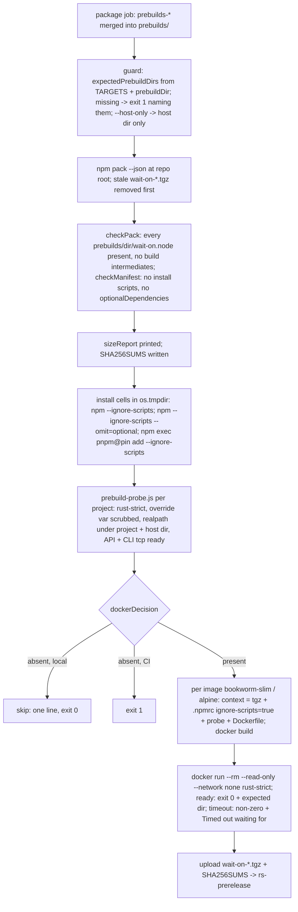

# [L9] multi-target prebuilds, install matrix and read-only run - Plan

Implementation-ready lane plan for sub-issue #61. Product Contract preservation: requirements R-L9-1..R-L9-14 and tests T-L9-1..T-L9-7 keep the meaning of the requirements-only plan; R-L9-15..R-L9-16 and T-L9-8..T-L9-9 are added, and the open areas (pnpm provisioning, host-only opt-in, images, container construction, path proof, SHA256SUMS, size baseline, target-list ownership) are resolved in KTD1–KTD9. The spine plan is controlling and is never edited by this lane.

---

## Goal Capsule

**Objective.** After this lane merges into `spike-next-rs`, the CI `package` job runs `npm run ci:rs:package` and leaves one `wait-on-*.tgz` holding all eight PO4 addons plus a `sha256sum -c`-compatible `SHA256SUMS`, having proven on the runner that the tarball installs with lifecycle scripts disabled under npm, npm `--omit=optional` and pnpm and loads the addon from inside the installed package, and that AE1 holds in `--read-only --network none` containers on glibc and musl. The package log carries the size report. From then on every push to `spike-next-rs` publishes a GitHub prerelease (intended, KD-S8). Proves PO4, PO5, PO7, PO8.

**Means.** One new hook script `scripts/ci-rs-package.js` in the `scripts/ci-rs.js` shape (pure planners + a `main` that spawns without a shell; KTD1), the target list single-sourced from `scripts/build-napi.js` `TARGETS` + `lib/engine.js` `prebuildDir` (KTD2), a `--host-only` developer opt-in (KTD3), pnpm via `npm exec --package pnpm@<pinned>` (KTD4), one probe script that proves the addon path for host and container cells alike (KTD6), and `node:24-bookworm-slim` / `node:24-alpine` images built from the tarball with `ignore-scripts=true` (KTD5).

**Authority.** `AGENTS.md` > spine plan KD-S1..KD-S9 > this plan.

**Stop conditions** (report to the PM, do not work around):
- a `.github/workflows/` change is needed (a different `build:napi` argument shape in the `napi` `extra-args` column, a runner or tool the `package` job lacks, a lower glibc floor needing a different runner or zig flag);
- a public API / CLI / `WAIT_ON_SCHEMA` / `index.d.ts` change is needed;
- a new **npm runtime** dependency is needed (the loader stays hand-written, KD-S4).

**Execution profile.** `/ce-work` via `/lfg` from this plan; strict TDD per `AGENTS.md`; one PR, base `spike-next-rs` on `kevinold/wait-on`, body `Closes #61`; never merges.

---

## Product Contract

### Summary

Define `ci:rs:package`. With every target's prebuild already downloaded into `prebuilds/` by the `package` job, it refuses to pack a partial bundle, packs once, asserts the tarball's contents and manifest from `npm pack` output, prints sizes, writes `SHA256SUMS`, then runs the install matrix and the AE1 container cells against the tarball it just built. The build side (R-L9-1/2) is already true on `spike-next-rs`; this lane proves it and removes the second copy of the target list. Mocha tests cover the pure planners and the probe on every CI OS with fixtures; the heavy cells run only inside `ci:rs:package`.

### Problem Frame

`ci:rs:package` is undefined, so `package` and `prerelease` are green no-ops and no one has yet proven that a single tarball carries eight addons, installs with scripts off under npm and pnpm, or loads in a read-only, network-less container on both libcs. The loader's dir naming and the build's dir naming share `prebuildDir`, but the list of eight targets exists only inside `build-napi.js`, unexported, so a packaging guard would need its own copy.

### Starting state (verified 2026-09-30)

- `scripts/build-napi.js` maps all eight PO4 triples via `prebuildDir`; the eight `napi` rows are green on `spike-next-rs` (run 36766699792). `TARGETS` is not exported.
- The downloaded `prebuilds-x86_64-unknown-linux-gnu` artifact contains `linux-x64/wait-on.node` (609,328 bytes): upload-artifact keeps `<dir>/wait-on.node` under the artifact root, so the merged download reconstructs `prebuilds/<dir>/`.
- That binary's highest `GLIBC_` symbol version is 2.34 (built natively on ubuntu-24.04).
- `lib/engine.js`: `prebuildDir`, `isMusl` (no `glibcVersionRuntime` means musl), `addonPath(env)` (`WAIT_ON_NATIVE_LIBRARY_PATH` override else `<pkg>/prebuilds/<dir>/wait-on.node`), `resolveEngine` (`rust-strict` throws on load failure). No change needed.
- `package.json`: `files` = `bin/`, `lib/`, `prebuilds/`, `exampleConfig.js`, `index.d.ts` (allow-list: `crates/`, `scripts/`, `Cargo.*`, `target/`, `benchmarks/`, `docs/`, `test/` are already outside the package); no `install`/`preinstall`/`postinstall`/`prepare`/`prepack` scripts; no `optionalDependencies`; no `exports` field (so `wait-on/lib/engine` is requireable from an installed copy). `.npmignore` exists (npm ignores `.gitignore`). `.nycrc.json` covers `lib/` and `bin/` only.
- `package` job: `ubuntu-latest` (x64), Node 24.x, docker available; `npm ci --engine-strict`, `npm run --if-present ci:rs:package`, upload `wait-on-*.tgz` + `SHA256SUMS` from the repo root. `rs-prerelease.yml` creates `rs-<version>-<sha7>` only when a tarball exists.
- Node 24 ships corepack; Node 25+ does not (local dev: Node 26.3.1, npm 11.16.0, no corepack). npm 7+ treats `--no-optional` as a deprecated alias of `--omit=optional`.
- `test/scripts.mocha.js` tests the pure planners of `build:napi` and `ci:rs`; `test/helpers/engine-env.js` has `withEnv`/`runCLI`; `test/fixtures/fake-addon-checks.js` answers `tcpCheck` per `WAIT_ON_FAKE_ADDON_ANSWER`.

### Requirements

**Build (PO4)**

- R-L9-1 `npm run build:napi -- --target <triple>` produces `prebuilds/<platform>-<arch>[-musl]/wait-on.node` for each PO4 target: `darwin-arm64`, `darwin-x64`, `linux-x64`, `linux-arm64`, `linux-x64-musl`, `linux-arm64-musl`, `win32-x64`, `win32-arm64` (glibc linux dirs carry no suffix, matching `lib/engine.js`). The target list lives in one place and the loader's dir naming and the build's dir naming cannot drift. `linux-armv7` stays out (JS fallback covers it).
- R-L9-2 The built binary actually matches its dir: the `napi` artifact for each target lands at the expected path after the `package` job's merged download (the artifact root is `prebuilds/`, not flattened).

**Pack (PO5)**

- R-L9-3 `npm run ci:rs:package` runs `npm pack` and leaves exactly one `wait-on-*.tgz` and a `SHA256SUMS` covering it at the repo root (what `package` uploads and `rs-prerelease.yml` attaches).
- R-L9-4 Before packing it fails, naming the missing dirs, when any PO4 target's `wait-on.node` is absent, so CI can never ship a partial bundle. A local run with only the host prebuild needs an explicit, documented opt-in to proceed.
- R-L9-5 The tarball contains every PO4 `prebuilds/<dir>/wait-on.node` and no build intermediates (`target/`, `crates/`, `scripts/`, `Cargo.*`, `benchmarks/`, `docs/`, test fixtures); asserted from `npm pack` output, not assumed from `files`.
- R-L9-6 Size report: packed and unpacked tarball size, plus per-target addon size, printed by `ci:rs:package` and recorded in the guide with the baseline JS-only package size for comparison (PO5 decision input). No size threshold is enforced in this lane (KTD8).
- R-L9-15 `SHA256SUMS` is one `<sha256 hex>  <filename>` line per file (two spaces, `sha256sum` / `shasum -a 256 -c` compatible), covering the tarball only.

**Install and load (PO7, R6, R7, R9)**

- R-L9-7 From the packed tarball, into a fresh temp project, install with lifecycle scripts disabled and load the addon, under each cell: npm with `--ignore-scripts`; npm with `--ignore-scripts --omit=optional`; pnpm with `--ignore-scripts` (explicit, not the pnpm 10 default). "Loads" means: with `WAIT_ON_ENGINE=rust-strict`, the installed `wait-on` resolves the host's prebuild from inside the installed package (not the repo checkout) and a resource check succeeds through the CLI (exit 0) and the API.
- R-L9-8 The tarball declares no `install` / `preinstall` / `postinstall` / `prepare` script and no `optionalDependencies`; asserted from the packed `package.json`.
- R-L9-9 No network fetch at install beyond the registry resolution of the existing runtime deps (`joi`, `rxjs`, `undici`); in particular nothing downloads a binary.
- R-L9-16 Every install and container cell runs with `WAIT_ON_NATIVE_LIBRARY_PATH` removed from the environment, so an inherited override can never stand in for the installed prebuild.

**Read-only container (PO8, AE1)**

- R-L9-10 AE1: an image built from the tarball runs `npm install <tgz>` with `ignore-scripts=true` at build time; the container then runs with `--read-only` and `--network none` and `WAIT_ON_ENGINE=rust-strict`, executes `wait-on` against a `tcp:` resource served inside the same container (the AE1 stand-in for `tcp:db:5432`), and exits 0. A matching negative cell (no listener, short `--timeout`) exits non-zero with the timeout message, proving the check ran rather than short-circuiting.
- R-L9-11 The container is linux on the job's arch; a musl (alpine) image cell exercises the `-musl` prebuild and the loader's musl detection; a glibc (debian slim) cell exercises the glibc dir. Each cell asserts the dir the loader actually picked.
- R-L9-12 Where `docker` is absent (local macOS without Docker, Windows), the container cells skip with one clear line, never fail; under CI on the `package` job they must run (a skip there is a failure).

**Docs and hygiene**

- R-L9-13 `docs/guides/ci.md`: `ci:rs:package` status becomes defined; what it checks, the cells, the size table. `docs/guides/releasing.md`: the prerelease now carries a real multi-platform tarball, how testers install it, the size numbers. Keep edits small (sibling lanes edit these pages).
- R-L9-14 JS engine unchanged; `npm test` and `npm run ci:rs` stay green; `.npmignore` / `files` excludes any new tooling file from the published package; generated `wait-on-*.tgz` and `SHA256SUMS` are gitignored.

### Key Decisions

- KD-L9-1 Single prebuildify-style package: every target's `.node` under `prebuilds/<platform>-<arch>[-musl]/wait-on.node`, loaded by the existing hand-written loader (session-settled: user-approved — chosen over per-platform `optionalDependencies` and `node-gyp-build`: one package, one provenance attestation, works under `--omit=optional`, no new runtime dep). Governs R-L9-1, R-L9-5, R-L9-7, R-L9-8.
- KD-L9-2 No `.github/workflows/` edits; CI behavior changes only via `build:napi` / `ci:rs:package` (session-settled: user-directed — chosen over editing the `napi`/`package` jobs: workflows are operator-owned; a needed change is a stop-and-report). Governs R-L9-2, R-L9-3, R-L9-12.
- KD-L9-3 JS engine, public API/CLI/schema/`index.d.ts` unchanged; no new npm runtime dependency (session-settled: user-directed — chosen over any public-surface change: the spike is side-by-side and opt-in). Governs R-L9-14.
- KD-L9-4 Strict TDD per `AGENTS.md` (session-settled: user-directed — chosen over tests-after: repo mandate). Governs every T-L9-*.

### Tests that answer the risks (write each before its code)

- T-L9-1 Target table (mocha, `test/scripts.mocha.js`): `expectedPrebuildDirs()` returns exactly the eight PO4 dirs, each equal to `prebuildDir` of the exported `TARGETS` entry; an unknown triple still errors (existing test). U1.
- T-L9-2 Missing-target guard (mocha, temp `prebuilds/` fixtures): a subset gives the missing dirs, in table order; all eight fixture files give empty; `hostOnly` requires only the host dir. The formatted failure names every missing dir. U1.
- T-L9-3 Tarball contents (mocha, real `npm pack --dry-run --json` in a temp package that copies the repo's `package.json` and holds fixture prebuilds plus decoy `target/`, `crates/`, `scripts/`, `docs/`, `test/`, `Cargo.toml`): every PO4 `wait-on.node` present, no excluded path (R-L9-5); the manifest check rejects a manifest with an install script or `optionalDependencies` and accepts the repo's (R-L9-8). Skips when `npm_execpath` is unset. U1.
- T-L9-4 Size report shape (mocha, fixture pack JSON with concrete byte counts): packed, unpacked, JS-only unpacked and one row per target dir. U1.
- T-L9-5 Install matrix. Mocha half (cross-platform, no build): the cell planner yields the three cells with `process.execPath` as `cmd`, `--ignore-scripts` in every cell, `--omit=optional` in the second, `pnpm@<pinned>` in the third, and no shell; `WAIT_ON_NATIVE_LIBRARY_PATH` absent from every cell env; `assertInstalledAddon` accepts a realpath under the project root ending in the host dir and rejects the repo's path. Live half (inside `ci:rs:package`, real host addon): each cell's probe reports a realpath inside the temp project and exits 0 for API and CLI. U2.
- T-L9-6 AE1 read-only. Mocha half: the container planner yields four cells (glibc ready, glibc timeout, musl ready, musl timeout) with `--read-only`, `--network none`, `WAIT_ON_ENGINE=rust-strict` in the run args, `ignore-scripts=true` in the generated `.npmrc`, and the expected dir `linux-<arch>` / `linux-<arch>-musl`. Live half (inside `ci:rs:package`; skip without docker, fail under `CI`): ready cells exit 0 with the expected dir in the probe output; timeout cells exit non-zero with `Timed out waiting for` on stderr. U3.
- T-L9-7 Skip behaviour (mocha): `dockerDecision({ dockerFound: false, ci: false })` gives skip with a one-line reason; `({ dockerFound: false, ci: true })` gives fail; `({ dockerFound: true })` gives run. U3.
- T-L9-8 SHA256SUMS format (mocha): a temp file containing `abc` yields the line `ba7816bf8f01cfea414140de5dae2223b00361a396177a9cb410ff61f20015ad  <name>` with a trailing newline. U1.
- T-L9-9 Probe under the fixture addon (mocha, cross-platform): in a temp project whose `node_modules/wait-on` is a junction/symlink to the repo root, running `scripts/prebuild-probe.js` with `WAIT_ON_ENGINE=rust-strict` and `WAIT_ON_NATIVE_LIBRARY_PATH` = `test/fixtures/fake-addon-checks.js` prints one JSON line whose `addonPath` is the fixture path and `api` and `cli` both report success; with `--no-listener --timeout 300` and the fixture answering `refused`, it exits non-zero and stderr contains `Timed out waiting for`. U2.

Matrix: package manager {npm, pnpm} × optional {default, `--omit=optional`} × scripts {disabled}; container libc {glibc, musl} × outcome {ready, timeout}. Carve-outs: pnpm × `--omit=optional` not run (the tarball declares no optionalDependencies, R-L9-8, so the npm cells cover the flag's meaning); host arch only (linux-x64 in CI), other targets are proven present and sized, not loaded (the runner cannot execute darwin/windows/arm64 binaries; the `napi` rows built them natively). Cell table in the Verification Contract.

### Scope Boundaries

- Allowed paths: `crates/`, `Cargo.toml`, `Cargo.lock`, `rust-toolchain.toml`, `deny.toml`, `lib/`, `bin/`, `test/`, `index.d.ts`, `package.json`, `package-lock.json`, `.npmignore`, `.gitignore`, `.nycrc.json`, `eslint.config.mjs`, `docs/guides/`, `docs/plans/`, `docs/solutions/`, `AGENTS.md`, `README.md`, `benchmarks/`, `scripts/`. Never `.github/workflows/`; never the spine plan or sibling lane plans.
- Out of scope: resource checks (L2–L6), the Rust polling loop (L7), benchmarks (L8), npm publication and the end-to-end prerelease verification from the GitHub Release (L10), `linux-armv7`, code signing.
- Non-goals (considered, not built): a size threshold (KTD8); adding pnpm as a devDependency or relying on corepack (KTD4); an env-var opt-in for host-only (KTD3); a subprocess test of `ci-rs-package.js`'s `main` (the planners are the tested front door, as for `ci:rs`; `main` is proven by the package job and the local `--host-only` run); instrumenting npm's network traffic for R-L9-9 (no scripts in the manifest is the guarantee; `--network none` proves nothing fetches at run time); a `prepack`/`prepare` hook that builds addons (would run on `npm pack` and hide a missing prebuild); a `--tmpfs` mount in the container cells unless the read-only run proves to need one (Assumptions); removing the tarball on failure (the upload step is skipped when `ci:rs:package` exits non-zero).

### Deferred to Follow-Up Work

- Lowering the glibc floor below 2.34 (older runner or zig glibc-version target for the gnu rows) is a `napi` matrix change: operator PR, not this lane. This lane records the floor in the guide.
- pnpm `--no-optional` and yarn cells; a linux-arm64 container run (needs an arm runner for `package`).
- Verifying the published prerelease asset end to end (L10).

### Outstanding Questions

None blocking. Execution-time details:
- (deferred) Whether node under `--read-only` needs a writable `/tmp`; if the ready cell fails with `EROFS`, add `--tmpfs /tmp` to the run args (root FS stays read-only, AE1 intact) and record it in the guide.
- (deferred) The exact pnpm 10.x pin: latest 10.x at implementation time, recorded as one constant in the script and named in the guide.

### Sources

- Issue kevinold/wait-on#61 (text only); spine plan KD-S4, KD-S7, KD-S8, lane row L9 and the PO4 target matrix.
- Requirements plan `docs/plans/2026-09-28-1239-feat-rust-port-plan.md`: KD1, R6, R7, R9, AE1, PO4, PO5, PO7, PO8.
- `scripts/build-napi.js` (`TARGETS`, `planBuild`, `parseArgs`), `scripts/ci-rs.js` (`steps` + shell-less `main`), `test/scripts.mocha.js`, `lib/engine.js`, `package.json`, `.npmignore`, `.gitignore`, `.nycrc.json`, `.github/workflows/node.js.yml` (`napi`, `package`, `prerelease`), `.github/workflows/rs-prerelease.yml`, `docs/guides/ci.md`, `docs/guides/releasing.md`, `docs/guides/architecture.md`, `docs/guides/development.md`, `docs/guides/testing.md`, `test/helpers/engine-env.js`, `test/fixtures/fake-addon-checks.js`.
- CI run 36766699792 on `spike-next-rs` (eight green `napi` rows; artifact layout; glibc 2.34 symbol floor of the linux-x64 gnu binary).

---

## Planning Contract

### Key Technical Decisions

- KTD1. **One hook script, `scripts/ci-rs-package.js`, in the `ci:rs` shape.** Pure, exported planners (`expectedPrebuildDirs`, `missingPrebuilds`, `checkPack`, `checkManifest`, `sizeReport`, `sha256sumsLine`, `installCells`, `assertInstalledAddon`, `containerCells`, `dockerDecision`) plus a `main` guarded by `require.main === module` that runs the pipeline with `spawnSync` and no shell. `package.json` gets `"ci:rs:package": "node scripts/ci-rs-package.js"`. npm is invoked as `process.execPath [process.env.npm_execpath, ...]` (set by `npm run`; Windows-safe, no `npm.cmd`); when unset, `main` exits 1 telling the user to run it through `npm run`. Chosen over a shell script or a second runner: the repo already tests scripts this way and Windows CI forbids a shell.
- KTD2. **Target list owner: export `TARGETS` from `scripts/build-napi.js`; dirs come from `prebuildDir` in `lib/engine.js`.** `expectedPrebuildDirs()` = the `prebuildDir` of each `TARGETS` value. No second table anywhere; the guard, the pack check, the size report and the artifact-layout proof (R-L9-2, via the guard running on the real merged download) all read it. Chosen over a shared constants module: one added export, zero new files.
- KTD3. **Host-only opt-in is the flag `--host-only`** (`npm run ci:rs:package -- --host-only`): the guard requires only the host's `prebuildDir` (`process.platform`, `process.arch`, `isMusl`), the pack check requires only that dir's addon, the install cells run, and the container cells follow KTD5's presence rule. Chosen over an env var: a flag is visible in the command line and cannot leak from a developer shell into CI; it reuses the `parseArgs` style of `build-napi.js`. Never passed by CI.
- KTD4. **pnpm via `npm exec --yes --package pnpm@<pinned 10.x> -- pnpm add <tgz> --ignore-scripts`.** Works on Node 24 (corepack present but disabled by default) and on Node 25+ (no corepack), with no devDependency and no global install; the pin is one constant in the script. Chosen over corepack (a `packageManager` field would also make npm warn on every `npm ci`) and over a pnpm devDependency (a dev dep for one CI cell). `--ignore-scripts` is passed explicitly rather than trusting pnpm 10's default allow-list, so the cell's meaning survives a pnpm major bump. The registry fetch of pnpm itself is tooling, not the install under test.
- KTD5. **Container cells: `node:24-bookworm-slim` (glibc 2.36, above the 2.34 floor) and `node:24-alpine` (musl), built from a generated context.** Per image: temp context with the tarball, `.npmrc` (`ignore-scripts=true`), `scripts/prebuild-probe.js` copied in, and a Dockerfile (`FROM <image>`, `WORKDIR /app`, `COPY`, `RUN npm install ./wait-on-*.tgz --omit=optional`), then `docker build -t wait-on-ae1-<libc>`; the run is `docker run --rm --read-only --network none -e WAIT_ON_ENGINE=rust-strict wait-on-ae1-<libc> node /app/prebuild-probe.js [--no-listener --timeout 1000]`. The listener and the check live in the same container (AE1's `tcp:db:5432` stand-in) so `--network none` is honored. The expected dir per cell is `linux-<process.arch>[-musl]`, so a future arm `package` runner needs no change. Presence rule: the cells run when `dockerDecision` says run and both `linux-<arch>` and `linux-<arch>-musl` addons are in the tarball; otherwise they skip with one line (under `CI`, skip is exit 1). Chosen over bind-mounting a host install: AE1 says the image's build step does the install with scripts disabled.
- KTD6. **Path proof: one probe, `scripts/prebuild-probe.js`, run inside every cell.** From `cwd` it resolves `wait-on/lib/engine` and `wait-on` (`require.resolve` with `paths: [cwd]`), calls `resolveEngine(process.env)` (throws under `rust-strict` if the addon cannot load), starts a `net` listener on `127.0.0.1:0` (unless `--no-listener`), runs `waitOn` on `tcp:127.0.0.1:<port>` through the installed API (a rejection is caught and recorded as its message, and its `Timed out waiting for` text is written to stderr) and then the installed `bin/wait-on` as a subprocess (`process.execPath`, env inherited, stderr passed through), then prints one JSON line `{ addonPath, realpath, pkgDir, api, cli }` (`api` is `true` or the error message, `cli` the exit code) and exits with the CLI's code. `main` (host cells) asserts the realpath is under the temp project and ends in `prebuilds/<host dir>/wait-on.node` (`assertInstalledAddon`); container cells assert the expected dir from the captured stdout. `main` deletes `WAIT_ON_NATIVE_LIBRARY_PATH` from every cell env (R-L9-16). The probe is under `scripts/`, outside `files`, so it never ships (T-L9-3 asserts it). Chosen over `--verbose` fingerprints: the requirement is "loaded from the installed package", which only a realpath answers.
- KTD7. **`SHA256SUMS` = `<hex>  <filename>\n` from `crypto.createHash('sha256')`** over the packed tarball, written at the repo root next to it; stale `wait-on-*.tgz` at the root are removed before `npm pack` so exactly one remains (R-L9-3). Chosen over `npm pack`'s `shasum` field (SHA-1) and over `--json` `integrity` (base64 SRI): testers and L10 verify with `sha256sum -c`.
- KTD8. **Size report from `npm pack --json`, no threshold.** Print `packed` (`size`), `unpacked` (`unpackedSize`), one row per `prebuilds/<dir>/wait-on.node` from `files[]`, and `js-only unpacked` = `unpackedSize` minus the sum of addon bytes. The guide's table adds the JS-only packed size from a one-off local `npm pack --dry-run --json` with `prebuilds/` absent, dated. Chosen over a threshold: PO5 wants the number as decision input, and no target number exists yet. Chosen over a second pack run inside `ci:rs:package`: the derived unpacked figure answers "how much do the addons add" without doubling the pack step.
- KTD9. **Execution order and failure policy in `main`.** Guard, pack, contents/manifest check, size report, `SHA256SUMS`, install cells, container cells; first failure exits 1 with the cell name (the `package` job's upload step then never runs, so a red job never uploads a bundle). Temp projects and contexts live under `os.tmpdir()` (never the repo, so `require('wait-on')` cannot find the checkout) and are removed on success.

### High-Level Technical Design

New or changed files: `scripts/ci-rs-package.js` (new; KTD1, KTD9), `scripts/prebuild-probe.js` (new; KTD6), `scripts/build-napi.js` (export `TARGETS`; KTD2), `package.json` (`ci:rs:package`), `.gitignore` (generated tarball and sums), `test/scripts.mocha.js`, `docs/guides/ci.md`, `docs/guides/releasing.md` (other guide pages only for one-line corrections, U4).

### Assumptions

- `npm pack --json` returns `[{ filename, size, unpackedSize, files: [{ path, size }] }]` (npm 10/11); `--dry-run` yields the same JSON without writing. Verified by T-L9-3 on every CI `build` row.
- `npm install ./wait-on-*.tgz` in an empty temp dir (with a minimal `package.json`) resolves `joi`, `rxjs`, `undici` from the registry; the `package` job has network for that and for pulling images (R-L9-9 allows it).
- pnpm's symlinked layout resolves to a realpath under `<project>/node_modules/.pnpm/...`, still inside the temp project; `assertInstalledAddon` uses `fs.realpathSync` on both sides.
- Node runs `wait-on` under `--read-only` without writing to disk; if not, the deferred `--tmpfs /tmp` note applies.
- Junction creation on Windows (`fs.symlinkSync(..., 'junction')`) needs no elevation, so T-L9-9 runs on the windows `build` rows.
- `docker` on `ubuntu-latest` can pull `node:24-*` images within the job's time budget.

### Risks

| Risk | Answered by |
|---|---|
| glibc floor 2.34: the gnu addons will not load on debian bullseye / ubuntu 20.04 / RHEL 8 / amazonlinux 2 (glibc 2.31 or lower); under `rust` that is a silent JS fallback, under `rust-strict` a load error | recorded in `docs/guides/releasing.md` and `architecture.md` with the evidence; the glibc cell pins bookworm; lowering the floor is Deferred (operator PR) |
| Merged artifact download flattens `<dir>/wait-on.node` | guard on the real `package` job fails naming all eight dirs; evidence already shows the layout is preserved |
| A partial bundle ships | guard runs before pack; tarball removed on any later failure (KTD9) |
| The probe loads the repo's addon, not the installed one | temp project under `os.tmpdir()`, override var scrubbed (R-L9-16), realpath assertion (T-L9-5) |
| Container cell short-circuits (never polls) | timeout cell must print `Timed out waiting for` and exit non-zero (T-L9-6) |
| musl detection picks the glibc dir in alpine | alpine ready cell asserts `linux-<arch>-musl` in the probe output (T-L9-6) |
| pnpm unavailable on the runner | KTD4 `npm exec` fetches the pinned version; the cell fails loudly if not |
| Docker missing locally makes the run red | `dockerDecision` skip (T-L9-7); fail only when `CI` is set |
| zig-built musl addon fails to `dlopen` in alpine (static CRT) | musl-ready cell (T-L9-6 live); fix in scope: pass `-C target-feature=-crt-static` for musl triples from `scripts/build-napi.js` (no workflow edit) |
| Windows CI: no shell, no `npm.cmd` | every spawn uses `process.execPath` + `npm_execpath` (T-L9-5 asserts `cmd`) |

---

## Implementation Units

Order: U1, U2, U3, U4. Test and code land in the same Conventional Commit.

### U1. Target list, guard, pack check, size report, SHA256SUMS

- **Goal.** `ci:rs:package` exists, refuses partial bundles, packs once, proves the tarball's contents and manifest, prints sizes and writes `SHA256SUMS`; `--host-only` narrows the guard.
- **Requirements.** R-L9-1, R-L9-2, R-L9-3, R-L9-4, R-L9-5, R-L9-6, R-L9-8, R-L9-14, R-L9-15.
- **Dependencies.** None.
- **Files.** `scripts/ci-rs-package.js` (new), `scripts/build-napi.js` (export `TARGETS`), `package.json` (`ci:rs:package`), `.gitignore` (`wait-on-*.tgz`, `SHA256SUMS`), `test/scripts.mocha.js`.
- **Approach.** KTD1, KTD2, KTD3, KTD7, KTD8, KTD9 (guard, pack, check, sizes, sums; install/container steps land in U2/U3). Planners take plain data (`packJson`, `manifest`, `prebuildsRoot`, `dirs`) so tests need no repo state.
- **Patterns to follow.** `scripts/ci-rs.js` (`steps` + shell-less `main`), `scripts/build-napi.js` `parseArgs`, `test/scripts.mocha.js` describe shape; temp dirs via `fs.mkdtempSync(path.join(os.tmpdir(), ...))`.
- **Test scenarios (`test/scripts.mocha.js`, describe "ci:rs:package", which sets `this.timeout(15000)` like `test/engine-checks.mocha.js` so the real `npm pack` and probe subprocesses have Windows headroom).**
  - T-L9-1 "should list exactly the eight PO4 prebuild dirs from the build target table": `expectedPrebuildDirs()` deep-equals the eight dirs; `buildNapi.TARGETS` has eight keys.
  - T-L9-2 "should name every missing prebuild dir": temp root with fixture `wait-on.node` in three dirs; `missingPrebuilds` returns the other five in table order; the formatted message contains each.
  - T-L9-2 "should pass with all eight prebuilds present": eight fixture files give `[]`.
  - T-L9-2 "should require only the host dir under host-only": temp root with only the host dir gives `[]` with `hostOnly: true`, non-empty without it.
  - T-L9-3 "should pack every prebuild and no build intermediates": temp package with the repo's `package.json` copied, stub `lib/`, `bin/`, eight fixture addons, decoy `target/`, `crates/`, `scripts/`, `docs/`, `test/`, `Cargo.toml`; real `npm pack --dry-run --json`; `checkPack` returns no problems; the file list contains `prebuilds/<dir>/wait-on.node` for all eight and no path starting with a decoy. Skips when `npm_execpath` is unset.
  - T-L9-3 "should fail the pack check when a prebuild is missing from the file list": drop one dir from the pack JSON; the problem names it.
  - T-L9-3 "should reject a manifest with lifecycle scripts or optionalDependencies and accept the repo's": `checkManifest({ scripts: { postinstall: 'x' } })` and `({ optionalDependencies: {} })` report problems; the repo's `package.json` reports none.
  - T-L9-4 "should report packed, unpacked, js-only and per-target sizes": fixture pack JSON (`size` 700000, `unpackedSize` 5000000, eight addon rows of 600000 plus JS files) gives `{ packed: 700000, unpacked: 5000000, jsOnlyUnpacked: 200000, targets: [eight rows] }`.
  - T-L9-8 "should write a sha256sum-compatible line": temp file `abc` gives the known digest line with two spaces and a trailing newline.
  - "should parse --host-only": `parseArgs(['--host-only'])` gives `{ hostOnly: true }`; `parseArgs([])` gives `{ hostOnly: false }`.
- **Verification.** `npm test` green; `npm run ci:rs:package` on a checkout with no prebuilds exits 1 naming eight dirs (RED for `main`, observed); after `npm run build:napi`, `npm run ci:rs:package -- --host-only` packs, prints the size report, leaves one `wait-on-*.tgz` and `SHA256SUMS` at the root, and `git status` shows neither.

### U2. Probe and install matrix

- **Goal.** `ci:rs:package` installs the tarball three ways with scripts disabled and proves each install loads the host addon from inside the installed package, via API and CLI.
- **Requirements.** R-L9-7, R-L9-8, R-L9-9, R-L9-16.
- **Dependencies.** U1.
- **Files.** `scripts/prebuild-probe.js` (new), `scripts/ci-rs-package.js` (`installCells`, `assertInstalledAddon`, wiring), `test/scripts.mocha.js`.
- **Approach.** KTD4, KTD6, KTD9. `installCells({ tgz, execPath, npmExecPath, pnpmVersion, env })` returns `[{ name, cmd, args, env }]`; `main` creates a temp project per cell with a minimal `package.json`, runs the cell, runs the probe with `cwd` = project and env with `WAIT_ON_ENGINE=rust-strict` and without `WAIT_ON_NATIVE_LIBRARY_PATH`, parses the JSON line, and applies `assertInstalledAddon`.
- **Patterns to follow.** `test/helpers/engine-env.js` `runCLI` (explicit env, `process.execPath`), `test/fixtures/fake-addon-checks.js` (`WAIT_ON_FAKE_ADDON_ANSWER`), `test/helpers/cli-conformance.js` `getFreePort`.
- **Test scenarios (`test/scripts.mocha.js`).**
  - T-L9-5 "should plan npm, npm omit-optional and pnpm cells with scripts disabled and no shell": three cells; every `cmd` is `execPath`; every `args` includes `--ignore-scripts`; cell 2 includes `--omit=optional`; cell 3 includes `--package`, `pnpm@<pinned>`, `add`; no cell env has `WAIT_ON_NATIVE_LIBRARY_PATH` when the input env sets it.
  - T-L9-5 "should accept an addon realpath inside the project and reject one outside": a realpath `<project>/node_modules/wait-on/prebuilds/<host dir>/wait-on.node` passes; the repo's `prebuilds/<host dir>/wait-on.node` throws naming both paths.
  - T-L9-9 "should print the loaded addon path and pass API and CLI checks against the fixture addon": temp project with `node_modules/wait-on` junction/symlink to the repo root; run the probe with `WAIT_ON_ENGINE=rust-strict`, `WAIT_ON_NATIVE_LIBRARY_PATH` = fixture; exit 0; JSON line `addonPath` equals the fixture path, `pkgDir` realpath equals the repo root, `api: true`, `cli: 0`.
  - T-L9-9 "should exit non-zero with the timeout message when nothing listens": `--no-listener --timeout 300`, `WAIT_ON_FAKE_ADDON_ANSWER=refused`; exit non-zero; stderr contains `Timed out waiting for`.
- **Verification.** `npm test` green on the host; `npm run build:napi` then `npm run ci:rs:package -- --host-only` runs all three cells, each printing a realpath under `os.tmpdir()` ending in the host dir, exit 0.

### U3. AE1 container cells and docker skip policy

- **Goal.** `ci:rs:package` builds glibc and musl images from the tarball with `ignore-scripts=true`, runs ready and timeout cells under `--read-only --network none`, asserts the dir the loader picked, and skips (locally) or fails (CI) without docker.
- **Requirements.** R-L9-10, R-L9-11, R-L9-12, R-L9-16.
- **Dependencies.** U1, U2 (probe).
- **Files.** `scripts/ci-rs-package.js` (`containerCells`, `dockerDecision`, wiring), `test/scripts.mocha.js`.
- **Approach.** KTD5, KTD6, KTD9. `containerCells({ tgz, arch })` returns four `{ name, image, expectedDir, dockerfile, npmrc, runArgs, expectExit }`; `main` detects docker with `spawnSync('docker', ['--version'])` (ENOENT means absent), applies `dockerDecision({ dockerFound, ci: Boolean(process.env.CI) })`, checks both linux dirs are in the pack file list (else skip line / CI fail), builds each image once and runs its two cells, capturing stdout to read the probe's JSON line.
- **Patterns to follow.** `scripts/ci-rs.js` spawn loop; U2 temp-dir handling.
- **Test scenarios (`test/scripts.mocha.js`).**
  - T-L9-6 "should plan four container cells over glibc and musl with read-only and no network": for `arch: 'x64'`, cells `glibc-ready`, `glibc-timeout`, `musl-ready`, `musl-timeout`; images `node:24-bookworm-slim` and `node:24-alpine`; `expectedDir` `linux-x64` / `linux-x64-musl`; every `runArgs` contains `--read-only`, `--network`, `none`, `-e`, `WAIT_ON_ENGINE=rust-strict`; timeout cells contain `--no-listener` and `--timeout`; the `npmrc` text is `ignore-scripts=true`; the Dockerfile text contains `--omit=optional` and copies the probe.
  - T-L9-6 "should derive the container dirs from the runner arch": `arch: 'arm64'` gives `linux-arm64` / `linux-arm64-musl`.
  - T-L9-7 "should skip without docker locally, fail without docker under CI, and run when present": the three `dockerDecision` cells; the skip result carries a one-line reason naming docker.
- **Verification.** `npm test` green; locally on darwin `npm run ci:rs:package -- --host-only` prints the one-line container skip (no linux prebuilds) and exits 0. The full live cells run on the PR's `package` job: four cells pass, the log shows `linux-x64` and `linux-x64-musl` in the probe output and `Timed out waiting for` in both timeout cells.

### U4. Guides (docs-only)

- **Goal.** `docs/guides/` states what is true on merge: `ci:rs:package` defined, its cells, the size table with the JS-only baseline, the glibc floor, how testers install a prerelease.
- **Requirements.** R-L9-6, R-L9-13.
- **Dependencies.** U1–U3 and one green `package` job on the PR (source of the size numbers).
- **Files.** `docs/guides/ci.md` (hook row status exists; `build:napi` row drops "matrix hardening planned"; a short cells list; `--host-only`; size table), `docs/guides/releasing.md` (the prerelease carries the tarball; install with `--ignore-scripts` works; size numbers; glibc floor 2.34 with the evidence and the `rust` fallback note). Other guide pages (`architecture.md`, `development.md`, `testing.md`) change only where a sentence would become untrue (for example `architecture.md`'s "planned (lane L9)" status line), as one-line pointers to `ci.md`.
- **Approach.** Size numbers: packed, unpacked, per-target bytes copied from the PR's `package` job log; the JS-only packed baseline from a local `npm pack --dry-run --json` with `prebuilds/` absent, dated in the table.
- **Test scenarios.** Test expectation: none -- docs-only carve-out. Check: no page still says `ci:rs:package` is planned.
- **Verification.** Links resolve; edits small and additive (sibling lanes edit the same pages).

---

## Verification Contract

Run from the repo root; all must pass before the PR is marked done. The real install and container cells run only inside `ci:rs:package`: on the CI `package` job (all eight prebuilds, docker present) or locally with docker plus a linux prebuild for the host arch; a darwin/Windows developer sees the install cells run and the container cells skip with one line.

| Command | Proves |
|---|---|
| `npm test` | lint, types, mocha under JS on ubuntu + windows × node 22/24/26: T-L9-1..T-L9-9 mocha halves with fixtures, no docker, no prebuilds |
| `npm run test:mocha -- --grep "ci:rs:package"` | the new describe alone (RED/GREEN loop) |
| `npm run ci:rs` | Rust gate unchanged and green; `test/scripts.mocha.js` also passes under `rust-strict` |
| `npm run ci:rs:package` (no prebuilds) | guard exits 1 naming all eight dirs; no tarball left behind |
| `npm run build:napi` then `npm run ci:rs:package -- --host-only` | pack, contents/manifest check, size report, `SHA256SUMS`, three install cells with realpath proof; container cells skip locally (one line) |
| `shasum -a 256 -c SHA256SUMS` | R-L9-15 format |
| CI on the PR: `build`, `rust`, all 8 `napi` rows, `package` | `package` log shows the guard passing, the size report block, three install cells, four container cells (`linux-x64`, `linux-x64-musl`, two `Timed out waiting for`), and the `package` artifact holding `wait-on-*.tgz` + `SHA256SUMS` |
| commitlint / PR title | Conventional Commits |

After merge, the first `spike-next-rs` push publishes `rs-10.0.0-rc.1-<sha7>` with the tarball attached (intended; L10 verifies the asset end to end).

Matrix coverage:

| Cell | mocha (every CI OS) | live (`ci:rs:package`) |
|---|---|---|
| npm `--ignore-scripts` | T-L9-5 planner; T-L9-9 probe under fixture | `package` job, host-only local |
| npm `--ignore-scripts --omit=optional` | T-L9-5 planner | same |
| pnpm `--ignore-scripts` | T-L9-5 planner | same |
| pnpm × `--omit=optional` | carve-out (R-L9-8: no optionalDependencies) | — |
| glibc ready / timeout | T-L9-6 planner | `package` job |
| musl ready / timeout | T-L9-6 planner | `package` job (musl addon from the zig row) |
| docker absent local / CI | T-L9-7 | darwin local run (skip line) |
| non-host targets loaded | carve-out: runner cannot execute them; presence + size asserted on the real pack | — |
| override var scrubbed | T-L9-5 env assertion | every cell |

---

## Definition of Done

- All requirements R-L9-1..R-L9-16 met; tests T-L9-1..T-L9-9 present, named for behavior, each seen red for the right reason before green (for `main`: the guard command observed failing on a prebuild-less checkout).
- Verification Contract green locally (host-only) and on the PR; every PR check green, including the `package` job's live install and container cells.
- `scripts/build-napi.js` exports `TARGETS` and no second target list exists; T-L9-3 proves `scripts/` and the probe never ship.
- No `.github/workflows/` edits; no new runtime or dev dependency; `lib/engine.js` untouched; `test/rust-pending.js` untouched.
- No `.only`/`.skip` in the diff (conditional `this.skip()` only for the `npm_execpath`-less case); `prebuilds/`, `target/`, `wait-on-*.tgz`, `SHA256SUMS` absent from the diff.
- Cleanup criterion: no abandoned-attempt code (no corepack calls, no env-var opt-in, no bind-mount variant); temp projects and docker contexts removed on success.
- Guides updated per U4 with the size table filled from the PR's `package` log and the glibc floor recorded; `docs/plans/**` never deleted.
- PR opened against `spike-next-rs` with `Closes #61`; not merged by the lane.

---

## Resume notes

- 2026-09-30: U1 landed (eb0dfc5): `TARGETS` exported, `scripts/ci-rs-package.js` guard/pack check/size report/SHA256SUMS, `ci:rs:package` script, gitignore. Local host-only run: packed 410942, unpacked 1193171, js-only unpacked 61283, darwin-arm64 1131888. Next: U2 (probe + install matrix), U3 (containers), U4 (guides), then lfg steps 3-11 (simplify, review, compound, PR `Closes #61`, CI).
