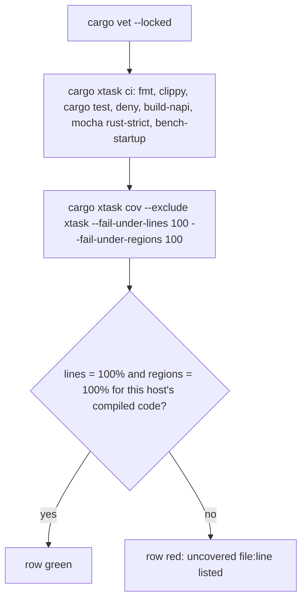

# [L13] Rust-first engine test suite; slim JS to front-door parity - Plan

Deepened lane plan for sub-issue #76 (base `9ae272c`, verified 2026-10-01 against `crates/`, `lib/`, `test/`, `package.json`, `xtask/src/ci.rs`, `xtask/src/main.rs`, `.github/workflows/node.js.yml`, `rust-toolchain.toml`, the `Cargo.toml` files and `docs/guides/*.md`). The spine plan is controlling and is never edited by this lane.

Product Contract preservation: R-L13-1..R-L13-10 and T-L13-1..T-L13-3 keep their IDs and meaning. R-L13-1 is narrowed to what Rust receives (KD2): `passphrase`, `strictSSL`, env proxies and `NO_PROXY` are resolved in JS before the spec crosses, so those cells stay JS front-door tests. R-L13-3 gains one clarifying clause (the napi cdylib builds no test binary and is absent from the report). T-L13-2's command is corrected (`cargo xtask cov` forwards arguments without `--`). The stop condition about CI installing `cargo-llvm-cov` is removed: CI already installs it.

---

## Goal Capsule

**Objective.** After this lane merges into `spike-next-rs`, a regression in the Rust engine's behaviour for any resource type fails `npm run ci:rs` on its own, on every CI OS, because Rust tests are the specification and the crate is held at 100% line and region coverage; the JS suite proves only what users see at `waitOn` and the CLI under both engines, so the JS engine can be sunset without losing the specification.

**Means.** Per-kind integration suites in `crates/wait-on-core/tests/` on a paused clock (KTD7, KTD8) with committed PEM fixtures and in-test TLS and proxy servers (KTD5, KTD6); the gate wired through `ci:rs` (KTD1); the napi crate thinned to declarations (KTD2); JS tests kept at the front doors with the counting spy as routing proof (KD3, KTD9).

**Direction (operator, 2026-10-01).** Rust is the primary implementation; the JavaScript engine and JS tooling are what get sunset. Avoidable JavaScript moves to Rust.

**Authority.** `AGENTS.md` > spine plan KD-S1..KD-S9 > this plan.

**Stop conditions** (report to the PM, do not work around):
- a `.github/workflows/` change is needed. None is known: the `rust` job already installs `cargo-deny,cargo-vet,cargo-llvm-cov` (`taiki-e/install-action`) and runs `rustup toolchain install`, which reads the components in `rust-toolchain.toml`;
- a public API / CLI / `WAIT_ON_SCHEMA` / `index.d.ts` change is needed;
- a new npm runtime dependency, or a new crate version in `Cargo.lock`, is needed (KTD5 and KTD6 avoid both);
- a needed edit lies outside the allowed paths (`xtask/` is **not** allowed: the gate is the `cargo xtask cov` passthrough chained in `package.json`; if that passthrough cannot express the gate, stop);
- the literal R-L13-3 proves unattainable because passing assertions themselves cost regions on this toolchain (KTD3 records the evidence that they do not; if the U1 base report contradicts it, stop and propose the test-body ignore regex to the PM instead of adding it).

**Execution profile.** `/ce-work` via `/lfg` from this plan; strict TDD per `AGENTS.md`; one PR, base `spike-next-rs` on `kevinold/wait-on`, body `Closes #76`; never merges. Allowed paths: `crates/`, `Cargo.toml`, `Cargo.lock`, `supply-chain/`, `deny.toml`, `test/`, `lib/`, `package.json`, `package-lock.json`, `.nycrc.json`, `rust-toolchain.toml`, `docs/guides/`, `docs/plans/`, `docs/solutions/`, `AGENTS.md`.

---

## Product Contract

### Summary

Add one integration file per resource kind under `crates/wait-on-core/tests/` (shared helpers in `tests/common/mod.rs`, TLS material as committed PEM fixtures), close every uncovered region the base report lists, move the napi crate's only branchy logic (the `kind` string mapping) into `wait-on-core` and delete the napi exports nothing in `lib/` calls, then wire `cargo xtask cov --exclude xtask --fail-under-lines 100 --fail-under-regions 100` into `npm run ci:rs` with `llvm-tools-preview` in `rust-toolchain.toml`. On the JS side delete `test/fixtures/fake-addon.js`, `test/engine-checks.mocha.js` and every mocha case that exercises Rust internals, keep `test/fixtures/counting-addon.js` as the spy that proves a wait ran in Rust, retire the pending list, and record the JS-vs-Rust test inventory in `docs/guides/testing.md`.

### Problem Frame

L7 left `wait-on-core` at 98.57% regions with misses in `lib.rs`, `http.rs` and `tcp.rs`, no https success test, no reverse test for socket, command or http-over-unix, and no CI enforcement. The JS suite still carries 50-odd cases that drive Rust through `fake-addon.js` or call per-check napi exports (`HttpChecker`, `fileSize`, `runCommand`) that `lib/` never uses. While that is so, a Rust regression can only be caught by a JS test, which is the engine being sunset.

### Starting state (verified 2026-10-01, base `9ae272c`)

- `crates/wait-on-core/src/`: `lib.rs` (file size, command), `tcp.rs`, `socket.rs`, `http.rs`, `parse.rs`, `waiter.rs` + `waiter/tests.rs` (21 paused-clock tests); one integration file `tests/loop.rs` (6 tests, its own `recorder`/`settle`/`breathe`/`server`/`listening_socket` helpers). Dev-dependency `tokio` already has `test-util`. `Cargo.lock` holds `tokio-rustls`, `hyper`, `rustls-platform-verifier` transitively; no `rcgen`, `tempfile`.
- `crates/wait-on-core/src/http.rs` `HttpOptions`: `url`, `method`, `headers`, `follow_redirect`, `timeout_ms`, `roots`, `cert`, `key`, `proxy` (explicit URI), `socket_path`; the client is built `.no_proxy()`, so the environment is never read.
- `crates/wait-on-napi/`: `Cargo.toml` sets `[lib] test = false, doctest = false`; `src/lib.rs` exports `version`, `noop`, `fileSize`, `runCommand`, `tcpCheck`, `socketCheck`, `parse*`; `src/wait.rs` holds `TryFrom<ResourceSpec>` with the `"unknown resource kind"` arm and `ms()`; `src/http.rs` holds `HttpCheckerOptions` + `From` and the `HttpChecker` napi class. Only `wait`, `version`, `noop` and `parse*` have a consumer in `lib/`, `bin/` or `benchmarks/`.
- `package.json`: `ci:rs` = `cargo vet --locked && cargo xtask ci`, pinned by `test/rust-scaffold.mocha.js`. `cargo xtask ci` runs vet, fmt, clippy, test, deny, build-napi, mocha under `rust-strict`, bench; no llvm-cov step. `cargo xtask cov [args]` = `cargo llvm-cov --workspace [args]` (`xtask/src/ci.rs` `cov_args` appends args directly; no `--`), run with `CARGO_TARGET_DIR=<target>/xtask-inner`.
- `.github/workflows/node.js.yml` `rust` job: ubuntu + windows on PRs, plus macOS on push; `rustup toolchain install`; `taiki-e/install-action` with `cargo-deny,cargo-vet,cargo-llvm-cov`; `npm run --if-present ci:rs`. `rust-toolchain.toml`: channel `1.98.1`, components `rustfmt`, `clippy`.
- `test/rust-pending.js` is `pending = []`; its hooks are spread into the root `mochaHooks` in `test/frozen-clock.js`; `test/rust-pending.mocha.js` and `test/fixtures/rust-pending/` still exist. References: `AGENTS.md` "Two engines", `docs/guides/testing.md` (suites row and `## Rust pending list`), `docs/guides/README.md`, `docs/guides/contributing-dual-engine.md`.
- Fake addons: `test/fixtures/fake-addon.js` (pure fake, `WAIT_ON_FAKE_ADDON_ANSWER`/`_LOG`) used by `test/engine.mocha.js` and `test/prebuild-probe.mocha.js`; `test/fixtures/counting-addon.js` records `wait` calls and delegates to the real prebuild when present, used by `test/engine.mocha.js`, `test/api.mocha.js`, `test/https-proxy.mocha.js`, `test/fixtures/extra-ca-api.js`. `test/helpers/engine-env.js` `ENGINE_VARS` lists the two fake vars.
- `.nycrc.json` (`all: true`, `lib/**/*.js`, thresholds branches 95 / lines 98) is run by `npm run test:coverage`, not by CI.

### Requirements

**Rust specification**

- R-L13-1 Integration suites under `crates/wait-on-core/tests/` for each resource type, each in forward and reverse mode, against real local files / listeners / servers on ephemeral ports: file (including `window` size stabilization), tcp (including IPv6 `[::1]`), unix socket (Windows named pipe on `windows`, each side under its own `cfg`), http/https HEAD and GET (status-code handling, headers including the JS-folded `authorization` header, redirects, and TLS as Rust receives it: `roots`, `cert` + `key`, `roots` absent; an explicit `proxy` URI including Basic auth from userinfo), http-over-unix-socket (named pipe on Windows), command. Cells resolved JS-side before the spec crosses (`passphrase` via `pkcs8Pem`, `strictSSL` into `roots`, `HTTP_PROXY`/`HTTPS_PROXY`/`NO_PROXY` via `envProxyFor`, the `routesHttpToRust` carve-outs) stay JS front-door tests in `test/https-proxy.mocha.js` under both engines (KD2).
- R-L13-2 Timing in those suites uses `tokio::time::pause` (virtual clock), not real sleeps, wherever the code under test runs on tokio time, and asserts virtual elapsed time where the behaviour is a time. Where a check is driven by real OS time (`run_command`'s thread timer, the Windows ~2 s loopback refusal) the test uses generous headroom and says why.
- R-L13-3 100% coverage gate: `cargo llvm-cov` over the workspace excluding only `xtask/` and `build.rs`, with `--fail-under-lines 100 --fail-under-regions 100`, run by `npm run ci:rs` on every CI OS. The napi cdylib builds no test binary (`test = false`), so its files are absent from the report rather than excluded (KTD2). Branch coverage is reported as unavailable on the pinned stable toolchain (`--branch` is nightly-only), not faked. Lines that cannot be exercised are removed or restructured, never excluded with attributes or regexes beyond the two named paths. Inline `#[cfg(test)]` modules inside `src/*.rs` count; `tests/` directories and files named `tests.rs` (so `crates/wait-on-core/tests/**` and `src/waiter/tests.rs`) are left out by cargo-llvm-cov's built-in default, not by a lane regex.
- R-L13-4 `rust-toolchain.toml` adds `llvm-tools-preview` to `components`.

**JS slimming**

- R-L13-5 Delete `test/fixtures/fake-addon.js` and the JS cases that use it or that exercise Rust internals (`test/engine-checks.mocha.js`, the real-addon `HttpChecker`/`fileSize`/`runCommand`/`wait` blocks and the fake-addon blocks in `test/engine.mocha.js`), each deletion only after a named Rust test or an existing front-door test covers the same behaviour (inventory in R-L13-8 and U2/U6). Engine *selection* behaviour reachable from the front door (`WAIT_ON_ENGINE` values, missing-addon and `wait`-less-addon errors) stays as JS tests, rewritten against the real prebuild where they relied on the fake. `test/fixtures/counting-addon.js` stays as the spy proving a wait ran in Rust (KD3).
- R-L13-6 Every API / CLI / conformance / property test passes under `WAIT_ON_ENGINE=rust-strict` and under the default JS engine; JS engine behaviour unchanged.
- R-L13-7 The Rust pending list is retired: `test/rust-pending.js`, `test/rust-pending.mocha.js`, `test/fixtures/rust-pending/` and the hook spread in `test/frozen-clock.js` are deleted, and doc references updated (shared files; small, additive edits; `docs/plans/*` untouched).

**Docs and gates**

- R-L13-8 `docs/guides/testing.md` records a JS-vs-Rust test inventory (what is Rust-specified, with file and test names; what stays JS parity, with file and why) and the rule for new work: engine behaviour → Rust test first; JS only at the API/CLI front doors. `AGENTS.md` carries the one-line rule.
- R-L13-9 The parser differential (#245 vectors in `test/parser-properties.mocha.js`) agrees on every input between engines.
- R-L13-10 `npm test` and `npm run ci:rs` pass locally; the `npm run` script names CI calls are unchanged.

### Test scenarios (named)

- T-L13-1 each R-L13-1 cell is a named Rust test (`<kind>_<forward|reverse>_<behaviour>`), listed per file in U4 and U5.
- T-L13-2 `cargo xtask cov --exclude xtask --fail-under-lines 100 --fail-under-regions 100` fails on the base (98.57% regions in `wait-on-core`) — RED for the gate — and passes at the end; `npm run ci:rs` runs it; removing one `src/` unit test whose arm no other test reaches makes it fail again (red-proof).
- T-L13-3 `npm run test:mocha` under `WAIT_ON_ENGINE=rust-strict` is green with no pending list.

### Key Decisions

- KD1 **Rust is the primary implementation; engine behaviour is specified by Rust tests, JS tests stay at the front doors** (session-settled: user-directed — chosen over keeping JS fake-addon tests of Rust internals: the JS engine is being sunset). Governs R-L13-1, R-L13-5, R-L13-8.
- KD2 **R-L13-1 covers what Rust receives; JS-resolved TLS and proxy cells stay JS front-door tests.** Not user-settled (orchestrator resolution from the `HttpOptions` shape and `lib/engine-rust.js`): Rust never sees a passphrase, `strictSSL` or the environment. Governs R-L13-1.
- KD3 **`counting-addon.js` stays; `fake-addon.js` goes.** Not user-settled (orchestrator resolution): the counting fixture is a spy over the real prebuild and is the only proof that a wait ran in Rust (`rust-strict` alone does not prove it, since `rust.routable` can still route the whole wait to JS, `lib/wait-on.js`). The issue's deletion condition ("once a Rust test covers the same behaviour") is not met for routing proof. Flagged in the PR body. Governs R-L13-5.
- KD4 **The gate is wired in `package.json` through the `cargo xtask cov` passthrough; no workflow and no `xtask/` edit** (PM-given lane constraint). Governs R-L13-3, R-L13-10.

### Scope Boundaries

- In: `crates/wait-on-core/tests/{common/mod.rs,file.rs,tcp.rs,socket.rs,command.rs,http.rs,https.rs,proxy.rs,unix_http.rs,fixtures/*.pem}`, restructures in `crates/wait-on-core/src/{lib,tcp,http,waiter}.rs` and their tests, `crates/wait-on-napi/src/{lib,wait,http}.rs` thinning, `rust-toolchain.toml`, `package.json` `ci:rs`, `test/rust-scaffold.mocha.js`, deletions and rewrites in `test/` (U6, U7), `docs/guides/*.md`, `AGENTS.md`.
- Out: `.github/workflows/`, `xtask/`, `lib/` behaviour (only test-facing comments if any), `index.d.ts`, `WAIT_ON_SCHEMA`, `benchmarks/http-ffi.js`, `docs/plans/*` historical pending-list references.
- Non-goals considered and not built:
  - measuring the cdylib under Node (`cargo llvm-cov show-env` + `build:napi` + mocha + `report`): needs an xtask change or a Windows-hostile script chain, for glue that is declarations after KTD2. Evidence that would change the call: a napi-only defect escaping the mocha run under `ci:rs`.
  - an `rcgen` dev-dependency or an `openssl` shell-out for TLS material: vet/deny cost, or a skip path that breaks 100% (KTD5).
  - a `tokio-rustls` direct dev-dependency: `rustls` is already direct and its blocking `ServerConnection` fits the std-thread server pattern (KTD5).
  - a Rust-only fingerprint or `_internal.routable` assertion replacing the counting spy: the spy already proves the path with no new code (KD3).
  - `--ignore-filename-regex` for test bodies: R-L13-3 forbids it; host-dependent test arms are restructured instead (KTD3).
  - `--branch` coverage: nightly-only; reported as unavailable (R-L13-3).
  - a `cov` `Step` inside `cargo xtask ci`: `xtask/` is outside the lane; the `&&` chain in `ci:rs` carries the gate.
  - porting the parser differential to Rust: JS is the oracle (R-L13-9 is a JS test).

### Deferred to Follow-Up Work

- Fold the coverage gate into `cargo xtask ci` (an xtask lane) so `ci:rs` returns to `cargo vet --locked && cargo xtask ci`.
- Move JS spec-building (`lib/engine-rust.js` `buildSpec`, header stringify, timer clamps, `rustTlsOptions`) into Rust; the `http routing (counting addon)` and `Rust shim` JS tests retire with it.
- Re-examine `test/engine.mocha.js` "five slow commands" (libuv pool starvation) now that `run_command` runs under tokio `spawn_blocking`.
- Operator: add macOS to the PR matrix of the `rust` job so the per-host gate is seen before merge.

---

## Planning Contract

### Key Technical Decisions

- KTD1. **Gate command and placement.** `ci:rs` becomes `cargo vet --locked && cargo xtask ci && cargo xtask cov --exclude xtask --fail-under-lines 100 --fail-under-regions 100`. No `--`: `xtask/src/ci.rs` `cov_args` appends arguments straight after `llvm-cov --workspace`, so a literal `--` would reach the test binaries. `--exclude xtask` drops the `xtask` member from test and report (`--workspace` includes it; `Cargo.toml` members); `build.rs` is not instrumented by default and needs no flag. `cov` runs after `ci` so the existing step order (vet first, bench last) is untouched and the `rust-scaffold` assertion changes once. The instrumented build lands in `target/xtask-inner` (a second full compile per CI row; accepted, observed on the PR). `--branch` is not passed. Answering tests: T-L13-2 and the `test/rust-scaffold.mocha.js` cases in U1.
- KTD2. **napi thinning: the `kind` mapping moves into core; dead exports are deleted; napi stays unmeasured.** `wait-on-core` gains a constructor on `waiter::Resource` (e.g. `Resource::from_parts(name, kind, path, host, port, command, http) -> Result<Resource, String>`) holding the five-arm `match` and the `unknown resource kind: <k>` error, with cargo tests for each arm; `crates/wait-on-napi/src/wait.rs` `TryFrom<ResourceSpec>` becomes a one-line call mapping the `String` error to `napi::Error`. `ms()`, the field copies and the `HttpCheckerOptions → HttpOptions` `From` (field-by-field, `HashMap` into `Vec`) stay in napi as declarations, per L7 KTD11. Deleted from napi: `FileSize`/`fileSize`, `CommandResult`/`runCommand`, `CheckResult`, `tcpCheck`, `socketCheck`, `HttpCheckResult`, the `HttpChecker` class; `src/http.rs` keeps only `HttpCheckerOptions`, its `From`, and the `ValidateStatus` type. Production surface after: `wait`, `version`, `noop`, `parsePrefix`, `parseHostPort`, `parseInterval`, `parseHttpUnix`. The cdylib (`test = false`) is exercised by every mocha suite under `rust-strict` in `ci:rs` but not measured by the gate; recorded as a PR-body residual for the PM. Answering tests: `from_parts` unit tests (U2); the mocha run under `rust-strict`.
- KTD3. **Inline test code counts; no ignore regex.** cargo-llvm-cov 0.9.1 drops `tests/` dirs and `tests.rs` files from the report by default (its built-in ignore regex), so integration files and `src/waiter/tests.rs` are unmeasured; only inline `#[cfg(test)]` modules in `src/*.rs` count. The base evidence (98.57% regions with those inline modules counted, misses at named source arms) shows passing `assert!`/`assert_eq!` cost no region on 1.98.1; only unreached arms do. Rules: a host-dependent `match` in a test (`tcp.rs` `TimedOut` vs `Io` vs `panic!`) becomes `assert!(matches!(..))` or one `cfg`-gated test per host; a `panic!("expected …")` arm in a test is removed; an unreachable arm in `src/` is restructured or replaced by `expect` carrying the invariant (L7 KTD11). Helpers in `tests/common/mod.rs` are not measured and need no arm-free rewrite. If U1's base report contradicts the evidence, the last stop condition applies.
- KTD4. **100% is per host.** The gate runs on each CI OS over what that OS compiles; `cfg`-gated code is invisible elsewhere. Platform code stays minimal and shared (`socket.rs`, the two `http.rs` transport arms, `lib.rs` `shell`), each side with its own `cfg`-gated test. Unix-only tests whose production lines also compile on Windows (`run_command` 1 MiB cap, grandchild holding stdout) get a Windows command vector so the Windows row covers those lines. macOS runs only on push; the darwin dev host's local `npm run ci:rs` is the pre-merge macOS proof. Answering checks: the ubuntu and windows `rust` rows on the PR; the macOS row on the push after merge.
- KTD5. **TLS material: committed PEM fixtures; in-test TLS server on `rustls` directly.** `crates/wait-on-core/tests/fixtures/`: `ca.pem`, `server.pem` + `server-key.pem` (SAN `DNS:localhost, IP:127.0.0.1, IP:::1`, `basicConstraints=critical,CA:FALSE`), `client.pem` + `client-key.pem` (signed by `ca.pem`), `other-ca.pem`; keys as PKCS#8 (what `pkcs8Pem` sends); validity ~100 years; generated once with `openssl` on the dev host (command recorded in `docs/guides/testing.md`, not run by the suite). The test server is `rustls::ServerConfig` + `ServerConnection`/`StreamOwned` over the existing std-thread scripted-server pattern (`rustls` is a direct dependency with `std`; no new crate, no `aws-lc-rs` risk); mTLS uses `WebPkiClientVerifier` built from `ca.pem`. Fixtures are parsed, never byte-compared, so a CRLF checkout on Windows is harmless and no `.gitattributes` edit (a disallowed path) is needed. Rejected: `rcgen` (vet/deny cost; `regenerate exemptions` forbidden), `openssl` shell-out (skip path breaks 100%), `tokio-rustls` dev-dep (no gain over `rustls`). Answering tests: the `https_*` cases in U5 on all three rows.
- KTD6. **Proxy test server: an in-test proxy on std threads.** `tests/common/mod.rs` gains a minimal proxy that forwards absolute-form requests, tunnels `CONNECT`, and counts request lines and `proxy-authorization` values (the Rust twin of `test/helpers/stub-proxy.js`). No crate. Answering tests: `proxy_*` in U5 (the CONNECT count is the path proof).
- KTD7. **Suite layout.** `tests/common/mod.rs` receives `recorder`, `text`, `has`, `spec`, `temp`, `settle`, `breathe`, `server`, `listening_socket` moved out of `tests/loop.rs` (integration files cannot reach `src/waiter/tests.rs`), plus `tls_server`, `proxy`, `closed_port`, PEM loaders. One file per kind: `file.rs`, `tcp.rs`, `socket.rs`, `command.rs`, `http.rs`, `https.rs`, `proxy.rs`, `unix_http.rs`; `loop.rs` keeps its six loop tests. Test names follow `<kind>_<forward|reverse>_<behaviour>` (T-L13-1). Behaviour already pinned by a unit test in `src/` is not repeated; the integration test adds the through-`wait` cell (forward/reverse, verbose line, virtual time).
- KTD8. **Clock rules in Rust tests** (R-L13-2; `docs/solutions/best-practices/porting-js-timer-semantics-to-a-tokio-loop.md`): `#[tokio::test(start_paused = true)]`, `settle` before `advance`, assert virtual elapsed (`Instant` deltas), lines that can repeat asserted with "contains". Real-time with headroom only for `run_command` (std `Instant`/`thread::sleep`) and the Windows loopback refusal (~2 s; `tcp_timeout` 0 and `settle`'s 5 s real deadline). Zero-timeout tests target `localhost`. Temp paths via `std::env::temp_dir()` + pid, as `loop.rs` does.
- KTD9. **JS side after slimming.** `test/engine.mocha.js` survives, slimmed to: engine selection (js / rust / rust-strict, real prebuild where a fake was used), the `http routing (counting addon)` and `routesHttpToRust` blocks (JS spec-building), the `Rust shim` spec-shape and timer-clamp cases re-pointed at `counting-addon.js`, the front-door real-addon loop block (gaining the port-above-65535 case from `engine-checks`), process lifetime, `NODE_EXTRA_CA_CERTS`, module graph, prebuild resolution. Deleted: the real-addon `HttpChecker`, `fileSize`, `runCommand` and `wait` blocks, the fake-addon timeout-answer and `WAIT_ON_FAKE_ADDON_LOG` CLI cases, `test/engine-checks.mocha.js`, `test/fixtures/fake-addon.js`, the two fake vars in `ENGINE_VARS`. `test/prebuild-probe.mocha.js` runs against the real prebuild (skips without one; the timeout case times out for real with `--no-listener`). The counting spy's canned path (no prebuild) keeps `lib/engine-rust.js` under nyc, so `npm run test:coverage` thresholds hold without a Rust toolchain. Rationale: no new files, no test moved for its own sake.
- KTD10. **Pending-list retirement mechanics.** Delete `test/rust-pending.js`, `test/rust-pending.mocha.js`, `test/fixtures/rust-pending/`; remove the spread and its comment from `test/frozen-clock.js` (keep `afterEach`); update `AGENTS.md` "Two engines", `docs/guides/testing.md` (suites row, `## Rust pending list`), `docs/guides/README.md` (model paragraph, Pages row), `docs/guides/contributing-dual-engine.md` (step 4, checklist). `.mocharc.json` and `package.json` need no change. `docs/plans/*` stay.
- KTD11. **Inventory shape (R-L13-8).** `docs/guides/testing.md` gains `## JS vs Rust inventory`: table A (Rust-specified: behaviour, file, test name) per kind and for the loop; table B (JS parity: file, why it stays JS: front door, engine selection, JS-resolved option, routing proof, parser oracle); then the rule for new work. `## Rust coverage` is rewritten around the gate command, per-host semantics, no ignore regex, branch unavailable, and the fixtures regeneration command. `AGENTS.md` "Tests" convention gains one sentence pointing at the inventory.

### High-Level Technical Design

Test ownership after the lane:

```mermaid
flowchart TB
  subgraph JS["JS tests (mocha, both engines)"]
    FD[api / cli / cli-conformance / parser-properties / https-proxy / validation / coverage]
    ENG[engine.mocha.js: WAIT_ON_ENGINE selection, JS spec-building, routing proof via counting-addon.js]
  end
  subgraph LIB["lib/"]
    W[wait-on.js front door] --> EJ[engine-js.js]
    W --> ER[engine-rust.js: buildSpec, routable]
  end
  subgraph NAPI["crates/wait-on-napi (test = false, unmeasured; exercised under rust-strict)"]
    N[wait, version, noop, parse*]
  end
  subgraph CORE["crates/wait-on-core (cargo tests; gate 100% lines + regions per host)"]
    U[src #cfg(test) units: lib, tcp, socket, http, parse, waiter/tests.rs]
    I[tests/: loop, file, tcp, socket, command, http, https, proxy, unix_http + common/mod.rs + fixtures/*.pem]
  end
  FD --> W
  ENG --> W
  ER --> N
  N --> CORE
```

`npm run ci:rs` on each CI OS:



### Assumptions

- `cargo-llvm-cov` from `taiki-e/install-action` and `llvm-tools-preview` for 1.98.1 are available on ubuntu, macos and windows runners; `cargo llvm-cov --workspace --exclude xtask` removes `xtask` from both test and report.
- Passing assertions cost no region (KTD3 evidence); the U1 base report confirms it before any restructure starts.
- rustls 0.23 with `ring`, `std`, `tls12` provides `ServerConfig`, `StreamOwned` and `WebPkiClientVerifier` without feature changes; reqwest's `rustls-platform-verifier` path is not involved when `roots` is set.
- CI runners bind `[::1]:0`; the IPv6 cell does not need a skip path.
- Deleting napi exports changes no `index.d.ts` (the addon's TypeScript surface is not published).
- The `counting-addon.js` canned path without a prebuild still drives every `lib/engine-rust.js` branch the deleted fake tests covered; `npm run test:coverage` is the check.

### Risks

| Risk | Answered by |
|---|---|
| Passing assertions do cost regions on this toolchain | U1 base report (stop condition if contradicted) |
| A `src/` region is unreachable from any test (defensive arm, resolver edge in `tcp.rs`) | U3 restructures per KTD3; the gate run after U3 lists nothing |
| Windows row: delete-pending stat success, ~2 s refusal, named-pipe http server | KTD8 headroom; `cfg(windows)` tests in U4/U5 on the windows `rust` row (`docs/solutions/best-practices/trimmed-pr-matrix-lets-platform-bugs-escape-to-the-base.md`) |
| macOS row seen only on push | dev host run of `npm run ci:rs` recorded in the PR body; push run after merge |
| Instrumented rebuild doubles `rust` job time | observed on the PR; `--exclude xtask` keeps xtask's node-spawning tests out of it |
| `closed_port()` races another process | bind-then-drop immediately before use, as today; re-run on a collision |
| tokio auto-advance jumps past real I/O | `settle` before `advance` (loop.rs pattern); fallback per L7 Assumptions: that case runs real-time with headroom |
| PEM fixtures rejected by webpki (missing SAN, CA:TRUE leaf) | `https_forward_verified_roots_ready` is the first U5 RED; fixture properties fixed in KTD5 (`docs/solutions/best-practices/porting-undici-tls-options-to-reqwest-rustls.md`) |
| nyc thresholds drop after fake-addon deletion | U6 scenario `npm run test:coverage` without a prebuild |
| Sibling lanes edit `AGENTS.md`, `docs/guides/*`, `package.json`, `test/frozen-clock.js`, `test/helpers/engine-env.js` | small additive edits; merge base only on conflict with `chore(merge): merge spike-next-rs into rs-76-rust-first-tests` |
| Fixed mocha ports 3000/3001/3011/3998 collide with parallel worktrees | not a lane defect; re-run (`docs/solutions/best-practices/parallel-spine-lanes-collide-on-ports-and-merge-commits.md`) |

### Open Questions (deferred to implementation)

- OQ1 Can `tcp.rs` `last_err` ("no addresses resolved") and the `JoinError` map be reached by a test, or must they be restructured? Answered by the U3 gate run: either `tcp_forward_resolve_error_is_io` reaches them or they are gone.
- OQ2 Does `command:` reverse settle under the paused clock with `spawn_blocking` outstanding? Answered by `command_reverse_ready_when_command_fails` (U4); fallback: real time with headroom, recorded in the test.
- OQ3 Does the http-over-named-pipe reverse cell reach the `windows_named_pipe` arm at 100% on the windows row? Answered by `unix_http_forward_ready_over_named_pipe` and `unix_http_reverse_ready_when_pipe_missing` (U5) on the windows `rust` row.
- OQ4 Do the committed PEM fixtures verify on a CRLF Windows checkout? Answered by `https_forward_verified_roots_ready` on the windows row; fallback: the fixture loader strips `\r` (test-only code).

---

## Implementation Units

### U1. Gate RED, toolchain component and `ci:rs` wiring

**Goal.** `npm run ci:rs` ends with the coverage gate, the toolchain pins `llvm-tools-preview`, and the base report's shortfall is recorded as the work list.

**Requirements.** R-L13-3, R-L13-4, R-L13-10; T-L13-2; KD4, KTD1.

**Dependencies.** None.

**Files.** `rust-toolchain.toml`, `package.json`, `test/rust-scaffold.mocha.js`, `docs/plans/2026-10-01-spike-rs-l13-rust-first-tests-plan.md` (Resume notes: the uncovered list).

**Approach.**
1. RED in `test/rust-scaffold.mocha.js`: components include `llvm-tools-preview`; `ci:rs` equals the KTD1 string. Both fail on base.
2. Run the gate command on the base and record every uncovered `file:line` region (source and test files) in Resume notes; this list drives U3 and the helper rewrites in U4.
3. GREEN: edit the two files. `ci:rs` is now red locally until U5 completes; that is the lane's RED state.

**Execution note.** Observe the gate failing on the base before touching anything; if the report shows regions at passing `assert!` sites, stop (Goal Capsule).

**Patterns to follow.** `test/rust-scaffold.mocha.js` file-shape assertions; `docs/guides/development.md` "Vetting a new or bumped crate" is not needed (no crate change).

**Test scenarios.**
- `test/rust-scaffold.mocha.js`: `rust-toolchain.toml` `components` contains `llvm-tools-preview`.
- `test/rust-scaffold.mocha.js`: `package.json` `ci:rs` equals `cargo vet --locked && cargo xtask ci && cargo xtask cov --exclude xtask --fail-under-lines 100 --fail-under-regions 100`.
- Gate on base: the command exits non-zero and prints regions below 100 for `wait-on-core`; the uncovered list is recorded.

**Verification.** `npm test` green; the gate command fails on base for the reported reason; `cargo xtask cov --exclude xtask --summary-only` lists no `xtask/` or `wait-on-napi` file.

### U2. Core takes the `kind` mapping; dead napi exports and their JS tests go

**Goal.** `wait-on-napi` holds declarations only; the resource-kind mapping is a tested core function; exports nothing in `lib/` calls are gone with the JS tests that called them.

**Requirements.** R-L13-5, R-L13-6; KTD2.

**Dependencies.** U1.

**Files.** `crates/wait-on-core/src/waiter.rs`, `crates/wait-on-core/src/waiter/tests.rs`, `crates/wait-on-core/src/http.rs` (tests), `crates/wait-on-napi/src/lib.rs`, `crates/wait-on-napi/src/wait.rs`, `crates/wait-on-napi/src/http.rs`, `test/engine.mocha.js`, `test/coverage.mocha.js` (header comment).

**Approach.**
1. RED: unit tests for `Resource::from_parts` in `waiter/tests.rs` (five kinds, unknown kind, tcp defaults).
2. GREEN: the constructor in `waiter.rs`; `wait.rs` `TryFrom<ResourceSpec>` calls it.
3. Delete the napi exports listed in KTD2 and the JS blocks that used them, each with its covering test named in the commit: `real addon HttpChecker` (10 cases → `http.rs` units: `head_200_…`, `validate_callback_…`, `cancel_settles_…`, `timeout_when_server_never_writes`, `proxy_receives_absolute_form_…`, `unparsable_roots_fail_only_tls_hops`, `socket_path_…`/`…named_pipe`; new `http_reuses_one_connection_across_checks`; the roots-absent half lands in U5 `https_forward_no_roots_accepts_any_cert`), `fileSize` and `runCommand` cases (→ `lib.rs` `file_size_*`/`run_command_*`), `real addon wait` block (→ `loop.rs` and `waiter/tests.rs`, plus `test/api.mocha.js` log lines, timeout message, validateStatus rows under `rust-strict`; unknown kind → `from_parts` test).
4. `npm run build:napi` and the mocha run under `rust-strict` prove the thinned addon.

**Execution note.** The first RED is `from_parts("bogus", …)` returning `Err("unknown resource kind: bogus")`; it fails to compile until the function exists.

**Patterns to follow.** `crates/wait-on-napi/src/wait.rs` field-by-field style; `docs/guides/architecture.md` "Thin napi".

**Test scenarios.**
- `from_parts` with `kind = "file"` and a path → `Kind::File(path)`.
- `from_parts` with `kind = "http"` and `Some(HttpOptions)` → `Kind::Http`; with `None` → `Kind::Http(HttpOptions::default())`.
- `from_parts` with `kind = "tcp"`, host `127.0.0.1`, port 80 → `Kind::Tcp { path, host, port }`; absent host and port → empty host, port 0.
- `from_parts` with `kind = "socket"` → `Kind::Socket(path)`; with `kind = "command"` → `Kind::Command(command)`.
- `from_parts` with `kind = "bogus"` → `Err` equal to `unknown resource kind: bogus`.
- `http.rs` unit `http_reuses_one_connection_across_checks`: two sequential `check` calls, the scripted server saw one connection.
- `test/engine.mocha.js` under `rust-strict`: the real addon exports exactly `wait`, `version`, `noop`, `parsePrefix`, `parseHostPort`, `parseInterval`, `parseHttpUnix` (one assertion in the existing "load the real addon" case).

**Verification.** `cargo test --workspace` green; `npm run build:napi`; `WAIT_ON_ENGINE=rust-strict npm run test:mocha` green; `npm test` green; `wait.rs` diff shows only the one-line call replacing the `match`.

### U3. Close the base report's uncovered regions in `src/`

**Goal.** Every region the U1 list names in `lib.rs`, `tcp.rs`, `http.rs` (and any in `socket.rs`, `parse.rs`, `waiter.rs`) is covered by a test or restructured away, on the host and on Windows.

**Requirements.** R-L13-3; KTD3, KTD4.

**Dependencies.** U1 (the list), U2.

**Files.** `crates/wait-on-core/src/lib.rs`, `crates/wait-on-core/src/tcp.rs`, `crates/wait-on-core/src/http.rs`, `crates/wait-on-core/src/socket.rs` (only if listed), `crates/wait-on-core/src/waiter.rs` + `waiter/tests.rs` (only if listed).

**Approach.**
1. For each listed region decide: reachable → write the test; unreachable → restructure (`expect` with the invariant, or remove the arm). Known candidates from the research: `http.rs` `Method::from_bytes` error (reachable), `status_text` `None` for status 299 (reachable), the `.or_else` else-branch when `!has_tls` (unreachable: fold the fallback under `has_tls`); `lib.rs` `capture` `None` pipe early return (unreachable: take the piped handle with `expect`); `tcp.rs` `"no addresses resolved"` and the `JoinError` map (OQ1); test arms `tcp.rs` host-dependent `match` and `panic!("expected Io…")` (restructure per KTD3).
2. Make the `run_command` 1 MiB cap and grandchild-holds-stdout tests cross-platform with a Windows command vector (KTD4), so the Windows row covers `room == 0` and the return-at-bound path.
3. Re-run the gate after each GREEN; the unit ends when the host report shows 100% for `src/`.

**Execution note.** Work from the recorded list, not from guesses; each restructure is its own commit with the region named.

**Patterns to follow.** L7 KTD11 (`expect` over defensive arms); `lib.rs` tests' per-OS command constants (`WIN`); `tcp.rs` `#[cfg(unix)]` test shape.

**Test scenarios.**
- `http.rs`: `HttpChecker::new` with `method = "BAD METHOD"` → `Err` containing the method parse error.
- `http.rs`: scripted server answering `HTTP/1.1 299 Whatever` → outcome `ok: true`, `status: Some(299)`, `status_text: None`.
- `http.rs`: after the restructure, bad roots still fail only the TLS hop (existing `unparsable_roots_fail_only_tls_hops` stays green).
- `lib.rs`: `run_command` output above 1 MiB is capped, on unix (`head -c`) and on Windows (a `cmd` loop or `fsutil`-free generator), both tests cfg-gated.
- `lib.rs`: grandchild holding stdout returns at the bound on both OS.
- `tcp.rs`: black-hole address with `timeout_ms` 200 → not ready; the assertion accepts `TimedOut` or `Io` with `assert!(matches!(..))`, no `panic!` arm.
- `tcp.rs`: resolve error for `nonexistent.invalid` → `Io`; the `"no addresses resolved"` text is either asserted by a reachable test or no longer exists (OQ1).

**Verification.** `cargo xtask cov --exclude xtask --summary-only` shows 100% lines and regions for every `src/` file on the dev host; `cargo clippy --workspace --all-targets -- -D warnings` clean; windows row checked on the PR.

### U4. Per-kind Rust suites: file, tcp, socket, command, and the shared helpers

**Goal.** Forward and reverse cells for the four non-http kinds run through `waiter::wait` on a paused clock, with helpers shared from `tests/common/mod.rs`.

**Requirements.** R-L13-1, R-L13-2; T-L13-1; KTD7, KTD8, KTD3.

**Dependencies.** U3.

**Files.** `crates/wait-on-core/tests/common/mod.rs` (new), `crates/wait-on-core/tests/loop.rs` (helpers removed, imports `common`), `crates/wait-on-core/tests/file.rs`, `crates/wait-on-core/tests/tcp.rs`, `crates/wait-on-core/tests/socket.rs`, `crates/wait-on-core/tests/command.rs` (all new).

**Approach.**
1. Move `loop.rs` helpers into `common/mod.rs` unchanged in behaviour, and adding `closed_port`, `elapsed` (virtual `Instant` since start) and `listening_socket` for both OS.
2. One `#[tokio::test(start_paused = true)]` per cell below; `settle` before `advance`; assert the outcome, the verbose line, and the virtual elapsed time where the behaviour is a time.
3. `command.rs` cells use per-OS commands (`sh` / `cmd`), real time for the command, headroom stated in the test.

**Execution note.** First RED is `tcp_forward_times_out_while_connect_pending` (the Rust replacement for `test/engine-checks.mocha.js` "overall timeout while a connect is pending"): a black-hole target, `tcp_timeout` 30 s, `timeout` 500 → `Err` at exactly 500 ms virtual.

**Patterns to follow.** `crates/wait-on-core/tests/loop.rs`; `crates/wait-on-core/src/waiter/tests.rs` (`closed_port`, growing file); `socket.rs` cfg pairs.

**Test scenarios.**
- `file_forward_ready_when_present`: existing temp file, `window` 0 → `Ok` at the first tick, line `waiting for 1 resources: <name>` only.
- `file_forward_window_waits_for_stable_size`: file grows at 0, 100, 200 ms virtual, `window` 300 → `Ok` at 500 ms virtual; lines include `file stabilized at size:3`.
- `file_forward_times_out_when_missing`: `timeout` 500 → `Err("Timed out waiting for: <name>")` at 500 ms virtual.
- `file_reverse_ready_once_removed`: file removed at 150 ms virtual → `Ok` after the next tick.
- `file_reverse_times_out_while_present`: `timeout` 500 → `Err` at 500 ms virtual.
- `tcp_forward_ready_when_listening`: `127.0.0.1:0` listener → `Ok`; verbose line `TCP connection successful to host:127.0.0.1 port:<p>`.
- `tcp_forward_ipv6_literal_ready`: listener on `[::1]:0`, resource `tcp:[::1]:<p>` → `Ok`.
- `tcp_forward_times_out_while_connect_pending`: as the execution note; `Err` at 500 ms virtual, not at 30 s.
- `tcp_reverse_ready_when_nothing_listens`: `closed_port`, `tcp_timeout` 0 → `Ok` (real-time refusal; Windows ~2 s inside `settle`'s 5 s).
- `tcp_reverse_times_out_while_listening`: `timeout` 500 → `Err` at 500 ms virtual.
- `socket_forward_ready_when_listening` (unix socket; named pipe under `cfg(windows)`) → `Ok`; line `connected to socket:<p>`.
- `socket_forward_times_out_when_missing`: missing path, `timeout` 500 → `Err`; verbose line starts `error connecting to socket socket:<p>`.
- `socket_reverse_ready_when_missing` → `Ok` at the first tick.
- `socket_reverse_times_out_while_listening` → `Err` at 500 ms virtual.
- `command_forward_ready_on_exit_zero`: `true` / `exit 0` → `Ok`; line `Command "<c>" success. stdout: ""`.
- `command_forward_times_out_on_nonzero_exit`: `exit 3` with `timeout` 500 → `Err`; line contains `Command error:`.
- `command_reverse_ready_when_command_fails` → `Ok` (OQ2).
- `command_reverse_times_out_while_command_succeeds` → `Err` at the timeout.
- `tests/loop.rs` six tests unchanged and green through `common`.

**Verification.** `cargo test -p wait-on-core` green; the gate report shows 100% for the `src/` files these suites exercise (integration files are not in the report, KTD3); windows row on the PR.

### U5. http, https, proxy and http-over-unix suites with PEM fixtures

**Goal.** Every http-family cell Rust receives (status handling, headers, redirects, `roots`/`cert`/`key`/absent roots, explicit proxy, socket path) is specified through `waiter::wait` against real TLS and proxy servers.

**Requirements.** R-L13-1, R-L13-2; T-L13-1; KD2, KTD5, KTD6, KTD7, KTD8.

**Dependencies.** U4.

**Files.** `crates/wait-on-core/tests/fixtures/{ca.pem,server.pem,server-key.pem,client.pem,client-key.pem,other-ca.pem}` (new), `crates/wait-on-core/tests/common/mod.rs` (`tls_server`, `proxy`, fixture loaders), `crates/wait-on-core/tests/http.rs`, `crates/wait-on-core/tests/https.rs`, `crates/wait-on-core/tests/proxy.rs`, `crates/wait-on-core/tests/unix_http.rs` (all new).

**Approach.**
1. Generate the fixtures once with `openssl` per KTD5 and commit them; record the command in `docs/guides/testing.md` (U8).
2. `tls_server(reply, require_client_cert)` on `rustls::ServerConfig` over the std-thread server; `proxy()` per KTD6; both report what they saw over a channel like `Seen`.
3. One test per cell; the `https_*` cells assert the TLS error text in the verbose line when not ready; proxy cells assert the proxy's counts (path proof).

**Execution note.** First RED is `https_forward_verified_roots_ready`; it fails until the fixtures and the TLS server exist and validates the fixture properties (SAN, `CA:FALSE`).

**Patterns to follow.** `crates/wait-on-core/src/http.rs` tests (`serve`, `reply`, `stall`, proxy absolute-form and userinfo cases, `socket_path_*` per OS); `test/helpers/stub-proxy.js` for what the proxy records; `test/https-proxy.mocha.js` for the JS twin cells.

**Test scenarios.**
- `http_forward_head_ready_on_200` → `Ok`; verbose `HTTP(S) result for <u>: { status: 200, statusText: 'OK', ok: true }`.
- `http_forward_get_ready_on_204` → `Ok`; `http_forward_get_times_out_on_404` → `Err` at the timeout.
- `http_forward_headers_reach_server_verbatim`: `x-custom` and `authorization: Basic …` seen by the server exactly as given.
- `http_forward_follows_redirect_when_enabled`: 302 → 200 with `follow_redirect` true → `Ok`; `http_forward_redirect_not_followed_times_out` with false → `Err`.
- `http_reverse_ready_on_500` → `Ok`; `http_reverse_times_out_on_200` → `Err` at the timeout.
- `https_forward_verified_roots_ready`: `roots = [ca.pem]` → `Ok`.
- `https_forward_wrong_roots_times_out`: `roots = [other-ca.pem]` → `Err`; verbose error line names the certificate failure.
- `https_forward_no_roots_accepts_any_cert`: `roots = None` → `Ok` (the roots-absent half of the deleted JS `HttpChecker` case).
- `https_forward_mtls_identity_ready`: server requires a client cert; `cert`/`key` = client pair → `Ok`.
- `https_forward_missing_identity_times_out`: server requires a client cert; no identity → `Err`.
- `https_forward_garbage_roots_fail_tls_hop_only`: `roots = ["not pem"]`; the https cell times out while an http cell with the same options is `Ok` (the `tls_certs_only([])` fallback, both halves).
- `https_forward_http_redirect_to_https_follows`: http server 302 → the TLS server's URL, `roots = [ca.pem]` → `Ok`.
- `https_reverse_ready_when_roots_wrong` → `Ok`.
- `proxy_forward_https_target_tunnels_connect`: `proxy = http://127.0.0.1:<p>`, https target, `roots = [ca.pem]` → `Ok`; the proxy counted exactly one `CONNECT`.
- `proxy_forward_userinfo_becomes_basic_auth`: `proxy = http://u:p@127.0.0.1:<p>` → the proxy saw `proxy-authorization: Basic dTpw`.
- `proxy_reverse_ready_when_proxy_down`: `closed_port` proxy → `Ok`.
- `unix_http_forward_ready_over_socket` (`cfg(unix)`) / `unix_http_forward_ready_over_named_pipe` (`cfg(windows)`): `socket_path` set and `proxy` set → `Ok`, the proxy saw zero requests, the request line shows `socketPath:<p>`.
- `unix_http_forward_times_out_when_socket_missing` → `Err`.
- `unix_http_reverse_ready_when_socket_missing` → `Ok` (OQ3 on Windows).

**Verification.** `cargo test -p wait-on-core` green on the host; the gate passes locally (T-L13-2 GREEN); windows row green on the PR with the `cfg(windows)` cells counted.

### U6. Slim the JS side: fake addon gone, internals tests gone, front doors kept

**Goal.** The JS suite holds only front-door, engine-selection and JS spec-building tests; the fake addon and `test/engine-checks.mocha.js` are deleted; the counting spy stays as routing proof.

**Requirements.** R-L13-5, R-L13-6; KD3, KTD9.

**Dependencies.** U2 (dead-export blocks already gone), U4 (`tcp_forward_times_out_while_connect_pending`).

**Files.** `test/fixtures/fake-addon.js` (deleted), `test/engine-checks.mocha.js` (deleted), `test/engine.mocha.js`, `test/prebuild-probe.mocha.js`, `test/helpers/engine-env.js`, `test/fixtures/counting-addon.js` (header comment), `test/fixtures/extra-ca-api.js` (unchanged unless the count proof shape changes).

**Approach.**
1. RED per rewrite: the "load a present addon under rust" and "addon-present branch" cases assert the real prebuild (`version()` equals the workspace version) and skip without one; the `Rust shim` spec-shape and timer-clamp cases load `counting-addon.js` and read `calls[0].spec`.
2. Delete: the fake-addon timeout-answer case (front door `real addon loop at the front door` missing-file timeout), the `WAIT_ON_FAKE_ADDON_LOG` CLI case (CLI timeout under `rust-strict` is `test/cli.mocha.js` and the conformance suites in `ci:rs`), the CLI "loadable fixture addon" case (duplicate of the real-addon CLI case).
3. `test/engine-checks.mocha.js`: the verbose tcp reason case is a duplicate of the front-door block (`(os error`); the port-above-65535 case moves into that block; the pending-connect case is now Rust (U4). Delete the file.
4. `test/prebuild-probe.mocha.js`: point `WAIT_ON_NATIVE_LIBRARY_PATH` at `addonPath({})`, skip without a prebuild; the timeout case uses `--no-listener --timeout 300` for a real timeout.
5. Drop `WAIT_ON_FAKE_ADDON_ANSWER` and `WAIT_ON_FAKE_ADDON_LOG` from `ENGINE_VARS`; delete `fake-addon.js`; the prebuild-resolution case that used its path as a string uses any path.

**Execution note.** Prove each surviving routing test still asserts the count (one `wait` call, or zero for a carve-out) under the real prebuild and under the canned path.

**Patterns to follow.** `test/api.mocha.js` `counted`/`outcome` wrappers; `test/engine.mocha.js` temp `no-wait.js` module for inline addon stand-ins.

**Test scenarios.**
- `rust engine` "should load a present addon under rust": real prebuild, `version()` equals the version in `Cargo.toml` `[workspace.package]`; skips without a prebuild.
- `rust-strict engine` "addon-present branch caches the addon": same addon object on two `resolveEngine` calls under the real prebuild.
- `Rust shim (counting addon)` "one wait call with a spec for file, tcp, socket, http and command": `calls.length === 1`, spec deep-equals the expected shape.
- `Rust shim (counting addon)` "overflowing timers map like Node": `delay`, `interval`, `timeout`, `commandTimeout` 3e9 → 1; `tcpTimeout` 3e9 → 2^31-1; `simultaneous` 5e9 → 2^32-1.
- Front-door block: `tcp:localhost:99999` under `rust-strict` → callback receives an `Error` whose message includes `port` (moved from `engine-checks`).
- `test/prebuild-probe.mocha.js`: ready case against the real prebuild prints `addonPath` equal to `addonPath({})`; timeout case exits non-zero with `Timed out waiting for`; missing-addon case unchanged.
- `npm run test:coverage` without a prebuild meets `.nycrc.json` thresholds (counting canned path drives `lib/engine-rust.js`).
- `test/helpers/engine-env.js`: `ENGINE_VARS` is exactly `WAIT_ON_ENGINE`, `WAIT_ON_NATIVE_LIBRARY_PATH`.

**Verification.** `npm test` green with and without a prebuild; `WAIT_ON_ENGINE=rust-strict npm run test:mocha` green; no file under `test/` references `fake-addon` or `WAIT_ON_FAKE_ADDON`.

### U7. Retire the Rust pending list

**Goal.** No pending-list machinery remains in `test/`, and every in-scope reference is updated.

**Requirements.** R-L13-7; T-L13-3; KTD10.

**Dependencies.** U6.

**Files.** `test/rust-pending.js`, `test/rust-pending.mocha.js`, `test/fixtures/rust-pending/` (deleted), `test/frozen-clock.js`, `test/frozen-clock.mocha.js` (RED case), `AGENTS.md`, `docs/guides/testing.md`, `docs/guides/README.md`, `docs/guides/contributing-dual-engine.md`.

**Approach.**
1. RED: a case in `test/frozen-clock.mocha.js` asserting the root `mochaHooks` exported by `test/frozen-clock.js` has exactly the key `afterEach`; it fails while the spread exists.
2. Delete the three test artefacts and the spread plus its comment.
3. Doc lines per KTD10; `AGENTS.md` "Two engines" sentence becomes "both must pass the same mocha suites under each engine (no pending list)".

**Execution note.** Keep the doc edits to the named lines; `docs/plans/*` are not touched.

**Patterns to follow.** `test/frozen-clock.mocha.js` existing shape.

**Test scenarios.**
- `test/frozen-clock.mocha.js`: `Object.keys(mochaHooks)` deep-equals `['afterEach']`.
- `WAIT_ON_ENGINE=rust-strict npm run test:mocha` green with no pending list (T-L13-3).
- A search of `test/`, `AGENTS.md` and `docs/guides/` for `rust-pending` returns nothing.

**Verification.** `npm test` green; T-L13-3 observed.

### U8. Inventory, guides, `AGENTS.md`, and the final gate

**Goal.** `docs/guides/testing.md` carries the JS-vs-Rust inventory and the gate description, every guide states what is true on merge, and `npm test` plus `npm run ci:rs` are green locally with the gate red-proven.

**Requirements.** R-L13-8, R-L13-9, R-L13-10; T-L13-2, T-L13-3; KTD11.

**Dependencies.** U1-U7.

**Files.** `docs/guides/testing.md`, `docs/guides/development.md`, `docs/guides/ci.md`, `docs/guides/architecture.md`, `docs/guides/README.md`, `AGENTS.md`, `docs/solutions/` (via `/ce-compound`), `docs/plans/2026-10-01-spike-rs-l13-rust-first-tests-plan.md` (Resume notes).

**Approach.**
1. `testing.md`: suites table rows (`engine.mocha.js` slimmed description, `engine-checks` row removed, one row per `crates/wait-on-core/tests/*.rs`), fixtures paragraph (no fake addon; counting as the spy), "Proving the Rust path ran" (counting or `(os error` text), new `## JS vs Rust inventory` (KTD11), `## Rust coverage` rewritten (gate command, per host, inline test modules counted and `tests/` + `tests.rs` excluded by tool default, branch unavailable, fixture regeneration command), `## Rust pending list` removed.
2. `development.md`: prerequisites (cargo-llvm-cov and `llvm-tools-preview` required for `ci:rs`), `ci:rs` row, the local coverage row now `cargo xtask cov --exclude xtask --fail-under-lines 100 --fail-under-regions 100`.
3. `ci.md`: `rust` job row lists `cargo-llvm-cov`; the `ci:rs` hook row adds the gate as the last step.
4. `architecture.md`: "Thin napi" (cdylib unmeasured, exercised under `rust-strict`); "Resource checks in Rust" exports paragraph (per-check exports removed; `tcpCheck`/`socketCheck`/`fileSize`/`runCommand`/`HttpChecker` lines rewritten).
5. `README.md` model paragraph and Pages row; `AGENTS.md` Tests convention: one sentence with the rule and the inventory pointer.
6. Final: `npm test`, `npm run ci:rs` on the dev host; red-proof (remove one inline `src/` unit test whose arm no other test reaches, observe the gate fail, restore); `/ce-compound mode:non-interactive` for the PEM-fixture and per-host-gate learnings; Resume notes entry; PR body residuals.

**Execution note.** Docs-only edits need no RED; the final gate run and the red-proof are the unit's evidence.

**Patterns to follow.** `docs/guides/contributing-dual-engine.md` docs-as-done checklist; L12 plan U6 docs sweep.

**Test scenarios.**
- `test/parser-properties.mocha.js` parser differential green under `js` and `rust-strict` (R-L13-9).
- A search of `docs/guides/` and `AGENTS.md` for `fake-addon`, `engine-checks`, `HttpChecker`, `fileSize`, `runCommand`, `tcpCheck`, `socketCheck`, `rust-pending` returns nothing.
- `docs/guides/testing.md` inventory names every T-L13-1 test of U4 and U5.
- Gate red-proof: with one inline `src/` unit test whose arm no other test reaches removed, `cargo xtask cov --exclude xtask --fail-under-lines 100 --fail-under-regions 100` exits non-zero; restored, it passes.

**Verification.** `npm test` and `npm run ci:rs` green locally; PR CI `build` (3 Node versions × 2 OS) and `rust` (ubuntu, windows) green; the macOS row observed on the push after merge.

---

## Verification Contract

| Check | Command / observation | Proves |
|---|---|---|
| JS suite, lint, types | `npm test` (with and without a host prebuild) | R-L13-6, R-L13-10 |
| Full Rust gate | `npm run ci:rs` on the dev host; ubuntu and windows `rust` rows on the PR | R-L13-3, R-L13-6, R-L13-10, T-L13-2 |
| Gate RED and red-proof | the gate command observed failing on base (U1) and with one test removed (U8) | T-L13-2 |
| Rust-strict mocha with no pending list | `WAIT_ON_ENGINE=rust-strict npm run test:mocha` | R-L13-7, T-L13-3 |
| Cargo suites | `cargo test --workspace`; `cargo clippy --workspace --all-targets -- -D warnings`; `cargo deny check`; `cargo vet --locked` (no lock change expected) | R-L13-1, R-L13-2 |
| Parser differential | `test/parser-properties.mocha.js` under both engines | R-L13-9 |
| nyc thresholds | `npm run test:coverage` without a prebuild | KTD9 |
| Docs | the search scenarios in U7 and U8; inventory names every T-L13-1 test | R-L13-8 |
| Toolchain | `test/rust-scaffold.mocha.js` | R-L13-4 |

---

## Definition of Done

- R-L13-1..R-L13-10 met; T-L13-1 tests present and named in the inventory; T-L13-2 RED, GREEN and red-proof observations and T-L13-3 recorded in the PR body.
- Gate at 100% lines and regions for `wait-on-core` on the dev host and on the ubuntu and windows `rust` rows; no `--ignore-filename-regex`, no coverage attributes; `--exclude xtask` is the only exclusion.
- Every `from_parts` arm, every forward/reverse cell per kind, every TLS and proxy cell Rust receives has a named Rust test; every engine-selection branch keeps a JS test.
- Deleted: `test/fixtures/fake-addon.js`, `test/engine-checks.mocha.js`, `test/rust-pending.js`, `test/rust-pending.mocha.js`, `test/fixtures/rust-pending/`, the napi exports in KTD2 and their JS blocks; no `.only`, `.skip` or disabled test; no abandoned-attempt code; no `prebuilds/`, `target/` or temp artefacts in the diff; `Cargo.lock` unchanged.
- Guides and `AGENTS.md` updated in the same PR; `/ce-compound` run; Resume notes appended.
- PR opened against `spike-next-rs` with `Closes #76`, and these residuals stated for the PM: napi glue is exercised by mocha under `rust-strict` but not measured by the gate; `counting-addon.js` is kept as the routing spy (issue wording asked for its deletion); the macOS gate is first seen on the push after merge; the coverage gate chained in `ci:rs` is a candidate to fold into `cargo xtask ci` in an xtask lane.

---

## Resume notes

- 2026-10-01: plan authored from #76 body; issue had no comments. Pending list already empty at base.
- 2026-10-01 U1 base gate (darwin, 1.98.1, cargo-llvm-cov 0.9.1): `cargo xtask cov --exclude xtask --fail-under-lines 100 --fail-under-regions 100` exits 1. TOTAL regions 98.61% (34/2448 missed), functions 99.09% (2/219), lines 99.05% (14/1472). Per file regions: http.rs 98.22% (17), lib.rs 97.49% (9), socket.rs 98.11% (1), tcp.rs 96.48% (7), parse.rs and waiter.rs 100%. Report lists only `wait-on-core/src/*.rs`: no `xtask/`, no `wait-on-napi`, no `tests/` or `tests.rs` file. Inline `#[cfg(test)]` modules in `src/*.rs` do count. Uncovered (`^0` or zero-count line in `llvm-cov report --text`):
  - src: `http.rs:67` `Method::from_bytes` `map_err` closure and `?` (bad method never tested); `http.rs:105` `Err(e)` when the build fails without TLS; `http.rs:108` `error_chain` `map_err` closure and `?`; `http.rs:199` `Identity::from_pem` `?` error path; `lib.rs:25` `NotReady::TimedOut` Display arm; `lib.rs:86` `run_command` reader `else { return }` (pipe is `None`).
  - test, host-dependent arms: `tcp.rs:57-58` `times_out_within_bound` `Io` and `Ok` arms (this host gives `TimedOut`); `tcp.rs:82` `refused_when_nothing_listens` `other => panic!`; `tcp.rs:96` `ipv6_literal` no-IPv6 `return`; `lib.rs:218` `file_size_is_minus_one_when_stat_is_denied` `if denied` false edge.
  - test, at passing assertions (contradicts KTD3): `lib.rs:314`, `lib.rs:335`, `http.rs:451`, `http.rs:469`: a passing `assert!(cond, "{:?}", start.elapsed())` leaves its message argument `start.elapsed()` at count 0. `socket.rs:38` and `tcp.rs:106`: a passing `assert!(matches!(result, Err(NotReady::Io(_))), "{result:?}")` in an async test leaves the `matches!` region (17-25) at count 0. The same `matches!` form in sync `parse.rs:283` costs nothing. Inline captures such as `"{out:?}"` cost nothing. Plain `assert!` and `assert_eq!` with no expression argument cost nothing.
  - U1 stopped before GREEN on this stop condition. The scaffold RED is in place: `test/rust-scaffold.mocha.js` asserts `llvm-tools-preview` and the KTD1 `ci:rs`. `rust-toolchain.toml` and `package.json` are not edited yet.
- 2026-10-01 U1 resolved (orchestrator): the KTD3 contradiction does not make R-L13-3 unattainable, so the stop condition does not fire and no ignore regex is proposed. Amended rule for inline test bodies (restructure, R-L13-3): no expression arguments in assertion messages (bind first: `let e = start.elapsed(); assert!(e < X, "{e:?}")`), and no `matches!` inside async-test asserts (use `is_err()`/`let Err(..) = .. else` free of dead arms, or `assert_eq!` on a value taken from the result). U1 GREEN then applied: `llvm-tools-preview` in `rust-toolchain.toml`, KTD1 `ci:rs` in `package.json`; `npm test` 490 passing, 34 pending. Gate stays RED until U3.
- Worktree note: a fresh worktree has no `node_modules`; run `npm ci` first or mocha resolves the parent checkout's tree and fails with `Cannot find module 'undici'`. Commands mixing `cd` and cargo are refused by the worktree-isolation guard; run cargo from the worktree root (instrumented artefacts: `CARGO_TARGET_DIR=target/xtask-inner cargo llvm-cov report --show-missing-lines`).
- 2026-10-01 U3: gate GREEN on darwin (2578/2578 regions, 1535/1535 lines, 231/231 functions; 3 consecutive runs). Non-obvious: llvm-cov's per-file region summary scores a generic function by its best single instantiation, not the union, so `--show-missing-lines` can show no `^0` while the summary still reports misses; find them in `cargo llvm-cov report --json`, fix by making one instantiation (`NoValidate`) cover every arm. That, not a `tokio::select!` race, was the `http.rs:146`/`:108` flip. `http.rs` client build fallback is now `expect` (only TLS material can fail a build). The KTD5 PEM set was generated in U3 (needed by the client-identity test); its CA key was discarded, so regenerating means replacing all six files (command goes in `docs/guides/testing.md`, U8). Windows command vectors (`GRANDCHILD_ECHO`, `OUT_2MB`) and `tcp.rs` `ipv6_literal` (now `.unwrap()`) are first proven on the windows/ubuntu `rust` rows.
- 2026-10-01 U4: 18 per-kind integration tests (file/tcp/socket/command, forward + reverse) on a paused clock, each file red-proven by a temporary `src/waiter.rs` break. OQ2 answered: tokio 1.53 does not auto-advance while a `spawn_blocking` task is outstanding, so `command:` cells settle at exact virtual times (no real-time fallback). `file:` with `window` 0 is ready on the second tick (251 ms): the first read only seeds the size scan. Windows `listening_socket` now holds 8 pipe instances (each client open consumes one); first proven on the windows `rust` row. Red-proof breaks in a test without `timeout` hang forever: break a line or elapsed-time assertion instead.
- 2026-10-01 U5: 22 http-family integration tests (http 8, https 8, proxy 3, unix_http 3 + 1 windows-only), red-proven by one temporary `src/` break per file; no `src/`, `Cargo.toml` or `Cargo.lock` change. Real server I/O races paused-clock auto-advance, so the http suites run the first tick and settle on the expected verbose line before advancing (`first_check` in `tests/common/mod.rs`). The https server is addressed by IP SAN `127.0.0.1` to avoid an IPv6-first attempt. OQ3 (named-pipe http) and OQ4 (CRLF PEM on Windows; rustls-pki-types 1.15.1 accepts `\r\n`) are answered only by the windows `rust` row; the darwin host has no Windows target and ring's C build blocks a cross `cargo check`.
- 2026-10-01 U6: `fake-addon.js` and `engine-checks.mocha.js` deleted; `counting-addon.js` kept as the routing spy (KD3). `npm test` and `WAIT_ON_ENGINE=rust-strict npm run test:mocha` 502 passing; nyc thresholds hold with and without a prebuild. Gotcha the fake hid: `interval: 3e9` raises `window` to 3e9 (`lib/wait-on.js`), so a `file:` wait with no timeout never settles on either engine; shim tests delegating to the real prebuild must set a timeout or small interval.
- 2026-10-01 U7/U8: pending list retired (496 passing on js and rust-strict, no `rust-pending` reference outside `docs/plans/`); inventory, coverage rules and the portable PEM regeneration script in `docs/guides/testing.md`. Final local gate: `npm run ci:rs` exit 0 on darwin (mocha rust-strict 496 passing; TOTAL 2578/2578 regions, 1535/1535 lines). Red-proof: removing `not_ready_timed_out_reads_timed_out` kept 100% (integration tests also reach that arm, since `tests/` is excluded from the report but still contributes coverage of `src/`); removing `invalid_method_fails_construction` made the gate exit 1 at 99.88% regions; restored.
