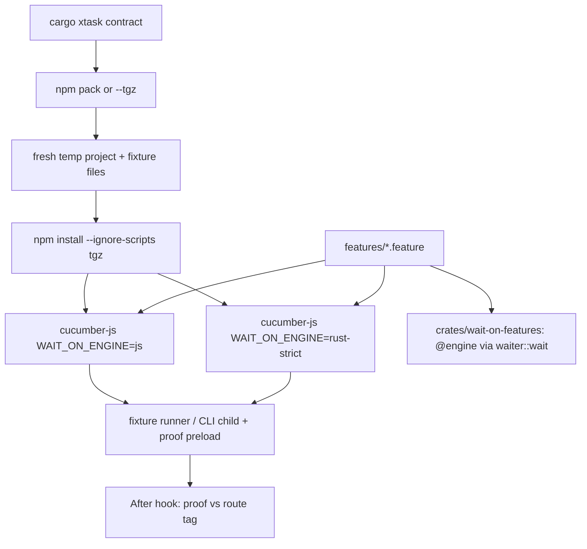
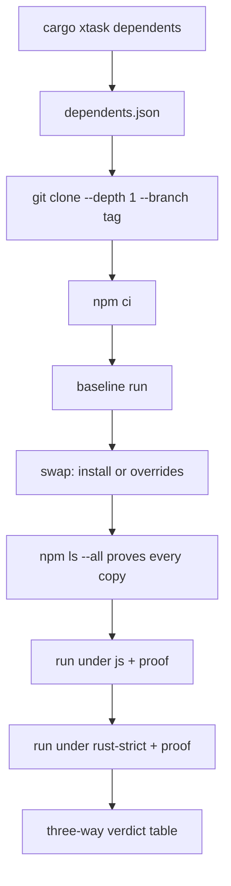

# Library consumer contract, dependents harness and size-tuned release - Plan

Plan for new lanes L15-L19 under spine #35 (base `7db576f`, verified 2026-10-02 against `lib/wait-on.js`, `lib/engine.js`, `lib/engine-js.js`, `lib/engine-rust.js`, `lib/resources.js`, `index.d.ts`, `bin/wait-on`, `xtask/src/*.rs`, `xtask/tests/cli.rs`, `test/helpers/*`, `test/fixtures/counting-addon.js`, `test/engine.mocha.js`, `crates/*/Cargo.toml`, `crates/wait-on-core/tests/common/mod.rs`, `Cargo.toml`, `Cargo.lock`, `deny.toml`, `supply-chain/config.toml`, `package.json`, `.gitattributes`, `eslint.config.mjs`, `docs/guides/{ci,testing,releasing}.md`, `AGENTS.md`). The spine plan is controlling; this plan supersedes none of its KDs (KD1/R6 single-package delivery stands).

---

## Goal Capsule

**Objective.** A Node project that uses `wait-on` as a library today (CommonJS `require`, ESM default import, or TypeScript against `index.d.ts`, callback or Promise form, any documented option or resource type, or the CLI) keeps working without any change when the installed package runs the Rust engine, and that compatibility is proven by an executable contract that outlives the JS engine and by the published dependents' own test suites, while the one-package tarball shrinks to a budgeted size.

**Means.** Gherkin feature files run by cucumber-js against the packed and installed tarball in CJS/ESM/TS fixture projects under both engines with per-scenario engine proof (KTD1, KTD2, KTD3); cucumber-rs runs the `@engine` scenarios against `wait-on-core` (KTD6); `cargo xtask dependents` clones pinned dependents and runs their suites three ways (KTD8); a size-tuned `[profile.release]` with a packed-size budget and an unwind guard (KTD10, KTD11).

**Authority.** `AGENTS.md` > spine plan KD-S1..KD-S15 > this plan > the lane PR.

**Stop conditions** (report to the PM, do not work around): a `.github/workflows/` edit is needed; a public API, CLI, `WAIT_ON_SCHEMA` or `index.d.ts` change is needed; a new npm **runtime** dependency is needed; an engine behavior change is needed to make a scenario pass (file the defect instead, see R6).

**Execution profile.** Five lanes (table in Planning Contract), each `/ce-work` via `/lfg` from this plan, one PR per lane into `spike-next-rs` on `kevinold/wait-on`, body `Closes #<lane issue>`; never merges. Allowed paths: `features/`, `cucumber.js`, `test/`, `xtask/`, `crates/`, `Cargo.toml`, `Cargo.lock`, `deny.toml`, `supply-chain/`, `package.json`, `package-lock.json`, `eslint.config.mjs`, `.gitattributes`, `.gitignore`, `.npmignore`, `docs/guides/`, `docs/plans/`, `docs/solutions/`, `AGENTS.md`.

---

## Product Contract

### Summary

Add `features/*.feature` at the repo root as the executable library-consumer contract, with cucumber-js step definitions that drive three in-repo consumer fixture projects (CommonJS, ESM, TypeScript) installed from the packed tarball, run under `WAIT_ON_ENGINE=js` and `rust-strict` by a new `cargo xtask contract` subcommand that `ci:rs` and `ci:rs:package` call. A `NODE_OPTIONS=--require` proof preload records, per child process, which native addon was `dlopen`ed and whether `lib/engine-js.js` loaded, and every scenario declares the route it expects. A cucumber-rs test crate runs the `@engine` scenarios from the same files against `waiter::wait`. `cargo xtask dependents` clones `start-server-and-test@v3.0.12` (and optionally `jest-dev-server@v11.0.0`) at pinned tags into a temp dir, swaps in the local tarball, proves the swap with `npm ls`, and runs their suites as baseline, js and rust-strict. The workspace gains a size-tuned `[profile.release]` (lto, codegen-units=1, strip, opt-level z, unwinding kept), `cargo xtask package` enforces a packed-size budget, and an xtask test pins `panic` to unwind.

### Problem Frame

wait-on has 12.8M weekly downloads and is consumed as a library by published packages (`start-server-and-test` 2.4M/week pins `9.1.0`; `jest-dev-server` 340k/week checks the exact timeout text). The Rust port keeps the JS API by construction, but nothing today exercises the *installed* package from a consumer's project under both engines, nothing proves that a green rust-strict run was executed by Rust (routing is per wait, `lib/wait-on.js:165-166`), and the contract lives in mocha files that will be sunset with the JS engine. The tarball is 15.0 MB packed with eight untuned addons, and no `[profile.release]` exists.

### Requirements

**Contract definition**

- R1. The consumer contract is the set of `features/*.feature` files; each scenario states concrete expected values (outcome, error name and message with `<port>`/`<tmp>`/`<pid>` placeholders, stdout log lines, CLI exit code and first stderr line, elapsed bounds), never "same as the other engine".
- R2. A scenario passes identically under both engines when: the scenario set is the same, every status is passed with zero skipped, pending or undefined steps (`--strict`), and each assertion in R1 holds; `verbose` lines are asserted only as non-empty, and stderr beyond the first line is not compared.
- R3. Scenarios pair `@kind:good` (works) with `@kind:bad` (how the API must fail) in relay style, and every scenario sets an explicit `timeout`.
- R4. Layer tags select the runner: `@engine` (wait-on-core behavior, both runners), `@api` (JS-owned: parsing, defaults, validation, `validateStatus`, engine env; Node only), `@consumer` (module shape and types; Node only, per fixture), `@cli` (Node only); route tags `@route:js` and `@route:none` override the default expectation that the engine under test ran the wait.
- R5. `@engine` scenarios use a closed, runner-neutral vocabulary ("a TCP server on a free port", "a missing file", durations like `500ms`) and state every timing option; they contain no resource strings, defaults, module words or ports.
- R6. A scenario that fails on one engine because of an engine defect is not skipped, tagged away or made lenient; the lane files the defect as an issue and stops (Goal Capsule stop condition).

**Node runner and fixtures**

- R7. `features/fixtures/{cjs,esm,ts}/` are consumer projects: `cjs` uses `require('wait-on')`, `esm` uses `import waitOn from 'wait-on'` with `"type":"module"`, `ts` type-checks `consumer.ts` with the repo's `node_modules/typescript` (`module node16`, `strict`, `types: ["node"]`, `esModuleInterop`) and runs the emitted JS; each exposes one runner that takes JSON options and a `--callback` flag and prints one JSON result line after any log output.
- R8. Behavior scenarios (`@engine`, `@api`, `@cli`) run on the `cjs` fixture only; `@consumer` scenarios run on every fixture; the carve-out is recorded in KTD2.
- R9. Each run installs the tarball into a fresh temp project with `npm install --ignore-scripts` (no `WAIT_ON_NATIVE_LIBRARY_PATH`, no proxy env; the ts cell also installs `@types/node` at the version locked in the repo's `package-lock.json`, since `index.d.ts` references Node types), runs cucumber-js once per engine, and fails if the addon realpath is outside `<project>/node_modules/wait-on/prebuilds/<host>/`.
- R10. Scenarios run on the real clock with the `TOLERANCE_MS` bounds from `test/helpers/cli-conformance.js` (the AGENTS.md subprocess exception); servers use `listen(0)`, sockets use temp paths or `\\.\pipe\wait-on-<pid>-<n>`, `command:` uses `node -e`, and reverse-file steps retry on Windows delete-pending.

**Engine and route proof**

- R11. A CJS preload loaded through `NODE_OPTIONS=--require` records, for every Node process it is inherited by, `{pid, dlopened: [<.node paths>], engineJs: <bool>}` to the file named by `WAIT_ON_PROOF_FILE` at exit; `engineJs` is true when `require.cache` holds `lib/engine-js.js`.
- R12. After every Node scenario the proof is checked against the expected route: under `rust-strict` the installed addon was dlopened and `engineJs` is false; under `js` nothing was dlopened and `engineJs` is true; `@route:js` expects `engineJs` true under both; `@route:none` expects no engine loaded (validation errors).
- R13. The dependents harness reuses the same preload and asserts, per rust-strict run, that at least one process dlopened the tarball's addon and none loaded `lib/engine-js.js`.

**Inventory coverage**

- R14. The feature files cover the full contract inventory in the Appendix: module shape (CJS, ESM default, ESM named import as `@kind:bad`, TS overloads and `import type { WaitOnOptions }`, deprecated `AxiosProxyConfig`/`HttpSignature`, `WaitOnOptions extends SecureContextOptions`), callback semantics (`cb(undefined)` once, returns `undefined`), string and `string[]` shorthand, every joi default and unknown-key rejection, the four resource-syntax error texts, timeout text listing remaining resources (including `timeout: 0` and `timeout: 3e9`), every resource prefix, reverse, every option, TLS with `strictSSL: true`, proxy object/`false`/env/`NO_PROXY`, engine env (`WAIT_ON_ENGINE=bogus`, rust-strict with the addon missing, `rust` fallback, validation error beating an engine error), log line formats, and every CLI flag and exit path.
- R15. Errors are never thrown synchronously from `waitOn`: `@kind:bad` scenarios pin that a malformed env proxy (`HTTP_PROXY=proxy.corp:3128` with `NO_PROXY=localhost`, https target) and an unparsable proxy object reach the callback or rejection on both engines (the fix exists at `lib/engine-js.js:183-194`; `test/engine.mocha.js:432` proves it; the memory note calling it a defect is stale).
- R16. `cargo xtask package` `check_manifest` rejects an `exports` field, so deep requires (`wait-on/lib/engine`, used by `xtask/assets/prebuild-probe.js`) and the ESM named-import failure cannot change silently; deep paths and `_internal` are not promised API.

**Rust runner**

- R17. A `publish = false` workspace member `crates/wait-on-features` runs the `@engine` scenarios from `features/` with cucumber-rs 0.23 (`harness = false`, `fail_on_skipped`), builds `WaitSpec` the way `crates/wait-on-core/tests/common/mod.rs` `spec` does, and fails when zero scenarios match.
- R18. The new crates pass `cargo deny check` (`BlueOak-1.0.0` added to the allow list for `synthez*`) and `cargo vet --locked` with hand-noted exemptions, stay out of the napi cdylib's dependency closure, and do not lower the 100% llvm-cov gate.

**Dependents harness**

- R19. `cargo xtask dependents [--only <name>] [--include-optional] [--tgz <path>] [--keep]` reads `xtask/assets/dependents.json` (name, repo, tag, subdir, swap mode, install and run commands, allowed OSes, optional flag), clones each entry `--depth 1 --branch <tag>` with `core.longpaths=true` into a temp dir, installs with `npm ci --ignore-scripts` unless the entry allows scripts, and never runs an entry's `npm test` when its `pretest` mutates sources.
- R20. Each entry runs serially three ways: baseline (published wait-on as pinned), tarball under `js`, tarball under `rust-strict`; before the tarball runs, `npm ls wait-on --all --json` must show every copy at the tarball's version and `require.resolve('wait-on/package.json')` from the entry dir must realpath into that install.
- R21. The verdict is per command: a failure under js or rust-strict that passes on baseline is a regression (exit 1); a failure that also fails on baseline is reported as pre-existing (exit 0); a rust-strict run whose proof (R13) shows no Rust wait is a failure; env `HTTP_PROXY`/`HTTPS_PROXY`/`NO_PROXY` (both cases) and `WAIT_ON_NATIVE_LIBRARY_PATH` are scrubbed; temp cleanup never fails the run.
- R22. Entries: `start-server-and-test` v3.0.12 (anchor, all OSes, mocha `test/helper src/*-spec.js` plus the `demo*` scripts CI runs, swap by `npm install --no-save <tgz>`), `jest-dev-server` in `argos-ci/jest-puppeteer` v11.0.0 (optional, linux only, scripts allowed for Chromium, root `overrides` swap, `npm run build` first).

**Release size**

- R23. The workspace `[profile.release]` is `lto = "fat"`, `codegen-units = 1`, `strip = "symbols"`, `opt-level = "z"`, with `panic` left at its default (unwind), so a Rust panic rejects the promise instead of killing the consumer's process.
- R24. `cargo xtask package` fails, naming the offending target, when any addon exceeds 3,145,728 unpacked bytes, or (full packs only) when the tarball exceeds 10,485,760 packed bytes; the numbers live in one place in `xtask/src/package.rs` and `docs/guides/ci.md` refreshes its size table from the first full pack.

**Gating and docs**

- R25. `ci:rs` runs the Node contract (host-only pack, both engines) after mocha; `ci:rs:package` runs it again on the full eight-target tarball; `cargo test --workspace` (already in `ci:rs`) runs the Rust features binary; the dependents harness has no CI hook in this plan.
- R26. `docs/guides/testing.md` (Suites table, JS vs Rust inventory, clock note), `docs/guides/ci.md` (hook contract, `ci:rs:package` steps, size table, budget), `docs/guides/development.md` (`contract`, `dependents`) and `AGENTS.md` (feature files as the contract) are updated in the lane that changes them.

### Key Decisions

- **One `wait-on` package carrying all eight addons, tuned, not per-platform optionalDependencies.** (session-settled: user-directed — chosen over per-platform `@wait-on/*` optionalDependencies and over `panic = "abort"`: everything ships through one package and one attestation; npm cannot fetch a host-only binary from one package without scripts (RFC #519 closed); abort would crash a consumer's process on a panic.) Governs R23, R24.
- **Feature files are the contract; the JS engine is not the oracle.** (session-settled: user-approved — chosen over JS-vs-Rust output diffing: AGENTS.md bans mirror tests and a shared bug would pass a diff.) Governs R1, R2.
- **The contract runs against the packed, installed tarball through consumer fixtures, under both engines.** (session-settled: user-approved — chosen over in-repo `require('../lib/wait-on')`: the `files` allow-list and the prebuild layout are part of what consumers get.) Governs R7, R9.
- **Dependents run from clones at pinned tags with the local tarball swapped in, on demand.** (session-settled: user-approved — chosen over vendoring their tests: their suites change with their tags and the swap must be proven each run.) Governs R19-R22.
- **JS fallback policy unchanged from the spine** (KD-S1): no permanent fallback is introduced; the Node engine is still what gets sunset. Governs R12 (the `rust` fallback scenario pins today's behavior, not a promise).

### Scope Boundaries

**In scope:** everything under Requirements; new devDependency `@cucumber/cucumber` 13.2.1 (user-directed exception to KD-S10 for the Node runner only); new Rust dev-dependencies `cucumber` 0.23 and its tree in a test-only crate.

**Deferred to Follow-Up Work**

- CI wiring of the dependents harness as a non-blocking `continue-on-error` job via the push-triggered `workflow_call` (operator PR; lanes never edit workflows, KD-S7; a `workflow_dispatch` on `spike-next-rs` never fires).
- Restoring the full PR matrix so the full-tarball contract run gates PRs (operator PR, already on the cutover list in `docs/guides/releasing.md`).
- Routing Rust http through undici to halve the addon again (engine architecture change, out of scope).
- Dropping low-traffic targets (win32-arm64, linux-arm64-musl) if the budget is still too high after tuning.
- `README.md` "proxy as defined in axios" wording (docs-only, stale since #238).

**Considered and not built (non-goals)**

- A behavioral unwind test through a test-only panic export on the addon: it would ship an export in the public addon; the config pin in R23's unit is the only RED available without that surface. Revisit if a panic path reachable from JS appears.
- Cross-runner scenario-id parity (cucumber-js `--dry-run` ids equal the Rust `output-json` ids): both runners filter on the same `@engine` tag, both fail on undefined or skipped steps, and the Rust binary fails on zero scenarios; a parser divergence would surface as a step mismatch. Build it if one runner ever runs a scenario the other does not.
- A fail-loud mode for `test/fixtures/counting-addon.js` when the host prebuild is missing: `ci:rs` builds the prebuild before mocha, and the real-addon tests already skip via `hasAddon()`; the trap only bites a local rust-strict run with no build, which `docs/guides/testing.md` now names.
- Running the contract on the `--omit=optional` and pnpm install cells: the package has no optionalDependencies and the existing probe already covers both cells; ESM and TS load the same module instance as CJS (KTD2).
- A JS-engine contract run inside `npm test`: the `build` job has no Rust toolchain and KD-S10 forbids a JS orchestrator, so both engines run in `ci:rs` instead.
- More dependents: no other published package with a large user base, a runnable suite and extensive API use exists (web research 2026-10-02); synthetic fixtures cover the option sets they would have exercised.
- A named Cargo profile (`release-napi`) instead of overriding `release`: xtask runs under the dev profile and nothing else builds `--release`, so the override reaches only the addon.

---

## Planning Contract

### Key Technical Decisions

- KTD1. **Orchestration is `cargo xtask contract`; step definitions are CommonJS under `features/support/`.** xtask packs (reusing `package.rs`'s `npm pack --json` and `fresh_temp_dir`), installs, sets `WAIT_ON_ENGINE`, `NODE_OPTIONS=--require <proof preload>`, `WAIT_ON_PROOF_FILE`, and spawns `node node_modules/@cucumber/cucumber/bin/cucumber.js --strict --tags <expr> --world-parameters <json>` once per engine and fixture; cucumber's World holds the project dir, fixture and engine. (session-settled: user-directed — chosen over a pure-xtask or `@cucumber/gherkin`-only runner: the user asked for a Node Gherkin runner; KD-S10's Rust-first rule still owns packing, installing and cloning.) Governs R7, R9, R25.
- KTD2. **Fixture × scenario matrix is cut to what can differ.** `@consumer` scenarios run on cjs, esm and ts; behavior scenarios run on cjs only, because all three fixtures load the same `lib/wait-on.js` instance; the npm install cell alone runs the suite. Governs R8.
- KTD3. **One proof mechanism for every child process: a `process.dlopen` wrapper plus a `require.cache` scan, written at `exit`.** `--require` through `NODE_OPTIONS` reaches ESM entries, spawned CLIs, start-server-and-test's child and jest workers; `require.cache` alone cannot see inside jest's registry, hence the dlopen record. Realpaths are canonicalized (`/private/var`, `\\?\`). Governs R11-R13.
- KTD4. **Fixture runner protocol.** Each fixture's runner takes `<json opts>` and optional `--callback`, prints log output as it happens and a final JSON line `{outcome, errorName, errorMessage, cbCalls, cbArg, elapsedMs}`; steps parse the last line and treat everything before it as stdout lines. CLI steps spawn `node <project>/node_modules/wait-on/bin/wait-on` (no `.cmd` shim). Governs R1, R7.
- KTD5. **Placeholders are normalized in the step, not in the feature.** Steps replace the actual port, temp path and pid with `<port>`, `<tmp>`, `<pid>` before comparing to the docstring; path separators are compared as written by the host. `@engine` Given steps register each resource in declaration order, and both runners replace each resource's runner-specific name with `<resource 1>`, `<resource 2>`, … so engine timeout scenarios assert `Timed out waiting for: <resource 2>` without resource strings (R5). Governs R1.
- KTD6. **Rust runner is `crates/wait-on-features`, `publish = false`, `[[test]] name = "features" harness = false`, excluded from cov.** `cargo test --workspace` already runs harness-less test binaries, so `ci:rs` needs no new step; the `cov` script gains `--exclude wait-on-features`. The binary calls `World::cucumber().fail_on_skipped().filter_run(<features dir>, @engine)` and asserts the executed count is non-zero. (session-settled: user-approved — chosen over `gherkin-cargo-test` 0.11: 978 downloads and three months old; and over a parser-only `gherkin` crate: it would mean writing a runner.) Governs R17, R18.
- KTD7. **`@engine` steps build `WaitSpec` directly** from the scenario's stated timings and a closed resource vocabulary; they never parse `tcp:host:port`, apply joi defaults or clamp timers, which stay `@api` and Node-only. Governs R5.
- KTD8. **Dependents manifest is JSON at `xtask/assets/dependents.json`** (xtask already depends on `serde_json`; no toml crate). Swap modes: `install` (`npm install --no-save --ignore-scripts <tgz>` for an exact pin at the top level) and `overrides` (write `overrides: {"wait-on": "file:<abs tgz>"}` into the root `package.json`, then `npm install`). Proof of swap is `npm ls wait-on --all --json` parsed in Rust. Governs R19, R20.
- KTD9. **Verdict model is a three-way diff** (baseline, js, rust-strict) per run command; the harness reports a table and exits per R21. Governs R21.
- KTD10. **The profile overrides `[profile.release]` in the root `Cargo.toml`.** `cargo xtask build-napi` already passes `build --release` to napi, so no xtask change is needed; the budget is checked in `package()` after `size_report`, from a `BUDGET` constant, with the total ceiling skipped under `--host-only`. Governs R23, R24.
- KTD11. **The unwind guard is `xtask/tests/release_profile.rs`**, mirroring `xtask/tests/toolchain_pin.rs`: it parses the root `Cargo.toml` and fails if `profile.release.panic` is set to anything but `unwind`. The size budget is the behavioral test for the other four levers. Governs R23.
- KTD12. **Lint and line endings.** `eslint` globs gain `features/**/*.js`; `.mjs`/`.ts` fixtures are type-checked or executed, not linted (same carve-out as `test/types.test-d.ts`); `.gitattributes` gains `*.feature`, `*.mjs`, `*.ts` as `text eol=lf`. Governs R7, R10.

### High-Level Technical Design

Lanes under spine #35 (new lanes continue at L15; L15 and L16 run in parallel, then L17-L19 in parallel, cap 3 per KD-S13):

| Lane | Units | Issue title (Conventional-Commit style) | Depends on |
|---|---|---|---|
| L15 | U1 | `[L15] build: size-tuned release profile, packed-size budget and unwind guard` | none |
| L16 | U2, U3 | `[L16] test: gherkin consumer contract against the packed package under both engines` | none |
| L17 | U4, U5 | `[L17] test: complete the consumer contract inventory (options, engine env, cli, types)` | L16 |
| L18 | U6 | `[L18] test: run the engine contract scenarios in rust with cucumber-rs` | L16 |
| L19 | U7 | `[L19] test: real-world dependents harness as cargo xtask dependents` | L16 |

### Assumptions

- `@cucumber/cucumber` 13.2.1 supports Node 22/24/26 and CommonJS step definitions through its `require` option (framework research 2026-10-02).
- `cucumber` 0.23 needs rust-version 1.88 (workspace pins 1.98.1) and brings about 70 new crates; exact vet and deny deltas are learned by running `cargo vet` in L18.
- `start-server-and-test` v3.0.12's `npm ci` + mocha gives 44 passing against wait-on 9.1.0 on the dev host (verified locally 2026-10-02); the demo scripts use fixed ports 3000/6000/8000/9000/19877.
- Node's `--require` preload runs before an ESM entry and is inherited through `NODE_OPTIONS` by child processes.

### Risks

- Fat LTO × codegen-units=1 across eight cross targets (zig musl rows, win-arm64) may lengthen the `napi` job materially; L15 records the first CI timings in `docs/guides/ci.md` and, only if a row exceeds 30 minutes, falls back to `lto = "thin"` with the measured size cost noted.
- The budget constants are set from the darwin-arm64 measurement (1,924,752 bytes raw tuned; projected 9.2 MB packed) plus headroom; the first full `package` run after L15 merges is the first measurement of the other seven targets, and a red result there is fixed forward (trimmed-PR-matrix learning).
- Rate limits (npm 429) during dependents runs: pinned tags only, `npm ci` from the entry's lockfile, no "latest" resolution.
- Windows: `node_modules` removal hits EBUSY; cleanup is retried and never fails the run (R21).
- The scratch size run showed 18 spurious rust-strict mocha failures from the counting addon when the host prebuild was absent; U1's verification runs the whole `npm run ci:rs`, which builds the prebuild first.

---

## Implementation Units

### U1. Size-tuned release profile, packed-size budget and unwind guard

- **Goal:** Ship the eight addons about 40% smaller with the promise that a Rust panic still rejects instead of aborting, and make the tarball size a gate.
- **Requirements:** R23, R24, R26
- **Dependencies:** none
- **Files:** `Cargo.toml`, `xtask/src/package.rs` (`BUDGET`, `check_budget`, call in `package()`), `xtask/tests/release_profile.rs`, `docs/guides/ci.md` (size table, step 3 budget), `docs/guides/testing.md` (counting-addon note)
- **Approach:**
  1. RED: `check_budget(&Sizes, &Budget, host_only) -> Vec<String>` unit test with a `Sizes` whose `linux-x64` target is over the per-addon ceiling expects one message naming `linux-x64` and the bytes; a second test expects the packed total to be checked only when `host_only` is false.
  2. GREEN: constant `BUDGET { addon_unpacked: 3_145_728, packed_total: 10_485_760 }`; `package()` returns `Err` with the joined messages right after printing the size report.
  3. RED: `xtask/tests/release_profile.rs` parses `Cargo.toml` (string scan like `toolchain_pin.rs`, no toml crate) and fails when `[profile.release]` sets `panic` to anything but `"unwind"`; it fails first because the profile block does not exist yet only if the test also requires the block, so assert both: the block exists with `opt-level = "z"`, and `panic` is absent or `"unwind"`.
  4. GREEN: add `[profile.release]` with the four levers to the root `Cargo.toml`.
  5. Record measured per-target sizes and build times from the first push CI in `docs/guides/ci.md`.
- **Execution note:** This is mostly build config; the proof is `npm run ci:rs` on the tuned host addon (not `WAIT_ON_NATIVE_LIBRARY_PATH` pointing at a scratch build) followed by `npm run ci:rs:package -- --host-only`.
- **Patterns to follow:** `xtask/tests/toolchain_pin.rs`; `size_report` and `check_pack` in `xtask/src/package.rs`; ci.md size table.
- **Test scenarios:**
  - `check_budget` with every target under 3,145,728 and packed under 10,485,760 returns no problems.
  - One target at 3,145,729 bytes returns exactly one problem naming that target and the ceiling.
  - Packed total at 10,485,761 with `host_only = false` returns one problem; with `host_only = true` returns none.
  - `release_profile.rs` passes on the committed `Cargo.toml` and fails when a copy adds `panic = "abort"`.
  - `npm run ci:rs` passes fully on the tuned addon (mocha under rust-strict, bench-startup within threshold, cov 100%).
- **Verification:** `npm run ci:rs` green; `npm run ci:rs:package -- --host-only` prints the size report with the host addon under the ceiling; the first push CI `package` job is green and its numbers land in ci.md.

### U2. Proof preload, consumer fixtures and `cargo xtask contract`

- **Goal:** Run cucumber-js against the packed, installed tarball in CJS, ESM and TS projects under both engines, with every scenario's route proven.
- **Requirements:** R7, R8, R9, R10, R11, R12, R25, R26
- **Dependencies:** none (U3 lands in the same lane)
- **Files:** `package.json` (devDependency `@cucumber/cucumber`, `lint` glob, script `contract`), `package-lock.json`, `cucumber.js`, `features/support/world.js`, `features/support/hooks.js`, `features/support/proof-preload.js`, `features/support/steps-common.js`, `features/fixtures/cjs/{package.json,run.js}`, `features/fixtures/esm/{package.json,run.mjs,named.mjs}`, `features/fixtures/ts/{package.json,tsconfig.json,consumer.ts,run.ts}`, `xtask/src/contract.rs`, `xtask/src/main.rs` (COMMANDS), `xtask/src/ci.rs` (`Step::Contract` after `Step::Mocha`), `xtask/src/package.rs` (run contract on the full tgz after install cells), `xtask/tests/cli.rs` (`SUBCOMMANDS` becomes 10), `eslint.config.mjs`, `.gitattributes`, `.npmignore` (`features/`, `cucumber.js`), `docs/guides/{testing,ci,development}.md`, `AGENTS.md`
- **Approach:**
  1. `contract.rs`: `plan(args, env) -> ContractPlan` (tgz source, fixtures, engines, cucumber command lines per cell) tested as pure functions like `install_cells`; `run` packs unless `--tgz`, copies `features/fixtures/<f>/` into `fresh_temp_dir`, installs, spawns cucumber per engine with the env from KTD1, scrubbing proxy and `WAIT_ON_NATIVE_LIBRARY_PATH`.
  2. `proof-preload.js`: wrap `process.dlopen`, scan `require.cache` at `exit`, append one JSON line to `WAIT_ON_PROOF_FILE`.
  3. World: project dir, fixture, engine, a `spawnRunner(opts, {callback})` and `spawnCli(args)` that set a per-scenario proof file; After hook applies R12 using the scenario's route tag.
  4. Fixture runners implement KTD4; the ts fixture's `tsc` step runs once per install in `BeforeAll` with a 120 s timeout.
  5. `ci.rs`: `Step::Contract` echo and dispatch, mirrored in the `steps()` order test; `package()`: after the install cells, call `contract::run_with(&tgz)` so the full tarball is exercised.
- **Execution note:** Start with the failing proof test: a rust-strict run of a `tcp:` scenario whose preload reports `engineJs: true` (simulate with `WAIT_ON_ENGINE=js` injected into the child) must fail in the After hook before any scenario text is written; a second RED is the realpath check against a `linkedProject`-style junction install.
- **Patterns to follow:** `xtask/src/package.rs` (`fresh_temp_dir`, `install_cells`, `assert_installed_addon`, `strip_verbatim`), `xtask/assets/prebuild-probe.js`, `test/engine.mocha.js` module-graph test, `test/helpers/cli-conformance.js` (`runCli`, `expectElapsed`).
- **Test scenarios:**
  - `contract::plan` with no flags yields npm pack, three fixtures, engines `js` and `rust-strict`, and per-cell env containing `NODE_OPTIONS=--require <preload>` and no `HTTP_PROXY`/`WAIT_ON_NATIVE_LIBRARY_PATH`.
  - `contract::plan` with `--tgz x.tgz --fixture cjs --engine js` yields one cell.
  - `cargo xtask contract` outside npm exits non-zero with "run this through npm" (as `package` does); `xtask/tests/cli.rs` lists `contract`.
  - `ci::steps()` places `Contract` after `Mocha` and before `BenchStartup`.
  - After-hook RED: a rust-strict scenario whose proof shows `engineJs: true` fails naming the route expected and seen.
  - A `js` scenario whose proof shows a dlopened `.node` fails.
  - Proof realpath outside `<project>/node_modules/wait-on/prebuilds/<host>/` fails naming both paths.
  - `@route:none` scenario (validation error) passes with an empty proof under both engines.
  - cjs, esm and ts runners each return `{outcome: "resolved"}` for a `file:` wait on an existing temp file under both engines.
  - `node named.mjs` exits 1 and a stderr line contains `Named export 'waitOn' not found` (`@kind:bad`, pinned; wait-on is CommonJS, so Node prints its CJS-specific message, and the first stderr line is the source location, so no first-line assertion).
  - ts fixture: `tsc -p` passes on `consumer.ts` and fails when `consumer.ts` gains `waitOn(42)`.
- **Verification:** `npm run contract` (alias `cargo xtask contract`) passes locally with the host prebuild under both engines on all three fixtures; `npm run ci:rs` runs it after mocha; `npm run ci:rs:package -- --host-only` runs it on the packed tarball; `npm pack --dry-run` ships no `features/`.

### U3. Core feature files

- **Goal:** The first executable contract: module shape, callback and Promise semantics, resolve, reject, timeout, resource-syntax validation, every resource type forward and reverse, basic CLI.
- **Requirements:** R1, R2, R3, R4, R5, R6, R14 (module shape, callback, shorthand, syntax errors, timeout text, resource prefixes, reverse), R15
- **Dependencies:** U2
- **Files:** `features/consumer-module-shape.feature`, `features/api-callback-and-promise.feature`, `features/api-validation.feature`, `features/engine-resources.feature`, `features/engine-reverse.feature`, `features/engine-timeout.feature`, `features/cli-basics.feature`, `features/support/steps-api.js`, `features/support/steps-engine.js`, `features/support/steps-cli.js`, `features/support/servers.js` (tcp, http, https via `test/helpers/tls-fixture.js`, unix socket or named pipe, stub proxy), `docs/guides/testing.md`
- **Approach:**
  1. Write the `@engine` vocabulary first (R5, KTD7): Given "a TCP server on a free port" | "nothing listening on a free port" | "an existing file" | "a missing file" | "an HTTP server answering {int}" | "a unix socket server" | "a command that exits {int}"; When "I wait for it with timeout {int}ms, interval {int}ms, window {int}ms, delay {int}ms" (reverse variant); Then "the wait succeeds" | "the wait fails with" docstring.
  2. `@api`/`@consumer` steps may use resource strings and JSON option tables; they run on the cjs fixture except `@consumer`.
  3. Every `@kind:bad` scenario carries the exact error name and message with placeholders (KTD5).
- **Execution note:** Each feature file is RED before its steps exist (`--strict` makes undefined steps fail); a scenario that passes on first run is investigated before the next one is written.
- **Patterns to follow:** `test/api.mocha.js` describe blocks for expected values; relay feature style (user-voice Feature prose, `@kind:good`/`@kind:bad` pairs).
- **Test scenarios:**
  - `@consumer`: `require('wait-on')` is a function; ESM default import is a function; ESM named import fails (`@kind:bad`); ts `import waitOn = require('wait-on')` and `import waitOn from 'wait-on'` both compile.
  - Callback form returns `undefined`, calls the callback exactly once with `undefined` on success, once with an `Error` on failure; Promise form resolves to `undefined` and rejects with an `Error`.
  - String shorthand `'tcp:<port>'` and `['tcp:<port>', 'file:<tmp>']` behave as `{resources}`.
  - Each of the four resource-syntax errors: `Invalid resource "http:localhost:3000": http(s) resources must include "//", e.g. http://host:port/path`, `not a valid URL`, `tcp://...` "(no \"//\")", `tcp:nohost` "expected tcp:host:port or tcp:[ipv6]:port"; `@route:none`.
  - Unknown key `httpsAgent` rejects with `ValidationError`; `@route:none`.
  - Timeout message `Timed out waiting for: <r1>, <r2>` lists only remaining resources in order; `timeout: 0` names all; `timeout: 3e9` times out at once (both engines clamp to 1 ms, `lib/engine-rust.js:13`).
  - `@api` resource syntax: bare-port `tcp:<port>` waits on localhost and `tcp:[::1]:<port>` waits on IPv6 loopback (parsing is JS-owned, KTD7).
  - `@engine` forward and reverse for file, tcp host:port (IPv4 and IPv6 loopback servers), socket (unix path or named pipe), http HEAD 200, http-get GET 204, https with `strictSSL: true` and `ca`, http over a unix socket, command exit 0 and non-zero.
  - Malformed env proxy and unparsable proxy object reach the callback on both engines (`@kind:bad`, `@route:js`).
  - `@cli`: exit 0 on a ready tcp port; exit 1 with first stderr line `Error: Timed out waiting for: tcp:127.0.0.1:<port>` on timeout; usage on stdout for `--help` (exit code not pinned, see `test/cli-conformance.mocha.js:125`).
- **Verification:** `npm run contract` passes on both engines; `cucumber-js --dry-run --strict` reports no undefined steps; `docs/guides/testing.md` Suites table lists the feature files and the inventory marks them as front-door JS.

### U4. Inventory: options, engine environment, log lines

- **Goal:** Close the option and environment gaps so every documented option and engine env value has a scenario with concrete expectations.
- **Requirements:** R14, R12, R16
- **Dependencies:** U3
- **Files:** `features/api-options.feature`, `features/api-http-options.feature`, `features/api-tls-proxy.feature`, `features/api-engine-env.feature`, `features/api-log-lines.feature`, `features/support/steps-options.js`, `features/support/world.js` (lazy `no-addon` project copy), `xtask/src/package.rs` (`check_manifest` rejects `exports`), `docs/guides/testing.md`
- **Approach:**
  1. Options as a Scenario Outline per option with explicit expected elapsed bounds where timing is the contract (`delay`, `window`, `interval`), counts where concurrency is (`simultaneous` via a server counting in-flight requests), and server-observed values for `headers`, `auth`, `followRedirect`, `validateStatus`, `httpTimeout`, `tcpTimeout`, `commandTimeout`.
  2. Engine env scenarios: `WAIT_ON_ENGINE=bogus` message; `rust-strict` on the `no-addon` project copy (host prebuild dir removed) yields `WAIT_ON_ENGINE=rust-strict: failed to load the native addon at <path>: ...`; `rust` on the same copy resolves (`@route:js`); a validation error on the `no-addon` copy under `rust-strict` is the `ValidationError` (`@route:none`).
  3. Log lines: `wait-on(<pid>) complete`, `wait-on(<pid>) Timed out waiting for: ...; exiting with error`, `wait-on reverse mode - waiting for resources to be unavailable`, `verbose` implies log and produces non-empty extra output.
  4. `check_manifest` RED: a manifest with `exports` names it.
- **Patterns to follow:** `test/https-proxy.mocha.js` (stub proxy counting), `test/engine.mocha.js` (engine env messages), `test/coverage.mocha.js` (log lines).
- **Test scenarios:**
  - `delay: 400` on a ready tcp port resolves no earlier than 300 ms and no later than 1400 ms; `window: 600` on a file that stops growing resolves after the window; `window` below `interval` is raised to `interval`.
  - `simultaneous: 1` with `interval: 50` and a 300 ms-slow server never has two in-flight requests; unlimited does.
  - `headers` reach the server verbatim; `auth` sends `authorization: Basic <base64>`; `followRedirect: false` times out on a 302; `validateStatus` accepting 403 resolves on 403; `httpTimeout: 200` against a hung server times out; `tcpTimeout`, `commandTimeout` as in `test/api.mocha.js`.
  - `proxy: {host, port}` tunnels through the stub proxy (counted); `proxy: false` with `HTTP_PROXY` set hits the target directly; `HTTP_PROXY` with `NO_PROXY=localhost` goes direct; `HTTPS_PROXY` with an https target routes to JS (`@route:js`).
  - TLS: `ca` + `strictSSL: true` resolves against the fixture leaf and times out against the unrelated leaf; `cert`/`key`/`passphrase` with a client-verifying server resolves.
  - The four engine env scenarios above, each with its exact message.
  - The three log line formats with `<pid>` normalized; `verbose: true` output non-empty under both engines.
  - `check_manifest` with `{"exports": {}}` returns a problem naming `exports`.
- **Verification:** `npm run contract` green under both engines; every option in `index.d.ts` appears in a feature file (a reviewer check, not a test).

### U5. Inventory: CLI flags and TypeScript types

- **Goal:** Pin every CLI flag, exit path and parsing quirk, and the type surface consumers compile against.
- **Requirements:** R14 (CLI, types), R16
- **Dependencies:** U3
- **Files:** `features/cli-flags.feature`, `features/cli-config.feature`, `features/consumer-types.feature`, `features/fixtures/ts/consumer.ts`, `features/fixtures/ts/bad-usage.ts`, `features/support/steps-cli.js`, `features/support/steps-types.js`, `docs/guides/testing.md`
- **Approach:**
  1. CLI scenarios spawn the installed `bin/wait-on` (KTD4) with temp config files written by the step (`.js` via `module.exports`, `.json`).
  2. Types scenarios run `tsc -p` against `consumer.ts` (must pass) and `bad-usage.ts` (must fail with the expected diagnostic code), both importing from `'wait-on'` in the installed project.
- **Patterns to follow:** `test/cli.mocha.js`, `test/cli-conformance*.mocha.js`, `test/types.test-d.ts`, `test/types-compat/dt-wait-on-tests.ts`.
- **Test scenarios:**
  - `-c` js and json config supply resources and options; CLI `-H` merges with config headers and wins on conflict (server sees the CLI value); `-H` is repeatable.
  - `--status-codes 403`, `200-299`, `200,403` accepted; a bad value exits 1 with its message first on stderr.
  - `-t 2s`, `--httpTimeout 1s`, `--tcpTimeout 100ms` parse; `-t 2S` leaves the option unset (pinned quirk, `bin/wait-on` `parseInterval`).
  - `--no-log` sets log false; an unknown flag consumes the next argument (pin the observed behavior).
  - `-r` reverse, `-d`, `-i`, `-w`, `-s`, `-l`, `-v` each change the observable outcome or output.
  - No resources prints usage on stdout.
  - Types: both overloads; string and `string[]` input; `import type { WaitOnOptions }`; `AxiosProxyConfig` assignable to `WaitOnProxyOptions`; `HttpSignature` exists; `{ resources, minVersion: 'TLSv1.2' }` type-checks (SecureContextOptions); `bad-usage.ts` with `waitOn(42)` fails with TS2769.
- **Verification:** `npm run contract` green; every flag in `bin/usage.txt` appears in a `@cli` scenario.

### U6. cucumber-rs runner for `@engine` scenarios

- **Goal:** The engine-level half of the contract runs in Rust against `waiter::wait`, so the feature files remain executable when the JS engine is gone.
- **Requirements:** R17, R18, R25, R26
- **Dependencies:** U3
- **Files:** `Cargo.toml` (member), `Cargo.lock`, `crates/wait-on-features/Cargo.toml`, `crates/wait-on-features/src/lib.rs` (doc comment only), `crates/wait-on-features/tests/features.rs`, `crates/wait-on-features/tests/steps/{mod,given,when,then}.rs`, `deny.toml`, `supply-chain/config.toml`, `package.json` (`cov --exclude wait-on-features`), `docs/guides/{testing,development}.md`
- **Approach:**
  1. `features.rs`: `#[tokio::main] async fn main()`, `World` holding servers, temp paths, the built `WaitSpec`, the recorded lines and the outcome; `filter_run` over `concat!(env!("CARGO_MANIFEST_DIR"), "/../../features")` with a filter that inherits Feature and Rule tags the way cucumber-js tag expressions do (`@engine` on the Feature, the Rule or the Scenario all select it), with `fail_on_skipped()`; after the run, read the summary and `std::process::exit(1)` when no scenario ran or any failed.
  2. Steps mirror `crates/wait-on-core/tests/common/mod.rs` helpers (`serve`, `tls`, `listening_socket`, `closed_port`, `temp`) rather than duplicating them: move the shared helpers to a `wait-on-core` `pub mod test_support` behind a `test-support` feature only if copying is larger; default is to copy the few used functions (they are outside cov).
  3. Real clock, small timeouts (R5 requires explicit timings).
  4. `cargo vet` for the new tree: hand-written exemptions with `notes`, dev-dependency criteria `safe-to-run` where the policy allows; `deny.toml` adds `BlueOak-1.0.0`.
- **Execution note:** RED is `cargo test -p wait-on-features` failing on undefined steps for the committed `@engine` scenarios; then implement steps one Given/When/Then at a time. If `cargo test --workspace <filter>` breaks on the harness-less binary, record it in `docs/guides/testing.md` and keep filtering per crate.
- **Patterns to follow:** `crates/wait-on-core/tests/{tcp,file,http}.rs`, naming `<kind>_<forward|reverse>_<behaviour>` for any helper tests; `docs/solutions/best-practices/cargo-vet-store-setup-and-maintenance.md`.
- **Test scenarios:**
  - Every `@engine` scenario in `features/` passes under `cargo test -p wait-on-features --test features`.
  - The binary exits non-zero when run with a tag filter that matches nothing (zero-scenario guard).
  - A deliberately undefined step in a scratch feature makes the run fail (`fail_on_skipped`).
  - `cargo deny check` and `cargo vet --locked` pass; `cargo tree -p wait-on-napi -e normal` is unchanged in crate count (134 on the dev host).
  - `cargo xtask cov --exclude xtask --exclude wait-on-features --fail-under-lines 100 --fail-under-regions 100` stays green.
- **Verification:** `npm run ci:rs` green with the new crate in `cargo test --workspace`; `docs/guides/testing.md` inventory table A gains a row for the features binary.

### U7. `cargo xtask dependents`

- **Goal:** Run published dependents' own suites against the local tarball under both engines, with the swap and the engine proven, on demand.
- **Requirements:** R13, R19, R20, R21, R22, R26
- **Dependencies:** U2 (proof preload)
- **Files:** `xtask/src/dependents.rs`, `xtask/assets/dependents.json`, `xtask/src/main.rs` (COMMANDS), `xtask/tests/cli.rs` (`SUBCOMMANDS` becomes 11), `package.json` (script `dependents`), `docs/guides/{testing,development,ci}.md`
- **Approach:**
  1. Pure functions, each unit-tested: `parse_manifest(&str) -> Vec<Entry>`, `clone_args(&Entry, &Path)`, `install_args(&Entry)`, `swap_plan(&Entry, tgz) -> Vec<Command>`, `ls_verdict(npm_ls_json, version) -> Result<(), String>` (every `wait-on` node at the tarball version), `run_env(engine, proof_file, parent_env)` (scrubbed per R21, `NODE_OPTIONS` set), `verdict(baseline, js, rust, proof) -> Report` with exit code.
  2. `run`: pack host-only unless `--tgz`; iterate entries in manifest order, skipping `optional` unless `--include-optional` and entries whose `os` excludes the host; print a per-command table; cleanup with retry, kept on `--keep` or failure.
  3. Manifest entries per R22; the start-server-and-test `run` list is `node node_modules/mocha/bin/mocha.js test/helper src/*-spec.js` plus `npm run demo`, `demo2`..`demo7`, `demo9`, `demo11`, `demo12`, `demo-multiple`, `demo-expect-403`, `demo-json-server`, `demo-ip6`, `demo-timeout`, `demo-interval`, `demo-commands`, excluding `demo4` (it runs the dependent's `npm test`, whose pretest runs `prettier --write`).
- **Execution note:** The clone and run path is proven by an on-demand run recorded in the lane PR body and `docs/guides/testing.md` (dates, versions, verdict table), not by a network test in `cargo test`; the Rust tests cover the pure functions and the CLI surface.
- **Patterns to follow:** `xtask/src/package.rs` (temp dirs, `host::run`, env scrubbing), `xtask/src/bench.rs` (report printing), `docs/solutions/best-practices/parallel-spine-lanes-collide-on-ports-and-merge-commits.md`.
- **Test scenarios:**
  - `parse_manifest` on the committed file yields two entries with `start-server-and-test` first, non-optional, all OSes, swap `install`; `jest-dev-server` optional, `linux` only, swap `overrides`, scripts allowed.
  - `clone_args` contains `--depth`, `1`, `--branch`, `v3.0.12`, `-c`, `core.longpaths=true`.
  - `ls_verdict` with a tree where one nested `wait-on` is `9.1.0` returns `Err` naming that path; all at `10.0.0-rc.1` returns `Ok`.
  - `run_env` removes `HTTP_PROXY`, `http_proxy`, `HTTPS_PROXY`, `https_proxy`, `NO_PROXY`, `no_proxy`, `WAIT_ON_NATIVE_LIBRARY_PATH` and sets `WAIT_ON_ENGINE`, `WAIT_ON_PROOF_FILE`, `NODE_OPTIONS`.
  - `verdict`: fail on js, pass on baseline → regression, exit 1; fail on both → pre-existing, exit 0; pass everywhere but proof shows no dlopen under rust-strict → exit 1 naming the proof.
  - `cargo xtask dependents --only nope` exits non-zero naming the unknown entry; `xtask/tests/cli.rs` lists `dependents`.
  - On-demand run: `npm run dependents` on the dev host reports start-server-and-test green on all three runs with Rust proven.
- **Verification:** `cargo test -p xtask` green; the on-demand run's table is in the PR body and `docs/guides/testing.md`; `docs/guides/ci.md` names the harness as a follow-up CI job for an operator PR.

---

## Verification Contract

| Command | Proves | Units |
|---|---|---|
| `npm test` | lint (incl. `features/**/*.js`), `test:types`, mocha under the JS engine | U2-U5 |
| `npm run ci:rs` | vet, fmt, clippy, `cargo test --workspace` (xtask tests, release-profile pin, features binary), deny, host build on the tuned profile, mocha under rust-strict, `cargo xtask contract` (both engines), bench-startup, cov 100% with `--exclude xtask --exclude wait-on-features` | U1-U6 |
| `npm run ci:rs:package -- --host-only` | tarball checks incl. no `exports`, size report, per-addon budget, install cells, contract on the packed tarball | U1-U5 |
| `npm run ci:rs:package` (push CI) | full eight-target pack, total packed budget ≤ 10,485,760 bytes, container cells, contract on the full tarball | U1, U2 |
| `npm run contract` | the consumer contract alone, both engines, three fixtures | U2-U5 |
| `cargo test -p wait-on-features --test features` | every `@engine` scenario in Rust | U6 |
| `npm run dependents` | start-server-and-test baseline/js/rust-strict green with Rust proven (on demand) | U7 |
| `cargo xtask package` size report after L15 merges | measured per-target sizes recorded in `docs/guides/ci.md`; exit criterion packed ≤ 10,485,760 bytes | U1 |

Quality gates unchanged: Conventional Commits via `.githooks/commit-msg`, no `.only`/`.skip`, no edits under `.github/workflows/`.

---

## Definition of Done

- Every unit's test scenarios exist and pass under the commands above; each feature file was observed red (`--strict` undefined steps or an assertion) before its steps existed.
- The contract runs green under both engines on all three fixtures against the packed tarball, on ubuntu and windows CI rows, and every scenario's route proof passed.
- Every inventory item in the Appendix maps to a scenario or to a non-goal line in Scope Boundaries.
- `@engine` scenarios pass in both runners; `cargo vet --locked` and `cargo deny check` pass with the new crates.
- The first full `package` run after L15 is within budget, or the fix-forward is recorded in `docs/guides/ci.md` with the measured numbers.
- The dependents harness has a recorded on-demand run with start-server-and-test green three ways.
- `docs/guides/testing.md`, `ci.md`, `development.md` and `AGENTS.md` describe the feature files, the runners, the budget and the harness; `/ce-compound` ran if a non-obvious learning appeared (likely: proof preload under jest, cucumber-rs vet footprint).
- No abandoned experiment code (scratch profiles, unused step files, fixture variants) remains in any lane diff.

---

## Appendix

### Contract inventory (source: `lib/wait-on.js`, `lib/resources.js`, `lib/engine.js`, `index.d.ts`, `bin/wait-on`, `bin/usage.txt`)

1. Module: `module.exports = waitOn`; no `exports` field; `_internal` not public; ESM default import works, named import does not.
2. Call forms: `waitOn(opts, cb)` returns `undefined`, `cb(undefined)` once on success, `cb(err)` once on failure; `waitOn(opts)` returns `Promise<void>`; `opts` may be object, string or `string[]`.
3. Errors never thrown synchronously: joi `ValidationError` (unknown keys rejected), the four `Invalid resource` texts, `Timed out waiting for: <remaining>`, engine errors `WAIT_ON_ENGINE="<v>" is not one of js, rust, rust-strict` and `WAIT_ON_ENGINE=rust-strict: failed to load the native addon at <file>: <msg>`; validation beats engine errors.
4. Options and defaults: `resources`, `delay` 0, `httpTimeout`, `interval` 250, `log` false, `reverse` false, `simultaneous` Infinity, `timeout` Infinity, `validateStatus`, `verbose` false (implies log), `window` 750 (raised to `interval`), `tcpTimeout` 300, `commandTimeout` 0, `ca`/`cert`/`key`/`passphrase`, `proxy` object or `false`, `auth`, `strictSSL` false, `followRedirect` true, `headers`.
5. Resource prefixes: `file:` (default), `http:`, `https:`, `http-get:`, `https-get:`, `tcp:` (host:port, bare port, `[ipv6]:port`), `socket:`, `http://unix:<sock>:<path>`, `command:`.
6. Environment: `WAIT_ON_ENGINE`, `HTTP_PROXY`/`HTTPS_PROXY`/`NO_PROXY` honored when `proxy` unset; `WAIT_ON_NATIVE_LIBRARY_PATH` is a dev hook, not contract.
7. Log lines on stdout: `wait-on(<pid>) complete`, `wait-on(<pid>) <timeout message>; exiting with error`, `wait-on(<pid>) exiting with error <err>`, `wait-on reverse mode - waiting for resources to be unavailable`.
8. Types: two overloads, `WaitOnInput`, `WaitOnOptions extends SecureContextOptions`, `WaitOnAuth`, `WaitOnProxyOptions`, `ValidateStatus`, deprecated `AxiosProxyConfig`, `HttpSignature`.
9. CLI: `-c/--config`, `-d/--delay`, `-H/--header` (repeatable, CLI wins), `-i/--interval`, `-l/--log`, `-r/--reverse`, `-s/--simultaneous`, `--status-codes`, `-t/--timeout`, `-v/--verbose`, `-w/--window`, `-h/--help`, `--httpTimeout`, `--tcpTimeout`; unit suffixes `ms|s|m|h` on the three timeouts (uppercase yields unset); unknown flag consumes the next argument; `--no-x`; exit 0 on success, 1 on error with the message as the first stderr line; usage on stdout for help or no resources.
10. Packaging already gated by `check_pack`/`check_manifest`: no lifecycle scripts, no `optionalDependencies`, no `test/`, `features/` or tooling in the tarball.

### Timing numbers used by scenarios

`TOLERANCE_MS {early: 100, late: 1000}` from `test/helpers/cli-conformance.js`; both engines clamp timers above 2^31-1 ms to 1 ms (`lib/engine-rust.js:13`, Node's `setTimeout`); Rust floors `delay` and `timeout` at 1 ms (`crates/wait-on-core/src/waiter.rs:165-170`).

### Measured sizes (darwin-arm64, rustc 1.98.1, gzip -9)

Baseline 4,744,896 raw / 1,804,843 gzip; `strip+lto+cgu1+z` with unwinding 1,924,752 raw / 1,097,724 gzip; the same with `panic=abort` 1,609,584 / 948,905. Projected eight-target packed total with unwinding ≈ 9.2 MB (from 15.0 MB). Linux, Windows and musl were not measured; Windows MSVC gains less from `strip` (symbols already in the PDB).