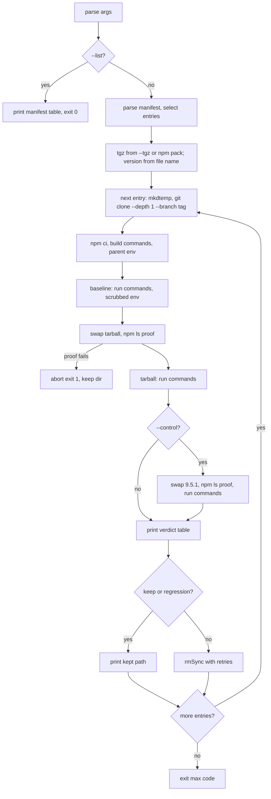

# Scripted Dependents Check - Plan

---

## Goal Capsule

- **Objective:** Before approving any 10.x release candidate or GA, a maintainer runs one command on the checkout and learns, per dependent command, whether the packed wait-on tarball breaks a published dependent's own suite where the dependent's pinned wait-on did not.
- **Means:** A CommonJS script `scripts/dependents.js` driven by a committed manifest `test/dependents/dependents.json`, exposed as `npm run dependents` (KTD1, KTD2).
- **Authority:** AGENTS.md conventions (strict TDD, front doors, ubuntu + windows) override this plan; this plan overrides unit-level improvisation; the issue's Shape section is settled input (Key Decisions below), not a question.
- **Stop conditions:** Stop and report when a settled decision proves infeasible on `next` (for example `npm_execpath` is unset under `npm run` on the Windows CI runner), or when the recorded on-demand run cannot clone or install the anchor dependent for a reason the harness cannot classify.
- **Execution profile:** `/ce-work` from this plan, one unit per commit, Conventional Commit subjects; no `.github/workflows/` edits, no runtime dependency changes, no edits under `features/`.
- **Finishes and ships:** The implementing agent finishes U1 through U4, records the on-demand run in the PR body, and opens the PR to `jeffbski/wait-on` base `next` with `Closes #264`; the maintainer merges.

---

## Product Contract

### Summary

Add a manifest-driven dependents check to `next`: `npm run dependents` clones each listed published dependent at a pinned tag, runs its own commands on its pinned wait-on (baseline), swaps in the packed tarball, proves the swap with `npm ls`, runs the commands again, optionally runs them a third time on wait-on 9.5.1, and prints a per-command verdict table. A command that fails on the tarball but passed on baseline is a regression and the script exits 1. Pure pieces (manifest parsing, selection, `--list` rendering, command construction, environment scrub, `npm ls` verdict, three-way verdict) are mocha-tested; the clone-and-run path is proven by one recorded on-demand run in the PR body.

### Problem Frame

#260 (Fetch refuses bad-list ports such as 6000) passed every repo test and was caught only by running start-server-and-test's `demo-multiple` script by hand on a fork against the 10.x tarball. That check lived in one person's shell history. The Rust spike fork has it as `cargo xtask dependents`, but `next` has no Rust toolchain, so upstream needs a Node implementation that is repeatable and makes "which dependents were tested" visible.

### Key Decisions

- KD1. **The issue's Shape section is the product shape** (session-settled: user-directed — chosen over running the check in required CI: it needs the network and its fixed ports collide across entries, so it runs on demand before each RC/GA). Governs R1, R4 through R16.
- KD2. **Node CommonJS, no new runtime dependencies** (session-settled: user-directed — chosen over porting the Rust xtask: `next` has no Rust toolchain). Governs R17.
- KD3. **Script at `scripts/dependents.js`, manifest and tests under `test/dependents/`, kept out of the published package** (session-settled: user-directed — chosen over a `bin/` entry or `lib/` module: this is contributor tooling, not product surface). Governs R17, R18.
- KD4. **Pure pieces are mocha-tested; the clone/run path is proven by one recorded on-demand run** (session-settled: user-directed — chosen over a network clone test in `npm test`: CI must stay offline and port-safe). Governs R19.
- KD5. **Initial manifest is start-server-and-test v3.0.12 (anchor) and jest-dev-server v11.0.0 (optional, linux, overrides swap, scripts allowed, build step)** (session-settled: user-directed — chosen over a longer list: nx, cypress, playwright and storybook do not depend on wait-on). Governs R3.
- KD6. **Separate from the Gherkin consumer contract (#263)** (session-settled: user-directed — chosen over folding both into one harness: that suite runs scenarios we write, this one runs other people's suites). Governs the scope boundaries; no `features/` edits.
- KD7. **The release checklist step is a docs-only change in `.github/RELEASING.md`**, the existing release runbook. A workflow step is out: `.github/workflows/` is off limits and the check is on demand. Governs R20.

### Requirements

**Manifest**

- R1. `test/dependents/dependents.json` is a JSON array; each entry has exactly these fields, all required: `name` (string), `repo` (git URL string), `tag` (string), `swap` (`"install"` or `"overrides"`), `scripts` (boolean: lifecycle scripts may run during install and swap), `build` (array of commands run once after install), `run` (non-empty array of the commands judged), `os` (array of `process.platform` names; empty means every OS), `optional` (boolean).
- R2. Every `build` and `run` command is a whitespace-split word list whose first word is `npm` or `node`; anything else is a manifest error naming the command. Manifest errors name the entry and the field.
- R3. The committed manifest holds, in this order: `start-server-and-test` at `v3.0.12` from `https://github.com/bahmutov/start-server-and-test.git` (`swap: "install"`, `scripts: false`, `build: []`, `os: []`, `optional: false`, `run` = the mocha spec command `node node_modules/mocha/bin/mocha.js test/helper src/*-spec.js` followed by `npm run demo`, `demo2`, `demo3`, `demo5`, `demo6`, `demo7`, `demo9`, `demo11`, `demo12`, `demo-multiple`, `demo-expect-403`, `demo-json-server`, `demo-ip6`, `demo-timeout`, `demo-interval`, `demo-commands`; never `npm test`, never `demo4`, `demo8`, `demo10`), then `jest-dev-server` at `v11.0.0` from `https://github.com/argos-ci/jest-puppeteer.git` (`swap: "overrides"`, `scripts: true`, `build: ["npm run build"]`, `os: ["linux"]`, `optional: true`, `run: ["node node_modules/jest/bin/jest.js --runInBand packages/jest-dev-server"]`).

**Script front door**

- R4. `npm run dependents -- [--list] [--only <name>] [--include-optional] [--control] [--tgz <path>] [--keep]`; an unknown argument or a value-taking flag without a value prints that usage line and the offending argument to stderr and exits 1.
- R5. `--list` prints every manifest entry (name, tag, swap mode, OS list or `all`, optional yes/no, then each `run` command on its own indented line) and exits 0 without cloning, installing, packing, or touching the network. It ignores `--only` and `--include-optional`.
- R6. Selection: with `--only <name>` exactly that entry runs, optional or not; an unknown name is an error listing the known names; a name whose `os` excludes this host is an error naming the host and the allowed OSes. Without `--only`, non-optional entries run, plus optional ones when `--include-optional` is given, always skipping entries whose `os` excludes this host. Order is manifest order.
- R7. `--tgz <path>` names the tarball under test; without it the script runs `npm pack` of the checkout into the run's temp directory. The expected version is read from the tarball file name (`wait-on-<version>.tgz`); a file name of another shape is an error that says to pass the `npm pack` output.

**Run pipeline (per selected entry, entries one after another)**

- R8. Clone: `git -c core.longpaths=true clone --depth 1 --branch <tag> <repo> <tmp>/repo` into a fresh directory from `fs.mkdtempSync` under `os.tmpdir()`.
- R9. Install: `npm ci` in the clone, with `--ignore-scripts` unless `scripts` is true; then each `build` command. A failing clone, install, or build aborts the whole run with exit 1 and names the kept directory.
- R10. Baseline: every `run` command runs in the clone on the dependent's own pinned wait-on; each command's exit status is recorded, never aborting the sequence.
- R11. Swap, then prove: `install` mode runs `npm install --no-save [--ignore-scripts] <target>`; `overrides` mode runs `npm pkg set overrides.wait-on=<override>` then `npm install [--ignore-scripts]`. The target is the absolute tarball path (override `file:<path>`), or for the control `wait-on@9.5.1` (override `9.5.1`). Then `npm ls wait-on --all --json` is parsed with its exit code ignored; every `wait-on` node at any depth must report the expected version, and finding none is a failure. A failed swap proof aborts the run with exit 1 and names the kept directory.
- R12. Tarball run: the `run` commands again, same recording as R10. With `--control`, R11 and R12 repeat once more targeting 9.5.1.
- R13. Every `run` command and `build` command executes without a shell as `process.execPath` with argument list from the command's words: `npm ...` becomes `[npm_execpath, ...rest]`, `node ...` becomes `[...rest]`. `npm_execpath` comes from the environment set by `npm run`; when it is absent the script exits 1 asking to run through `npm run dependents`. Install, swap and `npm ls` invocations use the same `process.execPath` + `npm_execpath` form.
- R14. Run environment: baseline, tarball, and control commands run with the parent environment minus `HTTP_PROXY`, `http_proxy`, `HTTPS_PROXY`, `https_proxy`, `NO_PROXY`, `no_proxy`, plus `npm_config_ignore_scripts=true` regardless of the entry's `scripts` flag (that flag governs install and swap only). Clone, install, build, swap and `npm ls` run with the unmodified parent environment.
- R15. Cleanup: after an entry, its temp directory is removed with retries (Windows EBUSY) and removal failure never changes the exit code; it prints `could not remove <dir>; remove it by hand`. The directory is kept, and its path printed, when `--keep` is given or the entry produced a regression or a harness failure.

**Verdict and exit code**

- R16. Per entry the script prints a table with one row per `run` command: command, baseline (`pass`/`FAIL`), tarball (`pass`/`FAIL`), control 9.5.1 (`pass`/`FAIL`, column present only when `--control` ran), verdict. Verdict is `ok` when the tarball run passed, `regression` when the tarball run failed and baseline passed, `pre-existing` when both failed. The process exit code is 1 when any row in any entry is `regression`, otherwise 0. Harness failures (R4, R7, R9, R11, R13 errors) exit 1 with the message on stderr.

**Packaging and repo wiring**

- R17. `package.json` gains `"dependents": "node scripts/dependents.js"`; the lint script glob gains `"scripts/**/*.js"`; `dependencies` is untouched and no devDependency is added.
- R18. `npm pack` never ships `scripts/dependents.js` or anything under `test/dependents/` (the `files` whitelist already excludes them; a test keeps it that way).
- R19. The pure pieces of the script are unit-tested in `test/dependents/dependents.mocha.js`, which runs under `npm run test:mocha` offline on ubuntu and windows; the front door `npm run dependents -- --list` is exercised as a subprocess there. No test in `npm test` clones or installs anything.
- R20. `.github/RELEASING.md` carries a "run before each RC/GA" step naming `npm run dependents`, and `AGENTS.md`'s Commands section gains an `npm run dependents` bullet describing the Node script.

### Acceptance Examples

- AE1. Regression found
  - **Covers:** R10, R12, R16
  - **Given** start-server-and-test v3.0.12 cloned, `npm run demo-multiple` exits 0 on baseline (wait-on 9.1.0)
  - **When** the 10.0.0-rc.1 tarball is swapped in and `npm run demo-multiple` exits non-zero
  - **Then** the row reads `npm run demo-multiple  pass  FAIL  regression` and the process exits 1 with the clone directory kept.
- AE2. Pre-existing failure
  - **Covers:** R16
  - **Given** `npm run demo2` fails on baseline because `curl` is missing on the host
  - **When** it also fails on the tarball
  - **Then** the row reads `FAIL  FAIL  pre-existing` and that row does not make the exit code 1.
- AE3. Swap proof catches a nested copy
  - **Covers:** R11
  - **Given** `npm ls wait-on --all --json` exits 1 with `problems: ["invalid: wait-on@10.0.0-rc.1"]` and a nested `other > wait-on` at `9.1.0`
  - **When** the proof runs expecting `10.0.0-rc.1`
  - **Then** it fails naming `other > wait-on@9.1.0`, the run aborts with exit 1, and no tarball run is trusted.
- AE4. Listing without network
  - **Covers:** R5, R19
  - **When** `npm run dependents -- --list` runs from the checkout with no network
  - **Then** stdout names both entries, their tags, and each run command on its own line, and the process exits 0 in well under the mocha timeout.

### Scope Boundaries

- Not in required CI: no edits under `.github/workflows/`, no scheduled workflow in this PR (the issue leaves an optional non-blocking schedule for later).
- No `features/` change, no API, CLI (`bin/wait-on`, `bin/usage.txt`), `README.md`, or `index.d.ts` change, no runtime dependency change (KD2, KD6).
- No parallelism across entries or commands: the dependents bind fixed ports (9000, 6000, 6010, 8800, 8000, 3000).
- Considered and not built: a `require.resolve('wait-on')` check from the dependent's package directory (the spike's `subdir` field). `npm ls --all` already enumerates workspace trees, and R11 fails on any copy at the wrong version. Build it if a recorded run ever shows `npm ls` missing a copy that a run then resolved.
- Considered and not built: a `--help` flag and a `--control <version>` value. The usage line on any argument error covers discovery; a second control version has no requester.
- Considered and not built: a `CONCEPTS.md` entry in this plan. `next` has no `CONCEPTS.md`; `/ce-compound` creates or updates it with `docs/solutions/` after the recorded run, when the learning is known.

### Deferred to Follow-Up Work

- An optional scheduled, non-blocking workflow that runs `npm run dependents` weekly (issue text; needs a workflow edit, which this PR may not make).
- Additional manifest entries beyond the two in KD5.

### Sources

- Issue jeffbski/wait-on#264 (Shape, Initial manifest, Tracking).
- Spike prior art on `spike-next-rs`: `xtask/src/dependents.rs` and `xtask/assets/dependents.json` (manifest fields, `npm ls` walk, verdict table, select rules, cleanup retry), and `docs/solutions/best-practices/dependents-harness-npm-and-candidate-list.md` (`npm ls` exits 1 after a `--no-save` swap; `npm_config_ignore_scripts` keeps start-server-and-test's `pretest` from running `prettier --write` on the clone).
- start-server-and-test v3.0.12 `package.json`: `"wait-on": "9.1.0"` exact pin; `pretest` runs `lint` which runs `prettier --write`; `demo3` invokes `npm run test` internally (pre/post hooks suppressed by R14); `demo2`, `demo7`, `demo12` need `curl`; `demo9`, `demo-interval`, `demo-timeout`, `demo-json-server`, `demo-ip6` use the `cross-env` devDependency; `demo-multiple` waits on 6000 and 6010.
- Repo facts on `next` at 9c0f38b: `package.json` `files` = `bin/`, `lib/`, `exampleConfig.js`, `index.d.ts`; lint glob covers `lib`, `test`, `bin/wait-on` only while `eslint.config.mjs` already matches `**/*.js`; mocha glob `test/**/*.mocha.js`; `.mocharc.json` requires `test/frozen-clock.js`; `bin/wait-on` exports its parser under `if (require.main === module)` (pattern to mirror); `test/cli.mocha.js` spawns `process.execPath` for subprocess tests; `.github/RELEASING.md` holds the release runbook; `scripts/` holds only `reindex-codebase-memory.sh`; `AGENTS.md` has no `npm run dependents` bullet.

---

## Planning Contract

### Key Technical Decisions

- KTD1. **One script file exporting its pure functions, running `main()` only under `require.main === module`.** Chosen over a `lib/dependents/` module tree: contributor tooling stays one file, mirroring `bin/wait-on`'s export pattern so mocha requires the functions directly. Instantiates KD3; governs R17, R19.
- KTD2. **Manifest fields are the issue's names plus the spike's `scripts` and `build`; the issue's `install` field is dropped in favor of a fixed `npm ci`.** Chosen over a free-form `install` command: `npm ci` is the only install that honors the dependent's lockfile, and a free-form string would bypass the npm/node-only rule of R2. The spike's `subdir` is dropped with the resolve check (Scope Boundaries). Governs R1, R3.
- KTD3. **The 9.5.1 control is the boolean flag `--control`; the version is a constant in the script.** Chosen over `--control <version>`: the issue names one control version and a value-taking flag adds a parse branch nobody asked for. Governs R4, R12.
- KTD4. **npm is spawned as `process.execPath` + `process.env.npm_execpath` with an argument list and no shell, for every npm invocation.** Chosen over `spawn('npm', ...)` or `shell: true`: `npm` is a `.cmd` shim on Windows and a shell would reintroduce quoting. Manifest commands are whitespace-split, so the manifest cannot carry quoted arguments; R2 states the rule. Governs R13.
- KTD5. **Swap command construction takes a target, so tarball and control reuse one function per swap mode.** The target carries the install spec and the override value (R11). Governs R11, R12.
- KTD6. **Expected version comes from the tarball file name, not the checkout's `package.json`.** A maintainer may pass an older tarball; the file name is what `npm pack` guarantees. Governs R7.
- KTD7. **The run environment always sets `npm_config_ignore_scripts=true`; the entry's `scripts` flag only drops `--ignore-scripts` from `npm ci` and the swap install.** Lifecycle hooks are needed for Chromium downloads at install time, never to judge a run command, and start-server-and-test's `pretest` is the hazard. Install, swap and `npm ls` keep the parent environment so a registry proxy still works; only the dependent's runs are proxy-scrubbed. Governs R9, R11, R14.
- KTD8. **Cleanup delegates retry to `fs.rmSync(dir, { recursive, force, maxRetries: 5, retryDelay: 1000 })` inside a try/catch that reports and returns.** No hand-rolled loop. Governs R15.
- KTD9. **The package-exclusion guard runs `npm pack --dry-run --json` and asserts neither path family appears; the subprocess front-door test spawns `npm run dependents -- --list` through `npm_execpath`; both skip when `npm_execpath` is unset** (mocha not launched through npm). Governs R18, R19.
- KTD10. **Harness failures abort the whole run at the first failing entry, exit 1, keep the directory.** Chosen over continuing to the next entry: a half-run table invites misreading, and the two-entry manifest makes a rerun cheap. Governs R9, R11, R16.

### High-Level Technical Design

Directional flow, not implementation:

### Assumptions

- `npm run` sets `npm_execpath` to npm's `npm-cli.js` on ubuntu, macOS and Windows, including the CI matrix runners.
- `wait-on@9.5.1` is published on the npm registry at run time.
- `git` and `curl` are on PATH where the on-demand run happens (curl ships with Windows 10+, macOS, and ubuntu runners); a missing `curl` surfaces as `pre-existing` rows, not a harness error.
- `npm pack --json` prints an array whose first element has `filename` (and `--dry-run --json` has `files[].path`), on the npm bundled with Node 22, 24 and 26.
- The start-server-and-test `v3.0.12` tag's `package.json` matches the evidence (scripts and the exact `9.1.0` pin).
- `fs.rmSync` honors `maxRetries`/`retryDelay` on the Node engines floor (22.19).

### Implementation Constraints

- Strict TDD per AGENTS.md: each scenario below is written and seen red for the right reason before its code; a scenario that passes on first run is investigated and the plan's stated RED (U3 lint glob, U3 package guard) is observed before the change.
- CommonJS, `'use strict'`, no build step, no new devDependency (`mocha`, `chai`, `temp` already present).
- Ubuntu and Windows safe: no shell, `path.join`, `os.tmpdir()`, `process.platform` names in `os`.
- Only fixed-state tests; no fake clock is needed (nothing here schedules on rxjs). Subprocess tests use generous real timeouts.

### Sequencing

U1 → U2 → U3 → U4. U1 and U2 are pure and can be red/green in isolation; U3 wires them and adds the two subprocess-adjacent tests; U4 is docs-only.

---

## Implementation Units

### U1. Manifest, selection, listing, and argument parsing

- **Goal:** `scripts/dependents.js` exists with its pure manifest/selection/listing/args functions exported, and `test/dependents/dependents.json` holds the two settled entries.
- **Requirements:** R1, R2, R3, R4 (parse only), R5 (rendering only), R6. Implements KD5, KTD1, KTD2, KTD3.
- **Dependencies:** none.
- **Files:** `scripts/dependents.js` (create), `test/dependents/dependents.json` (create), `test/dependents/dependents.mocha.js` (create).
- **Approach:**
  1. Manifest parser: JSON text in, array of validated entries out; the validation table is the nine fields of R1 with their types; errors are plain `Error`s whose message names the entry and field (R2 for commands).
  2. Selection takes entries, parsed options, and a platform string (never reads `process.platform` itself) and returns the entries in manifest order or throws (R6).
  3. Listing returns a string (R5); `--list` printing lives in `main` (U3).
  4. Argument parser takes an argv array and returns `{ list, only, includeOptional, control, tgz, keep }` or throws with the usage line (R4). `util.parseArgs` (strict) or a hand-rolled loop, whichever yields the stated error messages.
  5. Export under `module.exports`; add the `if (require.main === module)` guard now with an empty `main` so U3 fills it.
- **Patterns to follow:** `bin/wait-on` export-plus-guard shape; `test/validation.mocha.js` style for error-message assertions.
- **Test scenarios** (all in `test/dependents/dependents.mocha.js`, `describe('dependents: manifest')`, `'dependents: select'`, `'dependents: list'`, `'dependents: args'`):
  - Parsing the committed manifest file yields two entries: `start-server-and-test` first with `swap` `install`, `scripts` false, `os` `[]`, `optional` false, `build` `[]`; `jest-dev-server` second with `swap` `overrides`, `scripts` true, `os` `['linux']`, `optional` true, `build` `['npm run build']`.
  - The anchor's `run[0]` is `node node_modules/mocha/bin/mocha.js test/helper src/*-spec.js`, `run` includes `npm run demo-multiple`, and excludes `npm test`, `npm run test`, `npm run demo4`, `npm run demo8`, `npm run demo10`.
  - Text that is not JSON throws with a message containing `dependents.json`.
  - A JSON object (not an array) throws `expected an array`.
  - `[{"name":"x"}]` throws a message containing `x` and `repo`.
  - An entry with `os: "linux"` (string, not array) throws naming the entry and `os`.
  - An entry with `swap: "link"` throws naming `swap` and listing `install, overrides`.
  - An entry with `run: []` throws naming `run`.
  - An entry whose `run` contains `curl http://x` throws a message containing `curl http://x` and `npm or node`.
  - Select with default options on `linux` returns `['start-server-and-test']`.
  - Select with `includeOptional` on `linux` returns `['start-server-and-test', 'jest-dev-server']`; on `darwin` returns `['start-server-and-test']`; on `win32` returns `['start-server-and-test']`.
  - Select with `only: 'jest-dev-server'` on `linux` returns `['jest-dev-server']` without `includeOptional`.
  - Select with `only: 'jest-dev-server'` on `darwin` throws a message containing `jest-dev-server`, `linux`, and `darwin`.
  - Select with `only: 'nope'` throws a message containing `nope` and `start-server-and-test, jest-dev-server`.
  - List text for the committed manifest contains `start-server-and-test`, `v3.0.12`, `jest-dev-server`, `v11.0.0`, `optional`, and each anchor run command on its own line indented by two spaces; it contains the string `all` for the anchor's OS and `linux` for jest-dev-server.
  - Args `['--only','jest-dev-server','--include-optional','--control','--tgz','x.tgz','--keep','--list']` parse to `{ list: true, only: 'jest-dev-server', includeOptional: true, control: true, tgz: 'x.tgz', keep: true }`.
  - Args `[]` parse to all-false/undefined defaults.
  - Args `['--frob']` throw a message containing `--frob` and `usage: npm run dependents`.
  - Args `['--tgz']` throw a message containing `--tgz needs a value`; same for `['--only']`.
- **Verification:** `npm run test:mocha -- --grep "dependents:"` is green; `npm run lint` passes once U3 adds the glob (until then run eslint on the file by hand to keep it clean).

### U2. Command construction, environment, and verdicts

- **Goal:** The pure functions that decide what runs, with what environment, and how results are judged, with every dispatch branch and matrix cell tested.
- **Requirements:** R7 (version from file name), R8, R9, R11, R13 (argument lists), R14, R15 (helper), R16. Implements KD1, KTD4 through KTD8.
- **Dependencies:** U1.
- **Files:** `scripts/dependents.js` (modify), `test/dependents/dependents.mocha.js` (modify).
- **Approach:**
  1. Clone args and install args as pure functions of the entry (R8, R9).
  2. Swap commands as a function of entry and target (KTD5), returning an array of npm argument lists; the two targets are `{ tgz: <abs path> }` and `{ version: '9.5.1' }`.
  3. Node argument list from a manifest command and the npm path (R13).
  4. Run environment from a parent environment object (R14, KTD7).
  5. Tarball version from a file name (KTD6).
  6. `npm ls` verdict from stdout text and expected version: walk `dependencies` recursively, collect every `wait-on` with its `a > b` path, judge versions only (R11).
  7. Verdict from entry label, rows `{ command, baseline, tarball, control }` (control `undefined` when not run), returning `{ text, code }` (R16).
  8. Remove-directory helper (KTD8).
- **Patterns to follow:** the spike's function boundaries (`clone_args`, `install_args`, `swap_plan`, `node_args`, `run_env`, `ls_verdict`, `verdict`, `remove_with_retry`) translated to plain functions; concrete expected values in tests, never recomputed from the implementation.
- **Test scenarios** (`describe('dependents: commands')`, `'dependents: env'`, `'dependents: npm ls'`, `'dependents: verdict'`, `'dependents: cleanup'`):
  - Clone args for the anchor and dest `/t/sst` equal `['-c','core.longpaths=true','clone','--depth','1','--branch','v3.0.12','https://github.com/bahmutov/start-server-and-test.git','/t/sst']`.
  - Install args: anchor → `['ci','--ignore-scripts']`; jest-dev-server → `['ci']`.
  - Swap matrix, one assertion per cell (swap mode × target × scripts):
    - install, tarball, scripts false → `[['install','--no-save','--ignore-scripts','/p/wait-on-10.0.0-rc.1.tgz']]`
    - install, tarball, scripts true → `[['install','--no-save','/p/wait-on-10.0.0-rc.1.tgz']]`
    - install, control, scripts false → `[['install','--no-save','--ignore-scripts','wait-on@9.5.1']]`
    - install, control, scripts true → `[['install','--no-save','wait-on@9.5.1']]`
    - overrides, tarball, scripts true → `[['pkg','set','overrides.wait-on=file:/p/wait-on-10.0.0-rc.1.tgz'],['install']]`
    - overrides, tarball, scripts false → `[['pkg','set','overrides.wait-on=file:/p/wait-on-10.0.0-rc.1.tgz'],['install','--ignore-scripts']]`
    - overrides, control, scripts true → `[['pkg','set','overrides.wait-on=9.5.1'],['install']]`
    - overrides, control, scripts false → `[['pkg','set','overrides.wait-on=9.5.1'],['install','--ignore-scripts']]`
  - Node args: `npm run demo2` with npm `/n/npm-cli.js` → `['/n/npm-cli.js','run','demo2']`; `node node_modules/mocha/bin/mocha.js src/*-spec.js` → `['node_modules/mocha/bin/mocha.js','src/*-spec.js']`.
  - Tarball version: `wait-on-10.0.0-rc.1.tgz` → `10.0.0-rc.1`; `/abs/dir/wait-on-9.5.1.tgz` → `9.5.1`; `wait-on.tgz` throws a message containing `npm pack`.
  - Run env from a parent containing all six proxy variables (`HTTP_PROXY`, `http_proxy`, `HTTPS_PROXY`, `https_proxy`, `NO_PROXY`, `no_proxy`) plus `PATH=/bin`: none of the six is present, `PATH` is `/bin`, `npm_config_ignore_scripts` is `'true'`.
  - Run env for an entry with `scripts: true` still has `npm_config_ignore_scripts` `'true'` (KTD7).
  - Run env does not mutate the parent object.
  - `npm ls` verdict accepts a tree with `problems: ["invalid: wait-on@10.0.0-rc.1"]`, `error: {code: "ELSPROBLEMS"}`, root `wait-on` at `10.0.0-rc.1` marked `invalid`, and nested `other > wait-on` at `10.0.0-rc.1`, when expecting `10.0.0-rc.1`.
  - Same tree with the nested copy at `9.1.0` throws a message containing `other > wait-on@9.1.0` and `10.0.0-rc.1`. Covers AE3.
  - A workspace-shaped tree (`dependencies.jest-dev-server.dependencies.wait-on` at `8.0.1`) expecting `10.0.0-rc.1` throws naming `jest-dev-server > wait-on@8.0.1`.
  - `{"name":"x"}` throws a message containing `no wait-on`.
  - Non-JSON stdout throws a message containing `npm ls`.
  - Verdict: one row `{baseline: true, tarball: true}` → code 0, text contains `npm run demo`, `pass`, `ok`.
  - `{baseline: true, tarball: false}` → code 1, text contains `regression`. Covers AE1.
  - `{baseline: false, tarball: false}` → code 0, text contains `pre-existing`. Covers AE2.
  - `{baseline: false, tarball: true}` → code 0, text contains `ok`.
  - Two rows, one regression and one ok → code 1.
  - Rows without `control` → header lacks `9.5.1`; rows with `control: false` → header contains `9.5.1` and the row contains `FAIL` in the control column while the verdict stays `ok` when tarball passed.
  - Cleanup helper removes a `temp`-created directory containing a nested file and returns without throwing.
  - Cleanup helper on a path that does not exist returns without throwing.
- **Verification:** `npm run test:mocha -- --grep "dependents:"` green; every swap matrix cell has its own assertion.

### U3. Runner, npm script wiring, lint glob, package guard, and the front-door test

- **Goal:** `npm run dependents` runs end to end: packing, cloning, installing, three-way runs, proof, table, cleanup, exit code; the lint glob covers `scripts/`; the package never ships the tooling.
- **Requirements:** R4 (exit behavior), R5 (printing and no-network), R7 (`npm pack` default), R8 through R16, R17, R18, R19. Implements KD3, KD4, KTD9, KTD10.
- **Dependencies:** U1, U2.
- **Files:** `scripts/dependents.js` (modify: `main`), `package.json` (modify: `scripts.dependents`, `scripts.lint`), `test/dependents/dependents.mocha.js` (modify).
- **Approach:**
  1. `main`: parse args, read and parse the manifest from `test/dependents/dependents.json` relative to the script, handle `--list` before anything else, select with `process.platform`, resolve `npm_execpath` (R13 error when absent), resolve the tarball (`--tgz` made absolute, or `npm pack --json --pack-destination <tmp>` parsed for `filename`), derive the version (U2), then loop entries per the flowchart; `process.exitCode` set from the max verdict code; harness errors print to stderr and exit 1.
  2. All child processes via `child_process.spawnSync(process.execPath, args, { cwd, env, stdio })` for npm and node, `spawnSync('git', ...)` for the clone; `npm ls` captures stdout, everything else inherits stdio so dependents' output streams through.
  3. Print `> <name> [baseline|tarball|control] <command>` before each run command.
  4. `package.json`: add `"dependents": "node scripts/dependents.js"`; extend `lint` to `eslint "lib/**/*.js" "test/**/*.js" "scripts/**/*.js" "bin/wait-on"`.
- **Execution note:** RED for the lint glob is a lint violation placed in `scripts/dependents.js` (an unused variable) that `npm run lint` fails to report before the glob change and reports after; remove the violation once observed. RED for the package guard is observed by temporarily adding `scripts/` to `files` and watching the guard fail, then reverting, because the invariant already holds on `next`.
- **Patterns to follow:** `test/cli.mocha.js` `execCLI` for spawning `process.execPath`; `test/coverage.mocha.js` for subprocess assertions on exit code and output.
- **Test scenarios** (`describe('dependents: front door')`, `'dependents: package'`, both `this.timeout(30000)`; npm-spawning cases `this.skip()` when `process.env.npm_execpath` is unset):
  - `npm run dependents -- --list` spawned as `process.execPath [npm_execpath, 'run', 'dependents', '--', '--list']` with `cwd` the repo root exits 0, and stdout contains `start-server-and-test`, `v3.0.12`, `jest-dev-server`, `v11.0.0`, and `npm run demo-multiple`. Covers AE4.
  - The same spawn with `HTTP_PROXY=http://127.0.0.1:9` and `HTTPS_PROXY=http://127.0.0.1:9` in the env still exits 0 with the same stdout, proving `--list` touched no network.
  - `node scripts/dependents.js --frob` spawned directly exits 1 and stderr contains `--frob` and `usage: npm run dependents`.
  - `node scripts/dependents.js --tgz` exits 1 and stderr contains `--tgz needs a value`.
  - `node scripts/dependents.js --only nope` exits 1 and stderr contains `nope` and `start-server-and-test` (no network: selection fails before packing).
  - `node scripts/dependents.js --only start-server-and-test` spawned with `npm_execpath` deleted from the env exits 1 and stderr contains `npm run dependents` (R13 guard fires before any clone or pack).
  - `npm pack --dry-run --json` from the repo root lists no path starting with `scripts/` and none starting with `test/`.
- **Verification:** `npm test` green on the local OS; `npm run lint` reports `scripts/dependents.js`; the CI matrix (ubuntu + windows, node 22/24/26) is green on the PR; `npm pack --dry-run` output unchanged from `next`.

### U4. Release checklist and agent guidance

- **Goal:** A maintainer finds the "run before each RC/GA" step where releases are run from, and agents read an accurate `npm run dependents` description.
- **Requirements:** R20. Implements KD7.
- **Dependencies:** U3.
- **Files:** `.github/RELEASING.md` (modify), `AGENTS.md` (modify).
- **Approach:**
  1. `.github/RELEASING.md`: in "Ship a release candidate on `next`" and "Promote the release candidate to 10.0.0", add one step before approving the Release run: run `npm run dependents` (and `npm run dependents -- --include-optional` on a linux host) on the checkout; a `regression` row blocks approval until it is fixed or the manifest entry is shown to be at fault; `--list` shows what will run.
  2. `AGENTS.md` Commands section: add an `npm run dependents` bullet: on demand, Node script `scripts/dependents.js`, manifest `test/dependents/dependents.json`, flags, not in CI, run before each RC/GA per `.github/RELEASING.md`.
- **Test expectation:** none -- docs-only edits (AGENTS.md carve-out).
- **Verification:** both files read correctly rendered.

---

## Verification Contract

| Check | Command | Proves |
|---|---|---|
| Unit and front-door tests | `npm run test:mocha -- --grep "dependents:"` | U1, U2, U3 scenarios green offline |
| Full gate | `npm test` | lint (now including `scripts/**/*.js`), types, whole mocha suite |
| Lint reach | `npm run lint` | `scripts/dependents.js` is linted (RED observed per U3 execution note) |
| Package exclusion | `npm pack --dry-run` | no `scripts/` or `test/` paths (also asserted by the U3 guard test) |
| Cross-platform | PR CI matrix ubuntu + windows, node 22/24/26 | the subprocess front-door test and the cleanup helper run on Windows |
| Recorded on-demand run | `npm pack --pack-destination <tmp>` then `npm run dependents -- --tgz <tmp>/wait-on-10.0.0-rc.1.tgz`, output pasted in the PR body | the clone, install, baseline, swap, proof, tarball, table and exit-code path ran for real |

Expected result of the recorded run on 10.0.0-rc.1: start-server-and-test rows all `ok` except `npm run demo-multiple`, which reads `pass FAIL regression` (ports 6000/6010 are on the Fetch bad list, #260) and makes the exit code 1, until upstream #262 merges. That row is the positive control that the harness detects a real regression; the PR body says so. Rows that read `FAIL FAIL pre-existing` (for example `demo2` on a host without `curl`) are reported, not fixed. If #262 merges before the PR opens, a second recorded run shows every row `ok` and exit 0. Optionally, `--control` on the same run shows the 9.5.1 column `pass` for `demo-multiple`.

Risks and the test that answers each:

| Risk | Named test |
|---|---|
| Windows cannot spawn `npm` without a shell | U2 node args from `npm run demo2`; U3 front-door `--list` spawn through `npm_execpath`, run on the windows CI matrix |
| `npm ls` exits 1 after a `--no-save` swap and the proof wrongly fails | U2 `npm ls` verdict accepts the `ELSPROBLEMS` tree with every copy at the tarball version |
| A nested or workspace copy keeps the old wait-on and the tarball run is trusted anyway | U2 nested `other > wait-on@9.1.0` and workspace `jest-dev-server > wait-on@8.0.1` scenarios |
| start-server-and-test's `pretest` rewrites the clone during `demo3` | U2 run env has `npm_config_ignore_scripts` `'true'`, including for `scripts: true` entries |
| A proxy in the maintainer's shell routes the dependent's localhost probes | U2 run env drops all six proxy variables; U3 `--list` under `HTTP_PROXY` |
| The expected version drifts from the tarball actually under test | U2 tarball version from file name; `wait-on.tgz` rejected |
| The tooling leaks into the published package | U3 `npm pack --dry-run --json` guard |
| `scripts/` silently escapes lint | U3 execution note RED on the lint glob |
| `--only` on an unsupported OS runs nothing and exits 0 | U1 select `only: 'jest-dev-server'` on `darwin` throws |
| Temp cleanup fails on Windows (EBUSY) and fails the run | U2 cleanup helper returns without throwing; retry delegated to `fs.rmSync` `maxRetries` (KTD8) |
| The swap for the control uses the wrong spec shape in overrides mode | U2 swap matrix, all eight cells |

---

## Definition of Done

| Scope | Criterion |
|---|---|
| Global | `npm test` green locally and on the PR CI matrix (ubuntu + windows); no runtime dependency change; no edits under `.github/workflows/` or `features/`; `npm pack --dry-run` lists nothing new |
| Global | Every U1 through U3 scenario exists, was seen red for the right reason, and is green; no `.only`, `.skip`, or disabled test in the diff (the `npm_execpath` skips are runtime guards, not disabled tests) |
| Global | The recorded on-demand run output is in the PR body with the `demo-multiple` regression called out as expected pending #262 |
| Global | Abandoned-approach code is removed; `scripts/dependents.js` carries only the functions the tests demand plus `main` |
| Global | PR opened to `jeffbski/wait-on` base `next` with `Closes #264`, Conventional Commit subjects, `docs/plans/2026-10-05-1020-feat-dependents-check-plan.md` committed |
| U1 | Manifest with the two KD5 entries committed; parse, select, list, args exported and tested |
| U2 | Command, env, version, `npm ls`, verdict, cleanup functions exported and tested, all eight swap cells asserted |
| U3 | `npm run dependents -- --list` works from a clean clone offline; `--frob`, missing value, unknown `--only`, and missing `npm_execpath` exit 1 with the stated stderr; lint glob and package guard in place |
| U4 | `.github/RELEASING.md` carries the RC/GA step; `AGENTS.md` describes the Node script |
