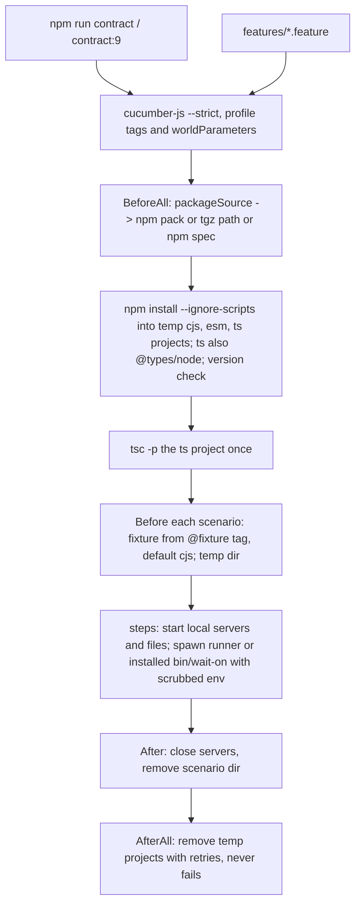
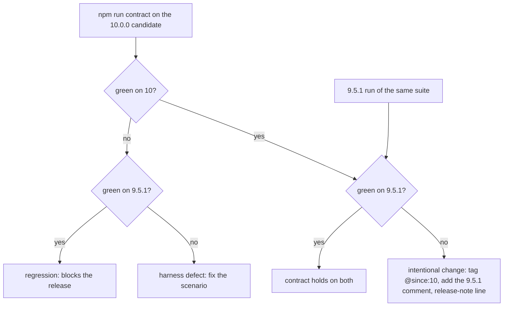

# v10 executable Gherkin consumer contract and a 9.5.1 to 10.x compatibility gate - Plan

Implementation plan for jeffbski/wait-on#263 on branch `next` (10.0.0-rc.1). The spike branch `spike-next-rs` already holds a working contract (`features/`, `features/support/`, `features/fixtures/`, `cucumber.js`) driven by a Rust orchestrator; this plan ports its engine-agnostic parts to `next` under a Node-only harness and adds the 9.5.1 release gate.

---

## Goal Capsule

- **Objective:** A project that uses `wait-on` 9.5.1 today as a library (CommonJS, ESM default import, TypeScript against `index.d.ts`, callback or Promise form, any documented option or resource kind) or as a CLI keeps working on 10.0.0, and every intentional 10.x difference is named in the release notes before GA, because the same executable contract runs green against the published 9.5.1 and against the 10.0.0 candidate.
- **Means:** cucumber-js feature files run by `npm run contract` against the packed, installed tarball in three consumer fixture projects, plus `npm run contract:9` running the same files against `wait-on@9.5.1` with `@since:10` scenarios excluded (KTD1, KTD2, KTD8).
- **Authority:** `AGENTS.md` on `next` > the five session-settled Key Decisions below > this plan > the implementing PR. jeffbski/wait-on#263 is the tracking issue.
- **Stop conditions:** a change to `lib/`, `bin/`, `index.d.ts` or `WAIT_ON_SCHEMA` becomes necessary to make a scenario pass (file the defect, do not bend the scenario); a new runtime dependency becomes necessary; an edit under `.github/workflows/` becomes necessary inside a unit (CI wiring is the operator PR in KTD9, never a unit).
- **Execution profile:** one PR into `jeffbski/wait-on` base `next` from `kevinold/wait-on`, one commit per unit (U1 to U5), body `Refs #263`; U6 lands in a second PR once jeffbski/wait-on#262 is on `next`. Allowed paths: `features/`, `cucumber.js`, `test/`, `package.json`, `package-lock.json`, `eslint.config.mjs`, `.gitattributes`, `AGENTS.md`, `docs/`. Implementation runs through `/ce-work` from this file.

---

## Product Contract

### Summary

Add `features/*.feature` to `next` as the executable consumer contract: 14 engine-agnostic feature files ported from the spike, cucumber-js step definitions under `features/support/`, and consumer fixture projects under `features/fixtures/{cjs,esm,ts}/`. A cucumber `BeforeAll` hook packs the working tree (or takes a tarball path or npm spec from a world parameter), installs it with `npm install --ignore-scripts` into one fresh temp project per fixture, compiles the TypeScript fixture, and the suite runs once; each scenario picks its fixture from an `@fixture:` tag. `npm run contract` is the entry point and `npm run contract:9` is the same suite against `wait-on@9.5.1` minus `@since:10` scenarios. Both runs green is the 10.0.0 release gate; CI runs `npm run contract` on ubuntu and windows through an operator-owned workflow step.

### Problem Frame

`next` carries the 10.0.0 rewrite (axios to undici, `util.parseArgs`, fail-fast validation, bundled types, `command:` resources) with 12.8M weekly downloads behind it and dependents such as `start-server-and-test` pinning 9.x. Its mocha suites test the repo's own `lib/`, not the installed package a consumer gets, and nothing compares 10.x behavior with the published 9.5.1 on the same inputs. The spike built that comparison harness for a different purpose (JS engine vs Rust engine) with a Rust orchestrator `next` cannot carry. The L19 dependents run already caught one silent 9.x to 10.x regression (the fetch bad-port list, jeffbski/wait-on#260) that no mocha test saw.

### Requirements

**Contract definition**

- R1. `features/*.feature` is the consumer contract: every scenario states concrete expected values (outcome, error name and message, stdout log lines, CLI exit code and first stderr line, elapsed bounds) with `<tmp>`, `<port>`, `<pid>`, `<resource N>` placeholders, and runs against the installed package, never against `lib/` in the repo.
- R2. A run passes only with zero undefined or pending steps (`strict`), and the only permitted skip is the explicit `'skipped'` return when a fixed-port scenario finds its port taken (R22).
- R3. Tags: layer `@api`, `@cli`, `@engine`, `@consumer`; `@kind:good` / `@kind:bad` pairs; `@fixture:<cjs|esm|ts>` pins a scenario to one fixture; `@since:10` marks a 10-only guarantee (R14); `@engines:multi` marks spike-only scenarios (R6); `@route:js` / `@route:none` are kept on scenarios as text and are inert on `next` (KTD3).
- R4. Every elapsed assertion sits off a `window == interval` file boundary: interval timing uses a TCP server that starts listening after a delay `D` with `S < D < S + interval` (the L20 pattern, `cli-flags.feature` "-i sets the interval", D = 1000 ms); the audit result for every other timed scenario is recorded in KTD10.
- R5. Feature text names no engine, environment switch, or addon, and stays parsable by cucumber-rs 0.23 so the spike can inherit the files unchanged: no `<...>` inside a Scenario Outline other than its Examples columns, and `@engine` scenarios keep the closed runner-neutral vocabulary with `window >= interval`.
- R6. Spike-only scenarios (`api-engine-env.feature`, the no-addon step) do not land on `next`; `cucumber.js` excludes `@engines:multi` so the spike can add them without touching the profile.

**Node runner and fixtures**

- R7. `features/fixtures/{cjs,esm,ts}/` are consumer projects installed from the tarball: `cjs/run.js` is the full runner (JSON options in, optional `--callback`, one JSON result line out after any log output: `exportType`, `outcome`, `errorName`, `errorMessage`, `cbCalls`, `cbArg`, `cbSync`, `returned`, `elapsedMs`; a string `validateStatus` is compiled as the body of `function (status)`), `esm/run.mjs` and `ts/run.ts` run the Promise form, `esm/named.mjs` is the named import that must fail, `ts/consumer.ts` is the type surface compiled once per run.
- R8. Behavior scenarios (`@api`, `@cli`, `@engine`) run on the `cjs` fixture; `@consumer` scenarios are tagged `@fixture:<f>` and run on that fixture; a scenario without a fixture tag runs on `cjs`.
- R9. One cucumber run: `BeforeAll` resolves the package source (R10), installs it into a fresh temp project per fixture with `npm install --ignore-scripts --no-audit --no-fund` (the `ts` project also installs `@types/node` at the version the repo has installed), compiles `ts/`, and fails the run when the installed `wait-on` version differs from a requested `name@version` spec; `AfterAll` removes the temp projects with retries and never fails the run.
- R10. The package source is the `package` world parameter: unset packs the working tree with `npm pack`; a value ending in `.tgz` is a tarball path; any other value is an npm spec such as `wait-on@9.5.1`.
- R11. Scenario children (fixture runners, the installed `bin/wait-on`, `command:` children) run with `HTTP_PROXY`, `HTTPS_PROXY`, `ALL_PROXY`, `NO_PROXY` (both cases) scrubbed from the inherited environment, the scenario's own `Given the environment variable ...` values on top, on the real clock with `TOLERANCE_MS = { early: 100, late: 1000 }`, which U2 adds to `test/helpers/cli-conformance.js` (the spike's value; `next`'s helper does not export it yet).

**Inventory**

- R12. The 14 engine-agnostic spike feature files land with the scenario inventory in the table under Planning Contract: module shape, call forms and shorthand, validation and resource syntax, every resource kind forward and reverse, timeout text, timing and concurrency options, http options, TLS material and proxies (object, `false`, `HTTP_PROXY`, `HTTPS_PROXY`, `NO_PROXY`), log lines, CLI basics, config files, every flag, and the type surface; proxy scenarios prove the path through the counting stub proxy and direct scenarios assert it carried nothing.
- R13. The TLS scenarios (self-signed server, unrelated CA, client certificate, encrypted client key with passphrase, trusted-through-its-CA) use committed PEM fixtures; no scenario depends on `openssl` being installed.

**Release gate (9.5.1 to 10.x)**

- R14. `@since:10` marks a scenario that passes on 10.x and fails on 9.5.1 because 10.x intentionally changed or fixed the behavior; it is assigned only from an observed 9.5.1 run, never from assumption.
- R15. `npm run contract:9` runs the suite against `wait-on@9.5.1` with `not @since:10` and is green.
- R16. Verdict: a scenario red on 10.x and green on 9.5.1 is a regression that blocks the release; a scenario green on 10.x and red on 9.5.1 is an intentional change and gets `@since:10`; a scenario red on both is a harness defect to fix.
- R17. Every `@since:10` scenario carries a one-line `# 9.5.1:` comment stating the behavior it replaces, and the gate's PR body lists those lines for the 10.0.0 release notes (BREAKING or fixed, per line).

**CI, packaging, docs**

- R18. The contract runs on CI on ubuntu and windows (node 22, 24, 26) through one `npm run contract` step added to `.github/workflows/node.js.yml` by an operator PR (KTD9); `npm test` stays as it is.
- R20. `AGENTS.md` gains the contract commands and a "Consumer contract" section (layout, tags, placeholders, fixtures, clock, PEM regeneration, the gate procedure); no `docs/guides/` directory is created.
- R21. `npm run lint` covers `features/**/*.js` and `cucumber.js`; `.gitattributes` keeps `*.feature`, `*.mjs`, `*.ts` at LF; the pure harness helpers have a mocha test in `test/`; the published tarball still ships only `bin/`, `lib/`, `exampleConfig.js`, `index.d.ts`.
- R22. Once jeffbski/wait-on#262 is on `next`, an `@api` scenario waits on an HTTP server bound to port 6000 and resolves; the Given returns `'skipped'` when the port is taken.

### Key Decisions

- KD1. **`next` is the source of truth for the contract.** (session-settled: user-directed — chosen over keeping the contract spike-only or maintaining two copies: engine-agnostic features, fixtures, steps and config land on `next`, and the spike inherits them by merging `next` and layering only engine-specific pieces.) Governs R1, R5, R6, R12.
- KD2. **Engines are a cucumber World parameter.** (session-settled: user-directed — chosen over an engine env var or per-engine profiles: `next` runs `{ engines: ["js"] }`, the route-proof hook asserts only with more than one engine, and spike-only scenarios carry `@engines:multi` and are excluded by `next`'s profile.) Governs R3, R6.
- KD3. **Node-only orchestration on `next`.** (session-settled: user-directed — chosen over porting `cargo xtask contract` or any Rust tooling: a cucumber `BeforeAll` hook packs, installs into a temp project and selects the fixture, and `npm run contract` is the entry point; the spike's `cargo xtask contract` becomes a thin engine-loop wrapper later, outside this plan.) Governs R7, R8, R9, R10, R11.
- KD4. **9.5.1 vs 10.x release gate.** (session-settled: user-directed — chosen over a changelog review: the same suite runs against published `wait-on@9.5.1` and the 10.0.0 candidate; fails-on-10 and passes-on-9 is a regression, passes-on-10 and fails-on-9 is an intentional change with a BREAKING release note, and 10-only scenarios carry `@since:10`.) Governs R14, R15, R16, R17. Conflict call-out: the brief's illustrative `@since:10` examples (resource-syntax error texts, `util.parseArgs` quirks, bundled TS types, string/array shorthand) all already ship in 9.5.1 (`lib/wait-on.js` validation texts byte-identical, `bin/wait-on` identical except an export, `index.d.ts` identical except the `proxy` comment); the decision stands and KTD8 makes the assignment empirical, with the real 10-only set expected around the undici migration (`ALL_PROXY` no longer honored, proxy error shapes, the tightened `proxy` schema).
- KD5. **Dependents are out of scope.** (session-settled: user-directed — chosen over planning a dependents run or release step here: running published dependents' suites is its own sibling track, named once under Scope Boundaries.) This plan has no dependents code, unit, release step or verification row.

### Acceptance Examples

- AE1. **Regression caught.** Covers R16. Given the 10.0.0 candidate still has jeffbski/wait-on#260, when `npm run contract` runs with the U6 bad-port scenario present, then that scenario fails with `Timed out waiting for: <resource 1>` while `npm run contract:9` passes it; the release is blocked until #262 is in the candidate.
- AE2. **Intentional change recorded.** Covers R14, R16, R17. Given `api-validation.feature` "a proxy object without a port is rejected", when `npm run contract` passes it and a 9.5.1 run (no tag filter) shows it failing because 9.5.1 accepted any proxy object, then the scenario gains `@since:10` and a `# 9.5.1: any proxy object passed validation` comment, and `npm run contract:9` is green again.
- AE3. **Harness defect, not a verdict.** Covers R16. Given a scenario red on both runs, then it is a scenario or step bug (for example a placeholder that did not fill) and is fixed before either run is read as a verdict.

### Scope Boundaries

**In scope:** everything under Requirements; new devDependency `@cucumber/cucumber` 13.2.1 (MIT, Node 22/24/26); committed test-only PEM fixtures.

**Sibling track:** running published dependents' suites (start-server-and-test, jest-dev-server) against the candidate is jeffbski/wait-on#264, with its own issue and PR (KD5).

**Deferred to Follow-Up Work**

- Spike-side dedupe (spike lane, after this lands): merge `next` into `spike-next-rs`, drop the spike's copies of the engine-agnostic `features/*.feature`, `features/fixtures/`, `cucumber.js` and shared support files in favor of `next`'s, keep `api-engine-env.feature` tagged `@engines:multi`, move the route proof (`proof-preload.js`, `proof.js`, the After verdict) into a separate `features/support/hooks-engine.js` gated on `this.parameters.engines.length > 1`, keep the no-addon step spike-only, point `test/helpers/tls-fixture.js` consumers at the committed PEMs or keep it for mocha only, and turn `cargo xtask contract` into a loop that runs `npm run contract -- --world-parameters '{"engines":[...]}'` per engine.
- jeffbski/wait-on#262 landing on `next` (U6 waits on it).
- File a `lib/` defect: `EnvHttpProxyAgent` must receive the TLS options as `requestTls` so https checks behind `HTTPS_PROXY` honor `strictSSL`/`ca`/`cert`/`key`; its fix PR turns the pinned env-proxy scenario into a good/bad pair (likely `@since:10`).
- Running `npm run contract:9` in CI: it needs the registry and pins a published version; the operator decides after the first manual gate run.
- `AGENTS.md` on `next` still describes axios, lodash and Node 20 in Architecture and Stack; refreshing that is a separate docs change, not this plan's section.

**Considered and not built**

- A gate report script diffing two cucumber JSON reports: two runs plus `@since:10` tags give the same three verdicts (R16) with no code.
- Porting `test/helpers/tls-fixture.js` (openssl at runtime): committed PEMs remove the tool dependency, the Windows runner slowness, and the skip-vs-fail policy conflict between `AGENTS.md` and the spike's zero-skip rule.
- Any proof or engine code on `next` (`proof-preload.js`, `proof.js`, `NODE_OPTIONS` injection, `hostDir`, `addonDir`, `noAddonProject`): one engine has nothing to prove; the spike adds it gated on its own world parameter.
- Three per-fixture cucumber profiles chained with `&&`: CLI flags would reach only the last run and the tree would be packed three times (KTD1).
- Adding `npm run contract` to `npm test`: it needs the registry for the tarball's dependencies and a pack plus three installs per run, which every local `npm test` would pay.
- A CLI twin of the bad-port scenario: `bin/wait-on` and `waitOn` share `createHTTP$`, and #262's own mocha tests cover the CLI door.
- A `tcpTimeout` timing scenario, the window-raised-to-interval clamp, the `exiting with error <err>` log line and the `timeout` default Infinity: the spike recorded why none has an observable front-door outcome; unchanged here.

---

## Planning Contract

### Key Technical Decisions

- KTD1. **One cucumber run; the fixture is a per-scenario choice from the `@fixture:` tag.** `BeforeAll` installs all three fixture projects; a `Before` hook sets `this.project` from the scenario's `@fixture:` tag, default `cjs`. `npm run contract` is `cucumber-js`, so `--tags`, `--name` and `--world-parameters` pass straight through `npm run contract -- ...`. The one spike scenario that ran untagged on every fixture ("the default export waits for an existing file") becomes three tagged plain scenarios. Chosen over the spike's per-fixture invocations (see Considered and not built). Governs R8, R9.
- KTD2. **Package source and the baseline profile.** The `package` world parameter follows R10; `cucumber.js` declares a `baseline` profile `{ tags: 'not @since:10', worldParameters: { package: 'wait-on@9.5.1' } }` and the npm script `contract:9` is `cucumber-js -p default -p baseline`: cucumber-js applies `default` only when no profile is named, so `-p baseline` alone would lose `paths`, `require` (and autoload `features/fixtures/**/*.js` as step code) and `not @engines:multi`. Named profiles merge: tags join with `and`, `require`/`paths` concatenate, world parameters deep-merge, so CLI filters still stack. Governs R10, R15.
- KTD3. **No engine seam in code on `next`.** `cucumber.js`'s default profile declares `worldParameters: { engines: ['js'] }` and `tags: 'not @engines:multi'`; nothing on `next` reads `engines`. Feature files keep their `@route:*` tags (inert text) so they stay byte-identical across branches. The spike's route-proof hook lives in its own support file and gates on `engines.length > 1`, so merging `next` adds files rather than editing shared ones. Governs R3, R6.
- KTD4. **TLS material is committed under `features/fixtures/tls/`.** `server.pem` + `server-key.pem` (SAN `DNS:localhost, IP:127.0.0.1, IP:::1`, `CA:FALSE`, signed by `ca.pem`), `client.pem` + `client-key.pem` (signed by `ca.pem`), `client-key-encrypted.pem` (PKCS#8, passphrase `wait-on-test-passphrase`), `other-ca.pem` (unrelated); validity 100 years. `features/support/servers.js` reads them; the regeneration recipe (the spike's `docs/guides/testing.md` PEM script plus one `openssl pkcs8 -topk8` line) goes in `AGENTS.md`. The "requires a client certificate" server trusts `ca.pem`; "trusted through its CA" passes `ca.pem` as `ca` with `strictSSL: true`; "not trusted" and "strictSSL with an unrelated ca" pass `other-ca.pem`. Governs R13.
- KTD5. **`test/helpers/stub-proxy.js` is ported byte-identical from the spike.** It has no engine code (a counting proxy: absolute-form requests and `CONNECT` tunnels with `proxy-authorization`), the path matches the spike so the merge sees an identical add, and a later mocha proxy test can reuse it. Governs R12.
- KTD6. **Pure harness helpers are the only mocha-tested harness code.** `features/support/project.js` exports `packageSource(param, cwd)`, `fixtureOf(tags)`, `installArgs(fixture, source, typesNodeVersion)` and `scrubbed(env)` with no cucumber import; `test/contract-project.mocha.js` tests them and runs inside `npm test`. Hooks, steps and servers are proven by `npm run contract` itself under `strict`. Governs R9, R10, R11, R21.
- KTD7. **npm is invoked through `process.env.npm_execpath`** (`node <npm-cli.js> ...`), as the spike's `host::npm_execpath` did, so Windows needs no `.cmd` shim resolution and a run started outside npm fails at once with "run this through npm run contract". The install step keeps the parent's proxy variables (a corporate developer's npm may need them); only scenario children are scrubbed (R11). Governs R9, R11.
- KTD8. **`@since:10` is assigned empirically, one tag, one comment, no extra marker.** U5 runs the whole suite once against 9.5.1 with no tag filter, classifies each failure by R16, tags intentional ones and adds the `# 9.5.1:` line; BREAKING versus fixed is a release-notes judgment made per line in the PR body, not a second tag. Governs R14, R16, R17.
- KTD9. **CI wiring is an operator PR, carved out explicitly.** `npm test` is the only hook `.github/workflows/node.js.yml` runs; the contract needs the registry and minutes, so it stays a separate script, and the operator adds `- run: npm run contract` after `npm test` in the existing matrix (ubuntu + windows × node 22/24/26). Lanes never edit workflows. Governs R18.
- KTD10. **Timing scenarios keep the L20 shape and audit.** "-i sets the interval" uses `Given a TCP server that starts listening after 1000ms` with `-i 1500 -t 5000`, expecting about 1500 ms (bounds [1400, 2500] from `TOLERANCE_MS`). Audit carried from L20: "-w sets the stability window" (`-w 1500 -i 100`, 100 ms ticks resolve the boundary), api-options default (interval 250, window 750; a lost boundary lands at 1000 ms inside [650, 1750]) and `interval 100, window 600`, "-d delays the first check" (TCP, no window), the `-l`/`--no-log`/`-v` scenarios (`window == interval` but no elapsed assertion), timeout scenarios (not file windows). Governs R4.
- KTD11. **Bad-port scenario waits for #262 and skips when 6000 is taken.** The Given binds a recording HTTP server to `127.0.0.1:6000`; on `EADDRINUSE` the step returns `'skipped'`, which `strict` allows (it fails only pending and undefined). Governs R22.
- KTD12. **Developer docs live in `AGENTS.md`.** `next` has no `docs/guides/`; its manual is `AGENTS.md`, so Commands gains `npm run contract` and `npm run contract:9`, and a "Consumer contract" section replaces the spike's `docs/guides/testing.md` section, trimmed of engine text. Learnings that surface during the work go to `docs/solutions/` via `/ce-compound`. Governs R20.
- KTD13. **Lint and line endings as the spike's KTD12.** `lint` globs gain `"features/**/*.js" "cucumber.js"` (the existing flat config already matches `**/*.js`); `.mjs`/`.ts` fixtures are compiled or executed, not linted; `.gitattributes` gets `*.feature text eol=lf`, `*.mjs text eol=lf`, `*.ts text eol=lf`. `package.json` `files` already keeps `features/` and `cucumber.js` out of the tarball, so `.npmignore` is untouched and `npm pack --dry-run` is the check. Governs R21.

### High-Level Technical Design

Orchestration of one `npm run contract` (or `contract:9`) run:

Release-gate decision per scenario (R16):

### Scenario inventory: spike feature files on `next`

| Spike file | Scenarios | On `next` | `@since:10` candidates to verify (U5) |
|---|---|---|---|
| `features/api-callback-and-promise.feature` | 9 | port as-is (`@route:*` tags inert) | "a malformed env proxy reaches the callback" (undici `InvalidArgumentError`); "a proxy object that cannot form a URL reaches the callback" (`TypeError: Invalid URL`) |
| `features/api-http-options.feature` | 8, plus the U6 bad-port scenario | port as-is | none expected (`auth`, `followRedirect`, `validateStatus`, `httpTimeout` all exist in 9.5.1) |
| `features/api-log-lines.feature` | 5 | port as-is | none expected (log texts identical in 9.5.1 `lib/wait-on.js`) |
| `features/api-options.feature` | 8 | port as-is | none expected (`tcpTimeout`, `commandTimeout` exist in 9.5.1) |
| `features/api-tls-proxy.feature` | 12 | trim: TLS Givens read the committed PEMs; the pinned "HTTPS_PROXY ... without the TLS options" scenario stays, its comment naming the open defect (Assumptions) | the pinned env-proxy https scenario; the proxy-object scenarios if axios's absolute-form or auth handling differs |
| `features/api-validation.feature` | 6, plus one new | port as-is, prose trimmed of "JS front door"; U5 adds "a proxy object without a port is rejected" | the new proxy-schema scenario (9.5.1 accepted any object) |
| `features/cli-basics.feature` | 3 | as-is | none |
| `features/cli-config.feature` | 5 | as-is | none (`-H` merge and config files ship in 9.5.1) |
| `features/cli-flags.feature` | 20 | as-is (L20 delayed-listen already applied) | none (`--status-codes`, unit suffixes and the `parseInterval` upper-case quirk are identical in 9.5.1 `bin/wait-on`) |
| `features/consumer-module-shape.feature` | 4 | trim: Feature prose loses "under either engine"; the untagged default-export scenario becomes three `@fixture:`-tagged scenarios (KTD1) | none |
| `features/consumer-types.feature` | 2 outlines, 7 rows | as-is | none (`index.d.ts` differs only in the `proxy` doc comment) |
| `features/engine-resources.feature` | 2 outlines, 16 rows | as-is | none |
| `features/engine-reverse.feature` | 2 outlines, 15 rows | as-is | none |
| `features/engine-timeout.feature` | 2 | as-is | none |
| `features/api-engine-env.feature` | 4 | spike-only (`@engines:multi`), not ported | n/a |

Support code mapping: `world.js` (trim `engine`, `hostDir`, `proofFile`, `proofRecords`, `noAddonProject`, `addonDir`; add the env scrub to `spawn`), `hooks.js` (After keeps cleanups and the scenario dir removal; gains BeforeAll/Before/AfterAll from KTD1), `steps-common.js` (its `BeforeAll` tsc moves into `hooks.js`), `steps-api.js`, `steps-cli.js`, `steps-engine.js` as-is, `steps-options.js` (drop the no-addon step and "rejects with an Error starting with"), `servers.js` (replace the `tls-fixture` require with PEM reads; the `tlsServer` openssl error goes away), `proof.js` and `proof-preload.js` stay spike-only, `cucumber.js` rewritten per KTD2 and KTD3, fixtures as-is.

### Assumptions

- cucumber-js 13.2.1 (verified in its source): `strict` defaults to true and fails only pending and undefined; a step or Before hook returning `'skipped'` marks the scenario skipped; profile and CLI `tags` combine with `and`; `--world-parameters` merges with the profile's; `BeforeAll` receives `this.parameters`.
- `next`'s `package.json` `files` allow-list excludes `features/` and `cucumber.js` from the tarball; `index.d.ts` references only Node types, so the `ts` fixture needs `@types/node` and nothing from undici.
- `npm install` of the packed tarball resolves `joi`, `rxjs` and `undici` from the registry; CI has network, and an offline developer cannot run the contract (documented in `AGENTS.md`).
- Behind `HTTPS_PROXY` an https check on `next` ignores `strictSSL`, `ca`, `cert`, `key`: `buildDispatcher` passes them as `connect` to `EnvHttpProxyAgent`, which spreads them into `ProxyAgent`, and undici 8.11.2's `ProxyAgent` builds the tunnelled target's TLS only from `requestTls`. The spike pinned the same behavior, so U3 keeps the spike's pinned scenario; fixing it is a `lib/` change (stop condition) tracked under Deferred to Follow-Up Work.
- Node 22.19+ provides `fs.cpSync`, `fs.mkdtempSync`, `fs.rmSync({ maxRetries, retryDelay })`.

### Risks

- The bad-port regression (jeffbski/wait-on#260) is open on `next` until #262 merges; U6 is sequenced behind it.
- Windows temp cleanup can hit `EBUSY`/`EPERM` on `node_modules`; `AfterAll` uses retries and swallows the error (R9), matching the spike's "cleanup never fails the run".
- The `-i sets the interval` scenario assumes CLI startup under 1000 ms; the L20 derivation holds for every CI row seen so far, and a slower row shows as a `[1400, 2500]` miss, not a silent pass.
- The 9.5.1 run depends on the registry serving `wait-on@9.5.1` and on 9.5.1's `engines` (`>=20`) accepting the CI Node; both hold today.
- Committed private keys are test-only material; the files are named for what they are and never used outside the local servers the steps start.

### Sequencing

U1 → U2 → U3 → U4 → U5 in one PR, one commit each; U6 in a follow-up PR after #262. The operator CI PR (KTD9) is opened once U4 is green locally on macOS and the PR's own run is green on the step the operator adds. The gate run (U5 output) happens at RC time.

---

## Implementation Units

### U1. Harness: cucumber, project helpers, hooks, fixtures, module-shape feature

- **Goal:** `npm run contract` packs the tree, installs it into three fixture projects, and runs `consumer-module-shape.feature` green with fixture selection by tag.
- **Requirements:** R2, R3, R6, R7, R8, R9, R10, R11, R20 (Commands bullet), R21
- **Dependencies:** none
- **Files:** `package.json` (devDependency `@cucumber/cucumber` 13.2.1; scripts `contract`, `contract:9`; `lint` globs), `package-lock.json`, `cucumber.js`, `.gitattributes`, `features/support/project.js`, `features/support/world.js`, `features/support/hooks.js`, `features/support/steps-common.js`, `features/fixtures/cjs/{package.json,run.js}`, `features/fixtures/esm/{package.json,run.mjs,named.mjs}`, `features/fixtures/ts/{package.json,tsconfig.json,consumer.ts,run.ts}`, `features/consumer-module-shape.feature`, `test/contract-project.mocha.js`, `AGENTS.md` (Commands)
- **Approach:**
  1. `project.js`: the four pure helpers of KTD6; `packageSource` returns `{ pack: true }`, `{ tgz: <absolute> }` or `{ spec }`; `fixtureOf` reads `@fixture:` tags, default `cjs`, throws on two.
  2. `hooks.js`: `BeforeAll` (timeout 300 s) resolves the source, packs with `npm pack --json --pack-destination <tmp>` when needed, copies each `features/fixtures/<f>/` into a fresh temp dir, installs (KTD7), reads the installed `node_modules/wait-on/package.json` version and fails on a mismatch with a `name@version` spec, runs `tsc -p` on the `ts` project; `Before` sets `fixture` and `project`; `After` runs cleanups and removes the scenario dir; `AfterAll` removes the projects with retries.
  3. `world.js`: port the spike's World minus engine fields; `spawn` builds the child env from `scrubbed(process.env)` plus `this.env`; `callWaitOn` and `cli` unchanged; `setDefaultTimeout(30s)`.
  4. `cucumber.js`: default profile `paths`, `require: ['features/support/**/*.js']` (never `features/fixtures`), `strict: true`, `tags: 'not @engines:multi'`, `worldParameters: { engines: ['js'] }`; `baseline` profile per KTD2.
  5. `consumer-module-shape.feature`: port with the KTD1 split (three `@fixture:` scenarios) and trimmed prose; `steps-common.js` keeps the file, call, outcome, module-shape and TypeScript steps (tsc via the repo's `typescript`).
- **Execution note:** RED first in `test/contract-project.mocha.js` (module missing), then `npm run contract` observed failing as a missing script, then as undefined steps under `strict`; only then the hooks and steps.
- **Patterns to follow:** spike `features/support/world.js`, `hooks.js`, `steps-common.js`, `cucumber.js`; `xtask/src/contract.rs` `install`, `scrubbed`, `locked_types_node` (ported as `installArgs` reading `require('@types/node/package.json').version`); `test/helpers/cli-conformance.js` `tempDir`.
- **Test scenarios:**
  - `packageSource(undefined)` → pack; `packageSource('out/wait-on-10.0.0-rc.1.tgz', cwd)` → absolute tgz path; `packageSource('wait-on@9.5.1')` → spec `wait-on@9.5.1`.
  - `fixtureOf(['@consumer', '@fixture:esm'])` → `esm`; `fixtureOf(['@api'])` → `cjs`; two fixture tags → throws naming both.
  - `installArgs('ts', { tgz }, '26.6.3')` includes `--ignore-scripts`, the tgz path and `@types/node@26.6.3`; `installArgs('cjs', ...)` has no `@types/node`.
  - `scrubbed({ PATH, HTTP_PROXY, https_proxy, ALL_PROXY, all_proxy, NO_PROXY, no_proxy })` keeps `PATH` only.
  - `npm run contract`: the cjs, esm and ts default-export scenarios each print `exportType: "function"` and `outcome: "resolved"` for an existing temp file; `named.mjs` exits 1 with a stderr line containing `Named export 'waitOn' not found`; `consumer.ts` type-checks; `waitOn(42);` fails with `TS2345`.
  - Running `cucumber-js` outside npm fails at once naming `npm run contract`.
  - `npm run contract -- --world-parameters '{"package":"wait-on@9.5.0"}'` with a deliberately wrong expected version fails in `BeforeAll` naming both versions (prove the install path, then remove the probe).
- **Verification:** `npm test` green including the new mocha file and the extended lint globs; `npm run contract` green on the module-shape feature; `npm pack --dry-run` lists no `features/` or `cucumber.js`.

### U2. Core behavior: call forms, validation, resource kinds, timeout text, CLI basics

- **Goal:** The engine-agnostic core of the contract runs green on `next` against the installed package, with local servers and committed TLS fixtures.
- **Requirements:** R1, R4, R5, R12, R13
- **Dependencies:** U1
- **Files:** `features/api-callback-and-promise.feature`, `features/api-validation.feature`, `features/engine-resources.feature`, `features/engine-reverse.feature`, `features/engine-timeout.feature`, `features/cli-basics.feature`, `features/support/servers.js`, `features/support/steps-api.js`, `features/support/steps-engine.js`, `features/support/steps-cli.js`, `test/helpers/cli-conformance.js`, `test/cli-conformance-helper.mocha.js`, `features/fixtures/tls/{ca.pem,server.pem,server-key.pem,client.pem,client-key.pem,client-key-encrypted.pem,other-ca.pem}`
- **Approach:**
  1. Port the six feature files as-is (prose trim in `api-validation`).
  2. `servers.js`: port minus the `tls-fixture` require; `tlsServer` loads the PEMs (KTD4) and exposes `tls: { cert, key, otherCert, encryptedKey, passphrase, ca }` so `steps-options.js` (U3) and `steps-engine.js` keep their placeholder names.
  3. Steps ported as-is, including the `window >= interval` assertion in `steps-engine.js`.
  4. `test/helpers/cli-conformance.js` gains the exported `TOLERANCE_MS = { early: 100, late: 1000 }` that `steps-api.js` requires; RED is an assertion on it in `test/cli-conformance-helper.mocha.js`.
- **Execution note:** each feature file is observed red (undefined steps) before its step file lands; a scenario that passes on first run with no new step is investigated (the two proxy-error scenarios are expected to pass on `next` as the spike pinned them).
- **Patterns to follow:** spike `features/support/servers.js`, `steps-engine.js`, `steps-api.js`, `steps-cli.js`; `test/helpers/cli-conformance.js` (`getFreePort`, `listening`, `socketPathIn`).
- **Test scenarios (representative; the files carry the full set):**
  - Promise form on an existing file with `timeout: 2000` → resolves, `returned: "Promise"`; on a missing file with `timeout: 300` → rejects `Error` `Timed out waiting for: <resource 1>`.
  - Callback form → called once, later, with `undefined`, `waitOn` returned `undefined`; unknown option `httpsAgent` → called once, synchronously, with an `Error`, `waitOn` returned what the callback returned.
  - The four `Invalid resource` texts (`http:localhost:3000`, `http://[::1`, `tcp://localhost:3000`, `tcp:nohost`) as an Outline with placeholder-free docstrings.
  - `tcp:<port>` on localhost and `tcp:[::1]:<port>` resolve; `timeout: 0` and `timeout: 3000000000` name every resource in order, the latter in under 1000 ms.
  - `@engine` forward and reverse outlines for file, tcp (IPv4 and IPv6), unix socket or named pipe, http HEAD 200, http-get 204, https trusted through `ca.pem` with `strictSSL: true`, https not trusted (`other-ca.pem`), http over a unix socket, `command:` exit 0 and 1; every row states timeout 3000/600, interval 100, window 100, delay 0, tcp timeout 300, command timeout 0.
  - CLI: ready tcp port exits 0; nothing listening exits 1 with first stderr line `Error: Timed out waiting for: tcp:127.0.0.1:<port>` in about 500 ms; `--help` prints `Usage: wait-on {OPTIONS} resource [...resource]` first on stdout.
- **Verification:** `npm run contract` green for the files above on macOS; a Windows run (named pipes, CRLF-safe docstrings) before the PR opens or on the operator step.

### U3. Options, http options, TLS and proxies, log lines

- **Goal:** Every documented option, the TLS and proxy matrix, and the log line formats are pinned, with each proxy scenario proving its path.
- **Requirements:** R1, R4, R11, R12, R13
- **Dependencies:** U2
- **Files:** `features/api-options.feature`, `features/api-http-options.feature`, `features/api-tls-proxy.feature`, `features/api-log-lines.feature`, `features/support/steps-options.js`, `test/helpers/stub-proxy.js`
- **Approach:**
  1. Port `stub-proxy.js` unchanged (KTD5) and `steps-options.js` minus the engine steps.
  2. Port the four feature files; in `api-tls-proxy.feature` keep the pinned env-proxy scenario (an https check behind `HTTPS_PROXY` runs without the TLS options, so a self-signed target times out even without `strictSSL`, and the proxy carried `CONNECT 127.0.0.1:<port>`) and reword its comment to name the open `requestTls` defect.
- **Execution note:** the env-proxy scenario pins a known defect on purpose; if it starts passing the TLS options, the defect was fixed elsewhere and the scenario flips to the good/bad pair in that fix's PR.
- **Patterns to follow:** spike `steps-options.js`; `test/https-proxy.mocha.js` on `next` for the env-proxy expectations.
- **Test scenarios (representative):**
  - `headers: { "x-contract": "yes" }` → the recording server saw it; `auth` → `authorization: Basic dXNlcjpwYXNz`.
  - Redirect followed by default; `followRedirect: false` with `timeout: 600` → times out; `validateStatus: "return status === 403"` on a 403 server → resolves; without it → times out.
  - `httpTimeout: 200` + `reverse: true` against a server that never answers → resolves; without `httpTimeout`, `timeout: 1000` → times out.
  - Default timing on a stable file → about 750 ms; `delay: 1000` on a ready tcp port → about 1000 ms; `window: 600`, `interval: 100` → about 600 ms; `simultaneous: 1`, `interval: 50` against a 300 ms-slow 500 server → peak in flight 1; unlimited → peak ≥ 2.
  - `commandTimeout: 200` + `reverse: true` on a hung command script → resolves; forward with `timeout: 1000` → times out.
  - TLS: self-signed accepted without `strictSSL`; `strictSSL: true` + `ca: <otherCert>` → times out; `cert`/`key` and `cert`/`encryptedKey`/`passphrase` → server saw an authorized client certificate; no client cert and wrong passphrase → time out.
  - Proxy object `{ host, port }` → proxy carried `HEAD http://127.0.0.1:<port>/`; with `protocol` and `auth` → carried with `proxy-authorization: Basic dXNlcjpwYXNz`; `HTTP_PROXY=<proxy>` with `proxy` unset → carried; `proxy: false` → carried nothing and the origin saw the check; `NO_PROXY=127.0.0.1` → carried nothing and the origin saw the check.
  - Env-proxy https as in Approach 2: times out, and the proxy carried the `CONNECT`.
  - Log lines: nothing without `log`; `waiting for 1 resources: <resource 1>` then `wait-on(<pid>) complete`; timeout line `wait-on(<pid>) Timed out waiting for: <resource 1>; exiting with error`; reverse announces `wait-on reverse mode - waiting for resources to be unavailable`; `verbose` includes the complete line plus extra lines.
- **Verification:** `npm run contract` green; the proxy scenarios fail when the stub proxy's `connects`/`requests` arrays are emptied (path proof observed once, then restored).

### U4. CLI config and flags, TypeScript type surface

- **Goal:** Every CLI flag, config-file rule and exit path, and the types a consumer compiles against, are pinned on the installed package.
- **Requirements:** R1, R4, R5, R12
- **Dependencies:** U3 (slow and recording servers, `delayedTcpServer`)
- **Files:** `features/cli-config.feature`, `features/cli-flags.feature`, `features/consumer-types.feature`
- **Approach:** port the three files as-is; the steps they need already exist from U1 to U3 (`a config file {string} containing:`, `I run wait-on with the arguments:`, `... and stop it after {int}ms`, `the TypeScript consumer gains the line {string}`).
- **Execution note:** RED is each file observed red under `strict` before it is added to the run (a missing step name, or a deliberately wrong expected value corrected after the failure is seen); the `-i sets the interval` elapsed values from five local runs are recorded in the PR body (KTD10).
- **Patterns to follow:** spike `cli-flags.feature`, `cli-config.feature`, `consumer-types.feature`; `test/cli-conformance.mocha.js` on `next`.
- **Test scenarios (representative):**
  - `-c wait-on.config.js` supplies resources → exits 0; `--config wait-on.json` with `timeout: 500` on a missing file → exits 1, first stderr line `Error: Timed out waiting for: file:<tmp>`, about 500 ms; command-line resources replace the config's; `-H x-both: cli --header x-cli: cli` merges with config headers and wins the conflict; `-H nocolon` → exits 1 with `Error: Invalid header "nocolon", expected "Name: value"`.
  - `--status-codes 403`, `400-499`, `200,403` accept a 403; `200-299` times out; `abc` → `Error: Invalid --status-codes entry "abc", expected a code or range in 100-599 like 404 or 200-499`; `--interval abc` → `ValidationError: "interval" must be a number`.
  - `-t 2s` → about 2000 ms; `--httpTimeout 1s` with `-r` → about 1000 ms; `--tcpTimeout 100ms` → exits 0; `-t 2S` still running after 3500 ms; `-d 1000` → about 1000 ms; `-w 1500 -i 100` → about 1500 ms; `-i 1500` on a server listening after 1000 ms → about 1500 ms; `-s 1` → peak 1; `-r` on a missing file → exits 0; `-l`, `--no-log`, `-v` stdout shapes; `--bogus <missing file>` consumes the argument → exits 0; no arguments → usage first on stdout.
  - Types: string with callback, `minVersion: 'TLSv1.2'`, named option types, `AxiosProxyConfig` as `WaitOnProxyOptions`, `HttpSignature` type-check; `bogus: 1` → `TS2353`; `proxy: true` → `TS2345`.
- **Verification:** `npm run contract` green five consecutive local runs with zero timing failures; every flag in `bin/usage.txt` appears in a `@cli` scenario (reviewer check).

### U5. Release gate: `@since:10` assignment, baseline run, gate docs

- **Goal:** `npm run contract:9` is green against `wait-on@9.5.1`, every 10-only guarantee is tagged and explained, and the gate procedure is documented.
- **Requirements:** R14, R15, R16, R17, R20
- **Dependencies:** U4
- **Files:** `features/api-validation.feature` (new proxy-schema scenario), `features/api-tls-proxy.feature` (`ALL_PROXY` scenario), every feature file that gains `@since:10` and its `# 9.5.1:` comment, `AGENTS.md` ("Consumer contract" section with the gate procedure and PEM recipe), `cucumber.js` and `package.json` only if the U1 `baseline` profile needs adjustment
- **Approach:**
  1. Add `a proxy object without a port is rejected` to `api-validation.feature`: `{ "resources": ["http://localhost:1/"], "timeout": 2000, "proxy": { "host": "127.0.0.1" } }` → rejects with a `ValidationError` whose message names `proxy` (the docstring pins the observed joi text).
  2. Add one scenario per narrowed row of `docs/reviews/2026-09-29-pr238-axios-fetch-parity.md` that has a front-door outcome, so the gate can name it: `ALL_PROXY=<stub proxy>` with `proxy` unset on an http check → the proxy carried nothing and the origin saw the check (9.5.1's axios honored `ALL_PROXY`; expected `@since:10`). The redirect cap (21 vs 20 hops) is named in the release notes from that review instead of a scenario.
  3. Run the whole suite against 9.5.1 with no tag filter once; classify each failure by R16; tag intentional ones `@since:10` with the `# 9.5.1:` line; fix harness defects; stop on any regression.
  4. Confirm `npm run contract:9` is green and `npm run contract` is unchanged.
  5. Write the `AGENTS.md` section: layout, tags, placeholders, fixtures, clock, PEMs, the two commands, and the verdict rule.
- **Execution note:** for a `@since:10` scenario the 9.5.1 run is its RED: the scenario must be observed failing on 9.5.1 before the tag is added. The PR body carries the full list of 9.5.1 failures with their classification; the expected `@since:10` set is the candidates column of the inventory table, and any scenario outside it needs a sentence of justification.
- **Patterns to follow:** KD4's verdict rule; spike `docs/guides/testing.md` Consumer contract section (as the template to trim); the L20 plan's audit recording in the PR body.
- **Test scenarios:**
  - The proxy-schema scenario passes on `next` and fails on 9.5.1 (9.5.1 schema `proxy: [Joi.boolean(), Joi.object()]`).
  - The two proxy-error scenarios in `api-callback-and-promise.feature` and the pinned env-proxy https scenario in `api-tls-proxy.feature` are run on 9.5.1 and tagged or left untagged from the observation, with the observed 9.5.1 error name or outcome in the comment.
  - Every scenario in the inventory's "none expected" rows passes on 9.5.1; any that does not is a regression (block) or a harness defect (fix), never a tag.
  - `npm run contract:9` with `--tags @since:10` added runs zero scenarios (the profile and CLI expressions combine with `and`).
  - `BeforeAll` fails when the installed version is not `9.5.1` (run once with a wrong spec to observe, then revert).
- **Verification:** `npm run contract` and `npm run contract:9` both green; the PR body lists every `# 9.5.1:` line for the release notes; `AGENTS.md` names both commands.

### U6. Bad-port scenario (after jeffbski/wait-on#262)

- **Goal:** The fetch bad-port regression class (jeffbski/wait-on#260) is pinned in the contract so it cannot return silently.
- **Requirements:** R2, R22
- **Dependencies:** U3; jeffbski/wait-on#262 merged into `next`
- **Files:** `features/api-http-options.feature`, `features/support/steps-options.js`, `features/support/servers.js` (recording server on a fixed port)
- **Approach:** add `Given an HTTP server answering 200 that records requests on port 6000`; the step binds `127.0.0.1:6000`, returns `'skipped'` on `EADDRINUSE`, otherwise registers `http://127.0.0.1:6000/`; the scenario waits with `timeout: 2000`, resolves, and the server saw the check.
- **Execution note:** RED is the scenario observed failing with `Timed out waiting for: <resource 1>` on a `next` checkout without #262 (the regression reproduction), green once #262 is present; on 9.5.1 it passes (axios), so it carries no `@since:10`.
- **Patterns to follow:** `recordingHttpServer` and `the server saw the check` in U3; cucumber's `'skipped'` return.
- **Test scenarios:**
  - Port 6000 free, #262 present → resolves and the server saw one request.
  - Port 6000 free, #262 absent → fails with the timeout text (observed once, recorded in the PR body).
  - Port 6000 taken by another listener → the scenario is reported skipped and the run stays green under `strict`.
- **Verification:** `npm run contract` green with the scenario present; `npm run contract:9` green (untagged scenario passes on 9.5.1).

---

## Verification Contract

| Command | Proves | Units |
|---|---|---|
| `npm test` | lint over `lib/`, `test/`, `bin/wait-on`, `features/**/*.js`, `cucumber.js`; `test:types`; mocha including `test/contract-project.mocha.js` | U1 |
| `npm run contract` | the whole contract against the packed working tree in cjs, esm and ts; zero undefined or pending steps; only the port-6000 skip allowed | U1 to U4, U6 |
| `npm run contract:9` | the same files against `wait-on@9.5.1` with `not @since:10`; `BeforeAll` verified version 9.5.1 | U5, U6 |
| `npm run contract -- --tags @consumer` | the fixture matrix: esm and ts scenarios run on their projects, everything else on cjs | U1 |
| `npm run contract -- --world-parameters '{"package":"<rc tgz>"}'` | the gate's 10.x run on the exact release-candidate tarball | U5 (release step) |
| `npm pack --dry-run` | the tarball ships only `bin/`, `lib/`, `exampleConfig.js`, `index.d.ts` | U1 |
| five consecutive `npm run contract` runs | timing scenarios off boundaries; `-i sets the interval` elapsed recorded | U3, U4 |
| the operator CI step `npm run contract` on ubuntu + windows × node 22/24/26 | cross-platform contract (named pipes, CRLF, Windows cleanup) | all (KTD9) |

Quality gates: Conventional Commits (commitlint and pr-title workflows on `next`), no `.only`/`.skip`, no edits under `.github/workflows/` in the lane PR, `.gitattributes` LF rules in place.

---

## Definition of Done

- U1 to U5 landed as one commit each on a PR to `jeffbski/wait-on` base `next` with `Refs #263`; each unit's RED was observed and is named in the PR body (mocha failures, missing script, undefined steps, the 9.5.1 run for `@since:10`).
- `npm test`, `npm run contract` and `npm run contract:9` green locally on macOS and on the operator CI step on ubuntu and windows.
- Every scenario in the inventory table is present with its "On `next`" disposition applied; `api-engine-env.feature` and the proof files are absent from `next`.
- Every `@since:10` scenario has its `# 9.5.1:` line and the PR body lists them for the release notes; no scenario was tagged without an observed 9.5.1 failure.
- `AGENTS.md` documents the commands, layout, tags, PEM recipe and the gate; `docs/solutions/` gained a note via `/ce-compound` if a non-obvious learning appeared (likely: the env-proxy `requestTls` gap, the version check in `BeforeAll`).
- `npm pack --dry-run` shows no `features/` or `cucumber.js`; `.gitattributes` has the three LF rules.
- U6 lands in its own PR after #262 with its regression RED recorded.
- No abandoned experiment code (probe scenarios, wrong-version runs, scratch steps) remains in the diff.

---

## Documentation / Operational Notes

- **Operator CI PR (KTD9):** add `- run: npm run contract` after `- run: npm test` in `.github/workflows/node.js.yml`; open it against the branch that holds U1 to U4 so the first run is visible before merge. No other workflow edit.
- **Gate procedure (R15, R16, at RC time):** pack the candidate, run `npm run contract -- --world-parameters '{"package":"<rc tgz>"}'` and `npm run contract:9`; read verdicts per the decision diagram; a regression blocks GA; the `# 9.5.1:` lines become the release notes' BREAKING or fixed entries.
- **Offline developers:** `npm run contract` needs the registry for the tarball's dependencies and `contract:9` needs `wait-on@9.5.1`; `AGENTS.md` says so.
- **PEM regeneration:** the recipe in `AGENTS.md` replaces all seven files together (the CA key is discarded); validity 100 years so no scheduled rotation.